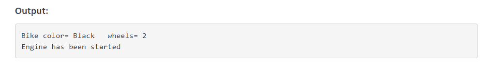

# 如何深度实现 Java 合成？

> 原文：<https://www.edureka.co/blog/how-to-implement-java-composition-in-depth/>

本文将向您介绍另一个有趣的编程概念，即 [Java](https://www.edureka.co/blog/java-tutorial/) Composition，并随后进行编程演示。本文将涉及以下几点:

*   [要点](#KeyPoints)
*   [好处](#Benefits)
*   [构图程序示例](#ProgramExampleofComposition)

组合是一种关联，代表整体关系的一部分，其中一部分不能离开整体而存在。如果一个整体被删除，那么所有部分也被删除。它有更强的关系。

继续这篇关于 Java 组合的文章

## **要点**

*   它代表了一部分关系。
*   在组合中，两个实体相互依赖。
*   当两个实体之间存在组合时，组合的对象不能离开另一个实体而存在。例如，如果订单有-A 行项目，那么订单是一个整体，行项目是部分
*   如果订单被删除，则该订单的所有相应行项目也应被删除。
*   重构图轻继承。

继续这篇关于 Java 组合的文章

## **好处**

如果您正在寻找代码重用，并且两个类之间的关系是 has-a，那么您应该使用组合而不是继承。在 java 中使用组合的好处是，我们可以控制其他对象对客户端类的可见性，并且只重用我们需要的对象。此外，如果在其他类实现中有任何变化，例如 getSalary 返回字符串，我们需要更改 Person 类来适应它，但 client 类不需要更改。组合允许在需要时创建后端类，例如，我们可以在需要时更改 PersongetSalary 方法来在运行时初始化 Job 对象。

继续这篇关于 Java 组合的文章

## **Java 合成的程序示例**

让我们考虑下面这个演示合成概念的程序。

**第一步:**

首先，我们创建一个类 Bike，在其中声明和定义数据成员和方法:

```
class Bike
{
// declaring data members and methods
private String color;
private int wheels;
public void bikeFeatures()
{
System.out.println("Bike Color= "+color + " wheels= " + wheels);
}
public void setColor(String color)
{
this.color = color;
}
public void setwheels(int wheels)
{
this.wheels = wheels;
}
}

```

**第二步:**

第二，我们创建了一个扩展上述自行车类的本田类。这里 Honda 类通过 composition 使用 HondaEngine 类对象 start()方法。现在我们可以说本田级有了——一辆本田发动机:本田级延伸自行车

```
{
//inherits all properties of bike class
public void setStart()
{
HondaEngine e = new HondaEngine();
e.start();
}
}

```

这个 Java 合成程序的下一步是

**第三步:**

第三，我们创建一个类 HondaEngine，通过它我们在上面的类 Honda 中使用这个类对象:类 HondaEngine

```
{
public void start()
{
System.out.println("Engine has been started.");
}
public void stop()
{
System.out.println("Engine has been stopped.");
}
}

```

这个 Java 合成程序的最后一步

**第四步:**

第四，我们创建一个类 CompositionDemo，其中我们创建了一个 Honda 类的对象并初始化它: class CompositionDemo

```
{
public static void main(String[] args)
{
Honda h = new Honda();
h.setColor("Black");
h.setwheels(2);
h.bikeFeatures();
h.setStart();
}
}

```



这样，我们就结束了这篇关于“Java 组合”的文章。如果你想了解更多，可以去看看 Edureka 值得信赖的在线学习公司提供的  [Java 培训](https://www.edureka.co/java-j2ee-soa-training) 。Edureka 的 Java J2EE 和 SOA 培训和认证课程旨在培训您掌握核心和高级 Java 概念以及各种 Java 框架，如 Hibernate & Spring。

有问题要问我们吗？请在这个博客的评论部分提到它，我们会尽快回复你。