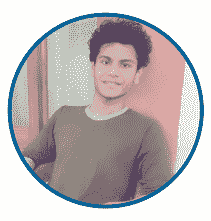
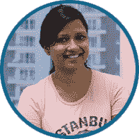
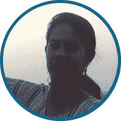
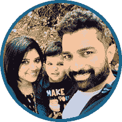
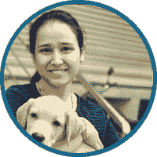
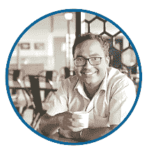

# 学习是自由:庆祝独立的印度人

> 原文：<https://www.edureka.co/blog/learning-is-freedom/>

第 73 个印度独立日即将到来，当这个国家准备庆祝这一重大时刻时，我们在 Edureka 问自己，自由对今天独立的印度人意味着什么。他们如何珍惜自己的自由，是什么促使他们享受自由？我们决定四处询问，讨论的结果压倒性地指向教育和学习是今天印度个人自由的催化剂。在这个博客中，我们将展示独立的印度人，来自印度每个邦和联邦领地的代表，以及他们通过学习寻找自由的故事。我们试图捕捉他们的希望、梦想的本质，以及他们如何通过教育和技能实现这些。请继续阅读，了解#LearningIsFreedom 的原因。

**苏迪普塔，安达曼** 内部销售经理“当我说我来自安达曼时，人们认为我来自部落地区。教育给了我一个纠正这种看法的机会。学习拓宽了我的思维，让我有信心走出去，代表我的状态。有一天，我希望经营自己的公司，但在那之前，我会努力在工作中表现出色。当我回头看时，我发现教育也改变了我的状态。在安达曼，学习可以拯救生命。我目睹了这一切，当地人和游客的无知导致了生命的丧失，海啸…也看到了正确的知识是如何拯救生命的。如果我要从我在城市的生活中学到一点东西，那就是你在大都市找到的坚韧和竞争。永不放弃的态度鼓舞人心。”

安得拉邦高级分析师阿巴拉·拉朱

“学习给我的不仅仅是自由。也是我的力量，希望，信心。在 IT 行业，人们期望不断升级，了解最新的技术。学习让我做好了在这种情况下坚持自己的准备。我最近开始学习大数据和 Hadoop，它给我的力量、信心和安全感比棒还要棒！这就是我觉得学习的真正力量…它真的能给你面对任何事情的信心和自由。在我作为一名技术人员在海德拉巴生活的 12 年多时间里，我开始欣赏这个城市的经济和职业机会，但如果我说我不想念我的家乡 Vishakhapatnam，那我是在撒谎。那里的基础设施肯定更好，但如果我能从海德拉巴学到一点东西，那就是对开设商店的公司的开放。”

来自比哈尔邦的高级专家帕拉维·普里亚

“我来自比哈尔邦的一个小镇，那里的技术专业人员没有多少就业机会。学习和教育实际上给了我通向更好生活的桥梁，这种生活充满了职业成就、经济保障和个人自由。今天，我在一个 Linux 基础设施的角色中表现出色，这个角色通常是男性主导的。作为团队中仅有的两个女孩之一，我觉得我不亚于任何人，有能力胜任我的工作。如果我没有受过良好的教育，这种自信是不可想象的。我来自一个对性别角色持传统观点的小镇，教育让我摆脱了这种界限，给了我依靠自己实现人生目标的方法和信心。结婚后，我的职业生涯中断了三年，但当婚姻破裂时，我没有让它妨碍我的职业生涯。我重新振作起来，学习并重新开始工作。我已经意识到，只要我有一技之长，我就不必依赖任何人，也不必为了经济保障而结婚。今天，甚至我的父母也相信我会做出正确的决定，并对我所做的感到高兴。教育解放了我。如果在外生活后，我要把一门学问带回我的家乡，那就是城市里的豁达。无论背景如何，每个人都可以在一个城市重新开始自己的生活，按照自己喜欢的方式生活，采用这种方式会有所不同。”

****昌迪加尔内容营销团队负责人 Aayushi Johari

“我大半辈子都住在昌迪加尔。虽然这是一个很适合居住的城市，但我的生活还是很封闭的。我搬到了班加罗尔，这样我就可以在印度的 IT 中心生活和工作。这不仅在我的职业生涯中帮助了我，也给了我寻找独立的机会。在这里，我的工资是我自己的，我学会了如何自力更生。另一个让我大开眼界的是社交媒体。当我回到昌迪加尔的家时，我甚至害怕在社交媒体上发帖，但在这里我很放松，这也让我开始在新时代媒体工作。在班加罗尔，学习是多方面的，如果让我拿回一样东西，那就是如何与所有地区和背景的人交往和沟通。”

** Ankit Koushik，来自查蒂斯格尔邦**的联盟营销经理

学习对我来说并不容易。10 年前，当我准备大学预科时，我在查蒂斯格尔邦 Surajpur 区的学校甚至没有老师。我是那所学校学数学的六名学生之一。我的姐姐，一位金牌获得者，实际上是我的救星，她教我物理和化学，为我准备去 AIEEE。我的学习之旅和随之而来的自由是在我完成工程后来到我身边的。最初，我在一家塔塔电气公司工作，主修工程学。工资只有区区 3500 卢比，也没有多少经验。那是我真正掌握了自己的命运，做出了有生以来最大胆的决定。我辞职了，开始上网，在接下来的 6 个月里，我通过课程、在线资料等自学了数字营销、分析和联盟营销。这导致了在一个流行的在线优惠券网站工作，然后去了一家教育科技公司。今天，我自立了，经济独立，自力更生，这一切都是因为我勇敢的踏上了自学之旅，所以退一步说，学习确实给了我成为自己想成为的人的自由。 如果我要把一门学问带回我的家乡，那就是如果你乐于接受，总会有新的知识。我在德里学到了很多，尤其是在班加罗尔，那里的每一次对话都是对知识的追求。

**艾丽夏·巴雷托，来自果阿的工科学生**

“我是一名即将毕业的工科学生，梦想通过科技让世界变得更美好。坦率地说，这个梦想一直是我选择学习工程的驱动因素。虽然我希望我的技术教育有一天能帮助我解决世界问题，但它也开阔了我的思维，让我认识到不同的人对同一个话题可以有不同的观点。没有两个人会以同样的方式思考一个话题。随着这种认识而来的是想象一个多样而统一的世界的自由和希望。在我受教育期间，我曾在泰米尔纳德邦和班加罗尔短暂居住过。如果我要从这些短暂的停留中学到什么，那将是对自己的文化和语言的骄傲。我希望我的果阿同胞能更开放地说我们自己的语言，了解我们丰富的文化。”#学习是自由的

来自古吉拉特的高级 IT 主管 Hardik Vyas

“我是一个小镇男孩，进入 IT 领域，在大城市谋生，同时在跨国公司工作，这一切都是因为正确的教育。职业并不是我的理学学士和理学硕士学位有所帮助的唯一领域。学习和教育给了我社交的自由。我现在可以毫不犹豫地用英语与任何地方的任何公民或全球同事轻松交谈，这改变了我的生活。我来自古吉拉特邦朱纳加德区的一个小镇，这里的每个人都认识彼此，我们的交流热情而随意。但是，在艾哈迈达巴德生活后，我希望把我在办公室礼仪、沟通和技术方面的学习带到我的城市，以便让许多尚未进入职业生涯的年轻人轻松生活。”

**贾坎德邦首席客户顾问 Vivek Gupta**

学习给了我走出家乡寻找自我的自由。我来自贾坎德邦的丹巴德，那里的每个人都知道我是某某的儿子。追求技术教育让我在班加罗尔找到了工作，这改变了我的想法。我一直对工程感兴趣，在我十年级后，我选择了理科，尽管我的父母希望我从事商业。我知道，尽管攻读 MBA 和进入管理层是我的最终目标，但与技术相关的职业将带我去那里。今天，我对自己的职业很满意，正在攻读 MBA，住在班加罗尔，一个我梦想居住的城市。即使在我的家乡，我也不再仅仅是某人的儿子，而是被视为一名成功的专业人士。我能在今天脱颖而出，是因为我的学识。如果我要从班加罗尔学到一点东西，那就是我在这座城市看到的宽广胸怀和对个性的尊重。我可以在这个城市定义我的生活和身份，这是我希望家乡像我一样的年轻人能够做到的。

**来自喀拉拉邦的客户成功经理 Juna P**

“学习一直是我生活中的第一要务。我相信学习比学位和课程更深入。虽然一个学位可以给你一个知道一些事情的官方标记，但学习超越了它，成为如何行为、知道什么和如何生活的基础。学习和教育给了我实现我想要的自由，无论是通过帮助我认识到我擅长什么，还是通过给我面对同事和客户的信心。它还帮助我知道在我的工作中什么是可能的，并帮助我铺平自己的职业道路。甚至在我的个人生活中，我父母对我的信任和我从公婆和社会得到的尊重都源于我的教育，反过来他们也相信我会做出正确的选择。我仍然记得我丈夫在我们结婚后告诉我的话，当时我正在考虑我的职业道路。他鼓励我追求自己的事业，不要让我的教育白费。我很高兴我做到了，尽管有起有落，因为我觉得学习真正给了一个女人自由。在多个城市生活多年后，我想带回喀拉拉邦的一个教训是思想开放。在班加罗尔等城市，女性甚至可以在晚上自由走动，这确实是回家的一个选择。还有，我喜欢这里的竞争力……每个人都想做到最好，不满足于一份朝九晚五的工作。我觉得，采用这种竞争力将有助于留住喀拉拉邦的优秀人才。”

**维沙尔·阿里巴姆，来自曼尼普尔** 的动画设计师

对我来说，自由就是有信心与任何类型的人交往，而不考虑地理位置；学习帮助我获得了这一点。如果不是因为我决定在家乡以外的地方接受高等教育，我永远也不会有这样的机会。由于生活在大都市，我在沟通、面试准备、演示等方面学到的东西对我的职业生涯真的很有帮助。即使你在家乡有很多钱，也不等于你在外面得到的机会。在班加罗尔，即使是办公室午餐也是一种体验和学习的机会。随之而来的当然是成为你自己的自由。在我的家乡，人们通常得不到在职业生涯中脱颖而出所需的机会和信心，我肯定会从我在大都市的时光中吸取教训。

**来自梅加拉亚邦的内部销售经理 Debraj**

适应，适应，适应。这是学习赋予我的能力。我来自一个文化与印度其他地方完全不同的邦。我对音乐、冒险运动、骑自行车的爱好都源于我家乡人的独特态度。虽然我是孟加拉人，但比起西孟加拉邦，我更喜欢梅加拉亚邦，并把这里当成我的家。我首先走出我的州，在钦奈和德拉敦学习，然后搬到班加罗尔工作。多亏了我所受的教育，我经常搬家。今天，我可以宣称我有来自印度不同地区的朋友和前室友，并且精通适应环境的艺术。在我去拉达克、尼泊尔、不丹和缅甸等地的长途骑行中，我也开始使用这种方法。我也发现了了解不同文化、人们和他们的生活方式的自由，这都归功于我的学习，对此我心存感激。如果让我从我生活过的不同城市中吸取一个教训，那就是对机遇的大胆和开放。我想鼓励来自梅加拉亚邦和其他东北部各邦的同胞们探索不同的地方，而不必担心障碍。不是每个人都是一样的，那里有很多爱。适应各种环境也是我们可以采用的城市特征。

来自旁遮普的自动化顾问 Kanwarpreet Singh

“如今做一名技术人员既有好处，也有挑战。每天都有令人兴奋的新技术被采用，但它们进入 IT 行业也意味着我别无选择，只能不断学习。我喜欢吗？是的，当然。学习和不断更新技能给了我打破工作角色传统界限的自由。我从自动化测试开始，但最近我已经掌握了 Hadoop、Tableau、BI 和 Python，并参与了与这些技术相关的项目的实施。我的长期梦想是成为一名数据科学家，但在我到达那里之前，我还有很长的路要走。但是，在过去的两年里，我意识到的一件事是，学习是我们提高自己、让我们自由选择我们想要的职业道路、规划更美好的明天并塑造我们自己以实现它的唯一途径。学习和技能提升无疑给了我一个世界观，以及分析和形成自己想法的自由。有一天，我希望用我所获得的知识来回馈社会，解决世界问题。在那之前，我会自己努力。如果我要把一门学问带回我的家乡，那就是我在伦敦发现的职业精神和对工作的尊重，不管它是什么。

来自拉贾斯坦邦的高级研究分析师 Saurabh Kulshreshta

“学习给了我拥有自己想要的生活方式的自由。今天，我经济独立，有了多种选择，因为我的教育为我打开了机会和信心。在成长过程中，我想成为一名战地记者，但显然，我的父母不喜欢这个选择。他们说我的生命对他们很重要，所以我满足于第二个梦想，成为一名工程师。那确实很好…今天我在新时代的数字媒体平台上工作，我在我非常喜欢的职业道路上。我可以自豪地说，我是一个负责任的公民，生活在一个我希望生活的城市里，并且有足够的洞察力来区分英雄和坏人。我在经济上也足够自立，可以实现我的梦想，和我一直想要的那种朋友一起广泛旅行。我周围都是聪明人，我的生活哲学是吃饭、睡觉、忙碌、重复。学习真正释放了自由。如果我要把学到的东西带回我的家乡斋浦尔，那将是城市的竞争力和对新思想的渴望。我真心希望看到更多的科技企业家在我的家乡创办公司。”

来自特里普拉邦的研究分析师 Sayantini Deb

“我来自阿格塔拉，一个小城市，在那里每个人都互相认识。我很幸运，因为我父亲的工作，我能够去旅行，并且能够选择我的城市来做我的工程。我选择去班加罗尔留学，住在一家旅社。那是真正的生活开始的时候。我不仅学会了如何与我熟悉的圈子之外的人互动，我还学会了如何独立做事，无论是管理我的开支，做我的家务，还是在深夜照顾自己。我一直梦想着能独立生活，这已经实现了，因为我的教育给了我自由。甚至我的父母都认为我今天是一个负责任的人，我有来自这么多地理位置的朋友。 如果让我拿回一门学问，那将是多元与发展。在班加罗尔，你可以向各种各样的人和社区学习，可以说了解印度的不同口味，这种学习很有价值。”

 **帕拉维·夏尔马，北阿坎德邦**的内部销售经理

“在一个充满酒店管理专业人士的家庭里，我是女孩中最年长的。主厨、副主厨、经理、旅行社，凡是能说出来的，我们都有。我是我们家第一个从事不同行业的人，比如科技。当我选择科学流的时候，我最初确实遇到了阻力，但我无论如何都要面对它，今天我很自豪地说，我已经取得了成功。学习给了我在 IT 领域工作的自由，也给了我渴望的财务自由。如果没有我选择的教育，我今天享受的思想、生活方式和职业的独立以及金钱自由是不可能的。它为我打开了更新更大的可能性。我梦想有一天拥有自己的创业公司，我希望获得创业所需的技能，因为我知道学习是实现目标的唯一途径。如果我要从德里和班加罗尔采纳一样东西，并把它带回家，那就是这些大都市的人们的技术水平。甚至一个卖椰子的人也使用 Paytm，尤其是在班加罗尔，而数字支付在国内还不受欢迎。我认为，采用技术将提高生活质量。”

**西孟加拉邦高级创意设计师 Shovan Singha**

“我一直梦想从事视觉设计。虽然我学的是艺术，但是正确的教育让这个梦想变成了现实。虽然我总是有诀窍，但正确的训练帮助我成为一名专业人士。跑步者有天生的能力，但要成为运动员，他/她需要正确的指导，这就是我在追求艺术和设计的正规教育中所得到的。现在我有信心相信我自己的决定，尽管这不是一天学到的。这些年来我得到的实践经验和教学经验特别有帮助。 艺术家懂美学，设计师懂技法。如果我要把一项学习带回我以前的艺术学院圈子，那将是交流的艺术，以及它如何帮助设计成为一种体验。这毕竟是一门交际艺术。”

通过与来自印度各地的各种各样的人交谈，我们知道#学习是自由的，因为它帮助我们打破个人和职业生活中的限制，帮助我们实现真正的潜力。这个独立日，让我们聚在一起庆祝这个指导我们国家和我们充满活力的 IT 产业的理念。我们希望这些关于学习和自由的故事已经激励了你！