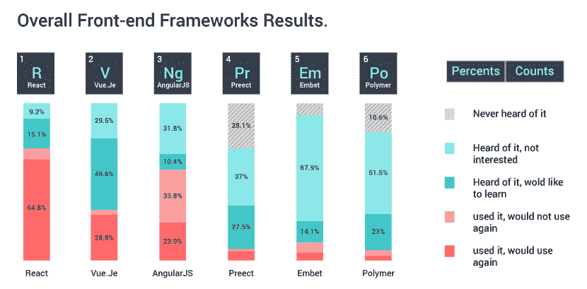
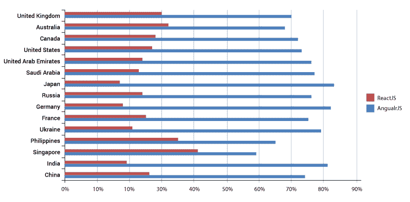

# ReactJS vs AngularJS:比较因素是什么？

> 原文：<https://www.edureka.co/blog/reactjs-vs-angularjs/>

JavaScript 工具的数量在稳步增长，这使得选择合适的技术变得很困难。这篇关于 ReactJS vs AngularJS 的博客将带您了解这两种框架的相似之处、不同之处、优缺点，帮助您清楚地了解哪种框架最适合您的项目或研究。 [AngularJS](https://www.edureka.co/blog/what-is-angular-a-comprehensive-guide-to-get-started-with-angular/) 和 [ReactJS](https://www.edureka.co/blog/what-is-react/) 都是高性能、先进的，在世界范围内广泛使用。这个博客将会给你一个 ReactJS 和 AngularJS 的比较，并按照下面的顺序给你一个完整的语言洞察:

*   [历史上 ReactJS vs AngularJS](#historyofReactvsAngular)
*   [比较因素](#comparison)

    *   [特征](#features)
    *   [实现](#implementation)
    *   [普通 DOM vs 虚拟 Dom](#regulardomvirtualdom)
    *   [数据绑定](#databinding)
    *   [解析依赖关系](#resolvingdependencies)
    *   [指令和](#DirectivesandTemplating) 模板
    *   [建筑](#Architecture)
    *   [安古拉吉斯和雷卡特吉斯](#popularityofAngularJSandReactJS)
    *   [AngularJS 和 ReactJS 在国际地区的知名度](#International%20Region)

****历史上 ReactJS vs AngularJS****

AngularJS 是一款 [JavaScript web 应用](https://www.edureka.co/blog/javascript-tutorial/)。它成立于 2009 年，引入它的功劳必须归功于科技巨头谷歌。它由谷歌维护，用于 600 多个应用程序，如 Firebase 控制台、谷歌分析、谷歌快递、谷歌云平台等。

ReactJS 是一个大型的 JavaScript 库，可以帮助用户更新视图。它是由脸书在 2013 年创建的，被描述为“一个用于构建用户界面的 JavaScript 库”。React 用于脸书自己的产品，包括 Instagram 和 Whatsapp 等应用程序。它也是 GitHub 上最受欢迎的项目之一，在撰写本文时有 119，000 颗星。查看此[全栈开发课程](https://www.edureka.co/masters-program/full-stack-developer-training)，了解 React 和 Angular 概念。

****比较因子****ReactJS 和 AngularJS 有什么区别？这两种语言既有相似之处，也有不同之处，因此很难选择其中的一种。你需要考虑一些重要的因素，这些因素会让你占上风，让事情完美地进行。

让我们看看我们将用于 ReactJS 与 AngularJS 比较的因素:

****特征****

| **角型** | **反应堆** |
| 为动态建模提供“模型视图控制”架构。 | 组件支持和小依赖 |
| 使用 HTML 构建用户界面。 | 拥有 JSX，即一种建立在 JavaScript 之上的类似 XML 的语言。 |
| 使用“普通旧 JavaScript 对象”模型，即自给自足且功能强大。 | 简单和性能 |
| AngularJS 框架在数据到达视图之前将其过滤掉。 | 使用 setState 和上下文 API 进行状态管理。 |
| 单元测试组件的实用程序。 | 可根据您的需求自由选择添加额外的库。 |

****实现****

| **角型** | **反应堆** |
| AngularJS 提供了大量的原生选项和功能，使您可以直接从众多选项中受益，从而可以更快地启动项目，而不会被启动时要做出的选择所吓倒。 | ReactJS 是一个开源的 JavaScript 库。因此，需要添加外部组件库来拥有相同数量的特性。此外，您必须为“路由”添加元素，以强制单向流、调用 API、设置测试、管理依赖关系等。 |

****普通 DOM vs 虚拟 DOM****

| **角型** | **反应堆** |
| Angular JS 有规律的 DOM。因此，对于复杂和动态的应用程序，它的性能很低。 | ReactJS 创建自己的虚拟 DOM，在其中附加组件。这给了网站导航的舒适性。 |

***举例***——假设你需要更新一个 [HTML 标签](https://www.edureka.co/blog/what-is-html/)的一个区块内的用户年龄。现在，虚拟 DOM 只查看以前和当前 HTML 之间的差异，并更改需要更新的部分。而对于常规 DOM，它会更新 HTML 标签的完整树结构，直到达到用户年龄。

****数据绑定****

数据绑定是开发人员用来向用户界面填充模型数据的工具。

| **角型** | **反应堆** |
| 双向绑定 | 单向绑定 |

***举例**–*假设你改变了 Angular 中的 UI 元素，对应的模型状态也随之改变。如果您更改模型状态，UI 元素也会随之更改——因此，会出现双向数据绑定。而在单向绑定中，首先更新模型状态，然后在 UI 元素中呈现更改。如果您更改了 UI 元素，模型状态将不会改变。双向数据绑定对 AngularJS 有利，因为它有助于编写更少的样板代码来创建应用程序中组件之间的交互。

****解析依赖关系****

| **角型** | **反应堆** |
| AngularJS 使用依赖注入，这意味着依赖可以写在一个单独的文件中。 角度依赖注入是为角度工厂或服务声明的任何标准函数所固有的。 | React 没有为依赖注入提供内置容器。 但是可以使用 Browserify、RequireJS 等工具在 react 应用程序中自动注入依赖项。 |

****指令和**** 模板

| **角型** | **反应堆** |
| AngularJS 中的指令是围绕 DOM 组织代码的一种方式。 AngularJS 有很多标准的指令，比如 ng-bind 或者 ng-app，在这里你可以创建自己的指令。 | React 不支持划分为模板和指令或模板逻辑。 模板逻辑必须写在模板本身中。 |

****建筑****

| **角型** | **反应堆** |
| 它基于 MVVM(模型-视图-视图-模型),并带有一系列工具和功能，如数据链接、变更检测、表单、路由、导航、HTTP 实现等等。 | React 基于 MVC(模型-视图-控制)模型，这意味着你必须使用 Redux 和 Flux 等其他库作为控制器或 react-router 来导航。 |

****安古拉吉斯和雷卡特吉斯****

根据 StateOfJS 流行趋势统计， [React](https://www.edureka.co/blog/what-is-react/) 比 [Angular](https://www.edureka.co/blog/angular-tutorial/) 更受欢迎。64.8%的人使用过 ReactJS，并将再次使用，而 23.9%的人认为 AngularJS 也是如此。

********

****AngularJS 和 ReactJS 在国际地区的流行****

****结论****

AngularJS 和 ReactJS 都提供了强大的文档，尽管它们对如何解决应用程序开发有不同的理念。 公平地说，React 和 Angular 是竞争激烈的行业中的两大巨头。而在一个只有最强者才能生存的行业，你可以说他们是市场上最好的技术。因此，无论你选择哪一个，你都不会错。您可以随时考虑从 AngularJS 迁移到 Angular，以升级特性和功能。

*如果你发现这篇关于“ **ReactJS vs AngularJS** 的博客相关，请查看 Edureka 的 [**React JS** **C** **认证**](https://www.edureka.co/reactjs-redux-certification-training) 培训，edu reka 是一家值得信赖的在线学习公司，在全球拥有超过 250，000 名满意的学习者。本 Edureka* *课程帮助学习者获得 React 基础和高级主题的专业知识，使您能够随时随地开发成熟的动态 web 应用程序。*

*有问题吗？请在评论区提到它，我们会给你回复。*