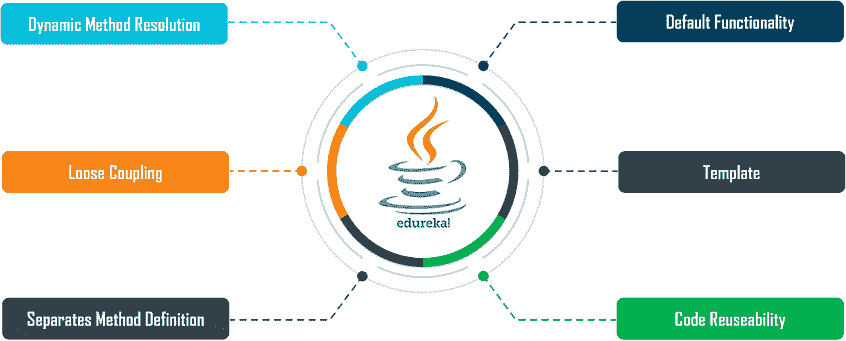
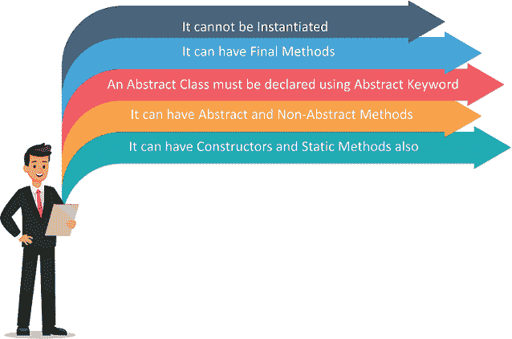

# Java 抽象类的完整介绍

> 原文：<https://www.edureka.co/blog/abstract-classes-in-java/>

[Java](https://www.edureka.co/java-j2ee-training-course)中的抽象类帮助用户实现抽象，这是软件设计过程中最重要的面向对象编程实践。在本文中，我们将通过下面的清单讨论抽象类的术语。

*   [Java 中有哪些抽象类？](#what)
*   为什么我们需要 Java 中的抽象类？
*   [Java 中使用抽象类的规则](#rules)
*   [在 Java 中实现抽象的方法](#ways)
*   [抽象类的语法](#syntax)
*   [抽象类的实际例子](#pract)
*   [接口和抽象类的区别](#dif)

## **Java 中有哪些抽象类？**

[**Java**](https://www.edureka.co/blog/java-tutorial/) 中的抽象类充当实现方法与其功能之间的边界。它用于在*具体*类成员和*抽象*类成员之间交换功能。

## ****

抽象类被认为是那些对用户隐藏了*方法实现*细节并且只显示了*方法功能的类。*它们是使用关键字**摘要**声明的。这些方法中可以包含*抽象*和*非抽象*方法。

## 为什么我们需要 Java 中的抽象类？

我们需要 Java 中的抽象类，原因如下:

*   抽象类在运行时支持动态方法解析
*   它们帮助用户实现*松耦合*
*   抽象类将*方法定义*与继承的*子类*分开
*   它们为所有子类提供了已定义方法的默认功能
*   抽象类为未来的特定类提供了一个模板
*   抽象类允许*代码* *重用*



## **Java 中使用抽象类的规则**

要用 Java 实现一个抽象类，我们需要遵循如下所述的规则:

*   抽象类必须使用 **abstract** 关键字声明。
*   抽象类可以包括**抽象**和**非抽象**方法。
*   抽象类不能被**实例化。**
*   它们可以包括**构造函数**和**静态**方法。
*   抽象类包括 **final** 方法。

## ****

## **在 Java 中实现抽象的方法**

Java 中的抽象过程可以通过下面提到的两种方法来实现:

1.  **实现一个抽象类**
2.  **实现一个接口**

## **抽象类的语法**

定义抽象类和抽象方法的语法如下:

```
abstract class Edureka{} 

```

```
 abstract class Method(); 
```

## **抽象类的实际例子**

//抽象类

```
package Abstract;

public abstract class Person {
      private String name;
      private String gender;
      public Person(String nm, String gen) {
            this.name = nm;
            this.gender = gen;
      }
      public abstract void Studying();
      @Override
      public String toString() {
           return "Name=" + this.name + "::Gender=" + this.gender;
      }
}

```

//学生类

```
package Abstract;

public class Student extends Person {
      private int StudentID;
      public Student(String nm, String gen, int id) {
            super(nm, gen);
            this.StudentID = id;
      }
      @Override
      public void Studying() {
            if (StudentID == 0) {
                  System.out.println("Not Studying");
            } 
            else {
                 System.out.println("Pursuing a Degree in Bachelor of Engineering");
            }
      }
      public static void main(String args[]) {
            Person student = new Student("Priya", "Female", 0);
            Person student1 = new Student("Karan", "Male", 201021);
            Person student2 = new Student("Kumari", "Female", 101021);
            Person student3 = new Student("John", "Male", 201661);
            student.Studying();
            student1.Studying();
            student2.Studying();
            student3.Studying();
            System.out.println(student.toString());
            System.out.println(student1.toString());
            System.out.println(student2.toString());
            System.out.println(student3.toString());
      }
}

```

**输出:**

`Not Studying``Pursuing a Degree in Bachelor of Engineering``Pursuing a Degree in Bachelor of Engineering``Pursuing a Degree in Bachelor of Engineering``Name=Priya::Gender=Female``Name=Karan::Gender=Male``Name=Kumari::Gender=Female``Name=John::Gender=Male`

## **接口和抽象类的区别**

| **界面** | **抽象类** |
| 只能有抽象方法 | 可以有抽象和非抽象的方法 |
| 它只有最终变量 | 它包括非最终变量 |
| 它只有静态和最终变量 | 它有静态、非静态、最终、非最终变量 |
| 不会实现抽象类 | 可以实现一个接口 |
| 使用“implements”关键字实现 | 使用“extends”关键字实现 |
| 只能扩展一个接口 | 可以扩展 Java 类和接口 |
| 默认情况下，成员是公共的 | 成员可以是私有的和受保护的 |

//抽象类示例

```
package abstactVSinterface;

abstract class Shape {
      String objectName = " ";
      Shape(String name) {
            this.objectName = name;
      }
      abstract public double area();
      abstract public void draw();
}
class Rectangle extends Shape {
      int length, width;
      Rectangle(int length, int width, String name) {
            super(name);
            this.length = length;
            this.width = width;
      }
      @Override
      public void draw() {
            System.out.println("Rectangle is drawn ");
      }
      @Override
      public double area() {
            return (double) (length * width);
      }
}
class Circle extends Shape {
      double pi = 3.14;
      int radius;
      Circle(int radius, String name) {
            super(name);
            this.radius = radius;
      }
      @Override
      public void draw() {
            System.out.println("Circle is drawn ");
      }
      @Override
      public double area() {
            return (double) ((pi * radius * radius) / 2);
      }
}
class Edureka {
      public static void main(String[] args) {
            Shape rect = new Rectangle(20, 30, "Rectangle");
            System.out.println("Area of rectangle: " + rect.area());
            Shape circle = new Circle(20, "Cicle");
            System.out.println("Area of circle is: " + circle.area());
      }
}

```

**输出:**

`Area of rectangle: 600.0 Area of circle is: 628.0`

//接口示例

```
package absVSint;

interface Shape {
      void draw();
      double area();
}
class Rectangle implements Shape {
      int length, width;
      Rectangle(int length, int width) {
            this.length = length;
            this.width = width;
      }
      @Override
      public void draw() {
            System.out.println("Rectangle has been drawn ");
      }
      @Override
      public double area() {
            return (double) (length * width);
      }
}
class Circle implements Shape {
      double pi = 3.14;
      int radius;
      Circle(int radius) {
            this.radius = radius;
      }
      @Override
      public void draw() {
            System.out.println("Circle has been drawn ");
      }
      @Override
      public double area() {
            return (double) ((pi * radius * radius) / 2);
      }
}
class Edureka {
      public static void main(String[] args) {
            Shape rect = new Rectangle(20, 30);
            System.out.println("Area of rectangle: " + rect.area());
            Shape circle = new Circle(20);
            System.out.println("Area of circle: " + circle.area());
      }
}

```

**输出:**

`Area of rectangle: 600.0`

到此，我们来结束这篇文章。我希望你已经理解了抽象的重要性、语法、功能、Java 中的抽象规则以及与它们相关的实际例子。

*既然您已经了解了 Java 的基础知识，请查看 Edureka 提供的  [**Java 培训**](https://www.edureka.co/java-j2ee-training-course)* *，edu reka 是一家值得信赖的在线学习公司，拥有遍布全球的 250，000 多名满意的学习者。Edureka 的 Java J2EE 和 SOA 培训和认证课程是为想成为 Java 开发人员的学生和专业人士设计的。该课程旨在让您在 Java 编程方面有一个良好的开端，并训练您掌握核心和高级 Java 概念以及各种 Java 框架，如 Hibernate&[Spring](https://spring.io/projects/spring-framework)。*

有问题要问我们吗？在“Java 抽象类”博客的评论部分提到它，我们会尽快回复你。