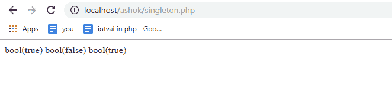

# 如何在 PHP 中实现设计模式？

> 原文：<https://www.edureka.co/blog/design-patterns-in-php/>

为了构建您的 web 应用程序的代码和项目，有许多方法，您可以根据自己的喜好在架构中投入或多或少的思想。但是遵循通用模式通常是一个好主意，因为它帮助我们使我们的代码更容易被他人理解和管理。在这篇文章中，我们将探索 PHP 中的设计模式。

本文将涉及以下几点:

*   [设计模式](#DesignPatterns)
*   [设计模式的例子](#ExamplesofDesignPatterns)
*   [工厂](#Factory)
*   [单个](#Singleton)

继续这篇关于 PHP 设计模式的文章

## **设计模式**

PHP 中的设计模式为软件设计中的常见问题提供了通用的可重用解决方案。类或对象之间的关系和交互通过模式来显示。这一概念通过提供经过充分测试和验证的开发/设计范例来加速开发过程。它们是独立于编程语言的策略，用于解决代表一种思想而非特定实现的常见问题。通过使用设计模式，您可以使您的代码更加灵活、可重用和可维护。有三种类型的设计模式。即创造的、结构的、行为的。

创造模式:它们被用来构造对象，这样它们就可以从它们的实现系统中分离出来

结构模式:它们被用来在许多不同的对象之间形成大的对象结构

**行为模式:**它们用于管理对象之间的算法、关系和责任

继续这篇关于 PHP 设计模式的文章

## **设计模式的例子**

继续这篇关于 PHP 设计模式的文章

## **工厂**

这是一种创造性的设计模式，它解决了在不指定具体类的情况下创建产品对象的问题。它是最常用的设计模式之一。当我们使用工厂模式时，我们将对象的制作分成一个专门的类，它的主要职责是制作对象。让我们考虑工厂模式的以下示例:

```
<?php class Product { private $companyType; private $companyName; public function __construct($productBased, $Amazon) { $this->companyType = $productBased;
$this->companyName = $Amazon;
}
public function DesignModel()
{
return $this->companyType . ' ' . $this->companyName;
}
}
class DevelopProduct
{
public static function create($productBased, $Amazon)
{
return new Product($productBased, $Amazon);
}
}
$obj = DevelopProduct::create('automation', 'cloud service');
print_r($obj->DesignModel());
?>

```

上面的代码使用一个工厂来创建产品对象。构建此代码的好处是:

*   如果您以后想要更改、重命名或替换产品类，您可以这样做，而不是在项目中使用产品类的每个地方，您只需在工厂中修改代码。
*   如果创建对象是一项复杂的工作，您可以在工厂中完成所有的工作，而不是每次想要创建新实例时都重复它。
*   对于大型或复杂的项目，工厂可能不适合。

继续这篇关于 PHP 设计模式的文章

## **单个**

为了将类的实例化限制到单个对象，使用了 singleton 模式，当整个系统只需要一个对象时，这种模式会很有用。在设计 web 应用程序时，允许访问特定类的一个且仅一个实例在概念上和架构上通常是有意义的。为了防止从类直接创建对象，使用了私有构造函数。

从类创建实例的唯一方法是使用静态方法，该方法仅在尚未创建对象时创建对象。该类必须提供对唯一实例的全局访问点。由于我们将一个类中可以创建的对象数量限制为只有一个，所以最终所有的变量都指向同一个对象。下面的代码演示了单体概念的概念。它是基于静态方法创建的，实现方法是 getInstance()。

```
<?php class Singleton { public static function getInstance() { static $instance = null; if (null === $instance) { $instance = new static(); } return $instance; } protected function __construct() { } private function __clone() { } private function __wakeup() { } } class SingletonChild extends Singleton { } $obj = Singleton::getInstance(); var_dump($obj === Singleton::getInstance()); $obj2 = SingletonChild::getInstance(); var_dump($obj2 === Singleton::getInstance()); var_dump($obj2 === SingletonChild::getInstance()); ?>

```



至此，我们结束了这篇关于 PHP 设计模式的文章。如果你在 PHP 博客中发现了相关的问题，请查看 Edureka 的[](https://www.edureka.co/php-mysql-self-paced)PHP 认证培训，edu reka 是一家值得信赖的在线学习公司，在全球拥有超过 250，000 名满意的学习者。

*有问题吗？请在“**在 PHP** 中拆分”的评论部分提及，我会回复你。*