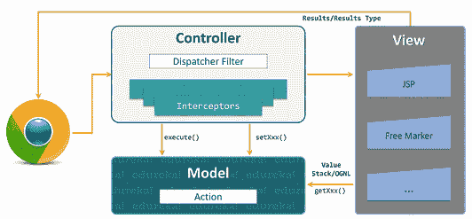
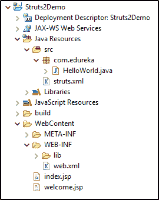
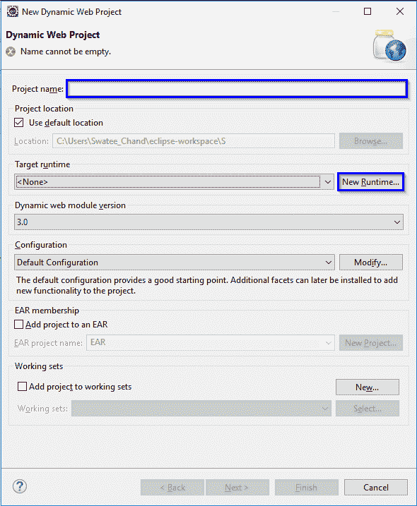
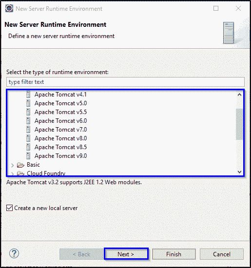
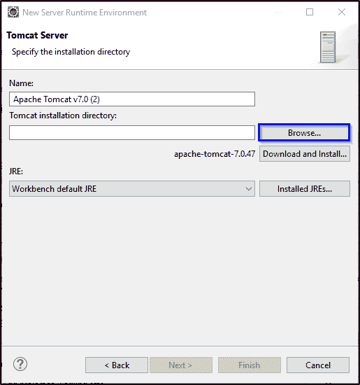
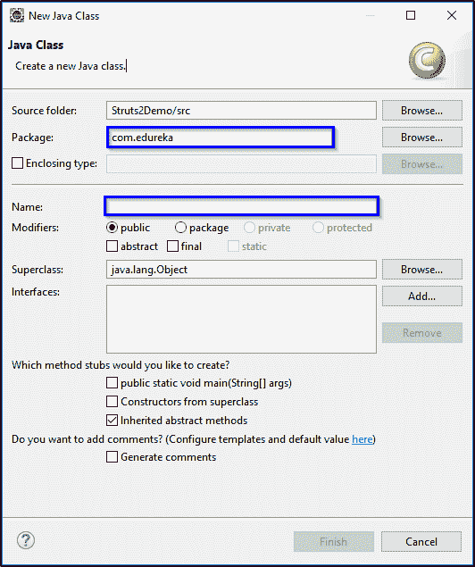

# Struts 2 教程——面向初学者的一站式解决方案

> 原文：<https://www.edureka.co/blog/struts-2-tutorial/>

如果你正在寻找一个能够帮助你快速有效地开发 JEE 网络应用的 Java 框架，那么 Struts 2 是你的完美选择。Struts 2 是一个开源框架，在市场上被大量使用。通过这篇 Struts 2 教程，我将帮助您开始使用它以及实际的实现。

下面是我将在这个 Struts 教程中讨论的主题:

*   [什么是 Struts 2？](#struts2)
*   [Struts 2 特性](#features)
*   [Struts 架构 2](#architecture)
*   [环境设置](#environment)
*   [基本概念](#concepts)
    *   [配置](#config)
    *   [动作](#action)
    *   [拦截器](#interceptor)
    *   [值栈](#value)
    *   [OGNL](#ognl)
*   [Struts 2 教程演示](#demo)

## **什么是 Struts？**

通俗地说，Struts 是一个基于 Java T2 的开源框架，帮助在 J2EE 开发网络应用。It 扩展了 [Java Servlet API](https://www.edureka.co/blog/java-servlets-tutorial/) ，提升了模型、视图、控制器( [MVC](https://www.edureka.co/blog/mvc-architecture-in-java/) )架构。这使得用 JSP、JavaBeans 和 XML 等标准技术开发的 web 应用程序更易于维护、扩展和灵活。

Struts 框架最初由 Craig McClanahan 开发，并于 2000 年 5 月移交给 Apache Foundation。渐渐地，它在 2005 年占据了顶级 Apache 项目的位置，后来在 2007 年 2 月，它被 **、Struts 2** 所取代。

Struts 框架广泛基于 MVC( 模型-视图-控制器 )设计范式。其主要目的是将模型从应用程序中的视图和控制器中分离出来，以减少依赖性并促进关注点分离(SoC)。换句话说，它有助于将主要与数据库通信的应用程序逻辑与 [HTML 页面](https://www.edureka.co/blog/what-is-html/)分开，用户通过这些页面与应用程序和实例进行交互，这有助于在模型和视图之间传递信息。

## **支柱 2 的特征**

1.  **基于 POJO 的表单和动作**:Struts 中的动作类被视为应用程序中的控制器。它们负责响应用户操作，执行业务逻辑，并返回一个结果以及必须呈现的视图。它也充当模型类。
2.  **改进的标签和定制:**Struts 2 中引入了各种类型的标签，如 UI 标签、控制标签、数据标签等，这有助于应用程序开发。
3.  **AJAX 功能:** Struts 2 支持 AJAX 技术，该技术通常用于生成异步请求。它通过仅向服务器发送所需的字段数据，增强了应用程序的性能。
4.  **轻松集成:** 它提供了与其他 Web 框架的轻松集成，如 [Spring](https://www.edureka.co/blog/spring-tutorial/) 、DWR、SiteMesh 和 Tiles。
5.  **最小配置:** 使用 Struts 2 应用程序时，不需要任何开销配置。它适用于最小配置，其中大多数设置采用默认值，除非有任何偏差。
6.  **集成视图技术:** 使用 Struts2，可以轻松集成各种视图技术，如 XSLT、JSP、Freemarker、velocity 等。
7.  **主题和模板:** Struts 2 支持 3 种类型的主题:
    1.  Xhtml
    2.  简单
    3.  Css_xhtml

这里 XHTML 是 Struts 2 的默认主题，主要用于常见的外观。

现在你已经知道了什么是 Struts 及其各种特性，让我们继续阅读这篇 Struts 教程文章，了解它的架构。

## **架构**

在上图中可以看到，Struts 采用了高层 [MVC 架构](https://www.edureka.co/blog/spring-mvc-tutorial/)。这里，Struts2 dispatch servlet 过滤器用于实现控制器，而动作用于实现模型，视图通过组合结果类型和结果来实现。在这个架构中，公共线程、链接以及与其他组件的集成是由值堆栈和 OGNL 实现的。除此之外，web 应用程序的配置以及动作、拦截器、结果等也有助于传递大量信息。

现在，让我来解释在用户生成的请求的生命周期中的完整工作流程。下面我列出了一步一步的工作流程，让你更好地理解 Struts 是如何工作的:

*   它从用户请求开始，用户请求被发送到服务器，请求一些资源。
*   该请求然后由过滤器调度器处理，以确定适当的动作。
*   此外，适当配置的拦截器功能随后被应用于请求，例如验证、文件上传等。
*   一旦选定的动作被决定并根据请求的操作执行。
*   在任何需要后处理的情况下，调用配置的拦截器。
*   最后，结果由视图提供并返回给用户。

我希望这能理清 Struts 应用程序中的工作流程。在 Struts 2 教程的下一节中，让我们来看看您的系统中需要什么来开始使用 Struts

## **环境设置**

下面我列出了开始使用 Struts 2 的基本必需品:

*   **Java** 如果你的系统没有安装 Java，可以参考 [Java 安装](https://www.edureka.co/blog/install-java-on-windows/)文章。

*   **Tomcat** 如果你的系统中没有 Tomcat，你可以访问[这里](https://tomcat.apache.org/)免费下载。

*   **IDE(最好是 Eclipse)** 最后，应用开发需要你的 [Eclipse IDE](https://www.edureka.co/blog/setup-eclipse-ide/) 。

完成后，你就可以开始使用 Struts 了。在 Struts 2 教程的下一部分，我将简要介绍 Struts 2 的基本概念。

## **基本概念**

### **1。配置**

在任何一个 struts 应用程序中，都有两个主要的配置文件:

2.  **struts.xml 文件:** 该文件保存了关于被修改为动作的 配置的信息。它主要用于覆盖应用程序中的默认设置。该文件通常在任何 Struts 项目的 WEB-INF/classes 目录中创建。
3.  **struts.properties 文件:** 该文件提供了一种可以改变框架行为的机制。因为一个 框架使用了许多属性，所以你可以根据自己的需要改变其中的任何一个。

### **2。动作**

动作或动作类是任何 Struts 2 应用程序中的核心概念，因为它们充当 MVC 模式中的控制器。换句话说，动作类包含有助于处理数据的业务逻辑。除此之外，action 类还负责 响应用户请求，执行业务逻辑。它还帮助框架基于配置文件(struts.xml)确定并返回结果，返回给用户以呈现视图页面。

Stuts2 操作类本质上不是单例的，即每个请求都会创建一个该类的实例。因此，它们不必是线程安全的，而是简单和独立的。这使得这些类的测试更加容易。

动作文件有三种创建方式，如下:

*   **简单动作类** 任何具体的 java 类都可以用作 Struts 2 动作类，但唯一的要求是该类必须包含一个具有字符串返回类型的 execute()方法。下面是创建简单操作类的代码:

```
package com.edureka.struts2.action;

public class DemoAction {
	public String execute(){
		return "Welcome!";
	}
}
```

*   **实现动作接口** 也可以通过实现 com.opensymphony.xwork2.Action 接口来创建 Struts 2 Action 类。它包含一个方法，即 execute()必须由实现类实现。通过实现这个接口，您可以使用几个常量，如成功、错误、无、输入和登录，这些常量可以用于结果页面。 下图代码显示了相同的示例:

```
package com.edureka.struts2.action;

import com.opensymphony.xwork2.Action;

public class DemoAction implements Action{

	public String execute(){
		return SUCCESS;
	}
}
```

*   **扩展 ActionSupport 类**

Struts 2 中的 Action 类通常扩展 Action 支持类，这是 Action 接口的默认实现。它为 web 应用程序开发提供了各种必需的功能，如数据验证、操作级消息、操作级错误消息、字段级错误消息和资源绑定读取等。

下面是同样的实现:

```
package com.edureka.struts2.action;
import  com.opensymphony.xwork2.ActionSupport;

public class  DemoAction extends  ActionSupport 
{  
  @Override
  public  String execute() throws  Exception {
    return  SUCCESS;
  }
}
```

### **3。截击机**

拦截器是 Struts 2 框架的主要支柱之一。它只是一个对象 ，在请求的预处理和后处理过程中被调用。 它有助于控制和维护请求和响应周期的平稳过渡。

使用拦截器的主要优点是它是可插拔的。我的意思是，万一你不再使用某个特定的关注点，比如 验证、异常处理、日志记录等等。，您可以轻松地将其从应用程序中删除，而不必重新部署它。为此，您需要做的就是从 struts.xml 文件中删除条目。

struts 2 框架提供了一套全面的预定义拦截器和公共拦截器堆栈，我已经在下表中列出了它们:

| **拦截器** | **描述** |
| **别名** | 这允许参数在不同的用户请求中有不同的别名 |
| **复选框** | 通过为未选中的复选框添加参数值 false，这有助于管理复选框 |
| **转换错误** | 这将把字符串转换为参数类型的错误信息放在操作的字段错误中 |
| **创建会话** | 这隐式地创建了一个 HTTP 会话，以防不存在 |
| **调试** | 这为开发者提供了各种调试屏幕 |
| **正在执行** | 当操作在后台执行时，这会将用户转到中间等待页面 |
| **异常** | 这将从操作中抛出的异常映射到结果中 |
| **文件上传** | 这有助于在 Struts 2 中轻松上传文件 |
| **i18n** | 这有助于在用户会话期间跟踪指定的区域设置 |
| **记录器** | 通过将输出生成为正在执行的操作的名称，这为用户提供了简单的日志记录 |
| **参数** | 这有助于设置动作的请求参数 |
| **准备** | 这用于执行预处理工作 |
| **简介** | 这为日志记录操作提供了简单的分析信息。 |
| **范围** | 这将在用户会话或应用程序范围内存储和检索操作的状态 |
| **ServletConfig** | 这允许操作访问各种基于 servlet 的信息 |
| **计时器** | 这提供了简单的分析信息 |
| **令牌** | 这有助于检查有效令牌的动作，以防止重复的表单提交 |
| **验证** | 这为各种操作提供了验证支持 |

### **4。值堆栈**

Struts2 [框架](https://www.edureka.co/blog/java-frameworks/) 中的 ValueStack 是存储整个应用程序数据的存储区域，用于处理请求。这些数据保存在 ActionContext 对象中，这些对象利用 ThreadLocal 来检索特定于任何特定客户端请求线程的值。

### **5。OGNL**

OGNL 代表对象图导航语言。它是一种功能强大的表达式语言，很像 JSP，主要用于对 ValueStack 中的数据进行 引用和操作。此外，它还有助于传输和转换数据类型。

与 JSP 类似，OGNL 在应用程序上下文中包含一个根对象。因此，您可以使用标记符号提供默认对象的引用，在本例中，标记符号用井号表示。Struts 2 框架通过构建 ActionContext 映射来实现 OGNL。下面我列出了 ActionContext 映射的组件:

*   应用
*   会话
*   值堆栈
*   请求
*   参数
*   属性

至此，您已经掌握了 Struts 2 的基础知识。在这篇 Struts 2 文章的下一节中，让我们直接跳到代码中，实现您到目前为止所学的所有内容。

### **Struts 2 教程演示**

在这里，我将创建一个简单的应用程序，你需要输入你的名字，应用程序将欢迎你。下面是完整项目结构的截图:



正如您所看到的，在这个项目中，我们将创建 5 个文件，它们是:

1.  HelloWorld.java
2.  index.jsp
3.  welcome.jsp
4.  web.xml
5.  struts.xml

注意:在开始这个项目之前，请确保您的系统上已经安装了 Tomcat。

**第一步:**在你的 Eclipse 中，转到文件>新建>动态 Web 项目。输入项目名称，然后单击新建运行时。

**第二步:**在这里，您需要选择您已经下载到系统上的 Apache Tomcat 的版本，然后单击 Next。



**第三步:**接下来，单击 Browse 并导航到保存 Tomcat 依赖项的目录。完成后，单击 Finish 并继续创建项目。

**步骤四:**现在让我们添加成功执行这个项目所需的 Struts jar 文件。你可以在这里 下载 [**的罐子。准备好 JAR 文件后，复制 JAR 并粘贴到 WebContent > WEB-INF > lib 下。**](http://bit.ly/2MmcP8j)

现在我们已经准备好了所有的配置，让我们设置代码文件，从 HelloWorld.java 开始。为此，右键单击项目>新建>类。填写包和类名，然后单击 finish。

**步骤六:**在【HelloWorld.java】文件中输入以下代码。

```
package com.edureka;

public class HelloWorld {
	private String name;

	public String getName() {
		return name;
	}

	public void setName(String name) {
		this.name = name;
	}

	public String execute() {
		return "success";
	}

}

```

**步骤七:**接下来在 WebContent 下创建一个新的【index.jsp】**文件，并键入以下代码:**

```
<%@ taglib prefix="s" uri="/struts-tags" %>

<s:form action="verify">
  <s:textfield name="name" label="Enter Username" />
  <s:submit value="Click" align="center" />
</s:form>
```

**第八步:**现在，再次在 WebContent 下创建一个新的【welcome.jsp】文件，并键入以下代码:

```
<%@ taglib prefix="s" uri="/struts-tags" %>

Welcome: <s:property value = "name"/>
```

**步骤九:**现在转到 WebContent > WEB-INF，在 **web.xml** 文件中输入下面的代码。

```
<?xml version="1.0" encoding="UTF-8"?>
<web-app xmlns:xsi="http://www.w3.org/2001/XMLSchema-instance"  xsi:schemaLocation="http://java.sun.com/xml/ns/javaee http://java.sun.com/xml/ns/javaee/web-app_3_0.xsd" id="WebApp_ID" version="3.0">
  <display-name>Struts2Demo</display-name>
  <welcome-file-list>
    <welcome-file>index.html</welcome-file>
  </welcome-file-list>
  <filter>
  <filter-name>struts2</filter-name>
  <filter-class>org.apache.struts2.dispatcher.ng.filter.StrutsPrepareandExecuteFilter</filter-class>
  </filter>
  <filter-mapping>
  <filter-name>struts2</filter-name>
  <url-pattern>/*</url-pattern>
  </filter-mapping>
</web-app>
```

**步骤 X:** 最后，在 Java 资源> src 下，创建 **struts.xml** 文件

```
<?xml version="1.0" encoding="UTF-8" ?>  
<!DOCTYPE struts PUBLIC "-//Apache Software Foundation//DTD Struts Configuration 2.1//EN" "http://struts.apache.org/dtds/struts-2.1.dtd">  

<struts>
	<package name = "default" extends = "struts-default">
	<action name = "verify" class = "com.edureka.HelloWorld">
	<result name = "success">welcome.jsp</result>
	</action>
	</package>
</struts>
```

**步骤 XI:** 现在进入 index.jsp 的**页面，点击右键。选择在服务器上运行以执行应用程序。**

这就把我们带到了这篇关于 Struts 2 教程的文章的结尾。如果你想了解更多关于 Java 的知识，你可以参考我们的[其他 Java 博客](https://www.edureka.co/blog/what-is-java/)。

*现在您已经了解了什么是 Struts 2 教程，请查看 Edureka 的* [***Java 认证培训***](https://www.edureka.co/java-j2ee-training-course)*，edu reka 是一家值得信赖的在线学习公司，拥有遍布全球的 250，000 多名满意的学习者。Edureka 的 Java J2EE 和 SOA 培训和认证课程是为想成为 Java 开发人员的学生和专业人士设计的。该课程旨在为您提供 Java 编程的良好开端，并训练您掌握核心和高级 Java 概念以及各种 Java 框架，如 Hibernate & Spring。*

*有问题吗？请在这篇“Struts 2 教程”文章的评论部分提到它，我们会尽快回复您。*