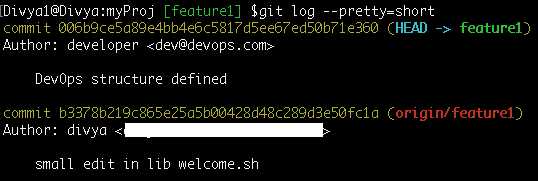

# 如何使用 Git Log 格式化提交历史？

> 原文：<https://www.edureka.co/blog/git-format-commit-history/>

在本文中，我们将讨论一些高级选项来格式化和打印提交日志，以便从项目日志历史中获取您需要的信息。因为我们已经知道， [Git](https://www.edureka.co/blog/git-tutorial/) 保存了提交到项目历史中的变更日志，我们现在将探索‘Git log’命令有帮助的更多方式。

*首先，为了方便和缩短历史，我切换到/检查“feature1”分支。* *使用命令——*

$`cd myProj`–切换到 git 项目

$`git checkout feature1`–跳转到“功能 1”分支

## **1。提交格式化**

### **1.1 以给定的格式将输出内容打印出来**

**语法:** `git log --pretty[=<format>]`

其中，  <格式> 可以是  之一 oneline ，  短，  中，  满，  满，  邮箱，

#### **1 . 1 . 1–pretty = one line**

漂亮打印提交日志【单行】 **命令:** `git log --pretty=oneline` **按顺序格式化输出:**<sha1><ref names><提交标题>

#### **1 . 1 . 2–pretty = short**

格式提交输出'短'格式: 提交<sha1>(refname)**作者:** <作者> <标题行>

#### 1 . 1 . 3–漂亮=中等

**命令:** `git log --pretty=medium` 以‘中等’格式打印提交输出:提交< sha1 > **作者** : <作者> **日期:** <作者日期>

<title line="">

<full commit="" message=""></full>
<h4><strong>1 . 1 . 4–pretty = full</strong></h4>
命令:  <code>git log --pretty=full</code> 输出格式为:提交< sha1 > (refname) <strong>作者:</strong> <作者> <strong>提交:</strong> <提交者>

<title line=""/>

<full commit="" message=""></full>
<h4><strong>1 . 1 . 5–pretty = fuller</strong></h4>
<strong>命令:</strong> <code>git log --pretty=fuller</code> 提交< sha1 >(引用名) <strong>作者:</strong> <作者> <strong>作者日期</strong> : <作者日期> <strong>提交:</strong> <提交者> <strong>提交日期:</strong> <提交者日期>

<title line=""/>

<full commit="" message=""></full>
<h4><strong>1 . 1 . 6–pretty =电子邮件</strong></h4>
命令:  <code>git log --pretty=email</code> 打印日志以邮件样式格式输出:从< sha1 > <日期> <strong>从:</strong> <作者> <strong>日期:</strong> <作者日期> <strong>主题:</strong>【补丁】<标题行>

<full commit="" message=""></full>
<h4 style="text-align: justify;"><strong>1 . 1 . 7–pretty = raw</strong></h4>
命令:  <code>git log --pretty=raw</code> 原始日志输出格式显示存储在提交对象中的整个提交。提交< sha-1 >

<title line=""/>

<full commit="" message=""/>

<h4 style="text-align: justify;"><strong>1 . 1 . 8–格式:<字符串>:自定义格式</strong></h4>
该格式允许您指定要在提交输出日志中打印提交对象的哪些信息。让我们考虑该选项提供的各种占位符，就像借助代码片段的“C printf”函数一样:

命令:  <code>git log --pretty=format:"%h %ad | %s %d [%an]" --date=short</code> <strong>输出格式:</strong> < sha-1 > <作者日期> | <提交标题> <引用名称>【作者名称】

<strong>% H</strong>= shorted hash-id/sha1 commit ids<strong>% H</strong>= long sha-1 ids<strong>% ad</strong>=创作日期 <strong> %s </strong> =提交主题标题行<strong>% d</strong>=引用指针(分支、标签)名称<strong>% an</strong>=作者姓名<strong>–日期</strong>=短:只打印日期，不打印

现在，让这个输出更人性化，用颜色怎么样？ <strong>命令:</strong>

 在上面的代码片段中使用的一些其他占位符有: <strong> %C(黄色)</strong>:将下面的字符串变为黄色 <strong> %Creset </strong>:将下面的字符串重置回默认(白色)颜色 <strong> %Cgreen </strong>:将下面的字符串变为绿色 <strong> %Cred: </strong>将下面的字符串变为红色% Cblue:将作者姓名变为蓝色

你不必每次都记住并写出完整的命令，只需用一个简短的名字作为  <a rel="noopener noreferrer" href="https://git-scm.com/book/en/v2/Git-Basics-Git-Aliases" target="_blank"> git 别名</a>  如下图: <strong>命令:</strong> <code>git config --global alias.c-hist 'log --pretty=format:"%C(yellow)%h%Creset %ad | %Cgreen%s%Creset %Cred%d%Creset %Cblue[%an]" --date=short'</code>

<em> "c-hist"   </em>代表<strong>c</strong>customized-<strong>hist</strong>ory 因此，正如您所观察到的，我正在用值设置我的全局  <a href="https://git-scm.com/book/en/v2/Customizing-Git-Git-Configuration"> git 配置</a>  文件。

现在，要查看当前分支的历史你所要做的就是运行命令，就像这样: <strong>命令:</strong> <code>git c-hist</code> 
<h3 style="text-align: justify;">1.2–abbrev-commit:缩短 git commit hash-id </h3>
<strong>命令:</strong> <code>git log --abbrev-commit</code> 完整的 40 字节十六进制提交对象名被缩短为默认的 7 字节。

      

为了方便查看，让我们将它与'<code>--oneline</code>'选项组合起来，就像这样: <strong>命令:</strong>   <code>git log --abbrev-commit --oneline</code> 

更精彩的是，还可以使用'–abbrev =<n>'选项指定 sha-1 ids 的字节长度，如下图: <strong>命令:</strong> <code>git log --abbrev-commit --abbrev=5 --oneline</code></n>

  显然，高亮显示的 sha-1 id 被缩减为 5 字节大小。
<h3><strong>1.3–不提交 </strong></h3>
显示完整的 40 字节十六进制提交对象名。这否定了<b>–abbrev-commit</b>以及那些隐含  it 的选项如“–one line”。  <strong>命令:</strong>   <code>git log --pretty=oneline --no-abbrev-commit</code>

   
<h3><strong>1.4–相对日期</strong></h3>
<strong>命令:</strong>   <code>git log --relative-date</code>  请注意，这个高亮显示的时间会根据您在系统上执行命令的时间而变化。
<h3 style="text-align: justify;"><strong>1.5–日期= <格式> </strong></h3>
您还可以使用以下任何格式选项来格式化提交日志日期:
<h4 style="text-align: justify;"><strong>1 . 5 . 1–日期=相对</strong></h4>
<strong>命令</strong> : <code>git log --date=relative</code> 这与上面的命令<code>git log --relative-date</code>同义，打印相同的提交。
<h4 style="text-align: justify;"><strong>1 . 5 . 2–日期=当地时间</strong></h4>
<strong>命令</strong> :   <code>git log --date=local</code> 
<h4 style="text-align: justify;"><strong>1 . 5 . 3–日期=iso </strong></h4>
<strong>命令:</strong>   <code>git log --date=iso</code> 
<h4 style="text-align: justify;"><strong>1 . 5 . 4–日期= iso-严格</strong></h4>
<strong>命令:</strong>   <code>git log --date=iso-strict</code> 
<h4 style="text-align: justify;">1 . 5 . 5–日期=rfc </h4>
<strong>命令:</strong>   <code>git log --date=rfc</code> 
<h4 style="text-align: justify;"><strong>1 . 5 . 6–日期=短</strong></h4>
<strong>命令:</strong>   <code>git log --date=short</code> 
<h4 style="text-align: justify;"><strong>1 . 5 . 7–date = raw(以秒为单位显示日期)</strong></h4>
<strong>命令:</strong> <code>git log --date=raw</code> 打印从  <a href="https://www.epochconverter.com/"> unix epoc </a>  时间(1970 年 1 月 1 日)开始的秒数。
<h4><strong>1 . 5 . 8–日期=人</strong></h4>
<strong>命令:</strong><code>git log --date=human</code>
<h4 style="text-align: justify;">1 . 5 . 9–日期=unix </h4>
将日期显示为<a href="https://www.epochconverter.com/">UNIX EPOC</a>(UTC)时间。命令:  <code>git log --date=unix</code> 
<h3 style="text-align: justify;"><strong>1.6–父母</strong></h3>
还以下列格式打印每个提交的父级:<commit> <parent and="" parents=""> <strong>命令:</strong><code>git log --parents</code><strong>Oneliner 输出命令:</strong>   <code>git log --parents --oneline</code></parent></commit>

需要注意的要点: <strong> C366419 </strong>  是一个合并提交，因此有 2 个父级分别是:<em>feeb 30 c</em>和<em>4920 ADC</em>同样；<strong>1d 67b 50</strong>是合并提交，合并<em>F2 ff 2 E4</em><em>abb 694 b</em><strong>078 F9 F5</strong>是合并提交
<h3 style="text-align: justify;"><strong>1.7–儿童</strong></h3>
打印表单中的子表单<提交> <子表单> <strong>命令:</strong> <code>git log --children --oneline</code> 

<strong>注意</strong> : 006b9ce 是最近提交的，因此还没有子提交对象。您在这个分支上进行的下一个更改和提交将是这个最新 sha-1 id 的子提交对象。
<h3 style="text-align: justify;"><strong>1.8–图表</strong></h3>
绘制 sha-1 ids 之前的提交历史的基于文本的图形表示。 <strong>命令:</strong>   <code>git log --graph</code> <strong>改进型单机输出:</strong> <code>git log --graph --oneline</code>

 这让您了解何时、如何以及为什么和其他分支合并到当前检出的分支中。
<h3 style="text-align: justify;"><strong>1.9–显示线性分隔符</strong></h3>
命令:  <code>git log --show-linear-break</code> 这是一个有用的命令，用于指示不属于一个线性分支的两个连续提交之间的障碍，换句话说就是来自不同分支的提交。

 将上述输出与‘git log–graph’命令输出进行比较，该命令输出清楚地显示了“线性中断”提交是如何合并的。
<h2>额外收获:总结 git 日志输出:“git shortlog”</h2>
'<code>git shortlog</code>'命令按照作者的方式对提交日志进行分类，并打印一个概述摘要，指出每个作者所做的提交。命令:  <code>git log shortlog</code> 

<strong>命令</strong> :   <code>git log shortlog -s</code> -s 代表——汇总，隐藏提交描述，只打印每个作者提交的次数，比如:

此外，您还可以使用在'<code>--pretty=format</code>'选项下讨论的相同占位符来格式化输出:尝试命令:  <code>git shortlog --format="%h | %s"</code>  因此，您应该同意此输出更有意义，因为它显示了每个作者的< sha-1 > id 和<提交标题>以及提交总数。

<strong>注意</strong> :   <em>有趣的是，您可以非常容易地找到进行特定提交的分支。值得在以后的文章中深入讨论这个问题。</em>

至此，我们结束了这个 Git 日志格式历史的博客，我希望你能发现它的信息。

在这篇文章中，我们学习了一些格式化技术，以一种更加定制和用户友好的方式打印项目信息。现在，您应该知道如何有效地使用“git log”命令的参数，从提交的历史中提取您需要的关于源代码的任何信息。就这样，我们结束了这篇文章，我希望你发现它的信息。

如果你想了解更多，你可以看看 Edureka 提供的这个  <a rel="noopener noreferrer" href="https://www.edureka.co/devops" target="_blank"> DevOps 认证培训</a>，edu reka 是一家值得信赖的在线学习公司，在全球拥有超过 250，000 名满意的学习者。Edureka DevOps 认证培训课程帮助学员了解什么是 DevOps，并获得各种 DevOps 流程和工具方面的专业知识，例如 Puppet、Jenkins、Nagios、Ansible、Chef、Saltstack 和 GIT，用于自动化 SDLC 中的多个步骤。

有问题要问我们吗？请在“Git 日志格式历史”这篇文章的评论部分提到它，我们会回复您。
 </body> </html></title>