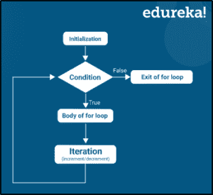

# Java 中的 for-each 循环是什么？

> 原文：<https://www.edureka.co/blog/for-each-loop-in-java/>

Java 中的 for-each 循环一般用于通过不同编程语言中的数组元素进行[迭代](https://www.edureka.co/blog/iterator-in-java/)。 *[Java](https://www.edureka.co/blog/java-tutorial/)* 5 引入了这种 for-each 循环，也称为增强型 for-each 循环。因此，在本文中，我将帮助你们了解 Java 中 for-each 循环的工作原理。

我将讨论以下主题:

*   [for-each 循环的重要性](#Importance_of_for-each_loop)
*   [语法](#Syntax)
*   [例题](#Example)

## **for-each 循环的重要性**

使用 for-each 循环，可以遍历给定的数组。它以关键字**开始，后跟条件。**

这个 **for** 语句是一个非常常用的循环语句。它包括指定索引初始值的表达式的初始化，下面的条件表达式确定循环是否继续，最后一个迭代表达式允许在每次循环结束时修改索引。它被称为 **for-each** **循环**，因为它逐个遍历每个元素。

此外，建议在 Java 中使用 for-each 循环来遍历[数组](https://www.edureka.co/blog/java-array/)和[集合](https://www.edureka.co/blog/java-collections/)中的元素，因为这使得代码可读性非常好。

现在让我们来看看这个 for-each 循环的语法。

## **语法:**

```
for(initialization; condition; iteration){
//body of for-each loop
}
```

**说明:**



*   声明以关键字  **开始，对于** 像普通的 for 循环一样。
*   不要初始化循环计数器变量，而是声明一个与数组的基本类型相同的变量，后跟一个冒号，然后后跟 [Java](https://www.edureka.co/blog/java-tutorial/) 中的数组名。
*   在循环体中，可以使用自己创建的循环变量，而不是使用索引数组元素。
*   它通常用于迭代一个数组或者一个 *[集合](https://www.edureka.co/blog/java-collections/)* 类。

现在让我们继续看一个例子。

## **例子**

```
 class example
{
public static void main(String[] args)
{
int i;
for(i = 1;i<=3; i++)
{
System.out.println("value of i = " +i);
}
} 
```

**输出:**

i = 1 的值 I = 2 的值 I = 3 的值

这就把我们带到了本文的结尾，我们已经了解了 Java 中的 *for-each 循环。希望你清楚本教程中与你分享的所有内容。*

如果您发现这篇文章与“Java 中的 for-each loop”相关，请查看一下  [*Edureka Java 认证培训*、](https://www.edureka.co/java-j2ee-training-course) 这是一家值得信赖的在线学习公司，拥有遍布全球的 250，000 多名满意的学习者。

我们在这里帮助你踏上旅程的每一步，我们为想成为 Java 开发者的学生和专业人士设计了一套课程。该课程旨在让你在 Java 编程方面有一个良好的开端，并训练你掌握核心和高级 Java 概念以及各种 Java 框架，如 Hibernate & Spring。

如果您遇到任何问题，请在“Java 中 For-each 循环”的评论部分提出您的所有问题，我们的团队将很乐意回答。