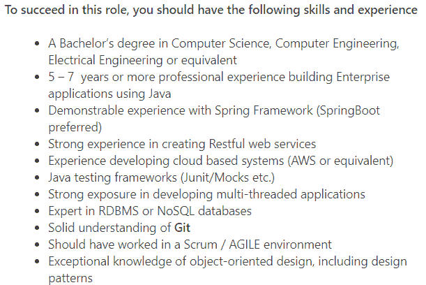
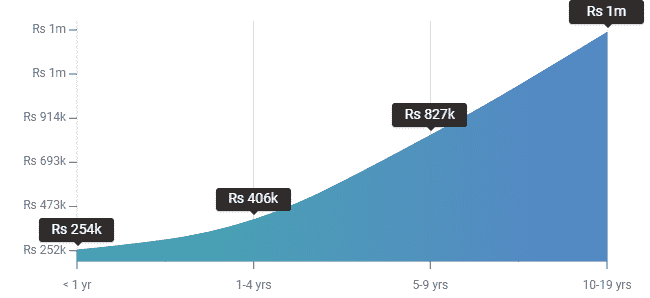
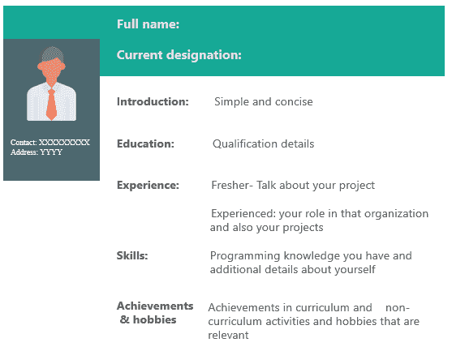

# Java 开发者简历:如何打造令人印象深刻的简历？

> 原文：<https://www.edureka.co/blog/java-developer-resume/>

你可能听说过一句谚语“先入为主”。嗯，你的简历通常是潜在雇主对你的第一印象。所以，要给人留下第一印象，你的简历必须从人群中脱颖而出。在本文中，让我们来看看如何撰写一份 Java 开发人员简历，这将帮助你在竞争 [Java 职位的激烈竞争中脱颖而出。【T2](https://www.edureka.co/blog/what-is-java/)

本文讨论的话题如下:

1.  [谁是 Java 开发人员？](#java-developer)
2.  [职位描述](#job-description)
3.  [角色&职责](#responsibilities)
4.  [所需技能](#skills)
5.  [Java 开发人员工资](#salary)
6.  【Java 开发人员简历样本

## **谁是 Java 开发人员？**

在计算机编程的世界里， [Java](https://www.edureka.co/blog/java-tutorial/) 是最流行的语言之一。由于其受欢迎程度、高需求和易用性，大约有 900 多万开发人员正在使用这种语言。

顾名思义，Java 开发人员主要使用 Java 来设计、开发和构建具有动态元素的应用程序和网站。让我把它变得更简单。Java 运行在超过 70 亿台设备上，包括超过 20 亿部智能手机。我们日常使用的购物、银行等应用程序并不是自己构建的，像网飞这样的网站当然也不会认为自己存在。开发人员可能不得不创建它们中的每一个。

接下来，让我们更深入地了解成为一名 Java 开发人员需要什么。

## **职位描述**

制作简历的第一步是看工作描述。下面是一家顶级公司*飞利浦，*为中级 java 开发人员发布的职位描述。检查一下提到的技能。

职位描述可能会根据组织的要求和需要而有所不同。 记住，因为 [Java 被广泛使用](https://www.edureka.co/blog/top-10-reasons-to-learn-java/)，尤其是在大型组织中，Java 开发人员的日常角色和职责可能会有所不同。

## **Java 开发者**

Java Developer 负责整个应用程序开发生命周期中的各种事情，从概念和设计一直到测试。以下是一些核心职责:

*   设计、构建和维护基于 Java 的应用程序和网站
*   贡献并参与软件和架构开发活动
*   开发设计良好、高效且可测试的代码
*   进行软件分析、编程、测试和调试
*   对报告的问题进行故障排除和解决，并及时回复查询
*   准备和生产软件组件版本
*   制作详细的设计文件
*   通过实现最佳实践来提高代码质量
*   建议更改以改进已建立的 java 应用程序流程

绝不是，这些是 Java 开发人员的固定职责，它们因公司和具体职位的不同而有很大差异。既然您已经了解了 Java 开发人员的一般职责，那么让我们来看看成为一名 Java 开发人员所需的技能。

## **所需技能**

为了完成上面列出的所有任务，Java 开发人员应该具备一定的技能。但是初级开发人员和高级开发人员的技能和工作经验略有不同。

新生所需的技能是:

*   0-2 年 Java 开发经验。
*   了解[面向对象编程](https://www.edureka.co/blog/object-oriented-programming/)和设计
*   至少有一个 [Java 框架](https://www.edureka.co/blog/java-frameworks/)的工作经验
*   了解关系数据库、 [SQL](https://www.edureka.co/blog/mysql-tutorial/) 和 ORM
*   了解 web 技术，比如 HTML、CSS、T2、Javascript 和 JQuery
*   精通 Java，JavaScript， [Java Applets](https://www.edureka.co/blog/java-applet-tutorial/) ，Java Servlets， [Java Beans](https://www.edureka.co/blog/what-is-javabeans/)
*   优秀的沟通能力和人际交往能力
*   积极的团队合作精神和反映领导技能的能力

现在，让我们看看一个有经验的 Java 开发人员需要的技能:

*   提到的入门级 Java 开发人员的所有基本资格
*   至少 2-5 年 Java 编程语言工作经验
*   Java 效率高，精通面向对象编程
*   Java 和可重用 Java 库中各种设计和[模式的知识](https://www.edureka.co/blog/java-design-patterns/)
*   熟悉 MVC、JDBC、JSP、SOAP 和 RESTful 等概念
*   Java UI 概念，比如小程序和框架，比如 Swing、SWT 和 AWT
*   关于[测试工具](https://www.edureka.co/blog/software-testing-tools/)的知识，如 JUnit、TestNG、Spock、Mockito 等
*   使用外部和嵌入式数据库的经验
*   优秀的软技能，如沟通、解决问题和客户服务

上面列出的技能是公司要求的基本技能 。它们也可能因公司而异。现在，让我们看看为什么您应该选择 Java 作为开发人员的职业。

## **Java 开发人员工资**

Java 超过 22 年的历史，然而 Java 的成功故事仍在继续。它的受欢迎程度和使用量持续增长，被认为是开发人员社区中最可靠的编程语言。Java 在所有其他编程语言中的受欢迎程度是最高的。据 Indeed 报道，在美国，一名 Java 开发人员的平均年薪约为**102，474** 美元。根据 ***工资等级*** ，查看基于印度 Java 开发人员经验水平的工资。

底线，从消费设备到异构企业系统的广泛环境的应用程序都是由 Java 编程开发的。因此，对 Java 的需求永远不会减少。下面是一份 Java 开发人员简历的样本。

## 【Java 开发人员简历样本

起草简历时，有些事情你应该注意。下面列出了一些简单的建议，可以帮助你制作出最好的简历。

*   介绍应该非常简单，并且要切中要点
*   您的教育详细信息应包含最新学位的详细信息
*   接下来是你的经历。可以是项目工作、实习或之前的工作经历
*   如果你是大一新生，你可以提及你参与过的项目，并证明你在其中的角色
*   如果你有经验，提及你最近的工作角色和你参与过的项目&你在以前的公司取得的成就
*   明确提及你擅长的技术技能
*   最后，但同样重要的是，提及你的成就和爱好。尽量不要夸大其词，因为这可能会分散面试官的注意力。保持简单。

就这样，伙计们！到此，我们结束了这篇“Java 开发人员简历”的博客。我希望你们喜欢这篇文章，并了解如何写一份有创意的简历来帮助你在职业生涯中取得进步。

如果你刚刚开始，那么看看这篇 Java 教程，了解基本的 Java 概念。

[https://www.youtube.com/embed/iGGgxnJCNRM](https://www.youtube.com/embed/iGGgxnJCNRM)

***确保你尽可能多的练习，恢复你的经验。***

**查看 Edureka 提供的 [**Java 在线课程**](https://www.edureka.co/java-j2ee-training-course) ，edu reka 是一家值得信赖的在线学习公司，在全球拥有超过 250，000 名满意的学习者。我们在这里帮助你的旅程中的每一步，为了成为一个除了这个 java 面试问题，我们提出了一个课程，这是为学生和专业人士谁想要成为一个 Java 开发人员设计的。**

*有问题吗？请在这篇“Java Map interface”**文章的评论部分提到它，我们会尽快回复您。*