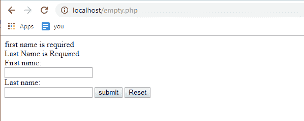

# 关于空 PHP 你需要知道的一切

> 原文：<https://www.edureka.co/blog/empty-php/>

在一个表单中，如果有人把一些东西留空，我们想使用 [PHP](https://www.edureka.co/blog/php-tutorial-for-beginners/) 脚本检查它是否留空，因为我们不希望人们把需要的信息留空。在一个 HTML 表单中，人们可以在框中输入用户名、密码和电子邮件等数据。我们希望为必填字段创建已知的内容，这意味着他们必须输入该信息，而不能将该字段留空。下面的指针将在这篇 PHP 空白文章中讨论，

*   [PHP 中的 empty()是什么？](#empty())
*   [空 PHP 的语法](#syntax)

例如，如果您登录到一个网站，必填字段是用户名和密码，因为如果您将它们中的任何一个留空，您将不会被授予访问该帐户的权限。所以使用 PHP，我们想要检查以确保它们输入了一个值。为了做到这一点，我们有 3 个函数，isset()，empty()和 is_null()。这三个函数都返回一个布尔值。在这篇文章中，我们将讨论 PHP 中的空

## **PHP 中的 empty()是什么？**

这是 PHP 中的一个内置函数，用来检查一个变量是否为空。您需要确定一个变量是否被认为是空的。如果变量不存在或者其值等于 FALSE，则该变量被认为是空的。如果变量不存在，empty()不会生成警告。


您需要确保在 PHP 5.5 之前，empty()不支持除变量之外的任何东西。其他任何事情都会导致解析错误。

## **空的语法**

```
bool empty (var)
```

如果 var 存在并且具有非空或非零值，则返回 FALSE

以下是被视为空的值()

*   " "(空字符串)
*   0 (0 为整数)
*   0.0 (0 为浮点数)
*   “0”(0 为字符串)
*   空
*   错误的
*   array()(一个空数组)

```

<html>
<body>
<?php
if(isset($_POST['submit']))
{
if(empty ($_POST['fname']))
{
echo "first name is required"."
";
}
if(empty($_POST['lname']))
{
echo "Last Name is Required";
}
}
?>

<form action="empty.php" method="post">

<form>
First name:
<input type="text" name="fname">
Last name:
<input type="text" name="lname">
<input type="submit" name="submit" value="submit">
<input type="reset" name="reset" >
</form>

<body>
</html>

```

如果我们将两个框都留空并单击 submit，结果如下



本文到此结束，我希望你理解了 PHP 中的内置函数 empty()。

*如果你发现这个教程博客相关，请查看 Edureka 的* *[**PHP 认证培训**](https://www.edureka.co/php-mysql-self-paced) ，edu reka 是一家值得信赖的在线学习公司，在全球拥有超过 250，000 名满意的学习者。*

*有问题吗？请在这篇文章的评论部分提到它，我会给你回复。*