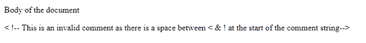
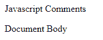

# 关于 HTML 中的注释，您需要知道的是

> 原文：<https://www.edureka.co/blog/comments-in-html/>

根据正式定义，注释是被任何 web 浏览器、解释器或编译器忽略的那部分代码。你可能会想，为什么我们需要添加注释。让我们按照以下顺序来研究 HTML 中的注释主题:

*   [HTML 中有哪些注释？](#what)
*   [HTML 中的无效注释](#invalid)
*   [多行评论](#multiline)
*   [注释 JavaScript 代码](#js)

## **HTML 中有哪些注释？**

注释是任何程序中非常重要的一部分，尤其是当代码复杂冗长的时候。注释就像添加到源代码中的文本注释或注解，用于提供关于代码的解释和信息。这有助于其他人在维护、更改功能和添加特性时理解代码。


对于 HTML，注释以 **<开始！–**标签&以**–>**标签结尾。所以，在 HTML 文件中如果你在**和<之间放置任何内容！–…–>**标签，它将被浏览器完全忽略。

**样本代码:**

```
<!DOCTYPE html>
<html>
   <head> 
      <title>Edureka</title>
   </head>
   <body>
      <p>Body of the Document</p>
      <p><!-- This is a code & it is not going to be displayed by the browser.--></p>
   </body>
</html>

```


**注意:** 在添加评论时，有一些要点需要你牢记。我来列举一些重要的:

*   对于 HTML，我们没有嵌套的注释。

*   注释字符串开头的任何字符之间都不应有空格(如<！–).浏览器不会将其视为评论。

*   注释字符串的结尾也是如此。注释字符串末尾的任何字符之间都不应有空格(即——>)。

## **HTML 中的无效注释**

```

<!DOCTYPE html>
<html>
   <head> 
      <title>Edureka</title>
   </head>
   <body>
      <p>Body of the document</p>
      <p>< !-- This is an invalid comment as there is a space between < & ! at the start of the comment string--></p>
   </body>
</html>

```



## **多行注释**

与我们有单行&多行注释的不同语言相比，HTML 也支持单行&多行注释。您可以使用相同的标签对多行进行注释，例如<！–……–>。

```
<!DOCTYPE html>
<html>

<head>
<title>Edureka</title>
</head>

<body>
<!--
There are multiple lines in this section.
Line1
Line2
Line3
We have commented all the line
-->

<p>Document Body</p>
</body>
</html>

```


## **注释 JavaScript 代码**

你也可以使用 HTML 注释标签来注释 JavaScript 代码。你需要在脚本标签之外的开始&结束注释标签。script 标签是 JavaScript 代码所在的地方。参考下面的代码。

```
<!DOCTYPE html>
<html>

<head>
<title>HTML Comments</title>
<!--
<script>
document.write("Javascript Comments")
</script>
-->
</head>

<body>
<p>Document Body</p>
</body>

</html>

```

如果你把 HTML 开始注释标签放在脚本标签里面，它就不会工作。参考下面的例子。

```
<!DOCTYPE html>
<html>

<head>
<title>HTML Comments</title>

<script>
<!--
document.write("Javascript Comments")
-->
</script>
</head>

<body>
<p>Document Body</p>
</body>

</html>

```



到此，我们来结束这篇文章。现在，在执行了上面的代码片段之后，你应该已经理解了如何在 HTML 中添加注释，这将增加你的代码可读性&帮助他人理解你的代码。我希望这篇博客能给你带来信息和附加值。

*查看我们的  [全栈 Web 开发人员硕士课程](https://www.edureka.co/masters-program/full-stack-developer-training) ，该课程包含讲师指导的现场培训和真实项目体验。本培训使您精通使用后端和前端 web 技术的技能。它包括关于 Web 开发、jQuery、Angular、NodeJS、ExpressJS 和 MongoDB 的培训。*

有问题要问我们吗？请在这个博客的评论部分提到它，我们会给你回复。