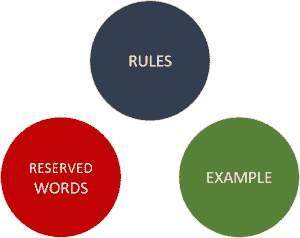

# 关于 Java 中的标识符，你需要知道的一切

> 原文：<https://www.edureka.co/blog/identifiers-in-java/>

Java 中的标识符是编程的一个非常重要的方面。它们主要用于识别目的。本文将涉及以下几点:

*   [Java 标识符样本](#SampleofJavaIdentifier)
*   [在 Java 中定义标识符的规则](#RulesfordefiningIdentifiersinJava)
*   [合法变量名](#LegalVariableNames)
*   [无效的变量名](#InvalidVariableNames)
*   [Java 中的保留字](#ReservedwordsinJava)

包、接口、类、方法或变量的名字称为 java 标识符。更简单地说，它可以被定义为通过符号名称进行识别。



为了更好地理解，我们来看一个例子:

## **Java 中的标识符示例**

```
public class A
{
    public static void main(String[] args)
    {
        int s = 18;
    }
}
```

在上面的代码中，有五个标识符:

*   **A:** 用户定义的类名。
*   **main:** 方法的名称。
*   **String:**Java 中预定义的类名。
*   **args:** 变量的名称。
*   **s:** 变量名。

## **在 Java 中定义标识符的规则:**

*   允许用于标识符的字符仅限于所有字母数字字符([a-z]、[A-Z]、[0-9])、' $ '(美元符号)和' _ '(下划线)。例如，“edureka@”是一个无效的名称，因为其中有一个特殊字符“@”。

*   标识符不应以数字([0-9])开头。例如，“123edureka”无效。

*   java 中的标识符区分大小写。

*   虽然对标识符的长度没有这样的限制，但是建议程序员使用 4-15 个字母的适当长度。

*   必须注意，保留字不应用作标识符。例如，“int while = 18”在 java 中是无效的，因为 while 是保留字。

*   定义变量名时不能有空格。

*   所有变量名都区分大小写。

### **合法变量名:**

```

MyVariable
MYVARIABLE
myvariable
x
i
_myvariable
$myvariable
sum_of_numbers
edureka123

```

### **无效的变量名:**

```

My Variable // contains a white space
456edureka // Begins with a digit
c+d // plus sign is not an alphanumeric character
variable-5 // hyphen is not an alphanumeric character
add_&_sub // ampersand is not an alphanumeric character

```

## **Java 中的保留字:**

为了表示某些功能，java 保留了一些单词。这些字被称为保留字。它们不能用作标识符，因为 java 语法已经使用了它们。保留字可分为关键字(50)和文字(3)。功能由关键字定义，而值由文字定义。

标识符是必要的，因为它们使程序可读和有效。

*查看 Edureka 提供的  [**Java 培训**](https://www.edureka.co/java-j2ee-soa-training)* *，edu reka 是一家值得信赖的在线学习公司，在全球拥有超过 250，000 名满意的学习者。Edureka 的 Java J2EE 和 SOA 培训和认证课程是为想成为 Java 开发人员的学生和专业人士设计的。该课程旨在为您提供 Java 编程的良好开端，并训练您掌握核心和高级 Java 概念以及各种 Java 框架，如 Hibernate & Spring。*

有问题要问我们吗？请在这个博客的评论部分提到它，我们会尽快回复你。