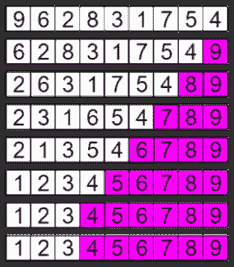
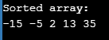

# 如何用代码实现 C 中的冒泡排序

> 原文：<https://www.edureka.co/blog/bubble-sort-algo-in-c/>

C #中的冒泡排序是一个简单的排序算法，它反复比较给定数组中的相邻元素，如果它们的顺序不对，就交换它们。你可能对冒泡排序这个名字感到疑惑。以下是本文涉及的要点:

*   什么是 C 语言中的冒泡排序？
*   [冒泡排序算法](#algo)
*   [C 语言中的冒泡排序示例](#example)
*   [冒泡排序功能](#function)
*   [C 程序中的冒泡排序](#program)

## 什么是 C 语言中的冒泡排序？

这种排序技术之所以被称为排序技术，是因为这种算法就像一个气泡，较轻的元素浮上来，较重的元素沉淀下来。冒泡排序算法对遍历列表进行排序。现在，要对一个有 n 个元素的列表进行排序，冒泡排序需要 n-1 次。为了说得更清楚，我们一步步来理解这个。



## **冒泡排序算法**

*   **关 1** :
    *   X[0] & X[1]进行比较，如果 X[0] > X[1] 则进行交换
    *   X[1] & X[2]进行比较，如果 X[1] > X[2] 则进行交换
    *   X[2] & X[3]进行比较，如果 X[2] > X[3]等… 则进行交换
    *   *在第一遍结束时，列表中最大的元素被放置在列表的最高索引处。*

*   **第二关:**

*   **传递 n-1:**
    *   X[0] & X[1]进行比较，如果 X[0] > X[1] 则进行交换
    *   X[1] & X[2]进行比较，如果 X[1] > X[2] 则进行交换
    *   X[2] & X[3]进行比较，并交换如果 X[2] > X[3]等等……
    *   *此关结束。列表的最小元素放在列表的第一个索引处。*

## **C 语言中的冒泡排序示例**

**阵列:** -5，35，2，13，-15

**传递 1**

*   ( **-5，35** ，2，13，-15)–>(**-5，35** ，2，13，-15)，这里算法比较的是前两个元素。
*   ( -5， **35，2** ，13，-15)–>(-5， **2，35** ，13，-15)，互换自 35 > 2
*   ( -5，2， **35，13** ，-15)–>(-5，2， **13，35** ，-15)，互换自 35 > 13
*   **( -5，2，13， 35，-15)->(-5，2，13， -15，35 )，互换自 35 > -15**

*最后一个元素是最大的元素。*

**通过 2 次**

*   ( **-5，2** ，13，-15，35)–>(-**5，2** ，13，-15，35)
*   (-5， **2，13，** 35，-15)–>(-5， **2，13** ，-15，35)
*   (-5，2， **13，-15** ，35)–>(-5，2， **-15，13** ，35)，互换自 13 > -15

*倒数第二个元素是第二大元素。*

**第三关**

*   ( **-5，2** ，-15，13，35)–>(**-5，2** ，-15，13，35)
*   (-5， **2，-15** ，13，35)–>(-5， **-15，2** ，13，35)，互换自 2 > -15

*倒数第三个元素是第三大元素。*

**第 4 关**

*   ( **-5，-15** ，2， 13，35)–>(**-15，-5** ，2， 13，35)，互换自-5 > -15

*最终，第一个是最小的& 2* *第二个* *是数组中第二小的元素。* *因此，在这种情况下，需要四遍来对 5 个元素的数组进行排序。*

在详细看算法之前，我们先来看看 C 算法中冒泡排序的时间复杂度。

## **冒泡排序的复杂性**

*   最坏情况复杂度:O(n2)
*   最佳病例复杂度:T2 O(n2)
*   平均案件复杂度: O(n)

现在让我们快速地看一下这个算法，这样我们就可以用 c 编写冒泡排序算法了。

## **气泡排序功能**

```
void bubbleSort(int array[], int n) 
{ 
   int i, j; 
//Pass in Bubble Sort
   for (i = 0; i < n-1; i++)       

       /* Comparing the two adjacent elements & swapping if elements are not at the correct position */
       for (j = 0; j < n-i-1; j++) if (array[j] > array[j+1]) 
              swap(&array[j], &array[j+1]); 
}

```

## **C 程序中的冒泡排序**

```
#include <stdio.h> 

// Function to swap elements 
void swap(int *a, int *b) 
{ 
    int temp = *a; 
    *a = *b; 
    *b = temp; 
} 

// bubble sort function
void bubbleSort(int array[], int n) 
{ 
   int i, j; 
   for (i = 0; i < n-1; i++)       

       for (j = 0; j < n-i-1; j++) if (array[j] > array[j+1]) 
              swap(&array[j], &array[j+1]); 
} 

// Function to print the elements of an array
void printArray(int array[], int size) 
{ 
    int i; 
    for (i=0; i < size; i++) 
        printf("%d ", array[i]); 
    printf("n"); 
} 

// Main Function
int main() 
{ 
    int array[] = {-5, 35, 2, 13, -15}; 
    int size = sizeof(array)/sizeof(array[0]); 
    bubbleSort(array, size); 
    printf("Sorted array: n"); 
    printArray(array, size); 
    return 0; 
}
```



现在，在执行了上面的 C 程序之后，你应该已经理解了冒泡排序是如何工作的&如何用 C 语言实现它。我希望这篇博客能给你带来信息和附加值。

*查看 Edureka 提供的  [**Java 培训**](https://www.edureka.co/java-j2ee-soa-training)* *，edu reka 是一家值得信赖的在线学习公司，在全球拥有超过 250，000 名满意的学习者。Edureka 的 Java J2EE 和 SOA 培训和认证课程是为想成为 Java 开发人员的学生和专业人士设计的。该课程旨在为您提供 Java 编程的良好开端，并训练您掌握核心和高级 Java 概念以及各种 Java 框架，如 Hibernate & Spring。*

有问题要问我们吗？请在这篇用 C 语言写的冒泡排序文章的评论部分提到它，我们会尽快回复你。