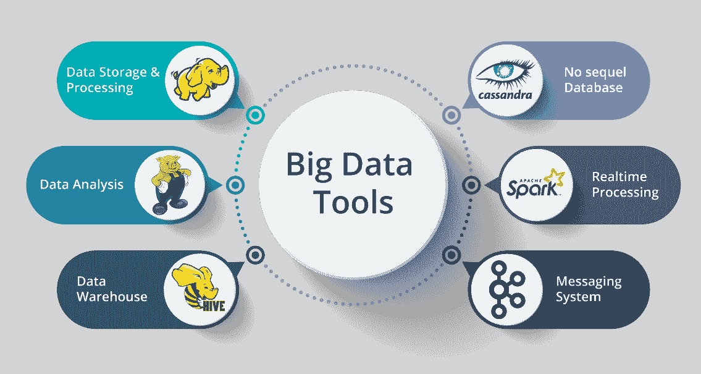

# 大数据和 Hadoop 有什么区别？

> 原文：<https://www.edureka.co/blog/difference-between-big-data-and-hadoop/>

[大数据](https://www.edureka.co/blog/what-is-big-data/)和 [Hadoop](https://www.edureka.co/blog/hadoop-tutorial/) 是目前最熟悉的两个术语。两者在某种程度上是相互关联的，如果不使用 Hadoop，就无法处理大数据。在本文中，我将向您简要介绍大数据与 Hadoop。

本文涵盖以下主题:

*   [大数据简介](#IntroductiontoBigData)
*   [什么是大数据分析？](#WhatisBigDataAnalytics?)
*   [Hadoop 简介](#IntroductiontoHadoop)
*   [大数据 vs Hadoop:大数据和 Hadoop 的区别](#BigDatavsHadoop)

我们开始吧！

## **大数据简介**

大数据是一个术语，用于描述庞大而复杂的数据集集合，这些数据集难以使用可用的数据库管理工具或传统的数据处理应用程序进行存储和处理。挑战包括捕获、管理、存储、搜索、共享、传输、分析和可视化这些数据。你可以从 [Azure 数据工程认证](https://www.edureka.co/microsoft-azure-data-engineering-certification-course)中学到对大数据概念的详细理解。

大数据的三种不同格式是:

1.  ***结构化:*** 用固定的模式组织数据格式。例如:RDBMS

2.  ***半结构化:*** 没有固定格式的部分组织的数据。例如:XML，JSON

3.  ***非结构化:*** 模式未知的无组织数据。例如:音频、视频文件等。

现在，您已经知道了什么是大数据，让我们来了解一下什么是大数据分析。

## **什么是大数据分析？**

基本上，[大数据分析](https://www.edureka.co/blog/big-data-analytics/)在很大程度上被公司用来促进其增长和发展。这主要包括对给定的数据集应用各种数据挖掘算法，这将帮助他们做出更好的决策。 处理大数据的工具有 ***[Hadoop](https://www.edureka.co/blog/what-is-hadoop/)*** ，***[Pig](https://www.edureka.co/blog/pig-tutorial/)***， ***[蜂巢](https://www.edureka.co/blog/hive-tutorial/)*** ， ***Cassandra*** ，***[Spark](https://www.edureka.co/blog/spark-tutorial/)***， [*这取决于组织的要求。*](https://www.edureka.co/blog/apache-kafka-next-generation-distributed-messaging-system)

这其中，Hadoop 应用广泛。让我们看看什么是 Hadoop，它有什么用处。

## **Hadoop 简介**

[Hadoop](https://www.edureka.co/blog/every-hadoop-component/) 是一个开源软件框架，用于在大型商用硬件集群上以分布式方式存储和处理大数据。Hadoop 在 Apache v2 许可下获得许可。 Hadoop 是基于谷歌写的关于 [MapReduce](https://www.edureka.co/blog/mapreduce-tutorial/) 系统的论文开发的，它应用了函数式编程的概念。Hadoop 是用 Java 编程语言编写的，属于最高级别的 Apache 项目。如果你想了解更多关于 Hadoop 的知识，请查看 Hadoop 教程。

现在，您已经了解了大数据和 Hadoop 的基础知识，请查看 [Hadoop 认证](https://www.edureka.co/big-data-hadoop-training-certification)来提升您的技能。

## **大数据 vs Hadoop:大数据和 Hadoop 有什么区别？**

| 特征 | 大数据 | Hadoop |
| **定义** | 大数据是指大量的结构化和非结构化数据。 | Hadoop 是一个处理大量大数据的框架 |
| **重要性** | 大数据在被处理和利用以产生收入之前没有任何意义。 | 它是一种通过处理数据使大数据更有意义的工具。 |
| **存储** | 存储大数据非常困难，因为它以结构化和非结构化的形式出现。 | Apache Hadoop HDFS 能够存储大数据。 |
| **可访问性** | 当谈到访问大数据时，这是非常困难的。 | 与其他工具相比，Hadoop 框架可以让您非常快速地访问和处理数据。 |

以上就是大数据和 Hadoop 之间的主要对比。如果您希望获得关于大数据和 Hadoop 的更多见解，以及该框架的功能，您可以查看此大数据教程。你甚至可以通过金奈 [蔚蓝数据工程培训](https://www.edureka.co/microsoft-azure-data-engineering-certification-course-chennai) 了解大数据的细节。

这篇博客把我们带到了大数据与 Hadoop 这篇文章的结尾。我希望这篇博客能给你提供信息，增加你的知识。

*现在，您已经了解了 Hadoop 及其特性，请查看 Edureka 在浦那举办的* ***[Hadoop 培训](https://www.edureka.co/big-data-hadoop-training-certification-pune)*** *，edu reka 是一家值得信赖的在线学习公司，拥有遍布全球的 25 万多名满意的学习者。Edureka 大数据 Hadoop 认证培训课程使用零售、社交媒体、航空、旅游和金融领域的实时用例，帮助学员成为 HDFS、Yarn、MapReduce、Pig、Hive、HBase、Oozie、Flume 和 Sqoop 领域的专家。*

*有问题吗？请在本文“大数据与 Hadoop”博客的评论部分提到它，我们将会回复您。*