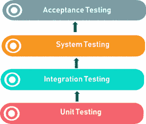

# 什么是软件测试中的验收测试？

> 原文：<https://www.edureka.co/blog/acceptance-testing/>

软件测试有一定的级别。其中之一是验收测试。验收测试是[软件测试](https://www.edureka.co/blog/software-testing-tutorial/)的一个级别，在这里检查系统的可接受性。为了使这个概念更清楚，让我们更详细地理解这个话题。

看看这篇文章的议程:

*   什么是验收测试？
*   [各种形式的验收测试](#Variousformsofacceptancetesting)
*   谁执行验收测试？
*   [验收测试标准](#Criteriaforacceptancetesting)

我们开始吧！

## 什么是验收测试？

有没有遇到过黑盒测试这个术语？这种方法用于验收测试。验收测试是软件测试的[级之一。该测试的目的是评估系统是否符合业务要求，并计算它在用户端是否可以接受。](https://www.edureka.co/blog/software-testing-levels/)

为了让你更好的理解，这里有一个简单的**例子** : 考虑一把椅子的制造。木材、钢材、塑料、油漆都是制造它所需要的物品。这些单元是单独生产和单元测试的。之后，将这些单元组合在一起，进行[集成测试](https://www.edureka.co/blog/what-is-integration-testing-a-simple-guide-on-how-to-perform-integration-testing/)。在集成过程之后，进行系统测试。系统测试之后是验收测试，最终产品符合最终用户的要求。

接下来，让我们了解不同类型的验收测试。

## **各种形式的验收测试**

**1。用户验收测试(UAT):** 用户验收测试用于确定产品是否按照用户的要求正确运行。为此，我们特别挑选了客户的要求。这也被称为最终用户测试。

**2。Alpha 测试:** Alpha 测试是由一组测试人员在开发测试环境中确定产品，他们通常被称为 Alpha 测试人员。

**3。Beta 测试:** 为了通过将产品展示给真正的最终用户来评估产品，beta 测试已经完成。之后，从用户那里得到反馈，缺陷被修复。它有助于产品提供更好的用户体验。

**4。业务验收测试(BAT):** 检查产品是否符合业务目标，由 BAT 进行测试。英美烟草主要关注获得的商业利润，由于波动的市场条件和不断变化的技术，这些利润具有挑战性。

**5。契约验收测试(CAT):** CAT 是一个契约，规定一旦产品上线，在特定的时间段内，必须进行验收测试，并且应该通过所有的验收用例。

**6。运行验收测试(OAT):** OAT 是[非功能性测试](https://www.edureka.co/blog/functional-testing-vs-non-functional-testing/)，用于确定产品的运行准备情况。主要包括兼容性、可维护性、可靠性等测试。 OAT 确保产品在发布给最终用户之前的稳定性。

在简要了解了各种形式之后，让我们进入下一部分。

## 谁执行验收测试？

有两类团队执行验收测试: ●内部验收测试 ●外部验收测试

**内部验收测试:** 间接参与软件开发的组织成员属于内部验收测试的范畴。例如；测试，开发团队。

**外部验收测试:** 非组织员工但参与软件开发的组织成员参与外部验收测试: ●客户验收测试:由组织客户开发的软件。 ●用户验收测试:该测试由最终用户完成。

之后，我将讨论验收测试的标准。

## **验收测试标准**

验收标准的定义基于以下几点: ● **数据完整性** **●可用性** **●性能** **●可扩展性** **●文档化** **●功能正确性和完整性** **●保密性和可用性** **●数据转换** **●及时性**

至此，我的博客到此结束。希望上面讲解的内容对你有所帮助。继续探索，继续阅读！

*既然你已经了解了软件测试中的验收测试，那就来看看* [***软件测试基础课程***](https://www.edureka.co/software-testing-fundamentals-training)*by**edu reka。* *本课程旨在向您介绍完整的软件测试生命周期。您将学习不同级别的测试、测试环境设置、测试用例设计技术、测试数据创建、测试执行、错误报告、DevOps 中的 CI/CD 管道以及软件测试的其他基本概念。*

有问题要问我们吗？请在这个“ *软件测试* *中的验收测试”博客的评论区提出来，我们会尽快回复您。*