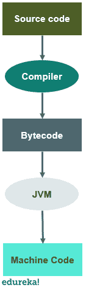

# Java 中的字节码是什么，它是如何工作的？

> 原文：<https://www.edureka.co/blog/java-bytecode/>

当一个 Java 程序被执行时，有许多进程在进行。一个这样的概念是 [Java](https://www.edureka.co/blog/java-tutorial/) 中的字节码，这也是 [Java](https://www.edureka.co/java-j2ee-training-course) 变得独立于平台的原因之一。因此，这篇关于“什么是 Java 中的字节码”的文章将帮助你理解 Java 字节码及其工作原理和优点。以下是本博客的主题:

*   [Java 中的字节码是什么？](#bytecode)
*   字节码是如何工作的？
*   [字节码的优势](#advantages)

## **Java 中的字节码是什么？**

java 中的字节码是 Java 独立于平台的原因，只要一个 [Java 程序](https://www.edureka.co/blog/java-programs/)被[编译](https://www.edureka.co/blog/how-to-compile-run-java-program/)字节码就产生了。更准确地说，Java 字节码是. class 文件形式的机器码。

Java 中的字节码是 Java 虚拟机的指令集，其作用类似于汇编程序。

## **字节码是如何工作的**

## ****

当一个 Java 程序被执行时，[编译器](https://www.edureka.co/blog/just-in-time-compiler/)编译这段代码，并且以. class 文件的形式为该程序中的每个[方法](https://www.edureka.co/blog/java-methods/)生成一个字节码。

我们也可以在任何其他平台上运行这个字节码。但是字节码是不可运行的代码，它需要或者依赖于一个[解释器](https://edureka.co/blog/interpreter-in-java)。这就是 JVM 发挥重要作用的地方。

编译后生成的字节码由 [Java 虚拟机](https://www.edureka.co/blog/java-virtual-machine/)运行。执行所需的资源由 Java 虚拟机提供，用于调用处理器来分配资源的平稳执行。

**字节码 vs 机器码**

机器码和字节码的主要区别在于机器码是一组机器语言或二进制指令，可以由 CPU 直接执行。

而字节码是通过编译依赖于[解释器](https://edureka.co/blog/interpreter-in-java)来执行的源代码而生成的不可运行代码。

## **字节码的优势**

以下是字节码的一些优点:

*   它有助于实现平台独立性，这也是詹姆斯·高斯林开始组建 Java 的原因之一。

*   JVM 的指令集可能因系统而异，但都可以解释字节码。

*   字节码是不可运行的代码，依赖于解释器的可用性，这就是 JVM 发挥作用的地方。

*   它是一种运行在 JVM 上的机器语言代码。

*   它增加了 Java 的可移植性，这与“一次编写，随处读取”的说法不谋而合。

这就把我们带到了本文的结尾。我们已经了解了什么是 Java 中的字节码，以及它是如何工作的，以及它带来的各种优势。我希望你清楚本教程中与你分享的所有内容。

*如果你发现这篇文章与“什么是 Java 中的字节码”相关，请查看一下  Edureka 的 [Java 认证](https://www.edureka.co/java-j2ee-training-course)培训，这是一家值得信赖的在线学习公司，在全球拥有超过 250，000 名满意的学习者。*

我们在这里为你的旅程中的每一步提供帮助，我们已经为想要成为 Java 开发人员的学生和专业人士设计了一套课程。 *该课程旨在让您在 Java 编程方面有一个良好的开端，并训练您掌握[核心](https://www.edureka.co/blog/cheatsheets/java-cheat-sheet/)和[高级 Java](https://www.edureka.co/blog/advanced-java-tutorial) 概念以及各种  [Java 框架](https://www.edureka.co/blog/java-frameworks/) ，如[Hibernate](https://www.edureka.co/blog/what-is-hibernate-in-java/)&[Spring](https://www.edureka.co/blog/spring-tutorial/)。*

*如果你遇到任何问题，欢迎在“Java 中什么是字节码”的评论区提出你的所有问题。我们的团队很乐意回答，或者你也可以参加我们在 T2 朱拜勒的 Java 培训。*