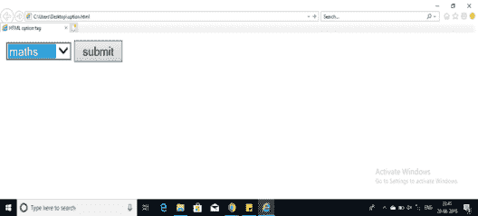

# 如何在 HTML 中实现选择和选项标签

> 原文：<https://www.edureka.co/blog/select-and-option-tag-html/>

Select 和 Action 是 HTML[中最重要的标签之一，你不能创建一个下拉菜单而不使用它。让我们以下面的方式开始我们在 HTML 中选择和选择标签的旅程:](https://www.edureka.co/blog/what-is-html/)

*   [HTML 中的 Select 和 Option 标签是什么？](#selectoption)
*   [HTML 中选择标签的例子](#selectexample)
*   [选择标签属性列表](#selectattributelist)
*   [HTML 中选项标签的例子](#optionexample)
*   [选项标签属性列表](#optionattributelist)

## **HTML 中的 Select 和 Option 标签是什么？**

**<选择>** 标签用于在 HTML 中定义选择列表的表单中。当点击表单元素时出现，并让用户选择其中一个选项。

select 元素中的 **<选项>** 标签定义了列表中的可用选项。<选项>标签用于定义所有可能的选项以供选择。

## **HTML 中选择标签的例子**

```

<!DOCTYPE html>
<html>
<head>
<title>HTML select tag </title>
</head>
<body>
<form action="/cgi-bin/dropdown.cgi" method="post">
<select name="dropdown">
<option value="html" selected>html</option>
<option value="css" selected>css</option>
<option value="php" selected>php</option>
</select>
<input type="submit" value="submit" />
</form>
</body>
</html>

```

**输出:**


```
<option value="css" selected>css</option>
```

这个选项标签是可以用来给出任意数量下拉选项的标签。该领域的主题可以根据需要进行修改。

## **选择标签属性列表**

| **属性** | **描述** |
| **名称** | 它用于为发送到服务器进行识别并获取值的控件命名。 |
| **大小** | 它用于显示一个滚动列表框。 |
| **多个** | 如果设置为“**多个**”，则允许用户从菜单中选择多个项目。 |

## **HTML 中选项标签的例子**

```

<!DOCTYPE html>
<html>
<head>
<title>HTML option tag </title>
</head>
<body>
<form action="/cgi-bin/dropdown.cgi" method="post">
<select name="dropdown">
<option value="physicsl" selected>physicsl</option>
<option value=”chemistry”selected>chemistry</option>
<option value="maths" selected>maths</option>
</select>
<input type="submit" value="submit" />
</form>
</body>
</html>

```



**选项标签属性列表**

| **属性** | **说明** |
| **值** | 如果选择了选择框中的选项，将使用该值。 |
| **选中** | 指定此选项应该是页面加载时首先选择的值。 |
| **标签** | 这是标记选项的另一种方式。 |

至此，我们结束了 HTML 文章中的 Select 和 Option 标记。我希望你理解 HTML 中选择和选项标签的重要性。

*查看我们的  [全栈 Web 开发人员硕士课程](https://www.edureka.co/masters-program/full-stack-developer-training) ，该课程包含讲师指导的现场培训和真实项目体验。本培训使您精通使用后端和前端 web 技术的技能。它包括关于 Web 开发、jQuery、Angular、NodeJS、ExpressJS 和 MongoDB 的培训。*

有问题要问我们吗？请在“选择 HTML 中的&选项标签”博客的评论部分提到它，我们会回复您。