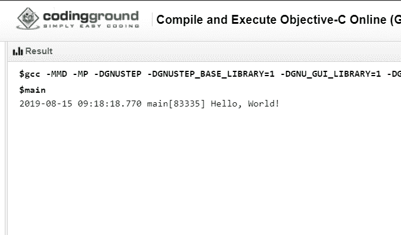

# 什么是客观——C:为什么要学？

> 原文：<https://www.edureka.co/blog/what-is-objective-c/>

Objective-C 是一种在普通 C 语言之上开发的语言。它是一种通用语言。它具有闲聊编程语言的额外特性，这使它成为一种面向对象的编程语言。在本文中，我们将详细探讨什么是 Objective-C。

本文将涉及以下几点:

*   基础框架
*   Objective-C 的特性
*   目标 C 的结构

那么让我们开始吧，

## **什么是 Objective-C？**

Objective-C 语言完全支持面向对象的方法。它支持面向对象方法的所有特性，

*   包装
*   数据隐藏
*   遗产
*   多态性

**示例代码**

```
#import &amp;amp;amp;amp;amp;amp;amp;amp;amp;amp;amp;amp;amp;amp;lt;Foundation/Foundation.h&amp;amp;amp;amp;amp;amp;amp;amp;amp;amp;amp;amp;amp;amp;gt;
int main (int argc, const char * argv[])
{
NSAutoreleasePool * pool = [[NSAutoreleasePool alloc] init];
NSLog (@"hello world");
[pool drain];
return 0;
}

```

**输出**

****

**解释**

我们导入包含基本函数的基础头文件。使用 Xcode 5，我们可以导入基础框架，

@进口基金会；

声明了具有整数返回类型的 main 函数。创建自动释放池是为了管理程序中的内存。最后，Nlog 函数用于打印 Objective-C 中的语句。

文件存储在。m 分机。

继续这篇什么是目标 C 的文章，

**基础框架**

基础框架提供了许多特性。这里列出了其中的一些功能，

*   该框架包含了 NSArray、NSDictionary、NSSet 等多种扩展数据类型。
*   这个框架包含了大量操作文件、字符串等的函数。
*   这个框架提供了 URL 处理功能，如日期格式化、数据处理、错误处理等实用工具。

继续这篇什么是目标 C 的文章，

**物镜 C 的特性**

*   这对于内存管理来说非常有用
*   为二进制框架提供更好的支持
*   与 C++和目标 C++的互操作性
*   许多第三方库帮助开发

继续这篇什么是目标 C 的文章，

**物镜 C 的结构**

Objective-C 程序分为七个部分，

*   预处理器命令
*   连接
*   履行
*   方法
*   变量
*   陈述和表达
*   评论

**示例代码**

```
#import Foundation.h;//pre-processor commands
@interface SampleClass:NSObject//interface
(void)sampleMethod;
@end
@implementation SampleClass//implementation
-(void)sampleMethod
{//methods
NSLog(@"Hello, World! n");
}
@end
int main()
{//main method
/* my first program in Objective-C *///commands
SampleClass *sampleClass = [[SampleClass alloc]init];//statement and expression
[sampleClass sampleMethod];
return 0;
}

```

**输出:**

****

**解释**

目标 C 代码分为七层。首先，我们有声明头文件的预处理命令。然后我们有一个被声明的接口。这就是创建接口的方法。@end 标记一个接口的结束。

这就把我们带到了这篇文章的结尾，关于什么是 objective-c？我希望这能给你带来信息和帮助，请继续关注更多类似主题的教程。您也可以查看我们的培训项目 t 以获得关于 jQuery 及其各种应用程序的深入知识，您可以 [**在此**](https://www.edureka.co/masters-program/full-stack-developer-training) 注册参加实时在线培训，享受全天候支持和终身访问。 用不同的字符串和修改实现上面的代码。现在，我们已经很好地理解了与指针相关的所有关键概念。

有问题要问我们吗？在这个博客的评论部分提到他们，我们会回复你。