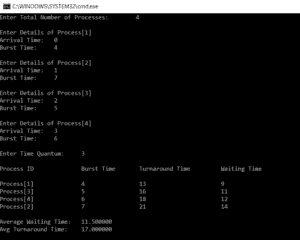

# C 程序设计中的循环调度

> 原文：<https://www.edureka.co/blog/round-robin-scheduling-in-c/>

在这篇文章中，我们将了解调度算法称为循环调度算法，什么是循环？怎么写程序？等等。我们开始吧。

*   [什么是循环调度？](#what)
*   [循环调度算法](#algo)
*   [代号](#code) 代号
*   [优缺点](#adv-diadv)

## **什么是循环调度？**

循环调度是系统用来调度 CPU 利用率的一种调度算法。这是一个抢占式算法。每个请求都有一个固定的时间片，称为量程。作业调度程序保存当前正在执行的作业的进度，并在给定时间段内执行特定进程时，移动到队列中的下一个作业。


没有进程会长时间占用 CPU。这种切换被称为上下文切换。它可能是最好的调度算法之一。这个算法的效率取决于量子值。

## **循环调度算法**

*   我们首先有一个队列，流程按照先到先服务的顺序排列。
*   分配一个量程值来执行每个进程。
*   执行第一个过程，直到量程值结束。此后，产生一个中断并保存状态。
*   然后 CPU 移动到下一个进程，并遵循相同的方法。
*   重复相同的步骤，直到所有过程结束。

## **考虑示例代码**

```
#include<stdio.h>

int main()
{
      int i, limit, total = 0, x, counter = 0, time_quantum;
      int wait_time = 0, turnaround_time = 0, arrival_time[10], burst_time[10], temp[10];
      float average_wait_time, average_turnaround_time;
      printf("nEnter Total Number of Processes:t");
      scanf("%d", &limit);
      x = limit;
      for(i = 0; i < limit; i++)
      {
            printf("nEnter Details of Process[%d]n", i + 1);

            printf("Arrival Time:t");

            scanf("%d", &arrival_time[i]);

            printf("Burst Time:t");

            scanf("%d", &burst_time[i]);

            temp[i] = burst_time[i];
      }

      printf("nEnter Time Quantum:t");
      scanf("%d", &time_quantum);
      printf("nProcess IDttBurst Timet Turnaround Timet Waiting Timen");
      for(total = 0, i = 0; x != 0;)
      {
            if(temp[i] <= time_quantum && temp[i] > 0)
            {
                  total = total + temp[i];
                  temp[i] = 0;
                  counter = 1;
            }
            else if(temp[i] > 0)
            {
                  temp[i] = temp[i] - time_quantum;
                  total = total + time_quantum;
            }
            if(temp[i] == 0 && counter == 1)
            {
                  x--;
                  printf("nProcess[%d]tt%dtt %dttt %d", i + 1, burst_time[i], total - arrival_time[i], total - arrival_time[i] - burst_time[i]);
                  wait_time = wait_time + total - arrival_time[i] - burst_time[i];
                  turnaround_time = turnaround_time + total - arrival_time[i];
                  counter = 0;
            }
            if(i == limit - 1)
            {
                  i = 0;
            }
            else if(arrival_time[i + 1] <= total)
            {
                  i++;
            }
            else
            {
                  i = 0;
            }
      }

      average_wait_time = wait_time * 1.0 / limit;
      average_turnaround_time = turnaround_time * 1.0 / limit;
      printf("nnAverage Waiting Time:t%f", average_wait_time);
      printf("nAvg Turnaround Time:t%fn", average_turnaround_time);
      return 0;
}
```

#### **输出:**

#### ****

#### **说明:**

在上面的代码中，我们要求用户输入进程的数量以及每个进程的到达时间和突发时间。然后，我们使用循环算法计算等待时间和周转时间。

这里的主要部分是计算周转时间和等待时间。周转时间的计算方法是将总耗时相加，然后减去到达时间。

等待时间的计算方法是从总时间中减去到达时间和突发时间，再加上等待时间。这就是循环调度的发生方式。

## **优点:**

*   决策开销低。
*   与其他算法不同，它给予所有进程同等的优先级。
*   在这个过程中很少出现饥饿。

## **缺点:**

*   如果量子值低，则系统的效率会降低，因为会发生频繁的切换。
*   如果量程值很高，系统可能会变得无响应。

到此，我们来结束这篇文章。

我希望这能给你带来信息和帮助，请继续关注更多类似主题的教程。您也可以查看我们的培训项目 t 以获得关于 jQuery 及其各种应用程序的深入知识，您可以 [**在此**](https://www.edureka.co/masters-program/full-stack-developer-training) 注册参加实时在线培训，享受全天候支持和终身访问。 用不同的字符串和修改实现上面的代码。现在，我们已经很好地理解了与指针相关的所有关键概念。

有问题要问我们吗？在这个博客的评论部分提到他们，我们会回复你。