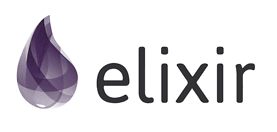
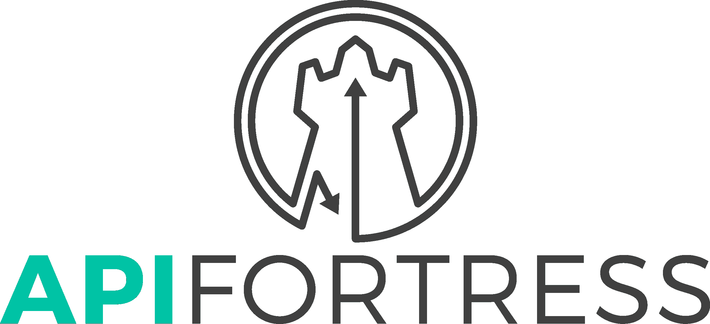
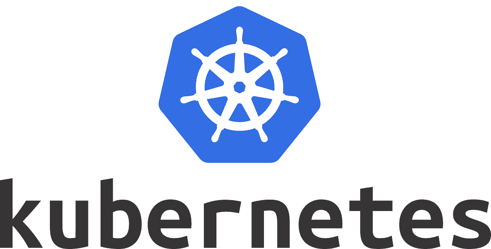
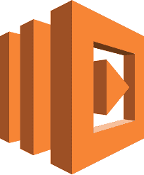

# 2019 年你必须知道的顶级微服务工具

> 原文：<https://www.edureka.co/blog/microservices-tools>

微服务是一种架构风格，借助它，您可以构建小型到复杂的业务应用程序。要构建这种架构风格的应用程序，开发人员需要工具和技术来构建和监控这些服务。因此，在这篇关于微服务工具的文章中，我将讨论可以用来构建这些自治服务的各种工具。

本文将涵盖以下主题:

1.  [什么是微服务？](#microservices)
2.  [微服务工具:](#toolsformicroservices)

在我们开始讨论使用微服务构建应用程序的工具和技术之前，让我告诉你什么是微服务。

## **什么是微服务？**

微服务，又名 [***微服务架构***](https://www.edureka.co/blog/microservice-architecture/) ，是一种架构风格，将应用程序构建为小型自治服务的集合，围绕 **业务领域建模。** 所以，你可以把微服务理解为围绕单一业务逻辑相互通信的小型个体服务。如果你希望深入了解微服务，那么你可以参考我的文章。

现在，您已经对微服务有了一个概念，让我们来看看微服务中使用的工具。

## **微服务工具**

微服务工具是具有各种功能的各种工具和技术的集合。这些工具用于构建应用程序的各个阶段，帮助开发人员轻松工作。它们带有预定义的功能、算法和非常用户友好的 GUI。此外，几家初创公司和科技巨头一直在致力于开发这种用户友好的微服务工具。然而，由于微服务是一种体系结构风格，因此对整个工作流使用一种工具通常是不够的。

因此，我们将着眼于不同的微服务工具，即

*   [操作系统](#operatingsystem)
*   [编程语言](#programminglanguages)
*   [API 管理工具&测试](#toolsforapimanagement)
*   [消息传递工具](#toolsformessaging)
*   [工具包](#toolkits)
*   [架构框架](#architecturalframeworks)
*   [编排工具](#toolsfororchestration)
*   [监控工具](#toolsformonitoring)
*   [无服务器工具](#serverlesstools)

### **操作系统**

构建应用程序的一个非常重要的因素是为您的应用程序建立一个合适的基础。这是由操作系统完成的。Linux 就是这样一种操作系统，在构建应用程序时最常用。在 Linux 容器的帮助下，它提供了一个自包含的执行环境，并允许您协调从小到大的服务，如安全性、网络和存储。所以，如果你问我从 [Linux](https://www.edureka.co/blog/linux-commands/) 家族中有什么更好的选择，那么我觉得，红帽和 Ubuntu 充斥着不必要功能的操作系统。除此之外，Linux 提供商还推出了一些工具，如 Atomic Red Hat 和 Ubuntu，包括面向容器的管理程序 LXD。

### **编程语言**

微服务的主要优势在于不同的语言和技术可以用来构建同一应用程序的不同服务。因此，它给了开发者选择他们的技术栈和构建应用的自由。但是，微服务中最流行的编程语言是 [Spring Boot](https://www.edureka.co/blog/interview-questions/spring-boot-interview-questions/) 和 Elixir。

#### **Spring Boot**

 Spring Boot 在 Spring Boot  框架的帮助下，用短短几行代码简化了[基于 REST 的微服务](https://www.edureka.co/blog/microservices-with-spring-boot)的创建。下面是 Spring Boot 的几个特点:

*   提供  自动配置 加载一组默认配置，用于快速启动应用程序
*   它带有嵌入式 tomcat、servlet 容器 jetty，以避免使用 WAR 文件
*   Spring Boot 提供了一种自以为是的观点，以减少开发人员的工作量并简化 maven 配置
*   包含一系列 API，用于监控和管理开发和生产中的应用程序。

#### **仙丹**

 Elixir 是一种通用编程语言，运行在 Erlang 虚拟机上。Elixir 在构建容错和分布式应用程序时共享相同的抽象。下面是仙丹的几个特性:

*   开发人员可以很容易地以简短、快速和可维护的方式编写代码。
*   Elixir 代码在独立的轻量级进程中运行，这些进程可以单独伸缩。
*   Elixir 通过提供监督程序来确保应用程序永不停机。这些管理员描述了如果出现问题，系统的不同部分是如何重新启动的。
*   这种编程语言自带构建工具来创建项目、管理任务和运行所需的测试。

### **API 管理工具&测试**

当您开始使用微服务构建应用程序时，您还必须确保所有单独的服务使用 API 相互通信。每个微服务可以有自己的 API 来与其他服务通信。这就是 API 管理和测试发挥作用的地方，因为系统中存在的所有 API 都必须得到正确的管理和测试，才能获得想要的结果。

用于 API 管理和测试的工具如下:

#### **邮递员**

Postman 是一个 API 开发套件，允许你轻松运行 UI 驱动的 API 测试。在 Postman 的帮助下，探索 [RESTful API 资源](https://www.edureka.co/blog/what-is-rest-api/)变得非常容易。还有，在 Postman 的帮助下，可以通过 HTTP 请求来测试、开发并得到所需的结果。以下是它的一些特点:

*   Postman 与您的软件开发生命周期轻松集成。
*   它提供了设计 API 和维护多个版本 API 的特性。
*   这个工具可以为小型应用程序到大型应用程序工作。
*   它支持协作工作，允许你将相关的 API 端点保存到一个集合中。然后，您可以将整个集合与其他开发人员共享。

#### **API 堡垒**

 API Fortress 既是一个 API 测试工具，也是一个健康工具，它自动化了[负载测试](https://www.edureka.co/blog/load-testing-using-jmeter/)、健康监控和[功能测试](https://www.edureka.co/blog/what-is-functional-testing/)的过程。这个工具是无代码的，是围绕现代 API 架构模式和实践构建的。下面是 API 堡垒的几个特点:

*   该工具可与您在工具链中选择的任何平台高度互操作，并验证 API 内置 API 管理平台

*   通过提供一个拖放式 GUI，它简化了 API 测试的创建和执行。

*   该工具还通过提供简单的功能测试生成来简化端到端测试。

*   API Fortress 还旨在通过在协作环境中存储测试和报告来简化协作，以确保团队验证他们的 API；如果它满足商业案例。

<section class="av_textblock_section ">

**消息传递工具**

</section>

微服务是一个系统，在这个系统中，自治服务相互通信或在它们自己内部通信。为了相互通信，微服务使用消息队列。因此，用于消息传递的工具如下:

#### 阿帕奇卡夫卡

这个工具是一个分布式发布-订阅消息系统，最初由 LinkedIn 开发，后来成为 Apache 项目的一部分。Kafka 是可扩展的、敏捷的，并且是通过设计分发的。因此，Apache Kafka 是一个分布式流处理平台，可用于数据处理或 API 调用。下面是阿帕奇卡夫卡的几个特点:

*   Kafka 具有发布和订阅消息的高吞吐量，以保持稳定的性能。
*   该工具还保证零停机时间和零数据丢失。
*   消息尽可能快地保存在磁盘上
*   许多应用程序可以插入并使用 Kafka，因为它提供了编写新连接器的功能。

#### **RabbitMQ**

该工具利用模式在微服务之间进行通信，同时也扩展应用程序。在这个工具的帮助下，你可以将微服务相互连接起来，解决分布式系统的问题。另外，您可以使用这个工具在各个服务之间交换事件。以下是 RabbitMQ 的几个特点:

*   该工具提供了多种功能，如可靠性、交付确认，包括持久性、发布者确认和高可用性。
*   通过使用该工具，消息在到达队列之前通过交换进行路由。
*   RabbitMQ 采用联盟模式，允许需要更加松散和不可靠连接的服务器
*   该工具支持通过多种消息传递协议进行消息传递。

### **工具包**

用外行人的话来说，工具包就是一套用于特定目的的工具。在微服务架构中，您可以构建各种应用程序。因此，您可能有不同的工具包用于不同的目的。本节中您可以考虑的各种工具如下:

#### **fabric8**

 fabric8 是一个平台即服务工具， 通过 Git 帮助开发者提供配置管理系统。这是一个处理端口映射和 IP 地址复杂性的开源工具。该工具还负责负载平衡服务，具有高可用性和可伸缩性。

以下是该工具的一些功能:

*   提供了一组向导来更快地创建应用程序并建立连续的交付管道。
*   fabric8 自带 Git 存储库托管
*   这个工具为升级版本提供了 maven 仓库管理器，以及中央 maven 仓库的镜像。
*   它提供了开发人员控制台，通过对项目、应用和环境的深度可视化来创建、构建和管理微服务

#### **塞内卡**

 Seneca 用于构建基于消息的微服务、流程，是 [Node.js.](https://www.edureka.co/blog/nodejs-tutorial/) 的工具包，这个工具包帮助你用应用的系统业务逻辑编写干净有序的代码。塞内卡的特点如下:

*   Seneca 提供插件，这些插件负责应用程序的基础。
*   你不必担心必须使用哪个数据库以及如何构建你的组件
*   在塞内卡，一切都被写成命令。只要这些命令匹配一组属性，就会被调用。
*   你调用的代码不知道哪个命令完成了工作。

## **架构框架**

既然微服务本身就是一种架构风格，那么架构框架就是一个重要因素。这些框架与各种技术一起用于构建应用程序。两种流行的架构框架如下:

#### **果阿**

这个架构框架提供了一种使用 [Golang](https://www.edureka.co/blog/golang-tutorial/) 构建 REST APIs 和微服务的方法。在这个架构框架的帮助下，您可以设计 API 及其所需的依赖项。这个框架运行在[谷歌云平台之上。](https://www.edureka.co/blog/google-cloud-platform-tutorial/)几个特征如下:

*   该工具允许您描述端点、全局点来创建服务 API。
*   一旦 API 的设计完成，Goa 就可以让您生成数据结构、验证代码和处理程序。
*   有一个分离的引擎。
*   提供插件，可以实现自定义 DSL，也可以生成任意输出。

#### **孔**

 Kong 是用于增强微服务开发和部署的现成部署插件，有了这个工具，你可以利用容器和微服务设计模式快速构建以 API 为中心的应用。下面是孔的几个特点  :

*   提供插件来扩展和连接混合和多云环境中的服务。
*   通过 Kubernetes 分析实时数据并利用生态系统部署 Kong】
*   孔利用自动化工具提高效率，减少错误。
*   提供基于角色的访问控制和端到端加密，以符合行业法规。

### **编排工具**

由于微服务与容器有关，容器编排是需要考虑的一个重要方面。在当今的市场上，有各种各样关于微服务容器编排的工具，但最常用的工具如下:

#### **Kubernetes**

[ Kubernetes](https://www.edureka.co/blog/kubernetes-tutorial/) 是一个开源的容器管理(编排)工具。它的容器管理职责包括容器部署、容器的缩放&除垢&容器负载平衡。根据定义，你可能会觉得 Kubernetes 很普通，不重要。但是相信我，这个世界需要 Kubernetes 来管理容器，就像它需要 [Docker](https://www.edureka.co/blog/docker-tutorial) 来创建它们一样。下面是 Kubernetes 的几个特点:

*   Kubernetes 可以帮助您部署和更新机密和应用程序配置，而无需重建您的映像，也不会暴露您的堆栈配置中的机密。
*   除了管理服务，Kubernetes 还可以管理您的批处理和 CI 工作负载，从而在需要时替换出现故障的容器。
*   使用 CLI 时，Kubernetes 只需要一个命令就可以放大或缩小容器。否则，也可以通过仪表板(Kubernetes UI)进行缩放。
*   使用 Kubernetes，您可以安装自己选择的存储系统。你可以选择本地存储，或者选择公共云提供商，如 [GCP](https://www.edureka.co/blog/what-is-google-cloud-platform/) 或 [AWS](https://www.edureka.co/blog/amazon-aws-tutorial/) ，或者使用共享网络存储系统，如 NFS、iSCSI 等。

#### **Istio**

该工具支持 Kubernetes 上的服务部署。它还为微服务通信提供了可管理性、安全性和可靠性等特性。这是通过服务网格技术实现的，它允许您改善应用程序和微服务之间的关系和交互。几个特性如下:

*   对服务执行自动跟踪、监控和日志记录。
*   该工具通过托管授权、身份验证和服务间通信的加密来自动保护服务。
*   Istio 控制服务之间的流量和 API 调用，通过红色或黑色部署进行一系列测试和升级
*   它还应用策略并确保它们得到执行，资源在消费者之间公平分配。

### **监控工具**

一旦构建了应用程序，监控应用程序的工作是非常重要的。因此，要监控应用程序，您可以使用以下工具:

#### **普罗米修斯**

Prometheus 允许使用可视化监控信息，并支持对要检测的异常模式进行基于时间的跟踪。这是一个收集监控信息的开源工具。下面是普罗米修斯的一些特征:

*   提供灵活的查询语言。
*   附带分布式存储和自治的单个服务器节点
*   通过服务发现或静态配置发现目标
*   提供仪表板和图形支持。

#### **日志隐藏**

Logstash 是一个开源工具，通过它你可以检查日志。这个工具可以让你存储、集中和转换数据。该工具的功能如下:

*   Logstash 支持多种输入，这些输入同时从多个公共来源获取事件。
*   该工具旨在转换和准备数据，无论其复杂程度如何
*   日志存储允许您选择自己的存储和传输数据
*   这是一个由 200 多个插件组成的可插拔框架，可以根据您的需要创建和配置管道。

### **无服务器工具**

这些工具是微服务的一部分，微服务优化了将东西分解成小功能的方法。几种无服务器工具如下:

#### 克劳迪娅

Claudia 是一个无服务器工具，用于 AWS Lambda 和 API Gateway 的部署。该工具自动执行容易出错的部署和配置任务。还包含 Claudia Bot Builder、Claudia API Builder 等工具。

该工具的功能如下:

*   Claudia 允许您使用一个命令进行部署和更新
*   它减少了样板代码
*   借助这个工具，你可以管理多个版本
*   你可以使用标准的 NPM 软件包，不需要学习 Swagger

#### **AWSλ**

该工具为您的微服务构建和按使用付费的用户提供无基础设施的服务器。该工具可以与 AWS API Gateway 结合使用来托管 REST 或 API 服务。这个 amazon web 服务允许您的 API 为用户提出的任何请求提供服务。下面是 [AWS Lambda](https://www.edureka.co/blog/aws-lambda-tutorial) 的几个特点:

*   该工具使您能够运行代码来响应事件，并自动管理相关的计算资源。
*   AWS 让你无需管理服务器就能运行代码。这是一种按使用量付费的服务，您只需为消耗的计算时间付费。
*   该工具通过为每个触发器运行一个代码来自动扩展应用程序。
*   AWS Lambda 还可以用来构建一个无服务器的后端来处理移动、API 和 web 请求。

*如果您希望学习微服务并构建自己的应用，那么请查看我们的 **[微服务架构培训](https://www.edureka.co/microservices-architecture-training)** ，它附带有讲师指导的现场培训和真实项目体验。本培训将帮助您深入了解微服务，并帮助您掌握该主题。*

*有问题吗？请在“**微服务工具**的评论区提及，我会给你回复。*