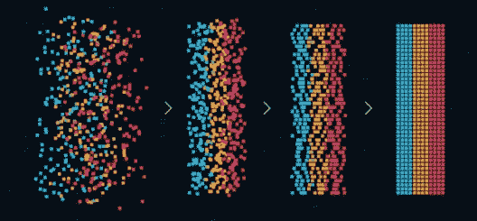

# 模式识别:它与机器学习有什么不同

> 原文：<https://www.edureka.co/blog/pattern-recognition/>

模式识别是管理任何 AI 或 ML 项目的关键特征之一。机器学习行业无疑正在蓬勃发展，并且朝着好的方向发展。本文将涉及以下几点:

*   [简介](#Introduction)
*   [机器学习](#MachineLearning)
*   [模式识别](#PatternRecognition)
*   [模式识别的特征](#FeaturesofPatternRecognition)
*   [模式识别中的训练和学习模型](#TrainingandLearningModelsinPatternRecognition)
*   [模式识别的应用](#ApplicationsofPatternRecognition)
*   [模式识别的优势](#AdvantagesofPatternRecognition)
*   [机器学习和模式识别的区别](#DifferenceBetweenMachineLearningandPatternRecognition)
*   [总结](#Summary)

**简介**

在当今世界，许多不同类型的数据在系统之间流动，为了对数据进行分类，我们不能使用传统的编程方法，传统的编程方法具有检查某些条件并对数据进行分类的规则。

这个问题的解决方案是机器学习，在它的帮助下，我们可以创建一个模型，可以从数据中对不同的模式进行分类。其中一个应用是垃圾或非垃圾数据的分类。

**机器学习**

在机器学习中，我们不能指望一个模型是 100%准确的，但预测应该尽可能接近，以便它可以被归类到特定的类别中。在机器学习中，模型是基于一些算法创建的，这些算法从提供的数据中学习以做出预测。

这个模型建立在统计数据的基础上。机器学习需要一些数据来分析它，并自动创建一些可以预测事情的模型。为了从模型中获得良好的预测，我们需要提供具有不同特征的数据，以便算法能够理解给定问题中可能存在的不同模式。

**模式识别**

借助机器学习中使用的算法来识别模式。识别模式是根据训练数据创建的模型对数据进行分类的过程，然后从模式中检测模式和特征。

模式识别是可以检测不同类别并获得关于特定数据的信息的过程。模式识别的一些应用是语音识别、天气预报、图像中的对象检测等。

**模式识别的特征:**

*   模式识别从数据中学习。

*   即使部分可见，也能自动识别图案。

*   应该能够识别熟悉的模式。

*   应该从不同的角度和形状来识别图案。

**模式识别中的训练和学习模型**

首先将数据分为训练集和测试集。从数据中学习可以知道系统的预测如何依赖于所提供的数据，以及哪种算法适合特定的数据，这是一个非常重要的阶段。由于数据分为两类，我们可以使用训练数据来训练算法，测试数据用于测试模型，正如已经说过的数据应该是多样的，训练和测试数据应该是不同的。

因此，我们将数据分成两组。通常，我们将数据分成两组，其中 70%的数据用于训练模型，算法从提供的数据中提取重要模式，并创建模型。测试集包含全部数据的 30%,然后用于验证模型的性能，即模型预测结果的准确性。

**模式识别的应用**

*   **[计算机视觉](https://en.wikipedia.org/wiki/Computer_vision) :** 图像中的物体可以在模式识别的帮助下进行识别，模式识别可以从图像或视频中提取某些模式，这些模式可以用于人脸识别、农业技术等。

*   **民政:**监视和交通分析系统，用于识别汽车等物体。

*   **工程:**语音识别广泛应用于 Alexa、Siri、Google Now 等系统中。

*   **地质学:**岩石识别，它帮助地质学家检测岩石。

*   **语音识别:**在语音识别中，单词被视为一种模式，并广泛用于语音识别算法中。

*   **指纹扫描 :** 在指纹识别中，模式识别是广泛用于识别一个人的应用之一，用来跟踪组织中的出勤情况。

**模式识别的优势**

*   DNA 序列可以被解释
*   广泛应用于医疗领域和机器人领域。
*   使用模式识别可以解决分类问题。
*   生物特征检测
*   可以从不同的角度识别特定的物体。

**机器学习和模式识别的区别**

ML 是一个从数据中学习而无需显式编程的方面，其本质上可以是迭代的，并且随着其不断执行任务而变得准确。ML 是模式识别的一种形式，其基本思想是训练机器识别模式并将其应用于实际问题。ML 是一种可以从数据中学习并不断更新自身以更好地执行的功能，但是，模式识别不学习问题，但是，它可以被编码以学习模式。模式识别被定义为基于从模式中获得的统计信息的数据分类。

模式识别在机器学习试图完成的任务中起着重要的作用。同样，人类通过识别模式来学习。模式不同于视觉模式、声音模式、信号、天气数据等。可以开发 ML 模型来理解使用统计分析的模式，统计分析可以进一步分类数据。结果可能是一个可能的值，或者取决于数据出现的可能性。

看看这个由 Edureka 提供的 [**自然语言处理课程**](https://www.edureka.co/python-natural-language-processing-course) ，让你的人工智能技能更上一层楼。

**总结**

在本文中，我们了解了什么是机器学习和模式识别，以及它们如何协同工作以创建准确高效的模型。我们探索了模式识别的不同特征。此外，如何将数据划分为训练集和测试集，以及如何使用它们来创建可以提供准确预测的高效模型。它们的应用是什么，它们之间的区别是什么？

*Edureka 的[机器学习工程师硕士项目](https://www.edureka.co/masters-program/machine-learning-engineer-training)让你精通像监督学习、* 和 *自然语言处理这样的技术。它包括人工智能&机器学习方面的最新进展和技术方法的培训，如深度学习、图形模型和强化学习。*

*如果您对本文有任何疑问，请在下面的  **评论区** 留言，我们将尽快回复。*