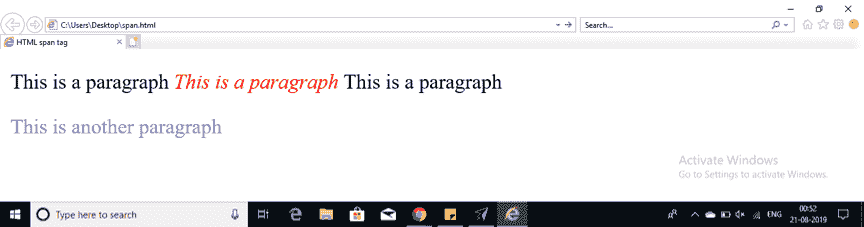

# 关于 HTML 中的 Span 标签，你需要知道的就是

> 原文：<https://www.edureka.co/blog/span-tag-in-html/>

在 HTML 中对元素进行分组以执行特定的动作是一项非常重要的任务。HTML 中的 Span 标签就是这里的一个例子。让我们按照以下顺序来理解什么是 span tag 以及它是如何工作的:

*   [什么是 HTML 中的 span 标签？](#what)
*   [颜色编码为跨度标记](#color)
*   [跨度标签示例](#code)

## **什么是 HTML 中的 span 标签？**

在 HTML 中标签主要用于对元素进行分组，并根据行内元素应用样式。标签和

标签是有区别的。标签用于行内元素，而标签用于块级内容。


在一个段落中,< span >标签用于将一种风格应用于一组特定的单词。使用一组给定的字体代码。其中，有三种不同的类型来为您创建的网页设置颜色。

## **跨度标签的颜色编码**

颜色可以直接指定，如绿色、蓝色。十六进制代码-有一个六位数的代码，代表颜色的数量。颜色十进制或百分比值–RGB()属性用于指定颜色。这些十六进制代码将以井号或井号#开头。下面是使用十六进制表示法的几种颜色的列表。

| **颜色** | **十六进制代码** |
| **黑色** | **#000000** |
| **红色** | **#FF0000** |
| **石灰** | **#00FF00** |
| **蓝色** | **#0000FF** |
| **黄色** | **#FFFF00** |
| **阿卡** | **#00FFFF** |
| **紫红色** | **#FF00FF** |
| **白银** | **#C0C0C0** |
| **白色** | **#FFFFFF** |

## **例子**

```

<!DOCTYPE html>
<html>
<head>
<title>HTML span tag </title>
</head>
<body>
<p>This is a paragraph<span style="color:#FF0001;">
<i>This is a paragraph</span></i>
This is a paragraph</p>
<p><span style="color:#8866ff;">
This is another paragraph</span></p>
</body>
</html>

```

**代码的输出:**



正如你所看到的，我们已经成功地实现了 span 标签来定制我们的 HTML 主体。就这样，我们来到了这篇文章的结尾。

*查看我们的  [全栈 Web 开发人员硕士课程](https://www.edureka.co/masters-program/full-stack-developer-training) ，该课程包含讲师指导的现场培训和真实项目体验。本培训使您精通使用后端和前端 web 技术的技能。它包括关于 Web 开发、jQuery、Angular、NodeJS、ExpressJS 和 MongoDB 的培训。*

有问题要问我们吗？请在“HTML 中的 Span 标签”博客的评论部分提到它，我们会给你回复。