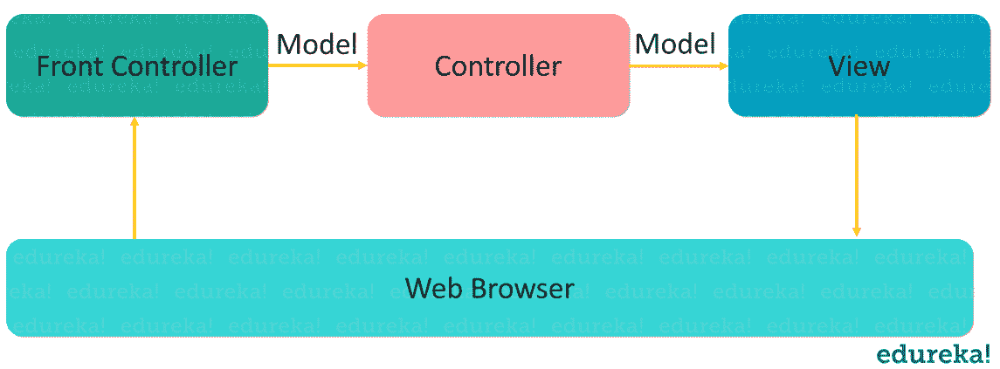
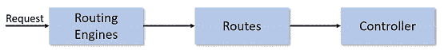

# 2023 年你需要知道的顶级 MVC 面试问答

> 原文：<https://www.edureka.co/blog/mvc-interview-questions>

在这篇 MVC 面试问题文章中，我收集了最常被问到的问题，这些问题是在咨询了[设计模式](https://www.edureka.co/blog/java-design-patterns/)、asked 和 [Spring 框架](https://www.edureka.co/blog/spring-tutorial/)领域的顶级行业专家后收集的。如果你想温习 MVC 基础知识，我建议你在继续这个 MVC 面试问题之前先温习一下，看看这篇关于 [*MVC 架构*](https://www.edureka.co/blog/mvc-architecture-in-java/) 的文章。

如果你在面试中遇到其他问题，或者有可能对其他人有帮助的疑问，请在评论区分享它们。本 MVC 面试问题分为以下几个部分:

*   [**初学者级别**](#Beginnerslevel)

*   [**中级**](#IntermediateLevel)

*   [**高级水平**](#AdvancedLevel)

让我们先从初学者水平的问题开始这个 MVC 面试问题。

**初学者级别 MVC 面试问题**

## **1。提到模型-视图-控制器在 MVC 应用程序中代表什么？**

| **组件** | **描述** |
| **型号** | 它代表应用程序数据域。换句话说，应用程序业务逻辑包含在模型中，负责维护数据。 |
| **视图** | 它代表最终用户与之通信的用户界面。简而言之，所有用户界面逻辑都包含在视图中。 |
| **控制器** | 它是响应用户动作的控制器。基于用户动作，相应的控制器在模型内做出响应，并选择显示用户界面的视图进行渲染。用户输入逻辑包含在控制器中。 |

下图表示相同的情况。

** 2。解释什么是 MVC？**

**MVC** 是  **模型、视图、控制器**的缩写。MVC 架构模式将应用程序分成三个部分——模型、视图和控制器。在这种模式中，模型代表了数据和业务逻辑的形式。它维护和保存应用程序的数据。模型对象在数据库中检索和存储模型状态。从根本上和技术上来说，视图是一个用户界面。视图段向用户显示数据使用模型，并使他们能够修改数据。控制器是处理用户请求的部分。

## **3。列出控制器动作方法的几种不同的返回类型？**

*   查看结果

*   Javascript 结果

*   重定向结果

*   JSON 结果

*   内容结果

## **4。MVC 的优势是什么？**

MVC 的好处或优势如下:

*   **多视图支持**:由于模型与视图的分离，用户界面可以同时显示同一数据的多个视图。

*   **变化适应**:用户界面的变化往往比业务规则更频繁。

*   **SoC**–**关注点分离:**关注点分离是*ASP.NET MVC*的核心优势之一。MVC 框架提供了 UI、业务逻辑、模型或数据的清晰分离。

*   **更多的控制**:与传统的 WebForms 相比，ASP.NET MVC 框架提供了对 [HTML](https://www.edureka.co/blog/what-is-html/) 、 [JavaScript](https://www.edureka.co/blog/javascript-tutorial/) 和 CSS 更多的控制。

*   **可测试性**:该框架为 [Web 应用](https://www.edureka.co/blog/django-tutorial/)提供了更好的可测试性，也为测试驱动开发提供了很好的支持。

*   轻量级:MVC 框架不使用视图状态，这在一定程度上减少了请求的带宽。

## **5。解释 MVC 中组件表示、抽象和控制的作用？**

*   **表现:** 它是应用程序内一个特定抽象的可视化表现。

*   **抽象:** 它是应用程序内的业务领域功能。

*   **控制:** 它是一个组件，保持系统内的抽象和它们对用户的呈现之间的一致性。它还用于与系统内的其他控件进行通信。

## **6。MVC 中如何维护会话？**

可以通过三种方式在 MVC 中维护会话:临时数据、视图数据和视图包。

## **7。什么是 MVC 应用生命周期？**

任何 web 应用程序都有两个主要的执行步骤，首先理解请求，然后根据请求的类型，发出适当的响应。MVC 应用程序生命周期有两个主要阶段，首先创建请求对象，然后向浏览器发送响应。

创建请求对象包括四个基本步骤:

**步骤 1:** 填充路由 **步骤 2:** 提取路由 **步骤 3:** 请求上下文创建 **步骤 4:** 控制器实例创建

## **8。MVC 模式用 3 个逻辑层定义了什么？**

MVC 模型用 3 个逻辑层定义了 web 应用程序:

*   业务层(模型逻辑)

*   显示层(视图逻辑)

*   输入控制(控制器逻辑)

模型是应用程序的一部分，它只处理应用程序数据的逻辑。通常，模型对象从一个[数据库](https://www.edureka.co/blog/mysql-data-types/)中检索数据(以及存储数据)。视图是应用程序的一部分，负责数据的显示。大多数情况下，视图是从模型数据中创建的，尽管还有其他更复杂的创建视图的方法。顾名思义，控制器是应用程序中处理用户交互的部分。

## **9。什么是 Spring MVC？**

它是一个用于构建 web 应用的  [Java](https://www.edureka.co/blog/what-is-java/) 框架。它遵循  ***模型-视图-控制器设计*** 的模式。不仅如此，它还实现了核心[Spring](https://www.edureka.co/blog/interview-questions/spring-interview-questions/)框架的所有基本特性，如反转控制、依赖注入。Spring MVC 借助**dispatcher servlet**提供了一个在 Spring 框架中使用 MVC 的体面解决方案。在这种情况下，*dispatcher servlet*是一个类，它接收传入的请求并将其映射到正确的资源，如 **控制器、模型和视图。**

## 10。什么是 ASP.NET MVC？

ASP.NET MVC 是一个 web 应用程序框架。它是轻量级和高度可测试的框架。MVC 将应用程序分成三个部分——模型、视图和控制器。

## **11。什么是 MVC 路由？**

ASP.NET MVC 中的 URL 被映射到动作方法和控制器，而不是系统的物理文件。为了准确地将动作方法和控制器映射到 URL，路由引擎形成适当的路由。利用这一点，控制器可以处理特定的请求。

##  ** 12。有哪些过滤器？**

有时候我们想在动作方法执行之前或者执行之后执行一些逻辑。对于这种情况，我们可以使用*动作过滤器*。过滤器定义了在执行动作方法之前或之后执行的逻辑。动作过滤器是我们可以应用于动作方法的属性。以下是 MVC 动作过滤器类型:

1.  **授权** 过滤  *(实现 IAuthorizationFilter)*

2.  **动作** 滤镜 *(实现 IActionFilter)*

3.  **结果** 过滤器 *(实现 IResultFilter)*

4.  **异常** 过滤器 *(实现 ExceptionFilter 属性)*

## 13。MVC 中什么是局部视图？

局部视图是可以安全地插入到现有 DOM 中的 HTML 块。最常见的是，局部视图用于组件化 Razor 视图，使它们更容易构建和更新。它也可以直接从控制器方法返回。在这种情况下，浏览器仍然接收文本/HTML 内容，但不一定接收组成整个页面的 [HTML](https://www.edureka.co/blog/what-is-html/) 内容。因此，如果从浏览器的地址栏直接调用返回部分视图的 URL，可能会显示不完整的页面。这可能类似于一个缺少标题、脚本和样式表的页面。

## **14。能解释一下 MVC 的页面生命周期吗？**

*下面提到的步骤定义了页面生命周期。*

*   应用程序初始化

*   按指定路线发送

*   实例化并执行控制器

*   定位并调用控制器动作

*   实例化并呈现视图。

## 15。MVC 中 ViewModel 有什么用？

ViewModel 是一个带有属性的普通类，用于将其绑定到强类型的视图。ViewModel 可以使用数据注释为其属性定义验证规则。

## **中级题**

## 16。MVC 中使用实体框架的数据库优先方法是什么？

数据库优先方法是实体数据模型的代码优先和模型优先方法的替代方法。实体数据模型创建模型代码(类、属性、DbContext 等。)并且该[类](https://www.edureka.co/blog/java-objects-and-classes/)充当数据库和控制器之间的链接。

有以下几种方法用于连接数据库和应用程序。

*   数据库优先

*   模型优先

*   代码优先

## **17。MVC 脚手架是什么意思？**

Scaffolding 是一个用于 ASP.NET 网络应用的代码生成框架。Visual Studio 包括为 MVC 和 [Web API](https://www.edureka.co/blog/what-is-rest-api/) 项目预装的代码生成器。当您想要快速添加与数据模型交互的代码时，可以向项目中添加脚手架。使用脚手架可以减少在项目中开发标准数据操作的时间。由页面模板、实体页面模板、字段页面模板、过滤模板组成。这些模板被称为脚手架模板，它们允许您快速构建一个功能性的数据驱动网站。

## 18。解释一下 ASP.NET MVC 中 Razor 的概念？

ASP.NET MVC 一直支持“视图引擎”的概念——视图引擎是实现不同模板语法选项的可插拔模块。ASP.NET MVC 的“默认”视图引擎使用了同样的方法。aspx/。ascx/。作为 ASP.NET web forms 的主文件模板。其他流行的 ASP.NET MVC 视图引擎是 Spart & Nhaml。Razor 是 MVC 3 引入的新的视图引擎。

## **19。解释 MVC 中默认路由的概念**

**默认路由:** 默认的 ASP.NET MVC 项目模板添加了一个通用路由，它使用以下 URL 约定将给定请求的 URL 分成三个命名段。

`URL: "{controller}/{action}/{id}"`

这个路由模式是通过调用 RouteCollection 的 MapRoute()扩展方法注册的。

## 20。什么是获取和发布操作类型？

**GET 动作类型:** GET 用于从指定的资源请求数据。对于所有的 GET 请求，我们传递 URL，这是必须的；但是，它可以接受下列重载。

**POST 动作类型**:POST 用于将需要处理的数据提交给指定的资源。对于所有的 POST 请求，我们传递 URL，这是必要的和数据。但是，它可以接受下列重载。

## **21。MVC 中视图数据和视图包有什么不同？**

| **查看数据** | **查看包** |
| ViewData 用于将数据从控制器传递到视图 | ViewBag 还用于将数据从控制器传递到相应的视图。 |
| 它仅适用于当前请求。 | 它也仅适用于当前请求。 |
| 需要对复杂数据类型进行类型转换，并检查空值以避免错误 | 复杂数据类型不需要类型转换。 |
| 如果发生重定向，则它的值变为 null。 | 如果发生重定向，则它的值变为 null。 |

## **22。提及 MVC 中面积的好处**

MVC 中区域的好处如下:

*   它允许我们将模型、视图和控制器组织到应用程序的不同功能部分，例如管理、计费、客户支持等等。

*   很容易与另一个领域创建的其他领域集成。

*   此外，对于[单元测试](https://www.edureka.co/blog/what-is-unit-testing)也很容易。

## **23。最后执行哪些过滤器？**

最后，执行“*异常过滤器*”。

## **24。提及向路线添加约束的两种方法是什么？**

向路线添加约束的两种方法是

*   使用[正则表达式](https://www.edureka.co/blog/java-regex/)

*   使用实现 IRouteConstraint 接口的对象

## **25。如何在 MVC 中实现验证？**

通过使用  *系统中定义的验证器，我们可以很容易地在 MVC 应用程序中实现验证。component model . data annotations*命名空间。有以下不同类型的验证器:

*   需要

*   [DataType](https://www.edureka.co/blog/data-types-in-java/)

*   范围

*   字符串长度

## **26。举出两个没有实施或不需要路由的例子？**

不需要布线的两种情况是:

*   当找到与 URL 模式匹配的物理文件时

*   当禁用 URL 模式的路由时

## **27。解释一下如何在 MVC 中实现 Ajax？**

在 MVC 中，Ajax 可以通过两种方式实现。它们如下:

*   Ajax 库

*   [Jquery](https://www.edureka.co/blog/jquery-tutorial/)

## **28。“TempData”中的 Keep 和 Peek 有什么用？**

一旦在当前请求中读取了“TempData ”,它在后续请求中就不可用了。如果我们希望“TempData”被读取并在后续请求中可用，那么在读取之后，我们需要调用“Keep”方法，如下面的代码所示。

```
@TempData["MyData"];
TempData.Keep("MyData");
```

更快捷的方法是使用“Peek”。这个函数有助于读取 MVC 为后续请求维护“TempData”的建议。

```
string str = TempData.Peek("Td").ToString();
```

## **29。什么是 WebAPI？**

HTTP 是使用最多的协议。多年以来，浏览器一直是我们消费通过 HTTP 公开的数据的首选客户端。但是随着时间的流逝，客户种类开始扩展。我们曾要求在 HTTP 上消费来自移动、JavaScript、Windows 应用程序等客户端的数据。

为了满足广大客户的需求，建议采用 [REST](https://www.edureka.co/blog/what-is-rest-api/) 的方法。WebAPI 是一种遵循 REST 原则通过 HTTP 公开数据的技术。

## 三十岁。怎样才能检测出一个 MVC 控制器是通过 POST 或者 GET 调用的？

要检测控制器上的调用是 POST 操作还是 GET 操作，我们可以使用下面代码片段中所示的  `Request.HttpMethod`属性。

```
public ActionResult SomeAction(){
if (Request.HttpMethod == "POST"){
return View("SomePage");
}
else{
return View("SomeOtherPage");
}
}
```

现在我们进一步来看高级 MVC 面试题。

## **高级 MVC 面试问题**

## 31。Razor 的主要语法规则是什么

以下是 Razor 主要语法的规则:

*   Razor 代码块包含在@{ … }中

*   内联表达式(变量和函数)以@开头

*   代码语句以分号结束

*   变量是用 var 关键字声明的

*   字符串用引号括起来

*   C#代码区分大小写

*   C#文件的扩展名为。cshtml

## 32。如何在 MVC 中实现表单认证？

认证是指通过使用用户名和密码或电子邮件和密码等凭证来验证用户的身份，从而为用户提供特定服务的访问权限。它确保正确的用户被认证或登录到特定的服务，并且根据特定用户的角色向其提供正确的服务。

## 33。能解释一下 MVC 中的 RenderBody 和 RenderPage 吗？

RenderBody 就像 web 表单中的 ContentPlaceHolder。这将存在于布局页面中，它将呈现子页面/视图。布局页面将只有一个 RenderBody()方法。布局页面中也存在 RenderPage，并且布局页面中可以有多个 RenderPage()。

## 34。MVC 中有哪些非动作方法？

在 MVC 中，所有的公共方法都被视为动作。因此，如果您正在创建一个方法，并且您不想将它用作一个动作方法，那么该方法必须用如下所示的“NonAction”属性来修饰

```
[NonAction]
public void TestMethod(){
// Method logic
}
```

## 35。如何在 MVC 中进行异常处理？

在控制器中，您可以覆盖“OnException”事件，并将“Result”设置为发生错误时要调用的视图名称。在下面的代码中，你可以看到我们将“结果”设置为一个名为“错误”的视图。

我们还设置了异常，以便它可以显示在视图中。

```
public class HomeController : Controller{
protected override void OnException(ExceptionContext filterContext){
Exception ex = filterContext.Exception;
filterContext.ExceptionHandled = true;
var model = new HandleErrorInfo(filterContext.Exception, "Controller","Action");
filterContext.Result = new ViewResult()
{
ViewName = "Error",
ViewData = new ViewDataDictionary(model)
};
}
}
```

## 36。剃刀和 ASPX 哪个更合适？

按照微软的说法，Razor 更受欢迎，因为它是轻量级的，语法简单。

## 37.**什么是视图中的代码块？**

与计算并发送到响应的代码表达式不同，执行的是代码块。这对于声明我们以后可能需要使用的变量很有用。

```
@{
int x = 123;
string y = “aa”;
}
```

## 38。为什么要用 Html。MVC 中的局部？

该方法用于将指定的局部视图呈现为 HTML [字符串](https://www.edureka.co/blog/java-string/)。此方法不依赖于任何操作方法。我们可以像下面这样使用它

```
@Html.Partial(“TestPartialView”)
```

## 39。什么是惊鸿一瞥？

Glimpse 是 NuGet 包，它有助于查找性能、调试和诊断信息。惊鸿一瞥可以帮助你获得时间线、模型绑定、路线、环境等信息。

## 40。我们如何使用超链接从一个视图导航到另一个视图？

通过使用  `ActionLink` 方法，您可以导航。下面的代码将创建一个简单的 URL，帮助导航到“Home”控制器并调用 *Gotohome* 动作。

```
<%= Html.ActionLink("Home","Gotohome") %>
```

这就把我们带到了这篇关于 MVC 面试问题的文章的结尾。希望它有助于增加你的知识。祝你面试一切顺利。快乐学习。

*查看 Edureka 提供的[在线培训，Edureka 是一家值得信赖的在线学习公司，在全球拥有超过 250，000 名满意的学习者。通过我们的在线认证培训，我们将为您的每一步旅程提供帮助。](https://www.edureka.co)*

有问题吗？请在这篇“MVC 面试问题”文章的评论部分提到它，我们会尽快回复你。