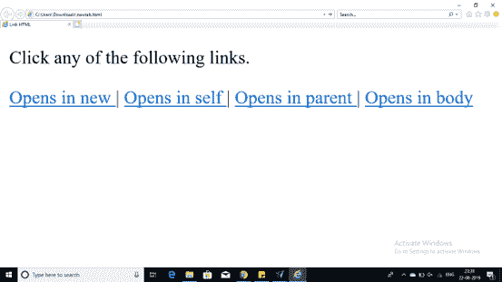
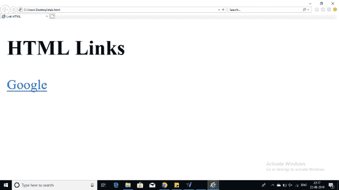

# 关于 HTML 中的“a”标签，你需要知道的就是

> 原文：<https://www.edureka.co/blog/a-tag-in-html/>

将某人重定向到另一个页面或将内容重定向到您的网页是保持互动的一个非常好的方法。这可以通过“HTML 中的标签”来实现。让我们以下面的方式来理解这一点:

*   [HTML 中的标签是什么？](#what)
*   [中的选项<一个>标签](#options)一个
*   [例子](#code)

## **HTML 中的标签是什么？**

使用 HTML 标签中的任何内容都成为链接的一部分，用户只需单击该部分，就可以到达链接的内容或文档。这个

```

<!DOCTYPE html>
<html>
		<head>
			<title> Link HTML</title
			<base href="http://www.edureka.com/">
		</head>
		<body>
		<p> Click any of the following links.</p>
		<a href="/html/index.htm" target="_blank"> Opens in new </a> |
		<a href="/html/index.htm" target="_self"> Opens in self </a> |
		<a href="/html/index.htm" target="_parent"> Opens in parent </a> |
		<a href="/html/index.htm" target="_top"> Opens in body </a>
		</body>
</html>

```

## **标签中的选项**

你可以在 HTML 的这个 a 标签里提供很多选项。下面是其中的一些

| **选项** | **描述** |
| **_ 空白** | 链接的文档在新选项卡或新窗口中打开。 |
| **_ 自我** | 链接的文档在同一框架中打开。 |
| **_ 父代** | 链接的文档在父框架中打开。 |
| **_top** | 链接的文档在整个窗口中打开。 |
| **目标帧** | 链接的文档在命名的 targetframe 中打开。 |

举例说明对标签目标属性给出的几个选项的区别的基本理解。

## **例子**

```

<!DOCTYPE html>
<html>
		<head>
			<title> Link HTML</title
		</head>
		<body>
		<h2> HTML Links</h2>
		<a href="https://www.google.co.in/" target="_blank"> Google </a>
		</body>
</html>

```

**输出:**



**例 2:**

```

<!DOCTYPE html>
<html>
		<head>
			<title> Link HTML</title
		</head>
		<body>
		<h2> HTML Links</h2>
		<a href="https://www.youtube.com/" target="_blank"> Youtube </a>
		</body>
</html>

```

**输出:**



至此，我们结束了这篇 HTML 文章中的 a 标签。我希望你明白什么是锚标签。本文开头也有三个。

*查看我们的 [网络开发人员在线课程](https://www.edureka.co/masters-program/full-stack-developer-training) ，该课程包含讲师指导的现场培训和真实项目体验。本培训使您精通使用后端和前端 web 技术的技能。它包括关于 Web 开发、jQuery、Angular、NodeJS、ExpressJS 和 MongoDB 的培训。*

有问题要问我们吗？请在“HTML 中的标签”博客的评论部分提到它，我们会给你回复。