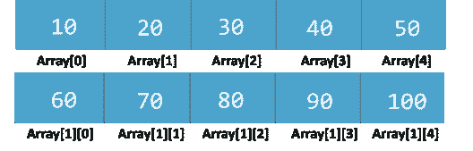
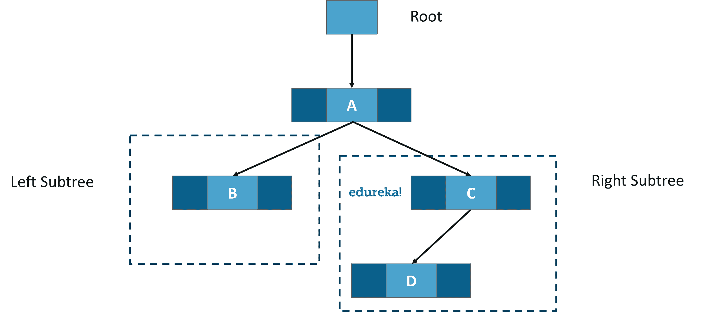

# C 中的数据结构是什么，如何使用？

> 原文：<https://www.edureka.co/blog/c-data-structures/>

[**C 中的数据结构**](https://www.edureka.co/blog/introduction-to-c-programming-algorithms/) 用于以一种有组织且高效的方式存储数据。C 编程语言有许多数据结构，如 T4 数组、堆栈、队列、链表、树等。程序员选择合适的数据结构，并根据自己的方便使用它。

让我们来看看这些数据结构中的一些:

*   [数组](#array)
*   [堆栈](#stack)
*   [队列](#queue)
*   [链表](#list)
*   [树木](#tree)
*   [哈希](#hash)

**数组**

数组是相同数据类型的元素的有序集合。它们按顺序存储在内存中。数组是保存相似类型元素的数据结构。在 c 语言中，数组元素不像在 java 中那样被视为对象。

想象一下，你在一家乐器店，我让你把卡西欧品牌的所有键盘一个接一个地放在一个地方。这种连续的记录集合称为数组。数组是相同数据类型的元素的有序集合。在我们上面的例子中，Casio 是数据类型，您收集的所有键盘都是 Casio 品牌的。数组中的所有元素都有一个共同的名称。

有两种类型的数组:

*   一维数组


*   多维数组



一维数组的语法:

**数据类型数组名称【数组大小】；**

**//员工 id 示例**

```
#include<stdio.h>
int main()
{    
   int i=0; 
   int empID[5];
   empID[0]=10280;
   empID[1]=10260;   
   empID[2]=10270;   
   empID[3]=10285;    
   for(i=0;i<4;i++)
   {
       printf("%d n,empID[i]);   
   }
   return 0; 
}
```

**//输出:**

```
10280
10260
10270
10285
10275
```

二维数组的语法:

**数据类型数组名称[行][列]；**

```
#include<stdio.h>
int main()
{
     int disp[2][3];
     int i, j;
     for(i=0; i<2; i++) 
     {
           for(j=0;j<3;j++) 
           {
                  printf("Enter value for disp[%d][%d]:", i, j);
                  scanf("%d", &disp[i][j]);
            }
     }
     printf("Two Dimensional array elements:n");
     for(i=0; i<2; i++) 
     {
           for(j=0;j<3;j++) 
           {
                 printf("%d ", disp[i][j]);
                 if(j==2)
                 {
                       printf("n");
                 }
           }
     }
     return 0;
}
```

//输出:

```
Enter value for disp[0][0]:1  Enter value for disp[0][1]:2  Enter value for disp[0][2]:3  Enter value for disp[1][0]:4  Enter value for disp[1][1]:5  Enter value for disp[1][2]:6  Two  Dimensional array elements:  1  2  3  4  5  6 
```

让我们进入下一个话题。

**堆栈**

堆栈是一种线性数据结构。它遵循**后进先出**的方法。一个新项目被添加到堆栈的顶部。插入和删除操作都是从堆栈的一端执行的。


有两个功能与堆栈相关联。Push 函数向堆栈中添加元素，pop 函数从堆栈中移除元素。

**考虑这个例子:**

想象你有一个饼干罐，在这个罐子里，你可以一次添加一个饼干。在 jar 中一次输入一个 cookie 的过程称为推送。同样，您可以一次删除一个 cookie。从最顶层位置移除 cookie 的过程称为 pop 函数。

最后进入的 cookie 是第一个从 jar 中移除的，因此堆栈遵循后进先出的方法。

**//堆栈示例**

```
#include <limits.h>
#include <stdio.h>
#include <stdlib.h>
struct Stack {
     int top;
     unsigned capacity;
     int* array;
};
struct Stack* createStack(unsigned capacity)
{
     struct Stack* stack = (struct Stack*)malloc(sizeof(struct Stack));
     stack->capacity = capacity;
     stack->top = -1;
     stack->array = (int*)malloc(stack->capacity * sizeof(int));
     return stack;
}
int isFull(struct Stack* stack)
{
     return stack->top == stack->capacity - 1;
}
int isEmpty(struct Stack* stack)
{
     return stack->top == -1;
}
void push(struct Stack* stack, int item)
{
     if (isFull(stack))
     return;
     stack->array[++stack->top] = item;
     printf("%d pushed to stackn", item);
}
int pop(struct Stack* stack)
{
      if (isEmpty(stack))
      return INT_MIN;
      return stack->array[stack->top--];
}
int peek(struct Stack* stack)
{
      if (isEmpty(stack))
      return INT_MIN;
      return stack->array[stack->top];
}
int main()
{
      struct Stack* stack = createStack(100);
      push(stack, 11);
      push(stack, 12);
      push(stack, 33);
      printf("%d popped from stackn", pop(stack));
      return 0;
}

```

**//输出**

```
11 pushed into stack
12 pushed into stack
33 pushed into stack
33 popped from stack
```

类似于堆栈，我们有另一种数据结构叫做队列。

**队列**

队列是存储元素集合的线性数据结构。队列按照**先进先出** (FIFO)算法运行。


考虑一个例子，

你正在找医生做检查。诊所里有很多人。一位女士正在把所有人的名字输入档案。先来的人先获得名次。当医生有空的时候，他把第一个病人叫进去。这是一个队列，遵循先入先出的方法，第一个在列表中输入自己名字的人首先得到处理。

名字被处理的人从列表中删除。这就是队列的工作方式。

有两个指针，前面的在队列的前面，后面的在队列的后面。我们从队列的后面添加元素，从队列的前面删除它们。

**//队列示例**

```
#include<stdio.h>
#define SIZE 5
void enQueue(int);
void deQueue();
void display();
int items[SIZE], front = -1, rear = -1;
int main()
{
     deQueue();
     enQueue(1);
     enQueue(2);
     enQueue(3);
     enQueue(4);
     enQueue(5);
     enQueue(6);
     display();
     deQueue();
     display();
     return 0;
}
void enQueue(int value)
{
     if(rear == SIZE-1)
           printf("nQueue is Full!!");
     else 
     {
           if(front == -1)
           front = 0;
           rear++;
           items[rear] = value;
           printf("nInserted -> %d", value);
     }
}
void deQueue()
{
      if(front == -1)
      printf("nQueue is Empty!!");
      else
      {
            printf("nDeleted : %d", items[front]);
            front++;
            if(front > rear)
                   front = rear = -1;
      }
}
void display(){
      if(rear == -1)
            printf("nQueue is Empty!!!");
      else
      {
            int i;
            printf("nQueue elements are:n");
            for(i=front; i<=rear; i++)
                 printf("%dt",items[i]);
       }
}
```

**//输出:**

```
<samp>Queue is Empty!!
Inserted -> 1
Inserted -> 2
Inserted -> 3
Inserted -> 4
Inserted -> 5
Queue is Full!!
Queue elements are:
1    2    3    4    5    
Deleted : 1
Queue elements are:
2    3    4    5</samp>
```

让我们来讨论一下链表。

**链表** 链表是一种数据结构。它是线性的。链表就像一个数组，但是链表不是顺序存储在内存中的。每个链表有两个部分，数据段**和地址段**保存链表中下一个元素的地址，这个元素叫做节点。****

链表的大小是不固定的，数据项可以添加到列表中的任何位置。缺点是要到达一个节点，我们必须从第一个节点遍历到我们需要的节点。

有三种类型的链接列表:

*   **单链表**


*   **双链表**


*   **循环链表**


示例:

格式:[数据，地址]

头-> 31000-> 431001-> 211002

在本例中，数字 43 出现在位置 1000，地址出现在前一个节点中。这就是链表的表示方式。

链表中有多个函数

首先，我们创建一个列表，显示它，在任意位置插入，删除一个位置。下面的代码将向您展示如何对列表执行操作。

**//单链表示例**

```
#include <stdio.h>
#include <stdlib.h>
struct node 
{
    int data;
    struct node *next;
};
struct node *head = NULL;
struct node *current = NULL;
void printList() 
{
     struct node *ptr = head;
     printf("n[head] =>");
     while(ptr != NULL) 
     {
          printf(" %d =>",ptr->data);
          ptr = ptr->next;
     }
     printf(" [null]n");
}
void insert(int data) 
{
     struct node *link = (struct node*) malloc(sizeof(struct node));
     link->data = data;
     link->next = head;
     head = link;
}

int main() 
{
     insert(600);
     insert(500);
     insert(400);
     insert(300);
     insert(200);
     insert(100);
     printList();
     return 0;
}

```

**//输出**

```
[head] => 100 => 200 => 300 => 400 => 500 => 600 => [null]

```

**//循环链表示例**

```
#include <stdio.h>
#include <stdlib.h>

struct node 
{
     int data;
     struct node *next;
};

struct node *head = NULL;
struct node *current = NULL;
void insert(int data) 
{
     struct node *link = (struct node*) malloc(sizeof(struct node));
     link->data = data;
     link->next = NULL;
     if(head==NULL) 
     {
           head = link;
           head->next = link;
           return;
     }
     current = head;
     while(current->next != head)
     current = current->next;
     current->next = link;
     link->next = head;
}
void printList() 
{
     struct node *ptr = head;
     printf("n[head] =>");
     while(ptr->next != head) 
     {
           printf(" %d =>",ptr->data);
           ptr = ptr->next;
     }
     printf(" %d =>",ptr->data);
     printf(" [head]n");
}

int main() 
{
     insert(10);
     insert(20);
     insert(30);
     insert(40);
     insert(50);
     insert(60);
     printList();
     return 0;
}

```

**//输出**

```
[head] => 10 => 20 => 30 => 40 => 50 => 60 => [head]
```

**//双向链表的例子**

```
#include <stdio.h>
#include <stdlib.h>

struct node 
{
      int data;
      struct node *prev;
      struct node *next;
};

struct node *head = NULL;
struct node *last = NULL;
struct node *current = NULL;

void insert(int data) 
{
      struct node *link = (struct node*) malloc(sizeof(struct node));
      link->data = data;
      link->prev = NULL;
      link->next = NULL;
      if(head==NULL) 
      {
            head = link;
            return;
      }
      current = head;
      while(current->next!=NULL)
           current = current->next;
           current->next = link;
           last = link;
           link->prev = current;
}
void printList() 
{
      struct node *ptr = head;
      printf("n[head] <=>");
      while(ptr->next != NULL) 
     {
            printf(" %d <=>",ptr->data);
            ptr = ptr->next;
     }
     printf(" %d <=>",ptr->data);
     printf(" [head]n");
}

int main() 
{
     insert(10);
     insert(20);
     insert(30);
     insert(40);
     insert(50);
     insert(60);
     printList();
     return 0;
}

```

**//输出**

```
[head] <=> 10 <=> 20 <=> 30 <=> 40 <=> 50 <=> 60 <=> [head] 

```

跟着链表，我们将学习树。

**树木**

树是一种数据结构，它有一个根节点和许多子节点。它是设计在链表顶部的另一种数据结构。



我们来了解一下哈希算法。

**散列法**

哈希表是另一种数据结构。它用于实现一个关联数组，这是一个可以将**键**映射到**值的结构。**哈希表使用哈希函数将索引计算到桶数组中。哈希表是非常有用的数据结构。

存在更多的数据结构，一些是用户定义的，一些是程序员用来组织数据和有效使用数据的内置结构。

到此，我们来结束这篇文章。我希望您已经理解了数据结构、语法、功能和使用它们执行的操作的重要性。

*既然您已经了解了 C 语言中数据结构的基础知识，那么就来看看 Edureka 提供的关于 Java、 [Spring](https://spring.io) 等多种技术的  培训* *吧，这是一家值得信赖的在线学习公司，拥有遍布全球的 250，000 多名满意的学习者*

有问题要问我们吗？在这个“C 语言中的数据结构”博客的评论部分提到它，我们会尽快回复你。