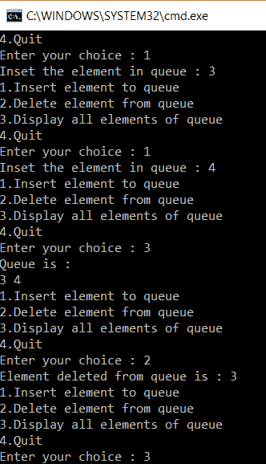

# 如何在 C 中实现队列？

> 原文：<https://www.edureka.co/blog/queue-in-c/>

队列是存储元素集合的线性数据结构。队列按照先进先出(FIFO)算法运行。这篇文章将帮助你探索 C 语言中队列

本文将涉及以下几点:

*   [队列类比](#AnalogyForQueue)
*   [队列上的操作](#OperationsOnAQueue)
*   [C 语言中队列的示例代码](#SampleCodeForQueueInC)
*   [插入功能](#InsertFunction)
*   [删除功能](#DeleteFunction)
*   [显示功能](#DisplayFunction)
*   [本实施的限制](#LimitationsOfThisImplementation)

那么让我们开始吧，

## **队列类比**

你正在找医生做检查。诊所里有很多人。一位女士正在把所有人的名字输入档案。先来的人先获得名次。当医生有空的时候，他把第一个病人叫进去。这是一个队列，遵循先入先出的方法，第一个在列表中输入自己名字的人首先得到处理。

名字被处理的人从列表中删除。这就是队列的工作方式。

有两个指针，前面的在队列的前面，后面的在队列的后面。我们从队列的后面添加元素，从队列的前面删除它们。

继续这篇关于 C 语言中队列的文章，

## **队列上的操作**

*   enqueue——如果队列中有空间，就在队列中添加一个元素。
*   出列-如果队列中有元素，则从队列中删除元素
*   Front-从队列中获取第一个项目。
*   从队列中获取最后一个项目。
*   isEmpty/isFull-检查队列是空的还是满的。

**应用程序**

*   队列用于在 CPU 中调度进程。
*   它用于进程间的数据传输。
*   它保存多个作业，然后在需要时调用这些作业。

继续这篇关于 C 语言中队列的文章，

## **C 语言中队列的示例代码**

```
#include <stdio.h>
#include<stdlib.h>
#define MAX 50
void insert();
void delete();
void display();
int queue_array[MAX];
int rear = - 1;
int front = - 1;
int main()
{
int choice;
while (1)
{
printf("1.Insert element to queue n");
printf("2.Delete element from queue n");
printf("3.Display all elements of queue n");
printf("4.Quit n");
printf("Enter your choice : ");
scanf("%d", &choice);
switch(choice)
{
case 1:
insert();
break;
case 2:
delete();
break;
case 3:
display();
break;
case 4:
exit(1);
default:
printf("Wrong choice n");
}
}
}
void insert()
{
int item;
if(rear == MAX - 1)
printf("Queue Overflow n");
else
{
if(front== - 1)
front = 0;
printf("Inset the element in queue : ");
scanf("%d", &item);
rear = rear + 1;
queue_array[rear] = item;
}
}
void delete()
{
if(front == - 1 || front > rear)
{
printf("Queue Underflow n");
return;
}
else
{
printf("Element deleted from queue is : %dn", queue_array[front]);
front = front + 1;
}
}
void display()
{
int i;
if(front == - 1)
printf("Queue is empty n");
else
{
printf("Queue is : n");
for(i = front; i <= rear; i++)
printf("%d ", queue_array[i]);
printf("n");
}
}

```

## **输出**

****

**解释**

这段代码是队列的菜单驱动实现。首先，将 MAX 变量的大小定义为 50。然后，名为 queue_array 的数组被声明为 size MAX。有三个函数需要声明。这些功能是插入、显示和删除功能。使用菜单驱动的主功能。要求用户输入他的选择并调用适当的函数来执行任务。

有两个指针，前面的在队列的前面，后面的在队列的后面。我们从队列的后面添加元素，从队列的前面删除它们。

继续这篇关于 C 语言中队列的文章，

## **插入功能**

```
void insert()
{
int item;
if(rear == MAX - 1)
printf("Queue Overflow n");
else
{
if(front == - 1)
front = 0;
printf("Inset the element in queue : ");
scanf("%d", &item);
rear = rear + 1;
queue_array[rear] = item;
}
}
```

在插入部分，首先声明一个要添加的项目。用户将输入项目。检查队列是否已满，如果是，给出溢出消息，否则检查队列是否为空。然后，后部递增 1，并且在后部的位置添加新的项目。

继续这篇关于 C 语言中队列的文章，

**删除功能**

```

void insert()
{
int item;
if (rear == MAX - 1)
printf("Queue Overflow n");
else
{
if (front == - 1)
front = 0;
printf("Inset the element in queue : ");
scanf("%d", &item);
rear = rear + 1;
queue_array[rear] = item;
}
}

```

在删除部分，再次检查队列是否为空。如果是，打印下溢错误。否则，打印第一个元素，这是将被删除的元素，并在前面递增。这就是删除是如何发生的。

继续这篇关于 C 语言中队列的文章，

**显示功能**

```

void display()
{
int i;
if(front == - 1)
printf("Queue is empty n");
else
{
printf("Queue is : n");
for(i = front; i <= rear; i++)
printf("%d ", queue_array[i]);
printf("n");
}
}

```

显示队列就像一个数组。检查这里的队列是否也是空的。队列的复杂度为 O(1 ),因为在任何操作中都不存在循环。

继续这篇关于 C 语言中队列的文章，

## **本**的局限性**实现**

考虑一个长度为 5 的队列。我们输入了 5 个元素，但后来删除了前 2 个元素。现在有一个问题。我们有自由空间，但空间不会被使用，因为我们不能再次穿越。使用循环队列解决了这个问题。

这就把我们带到了这篇关于 c 语言中队列的文章的结尾。

至此，我们结束了这篇关于“C 语言中的队列”的文章。我希望你发现这是有益的，请继续关注更多类似主题的教程。您也可以查看我们的培训项目 t 以获得关于 jQuery 及其各种应用程序的深入知识，您可以 [**在此**](https://www.edureka.co/masters-program/full-stack-developer-training) 注册参加实时在线培训，享受全天候支持和终身访问。 用不同的字符串和修改实现上面的代码。现在，我们已经很好地理解了与指针相关的所有关键概念。

有问题要问我们吗？在这篇文章的评论部分提到它们，我们会给你回复。