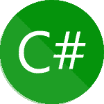

# 2023 年你需要知道的 50 大 C#面试问题

> 原文：<https://www.edureka.co/blog/interview-questions/c-sharp-interview-questions/>

C#是一种简单、现代和通用的面向对象编程语言。NET 框架。在这篇关于 C#面试问题的博客中，我将向你介绍 C#中最常见的面试问题，以及你应该如何解决这些问题。

我将问题分为三个部分:

*   [初级](#Beginner)
*   [中级](#Intermediate)
*   [进阶等级](#Advance)

让我们开始吧。

## **初级**

### **Q1** 。**列出 Public，Static 和 void 关键字的区别？**

年-

| **关键词** | **描述** |
| 公共 | 它是一个访问说明符，声明类的方法可以被公开访问 |
| 静态 | 它是一个关键字，用于声明特定于某个类型的成员 |
| 空的 | 声明该方法不返回任何值 |

```
using System;
class test
{
static void main(String args[])// main is the method that gets executed first
{
Console.Writeline("Welcome to the world of C#");
}
}

```

### **Q2。定义 C#并列出特性。**

** ** ** Ans- ** C#是一种面向对象的类型化安全管理语言，由。NET 框架，由微软在 2000 年开发。这个想法是，它将被用于开发所有类型的软件，针对不同的平台，如 Windows，Web，移动只使用一种编程语言。快进到今天，它是世界上最流行的编程语言之一，数以百万计的开发人员使用这种语言来构建各种软件。

C#(sharp)的一些特性是:

*   构造函数和析构函数的使用
*   容易掌握
*   通用和面向对象
*   结构化语言
*   独立于编译的平台
*   的一部分。NET 框架

让我们进入下一个问题，

### **Q3。列出使用 C#语言背后的原因。**

**Ans-** 使用 C#作为编程平台有几个原因。下面列出了其中的一些。

*   易于拾取
*   面向组件的语言
*   遵循结构化方法
*   制作可读且高效的程序
*   一旦编写完成，就可以在不同的平台上编译
*   传递参数很容易

### **Q4。用 C#有什么好处？**

以下是使用 C#的优势:

*   简单易学
*   面向对象语言
*   这种语法很容易掌握
*   面向组件
*   的一部分。NET 框架

### **Q5。C#中有哪些不同类型的注释？**

下面列出了 C#中遵循的注释类型:

**a .单行注释**

```
// hello, this is a single line comment

```

**b .多行注释**

```
  /* Hello this is a multiline comment
   last line of comment*/

```

**c. XML 注释**

```
/// Hello this is XML comment

```

### **Q6。用 C#说明代码编译的过程？**

代码编译过程中有四个步骤:

1.  在托管代码中编译源代码
2.  将新创建的代码组合到程序集中
3.  加载 CLR(公共语言运行库)
4.  通过 CLR 执行程序集

### **Q7。列出 C#中可用的访问修饰符。**

**Ans-** 以下是可用于一般用途的访问修饰符:

*   **Public-** 当一个属性或方法被定义为 Public 时，它可以从代码的任何部分被访问。

*   **Private-** 私有属性或方法可以从类本身内部访问。

*   **Protected-** 当用户将一个方法或属性定义为 Protected 时，那么它只能在该类和继承该类的类中被访问。

*   **Internal-** 当一个属性或方法被定义为 Internal 时，那么它将从当前组装位置的类中被访问。

*   **Protected Internal-** 当您将一个属性或方法定义为 Protected Internal 时，它的访问权限仅限于当前项目集合中的类或由该类定义的不同类型。

继续 C#面试问题，让我们展开 C#中使用的一些功能。

### **Q8。列出微软为 C#开发提供的不同 IDE。**

下面列出了一些用于 C#开发的 IDE:

*   Visual Studio 速成版(VCE)
*   Visual Studio (VS)
*   可视化 Web 开发人员
*   单显影
*   棕色的

### **Q9。区分 Continue 和 Break 语句？**

**Ans-** 使用 break 语句，您可以“跳出”循环，而使用 continue 语句，您可以跳过一次迭代并继续循环执行。

**示例(Break 语句):**

```
using System;
using System.Collections;
using System.Linq;
using System.Text;

namespace break_example{
Class break_Stmnt{
public static void main(String args[]){
for(int i=0;i<=6;i++)
{
if(i==5)
{
break;
}
Console.Readline("The number is +i");
}
}
}

```

**输出:**

数字为 0；数字为 1；数字为 2；数字是 3；数字为 4；

**举例(继续陈述):**

```
using System;
using System.Collections;
using System.Linq;
using System.Text;

namespace continue_example{
Class continue_Stmnt{
public static void main(String args[]){
for(int i=0;i<=6;i++)
{
if(i==5)
{
continue;
}
Console.Readline("The number is +i");
}
}
}

```

**输出:**

数字为 0；数字为 1；数字为 2；数字是 3；数字为 5；

### **Q10。向方法传递参数有哪些不同的方法？**

**Ans-** 向方法传递参数有三种方式:

**Value Parameters-** 在这种方法下，实参的值被复制到函数的形参中。在中，在这种情况下，对函数的形参所做的更改不会影响实参的值。

**引用参数-** 这个方法将引用内存位置的自变量复制到形参中。意味着对参数的更改会影响参数。

**输出参数-** 该方法返回多个值。

让我们在 C#面试题中前进，看下一类。

## **中级 C#面试问题**

### **Q11。区分 finally 和 finalize 块？**

**Ans-** finally 块在 *try* 和 catch *块执行后被调用，*无论异常是否被捕获，它都用于异常处理，这个代码块被执行。一般来说，这个代码块有一个更干净的代码。

finalize 方法在垃圾回收之前调用。主要的优先级是为非托管代码执行清理操作，当实例没有被后续调用时，它会被自动调用。

### **Q12。什么是托管或非托管代码？**

**Ans-** 托管代码是由 CLR(公共语言运行时)执行的代码，简单来说，这意味着所有的应用程序代码都依赖于。NET 平台，在他们看来是被监管的。非托管代码是由不同于。NET 平台。应用程序的运行时将处理内存、安全和其他执行活动。

### **Q13。什么是对象？**

**Ans-** Object 是一个类的实例，它用于访问一个类的方法。“New”关键字用于创建一个对象，一个创建对象的类在内存位置包含了关于该类的方法、变量和行为的信息。

要了解更多关于 Java、Python 和 C++中的 Object，你可以浏览下面的博客:

*   [Java 对象](https://www.edureka.co/blog/java-tutorial/)
*   [Python 对象](https://www.edureka.co/blog/python-class/)
*   [C++对象](https://www.edureka.co/blog/object-oriented-programming-in-cpp/#Objects)

### **Q14。什么是课？**

**Ans-** 类是一个对象的蓝图。它定义了对象将拥有的不同种类的数据和功能。通过将不同类型、方法和事件的变量组合在一起，类使您能够创建自己的自定义类型。在 C#中，类是由 class 关键字定义的。

要了解更多关于 Java、Python 和 C++中的类，你可以浏览下面的博客:

*   [Java 类](https://www.edureka.co/blog/java-objects-and-classes/#javaclass)
*   [Python 类](https://www.edureka.co/blog/python-class/#WhatIsPythonClass)
*   [C++类](https://www.edureka.co/blog/object-oriented-programming-in-cpp/#Classes)

### **Q15。定义一个抽象类？**

**Ans-** 它是一种其对象不能被实例化的类，它包含类似单一方法或技术的东西，并由关键字“abstract”指示。

要了解更多关于 Java 中抽象类的知识，你可以浏览下面的博客:

*   [Java 抽象类](https://www.edureka.co/blog/java-abstraction/)

### **Q16。在 C#中定义密封类？**

**Ans-** 当你想限制类被继承时，你可以创建密封类。为此，使用了密封的改性剂。如果将密封类强制指定为基类，则会发生编译错误。

### **Q17。定义一个分部类。**

**Ans-** 分部类是唯一一个本质上将一个类的定义在相同的源代码文件或多个源代码文件中分割成多个类的类。一个人可以在多个文件中创建一个类定义，但在运行时被编译成一个类，当这个类的一个实例被创建时，一个人可以用同一个对象访问每个源文件中的所有方法。它由关键字“partial”表示。

### **Q18。列出基本的 OOP 概念？**

**Ans-** 有四个基本的 OOP(面向对象编程)概念，它们列举如下:

*   **遗传-** 有没有从亲戚那里听说过这样的对话“你长得和你爸爸/妈妈一模一样”这背后的原因叫做‘遗传’。从编程方面来说，一般是指“从父类继承或转移特征到子类，不做任何修改”。这个新类称为 **派生/子** 类，而从中派生的类称为 **父/基** 类。
*   **多态性-** 你们一定都使用过 GPS 导航路线，根据交通状况，你会遇到多少条不同的路线到达同一个目的地，这难道不令人惊讶吗，从编程的角度来看，这被称为“多态性”。它是一种这样的 OOP 方法，其中一个任务可以用几种不同的方式来执行。简单来说，*它是一个对象的属性，允许它采取多种形式*。

*   封装- 在原始形式中，封装基本上意味着将数据绑定在一个类中。 一个类不应该被直接访问，而应该以下划线为前缀。

*   **抽象-** 假设你使用网上银行或任何其他流程从 bookmyshow 预订了一张电影票。你不知道 pin 码是如何生成的，也不知道验证是如何完成的。从编程的角度来看，这被称为“抽象”,它基本上意味着你只显示特定过程的实现细节，而对用户隐藏细节。它通过建模适合问题的类来简化复杂的问题。抽象类不能被实例化，这意味着你不能为这种类型的  类创建对象。它只能用于继承功能。

要了解 Java、Python 和 C++中 OOPs 的更多信息，您可以浏览以下博客:

*   [Java 哎呀](https://www.edureka.co/blog/object-oriented-programming/)
*   [Python 哎呀](https://www.edureka.co/blog/python-class/)
*   [C++哎呀](https://www.edureka.co/blog/object-oriented-programming-in-cpp/)

### **Q19。** **解释一个类继承到另一个类的过程？**

**Ans-** 冒号在 C#中作为继承运算符使用。放置冒号和类名。

```
public class Derivedclass: childclass

```

### **Q20。在 C#中定义方法重载？**

**Ans-** 方法重载本质上是用相同的类创建多个具有相同名称和唯一签名的方法。当你编译时，编译器利用重载决策来决定将被调用的具体方法。

### **Q21。列出方法重写和方法重载的区别？**

**Ans-** 在方法覆盖下，派生类的定义被改变，这反过来改变了方法行为。方法重载就是在不同的签名下，在同一个类下创建一个同名的方法。

### **Q22。解释 StreamReader/StreamWriter 类？**

**Ans-** Streamreader 和 StreamWriter 是 namespace.System.IO .的类，分别在我们要读取或写入 charact90，Reader based data，时使用。

StreamReader 的成员有: **close()** ， **Read()** ， **Readline()** 。Streamwriter 的成员有: **close()** ， **write()** ， **writeline()** 。

**示例程序:**

```
Class Testprogram
{
using(StreamReader sr = new StreamReader("C:Readme.txt")
{
// Any code to read//
}
using(StreamWriter sr = ndew StreamWriter("C:Readme.txt")
{
// Any code to write//
}
}

```

### **Q23。什么是接口？**

**Ans-** 一个接口基本上就是一个没有实现的类。它只包含属性、特性和事件的声明。

### **Q24。区分类和结构。**

下面给出了类和结构之间的区别:

| **类** | **结构** |
| 它支持继承 | 它不支持继承 |
| 它是通过引用传递的 | 它是按值传递的 |
| 默认情况下，成员是私有的 | 默认情况下，成员是公共的 |
| 被认为适用于较大的复杂对象 | 被认为适用于小型车型 |

### **Q25。列出虚方法和抽象方法的区别？**

**Ans-****虚拟方法**必须总是有一个默认的实现。然而，它可以在派生类中被关键字*覆盖。*

一个**抽象方法**没有任何实现。它驻留在抽象类中，并且派生类必须实现抽象类也是强制性的。没有必要使用 override 关键字。

### **Q26。用 C#说明命名空间？**

**Ans-** 名称空间用于组织大型代码项目。“System”是 C#中最流行、最广泛使用的命名空间之一。人们可以创建自己的名称空间，并将一个名称空间用于另一个名称空间，称为嵌套。

### **Q27。在 C#中定义 using 语句？**

**Ans-**“Using”关键字只是表示程序正在使用特定的名称空间。对于使用系统的 ex- *，这里的系统是一个名称空间。类控制台是在 system 下定义的，所以我们可以使用控制台。我们程序中的 Writeline(…)或 Readline。*

### **Q28。定义一个转义序列，在转义序列中命名几个字符串？**

**Ans-** 转义序列由反斜杠()表示。反斜杠仅仅表示它后面的字符应该按字面解释或者是一个特殊字符。转义序列是单个字符。

几个转义序列如下:

换行符

b–退格键

–反冲

–单引号

"–双引号

### **Q29。在 C#中定义装箱和拆箱？**

**Ans-** 将值类型转换为引用类型称为装箱。

**举例:**

```
int value = 10
//-------Boxing--------//
object boxedvalue = value1;

```

相同引用类型的显式转换，即将其转换回值类型，称为取消装箱。

**举例:**

```
 //----------------Unboxing-------// int UnBoxing = int(boxedvalue); 
```

要了解更多关于 Java 中装箱和拆箱的知识，你可以参考这篇文章。

**Q30。定义一个数组？** **Ans-** 一个数组用来存储多个相同类型的变量。存储在连续内存位置的变量集合。

**例:** 双数=新双[10]； int[] Score = new int[4] {25，24，23，22，21，20}

上面给出的例子是一维数组。它是一个线性数组，其中的值存储在一行中。多维数组是指具有不止一个维度的数组。矩形就是一个很好的例子。

**举例:**

int[，] numbers = new int[4，3]{ {1，2} {2，3} {3，4} {4，5 } }；

要了解更多关于 Java、Python 和 C++中的数组，你可以浏览下面的博客:

*   [Python 数组](https://www.edureka.co/blog/arrays-in-python/)
*   [Java 数组](https://www.edureka.co/blog/java-array/)
*   [C++数组](https://www.edureka.co/blog/arrays-in-cpp/)

### **Q31。在 C#中定义交错数组？**

**Ans-** 交错的数组被称为“数组的数组”。这是一个数组，其元素是数组，相同的元素可以是不同的维度和大小。每个数组索引的长度可以不同。

**举例:**

int[][] jagArray = new int[5][];

### **Q32。C#中区分数组和 Arraylist？**

年-

| **数组** | **阵列列表** |
| Array 使用向量数组来存储元素 | ArrayList 使用 LinkedList 来存储元素 |
| 在使用 redim 之前，必须定义数组的大小(vb) | 不需要指定存储大小。 |
| 数组是一种特定的数据类型存储 | ArrayList 可以将所有内容存储为对象 |
| 类型转换不是必需的 | 类型转换是必要的 |
| 没有运行时异常 | 出现 RunTime 错误异常 |
| 不能在中间插入或删除元素 | 可以在中间插入或删除元素 |

### **Q33。定义集合？**

集合本质上就像是其他类实例的容器。每个类都实现集合接口。

要了解 Java 中集合的更多信息，请查看下面的博客:

*   [Java 集合](https://www.edureka.co/blog/java-collections/)

### **Q34。在界面上写短笺？**

接口是一个没有实现的类。它由方法、参数和值的声明组成。

要了解更多关于 Java 接口的知识，请访问下面的博客:

*   [Java 接口](https://www.edureka.co/blog/java-interface/)

继续 C#面试问题，让我们看看下一个类别。

## **进阶等级**

### **Q35。图解序列化？**

在 C#中，将一些代码转换成二进制格式的过程被称为序列化。这样做提供了灵活性，代码可以方便地存储和/或写入磁盘或其他存储设备。当严格要求不丢失原始代码时，使用序列化。

C#中的序列化有三种类型:

**二进制序列化-** 速度快，占用空间少，可将任何代码转换成二进制格式。序列化和还原公共和非公共属性。

**SOAP-** 根据其理解 SOAP 的能力，生成一个完整的兼容 SOAP 的信封，供任何系统使用。这种序列化类型下的类驻留在*system . runtime . Serialization .*中

**XML 序列化-** 它将所有公共属性序列化为 XML 文档。可读性是一个因素，XML 文档也可以用多种方式操作。该类型下的类驻留在*system . SML . serialization .*

要了解 Java 中序列化的更多信息，请查看下面的博客:

*   [Java 序列化](https://www.edureka.co/blog/serialization-in-java/)

### **Q36。定义解析？解释如何解析日期时间字符串？**

**Ans-** 解析是一种将字符串转换成另一种数据类型的方法。

**举例:**

```
string text = "200";
int num = int.Parse(text);

```

在上面给出的例子中，200 是一个整数。因此，解析方法将字符串 200 转换成它自己的基本类型，即 int。为了解析日期时间字符串，让我们看一个小例子。

**举例:**

```
 string dateTime = "Aug 26,2019"; Datetime parsedvalue = Datetime.Parse(dateTime); 
```

### **Q37。定义代表？**

**Ans-** Delegate 是保存方法引用的变量。它是引用类型的函数指针。所有代表都来源于系统的*。委托*命名空间。委托和它引用的方法可以有相同的签名。我们来看一个小例子。

**举例:**

```
public Delegate int myDel(int number); //declaring a delegate
public class Program
{
public int SubstractNumbers(int a) //Class Program has the method same signature as delegate called  
{
int difference = a - 10;
return difference;
}
public void start()
{
myDel DelegateExample = SubstractNumbers;
}
}

```

### **Q38。区分系统。字符串和系统。StringBuilder 类？**

**Ans—**系统。字符串是不可变的。每当你修改一个字符串变量的值时，一个新的内存被分配给这个新的值，先前的内存分配被释放。系统。StringBuilder 是可变的，即支持这样一个事实，即无需为已经修改的字符串分配单独的内存位置，就可以执行各种操作。

**Q39。说明系统之间的差异。Array.CopyTo()和 System。Array.Clone()？**

**Ans–**使用 Clone()方法，创建一个包含原始数组所有元素的新数组对象。使用 CopyTo()方法，现有数组的所有元素都被复制到另一个现有数组中。两者都使用浅层复制方法。

### **Q40。用 C#编写捕捉异常的语法？**

为了捕捉异常，我们使用了 try-catch 块。catch 块有一个系统参数。异常类型。

**举例:**

```
try
{
GetAllData();
}
catch(Exception ex){
}

```

### **Q41。解释 C#中的泛型。网？**

**Ans-** 泛型用于生成可重用的代码类，减少代码冗余，

*   提高类型安全性、性能和优化
*   使用泛型可以做很多事情，比如创建集合
*   若要创建泛型集合，请使用 System.namespace
*   泛型命名空间应该在系统中的类(如 ArrayList)中使用
*   泛型鼓励使用参数化类型

### **Q42。列出 C#中“dispose”和“finalize”方法的区别。**

**Ans-** 当我们希望一个对象释放非托管资源时，Dispose()就会被调用。然而，Finalize()用于同样的目的，但是它不保证对象的垃圾收集。

### **Q43。定义 C# I/O 类？列出常用的类？**

**Ans-** C#由系统组成。IO 命名空间，其中包含计算和执行各种文件操作的类，如创建、删除、打开和关闭等。

下面列出了一些常用的 I/O 类:

**文件-** 帮助操作文件。 **流水号——**一般用于将字符写入一条流中。 **StreamReader-** 一般用于将字符读入一个流。 **StringWriter-** 用于写字符串缓冲区。 **Stringreader-** 用于读取字符串缓冲区。

### **Q44。定义线程？解释一下多线程？**

**Ans-** Thread 是一组指令，当执行时使程序能够执行并发处理。并发处理有助于同时执行多个流程。默认情况下，C#只包含线程。可以创建其他线程来与原始线程并行执行代码。

线程遵循一个生命周期，在这个生命周期中，每当线程被创建时它就开始，在执行后立即终止。它后面的命名空间是 *System。创建线程和使用其成员时必须包含的线程*。

线程是通过扩展 thread 类创建的。Start()方法标志着线程执行的开始。

```
//callThread is our target method//
ThreadStart methodThread = new ThreadStart(CallThread);
Thread childThread = new Thread(methodThread);
childThread.start();

```

C#还可以一次执行多个进程/任务，这是通过在不同时间处理不同的进程来实现的，称为“多线程”。相同的几个操作如下:

*   **开始**

*   **睡眠**

*   **中止**

*   **暂停**

*   **简历**

*   **加入**

要了解 Java 中线程的更多信息，您可以浏览下面的博客:

*   [Java 线程](https://www.edureka.co/blog/java-thread/)
*   [Python 中的多线程](https://www.edureka.co/blog/what-is-mutithreading/)

下面继续 C#面试问题，看下一题。

### **Q45。什么是事件？**

C#中的事件遵循一个由发布者、订阅者、通知和处理者组成的概念。你可以把一个事件想象成一个封装的委托。

**举例:**

```
public Delegate void TestEvent();
public TestEvent TestEvent1;

```

### **Q46。解释同步和异步操作？**

**Ans-** 同步是创建线程安全代码的一种方式，在这种方式下，在给定时间内只有一个线程可以访问代码。同步调用等待方法完成，然后继续程序流。同步编程会对 UI 操作产生负面影响，这通常发生在用户试图执行耗时的操作时，因为只使用了一个线程。

在异步操作中，方法调用立即返回，允许程序执行其他操作，而被调用的方法在某些情况下完成其工作。

### **Q47。解释异步和等待？**

**Ans-** Async 和 Await 关键字主要用于在 [C#](https://www.microsoft.com/en-in/download/details.aspx?id=8193) 中创建异步方法。通过一个示例显示了相同的用法:

```
public async Task>CalculateCount()
{
await Task.Delay(2000);
return 1;
}
public async task mytestmethod()
{
Task> count = CalculateCount();
int result = await count;
}

```

在上面给出的代码中，async 关键字用于方法声明。该计数属于调用 CalculateCount()方法的任务类型 int。CalculateCount()开始执行，计算一些东西。

### **Q48。解释死锁？**

**Ans-** 死锁是一种由于两个或两个以上的进程在等待对方完成而导致进程无法完成执行的情况。这通常发生在多线程中。在这种情况下，一个共享资源被一个进程占用，另一个进程等待第一个进程结束或释放它，持有锁定项的线程等待另一个进程完成。

### **Q49。说明竞态条件？**

**Ans-** 当两个线程同时访问同一个资源并试图改变它时，就会出现竞争情况。无法预测首先访问资源的线程。让我举一个小例子，其中两个线程 X1 和 X2 试图访问同一个名为 T 的共享资源。如果两个线程都试图将值写入 T，那么写入 T 的最后一个值将被保存。

### **Q50。什么是线程池？**

线程池是在不干扰主线程的情况下执行任务的线程集合。一旦任务被一个线程完成，它就返回到主线程。

关于 C#面试问题的文章到此结束。我希望这有助于增加你的知识。祝你面试一切顺利。快乐学习。

如果你在寻找最常见的技术面试问题，请阅读:

*   [哎呀面试问题](https://www.edureka.co/blog/interview-questions/oops-interview-questions/)
*   [MVC 面试问题](https://www.edureka.co/blog/mvc-interview-questions)
*   [SQL 面试问题](https://www.edureka.co/blog/interview-questions/sql-interview-questions)
*   [Java 面试问题](https://www.edureka.co/blog/interview-questions/java-interview-questions/)
*   [Python 面试问题](https://www.edureka.co/blog/interview-questions/python-interview-questions/)

*查看由 [Edureka](https://www.edureka.co/) 提供的* *在线培训，Edureka 是一家值得信赖的在线学习公司，在全球拥有超过 250，000 名满意的学习者。通过我们的在线认证培训，我们将为您的每一步旅程提供帮助。*

有问题要问我们吗？请在这篇“C#面试问题”文章的评论部分提到它，我们会尽快回复您。