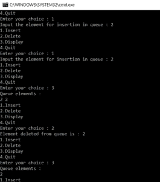

# 如何在 C 中实现循环队列？

> 原文：<https://www.edureka.co/blog/circular-queue-in-c/>

C 中的循环队列以非常实用的方式存储数据。它是一种线性数据结构。它非常类似于队列。唯一的区别是最后一个节点连接回第一个节点。因此它被称为*循环队列。本文将帮助您详细探索这一概念。*

本文将涉及以下几点:

*   [C 中的循环队列](#CircularQueueInC)
*   [循环队列上的操作](#OperationsOnACircularQueue)
*   [插入功能](#InsertFunction)
*   [删除功能](#DeleteFunction)
*   [显示功能](#DisplayFunction)

让我们开始吧，

## **C 中的循环队列**

循环队列解决了普通队列的局限性。因此，这是比普通队列更好的选择。它也遵循先来先服务的算法。循环队列也称为*环形缓冲区*。

## **循环队列上的操作**

1.  enqueue——如果队列中有空间，就在队列中添加一个元素。
2.  出列-如果队列中有元素，则从队列中删除元素
3.  Front-从队列中获取第一个项目。
4.  从队列中获取最后一个项目。
5.  isEmpty/isFull-检查队列是空的还是满的。

## **循环队列的应用**

*   内存管理:循环队列用于内存管理。
*   进程调度:CPU 使用队列来调度进程。
*   交通系统:队列也用于交通系统。

**样本代码**

```
#include<stdio.h>
# define MAX 5
int cqueue_arr[MAX];
int front = -1;
int rear = -1;
void insert(int item)
{
if((front == 0 && rear == MAX-1) || (front == rear+1))
{
printf("Queue Overflow n");
return;
}
if(front == -1)
{
front = 0;
rear = 0;
}
else
{
if(rear == MAX-1)
rear = 0;
else
rear = rear+1;
}
cqueue_arr[rear] = item ;
}
void deletion()
{
if(front == -1)
{
printf("Queue Underflown");
return ;
}
printf("Element deleted from queue is : %dn",cqueue_arr[front]);
if(front == rear)
{
front = -1;
rear=-1;
}
else
{
if(front == MAX-1)
front = 0;
else
front = front+1;
}
}
void display()
{
int front_pos = front,rear_pos = rear;
if(front == -1)
{
printf("Queue is emptyn");
return;
}
printf("Queue elements :n");
if( front_pos <= rear_pos )
while(front_pos <= rear_pos)
{
printf("%d ",cqueue_arr[front_pos]);
front_pos++;
}
else
{
while(front_pos <= MAX-1)
{
printf("%d ",cqueue_arr[front_pos])
front_pos++;
}
front_pos = 0;
while(front_pos <= rear_pos)
{
printf("%d ",cqueue_arr[front_pos]);
front_pos++;
}
}
printf("n");
}
int main()
{
int choice,item;
do
{
printf("1.Insertn");
printf("2.Deleten");
printf("3.Displayn");
printf("4.Quitn");
printf("Enter your choice : ");
scanf("%d",&choice);
switch(choice)
{
case 1 :
printf("Input the element for insertion in queue : ");
scanf("%d", &item);
insert(item);
break;
case 2 :
deletion();
break;
case 3:
display();
break;
case 4:
break;
default:
printf("Wrong choicen");
}
}while(choice!=4);
return 0;
}

```

**输出:**

#### ****

#### **解释**

这段代码是一个循环队列的菜单驱动实现。首先，将 MAX 变量的大小定义为 5。然后，名为 cqueue_array 的数组被声明为 size MAX。需要声明三个函数。这些功能是插入、显示和删除功能。有一个菜单驱动的主功能。要求用户输入他的选择并调用适当的函数来执行任务。

有两个指针，前面的在队列的前面，后面的在队列的后面。在循环队列中，元素从队列的后面添加，从队列的前面移除。这是一个循环队列，所以如果尾部在最后一个位置，如果递增，它将指向第一个元素

继续这篇关于 C #中循环队列的文章

**插入功能**

```
void insert(int item)
{
if((front == 0 && rear == MAX-1) || (front == rear+1))
{
printf("Queue Overflow n");
return;
}
if(front == -1)
{
front = 0;
rear = 0;
}
else
{
if(rear == MAX-1)
rear = 0;
else
rear = rear+1;
}
cqueue_arr[rear] = item ;
}

```

在插入部分，检查循环队列是否已满，如果是，给出溢出消息，否则检查循环队列是否为空。如果 rear 位于最后一个位置，则使其指向第一个位置，否则 Rear 递增 1。这就是为什么它变成了一个循环队列。最后，该项目进入队列。

继续这篇关于 C #中循环队列的文章

## **删除功能**

```
void deletion()
{
if(front == -1)
{
printf("Queue Underflown");
return;
}
printf("Element deleted from queue is : %dn",cqueue_arr[front]);
if(front == rear)
{
front = -1;
rear=-1;
}
else
{
if(front == MAX-1)
front = 0;
else
front = front+1;
}
}

```

在删除部分，首先检查循环队列是否为空。如果是，则打印下溢错误，即队列为空。否则，打印第一个元素，这是将被删除的元素，并在前面递增。这就是删除是如何发生的。

然后，检查前方和后方是否指向同一个位置，并将两个值都指定为-1，即不指向任何地方。否则，检查前端是否在末端，如果是，使其指向第一个位置。否则，增加前端。

继续这篇关于 C #中循环队列的文章

## `**Display Function**`

```
void display()
{
int front_pos = front,rear_pos = rear;
if(front == -1)
{
printf("Queue is emptyn");
return;
}
printf("Queue elements :n");
if( front_pos <= rear_pos )
while(front_pos <= rear_pos)
{
printf("%d ",cqueue_arr[front_pos]);
front_pos++;
}
else
{
while(front_pos <= MAX-1)
{
printf("%d ",cqueue_arr[front_pos]);
front_pos++;
}
front_pos = 0;
while(front_pos <= rear_pos)
{
printf("%d ",cqueue_arr[front_pos]);
front_pos++;
}
}
printf("n");
}

```

我们只是像显示数组一样显示循环队列。检查这里的循环队列是否也是空的。然后，根据变量前端和后端的位置打印循环队列的元素。

这就把我们带到了这篇关于 c 语言中循环队列的文章的结尾。

至此，我们结束了这篇关于“C 语言中的队列”的文章。我希望你发现这是有益的，请继续关注更多类似主题的教程。您也可以查看我们的培训项目 t 以获得关于 jQuery 及其各种应用程序的深入知识，您可以 [**在此**](https://www.edureka.co/masters-program/full-stack-developer-training) 注册参加实时在线培训，享受全天候支持和终身访问。 用不同的字符串和修改实现上面的代码。现在，我们已经很好地理解了与指针相关的所有关键概念。

有问题要问我们吗？在这篇文章的评论部分提到它们，我们会给你回复。