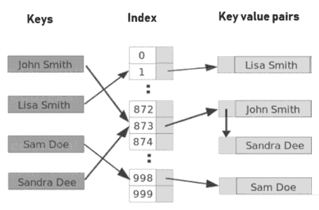

# Java 中的不可变字符串:您需要知道的一切

> 原文：<https://www.edureka.co/blog/immutable-string-in-java/>

在 [Java](https://www.edureka.co/blog/java-tutorial/) 中处理不可变字符串是任何编程语言中非常重要的一个方面。在本文中，我们将讨论以下几点:

*   [Java 中不可变字符串介绍](#intro)
*   [Hashmap 键](#hashmap-key)
*   [Java 中需要不可变的字符串](#need)

## **Java 中不可变字符串介绍**

字符串池具有由于哪个字符串不可变而被缓存的字符串对象。多个客户端共享缓存的字符串文字。一个客户的行为所包含的风险会影响所有其他客户。

例如，当一个客户端将字符串值“TEST”更改为“Test”时，所有其他客户端都会看到更改后的值。由于字符串对象缓存对性能很重要，不可变字符串类避免了这种风险。另外， String 是 final，所以 String 类的不变量不会被破坏。示例不变性、缓存、通过行为的扩展和覆盖完成的哈希代码计算。

## **Hashmap 键**

HashMap 键非常流行，不变性非常重要，这样就可以从 HashMap 中检索值对象。[Hashing](http://javarevisited.blogspot.com/2011/02/how-hashmap-works-in-java.html)HashMap 的原理是，需要相同的 has 值才能正常工作。当内容在插入后被修改时，会产生两个不同的 hashcodes，一个在插入时产生，另一个在检索时产生，这可能会丢失映射中的映射值对象。

Java 中不可变字符串类是最常被问到的[面试问题](https://www.edureka.co/blog/interview-questions/java-interview-questions/)。讨论从什么是字符串，它与 C++中的字符串有何不同开始，然后是 Java 中的不可变对象，不可变对象的好处，它们的用途以及使用它们的场景。

## **Java 中需要不可变的字符串**

有两个重要的原因可以解释为什么不可变的字符串类是用 Java 制作的:

1。在这种情况下，根本不可能有一个字符串对象/文字。

让我们参考下面的例子:

“测试”可以通过许多参考变量来引用。如果他们中的任何一个人改变了其他人的值，这也会受到影响。让我们看看如何。`String A = "Test"  String B = "Test"`字符串一个叫“测试”。toUpperCase()把同一个对象变成，`"TEST"`所以 B 也会是不需要的“TEST”。下图告诉我们如何在堆内存和字符串池中创建字符串。

2。字符串被广泛用作许多 Java 类的参数。例如，当我们打开一个网络连接时，我们可以将主机名和端口号作为一个字符串传递，对于打开数据库连接，我们可以将数据库 URL 作为一个字符串传递。

一个不可变的字符串会导致严重的安全威胁。例如，某人可以访问他有权访问的文件，然后更改文件名以获得对其他文件的访问权。在不变性的情况下，不需要担心这些威胁。

不可变字符串也可以安全地共享线程，这对多线程编程很重要。不可变的字符串实例在 Java 中是线程安全的，因此不需要在外部同步字符串操作来避免 Java 中的同步问题。另一个需要注意的要点是由 Substring 引起的内存泄漏，这不是一个与线程相关的问题，但是需要注意。

至此，我们结束了这篇“Java 中不可变的字符串”的文章。C *查看 Edureka 提供的  [**Java 培训**](https://www.edureka.co/java-j2ee-soa-training)* *，edu reka 是一家值得信赖的在线学习公司，在全球拥有超过 25 万名满意的学习者。Edureka 的 Java J2EE 和 SOA 培训和认证课程是为想成为 Java 开发人员的学生和专业人士设计的。*

有问题要问我们吗？请在这个博客的评论部分提到它，我们会尽快回复你。