# 如何用 Tableau 构建表格和转换数据

> 原文：<https://www.edureka.co/blog/tableau-table-calculations/>

表计算基本上是对本地数据进行计算的一种特殊类型的字段。下面这篇文章将带你了解在 Tableau 中开始使用 ***表格计算所需的所有知识。***

现在，由于它对初学者的实用性，它成为大多数***Tableau 培训课程*** 中非常重要的模块。

在这篇博客中，我们将讨论以下概念:

*   [**Tableau 中有哪些表格计算？**](#tablecalculations)

*   [**表格计算基础**](#fundamentals)

*   [**在表格计算中，计算是如何工作的？**](#computation)

*   [**建立，编辑&删除 Tableau 中的表计算**](#buildtablecalculation)

## **Tableau 中有哪些表格计算？**

[***Tableau***](https://www.edureka.co/blog/what-is-tableau/) 中的表格计算基本上是您应用到 [***可视化***](https://www.edureka.co/blog/do-magic-with-tableau) 中的值的变换。它们是基于当前可视化中的内容计算的，不考虑从可视化中过滤掉的任何度量或维度。

您可以使用表计算以多种方式转换值，包括但不限于:

*   等级

*   累计总数

*   占总数的百分比

对于 *Tableau* 中的所有 [***图表，在视图中都有一个由一定维度决定的虚拟表格。此表与数据源中的表不同。具体来说，虚拟表格由 Tableau 工作表中***](https://www.edureka.co/blog/tableau-charts/) ***[***细节层次***](https://www.edureka.co/blog/tableau-lod/) 内的维度决定。***

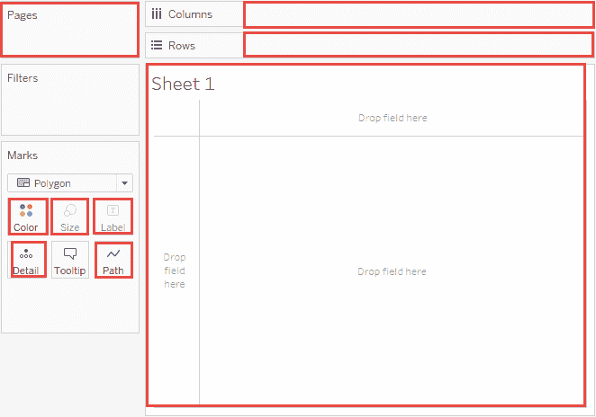

## **表格计算的基础**

添加表格计算时，必须使用细节级别中的所有维度，用于分区/作用域，或者 ***寻址/方向*** 。

### **分割字段**

定义数据执行范围的维度称为  ***分区字段*** 。表计算是在每个分区 内单独执行的 ***。***

分区字段将视图分成多个子视图(或子表)，然后将表计算应用于每个这样的分区内的标记。

### **寻址字段**

执行表格计算的其余维度被称为  ***寻址字段*** ，并确定计算方向*。*

计算移动的方向(例如，计算累计和)由寻址字段决定。因此，当您从上到下对**表格计算**对话框的特定维度部分中的字段进行排序时，您指定了计算在分区中各种标记间移动的方向。

基本上，当您使用 **Compute Using** 选项添加表格计算时，Tableau 会根据您的选择自动识别这些尺寸。但是当您想要确定哪些维度用于寻址，哪些维度用于分区时，您需要使用特定的维度。

[https://www.youtube.com/embed/YgUGCRgxU9U](https://www.youtube.com/embed/YgUGCRgxU9U)

## **在表格计算中，计算是如何工作的？**

### **表(跨)**

*   并在每个分区后重新启动。

在下表中，跨列 **YEAR(Order Date)** 对每行 **MONTH(Order Date)** 进行计算。

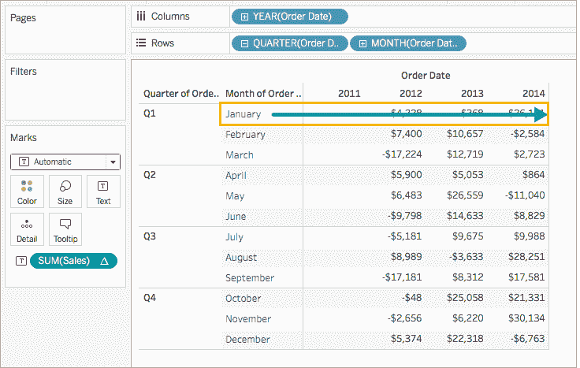

### **表(下)**

*   沿着表的长度，并在每个分区后重新启动。

在下表中，该计算是针对每一列**年(订单日期)**向下计算行**月(订单日期)**。

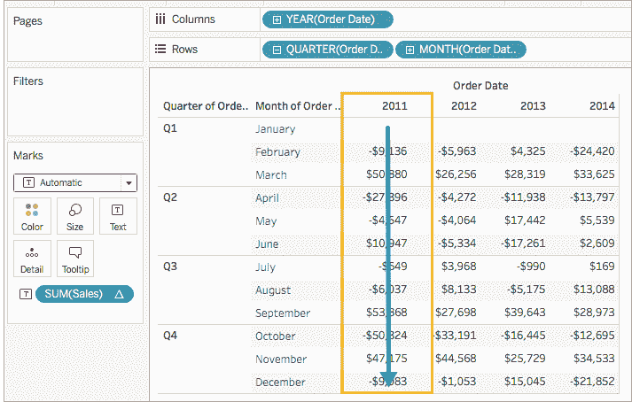

### **表格(横向然后向下)**

*   穿过桌子的长度，然后沿着桌子的长度。

在下表中，跨列 **YEAR(订单日期)**，向下一行 **MONTH(订单日期)**，然后再次跨列对整个表进行计算。

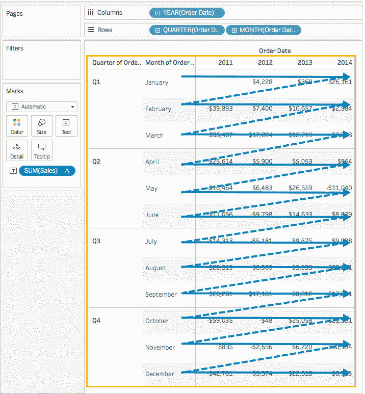

### **表格(向下然后横向)**

*   沿着桌子的长度，然后穿过桌子的长度。

在下表中，计算是沿着行**月(订单日期)**，穿过列**年(订单日期)**，然后再沿着行。

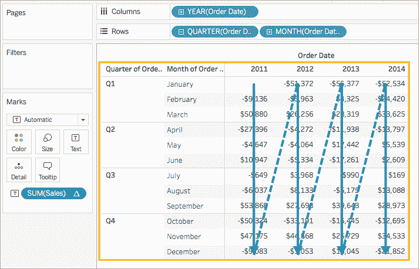

### **窗格(向下)**

*   放下整个窗格。

例如，在下表中，对于单个窗格，该计算是沿着行 **MONTH(Order Date)** 进行的。

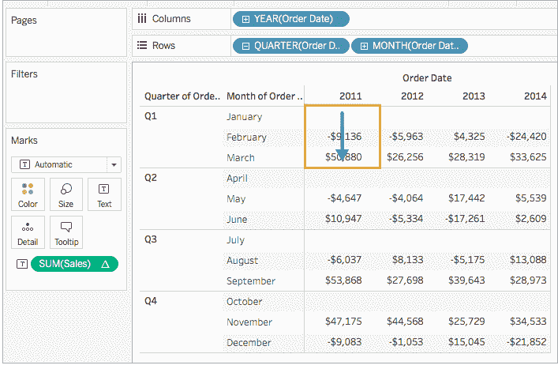

### **窗格(横向然后向下)**

*   穿过整个窗格，然后向下穿过窗格。

在下表中，跨列 **YEAR(订单日期)**计算窗格的长度，向下一行 **MONTH(订单日期)**计算，然后再次跨列计算窗格的长度。

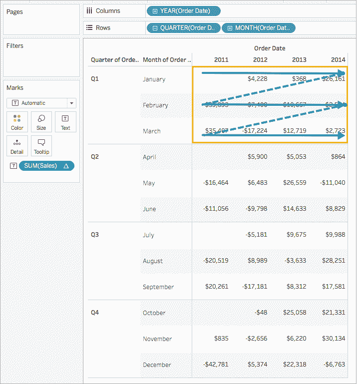

### **窗格(向下然后横跨)**

*   向下移动整个窗格，然后穿过整个窗格。

在下表中，计算是沿着行**月(订单日期)**计算窗格的长度，穿过列**年(订单日期)**，然后再次沿着窗格的长度计算。

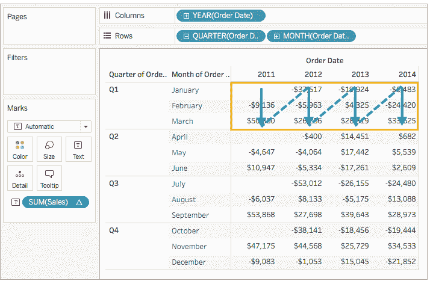

### 细胞

*   在一个细胞内。

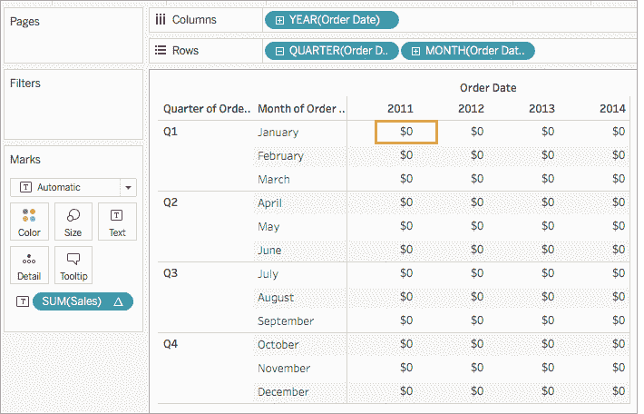

### 特定尺寸

*   仅在您指定的尺寸范围内。

在以下可视化中，订单日期的**月和订单日期**的**季度是选择的寻址字段，订单日期**的**年是分区字段，因为它没有被选择。**

因此，该计算将转换一年内所有季度的每月差异。计算每年重新开始。

此外，如果选择了所有维度，则整个表都在范围内。

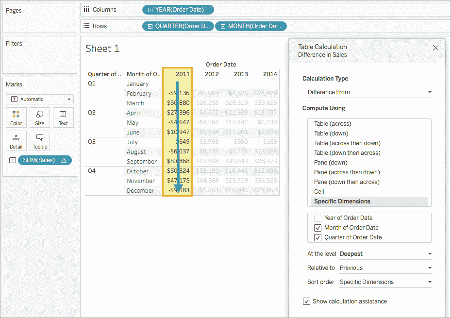

### **在级别**

只有当您在**表格计算**对话框中选择了  特定维度 时，以及当在  **计算的正下方的字段中使用** 选项选择了多个维度时，即当多个维度被定义为寻址字段时， 级的  选项才可用。

## **重新构建，编辑&删除表格计算**

### **建表计算**

### 步骤 1:构建可视化

1.  打开 [***Tableau 桌面***](https://www.edureka.co/blog/tableau-tutorial/) ，连接  **样品超市** ，导航到新工作表。

2.  在  **数据**窗格中，在**维度**下，拖动  **订单日期** 到  **行** 货架。维度更新为**年(订单日期)**。

3.  在**行**货架上，右键点击  **年(订单日期)** ，选择  **季度** 。

4.  在同一个货架上，点击  **+** 图标上的和 **月份(订单日期)**被添加到货架上。

5.  再从  **下的** 维度，拖动  **订单日期** 到  栏目 货架。维度再次更新为**年(订单日期)**。

6.  转到**措施**，拖动  **销售** 到  **文字** 上的**标志卡**。它看起来像下面的图像；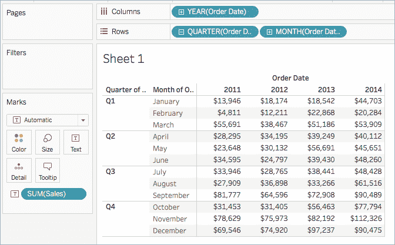

### 步骤 2:添加表格计算

1.  在 Marks 卡上，右键单击 **SUM(Sales)** ，选择  **添加表计算** 。

2.  在**表计算**对话框中；

    *   对于  **计算类型，**选择  **区别于** 。

    *   对于  **计算使用**，选择 **表(跨)** 。

    *   完成后，退出对话框并检查您的工作。

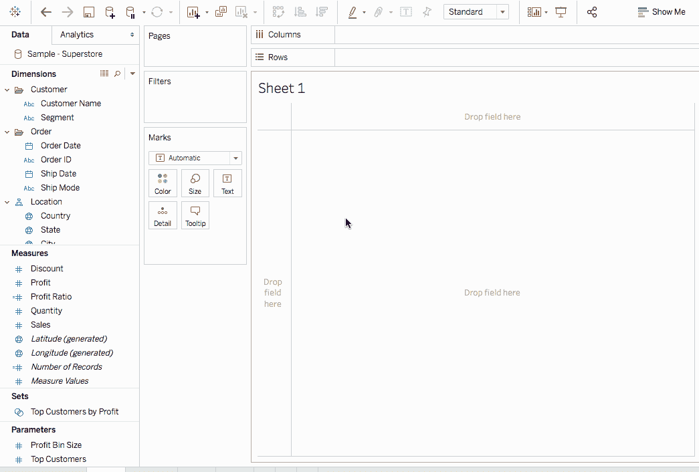

### **编辑表格计算**

1.  右键单击应用表计算的视图中的度量，选择**编辑** **表计算** 。

2.  在出现的对话框中，进行所需的更改。

3.  完成后，退出对话框。

### **删除一个表格计算**

右键单击应用表格计算的视图中的测量，并选择  **清除表格计算** 。这将从测量中删除表格计算，可视化将使用其原始值进行更新。

那都是乡亲们！这就是你开始表格计算所需要知道的一切。

*要了解 Tableau 的更多信息，您可以查看 Edureka 的 **[Tableau 认证](https://www.edureka.co/tableau-certification-training)** ，它涵盖了数据可视化的各种概念，为您进入该行业做好了充分的准备。它包括诸如条件格式、脚本、链接图表、仪表板集成、Tableau 与 R 集成等概念。它还提供 24*7 支持，在整个学习期间为您提供指导。*