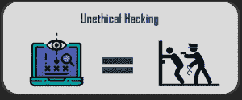

# 黑客和道德黑客的区别

> 原文：<https://www.edureka.co/blog/difference-between-hacking-and-ethical-hacking/>

即使在今天，系统安全经理们最害怕的词还是黑客。黑客攻击是为了获得对数据、信息、系统或资源的未授权访问。黑客是拥有技术技能的人，他们操纵数据来控制网络，意图破坏和窃取敏感数据。在本文中，让我们按照以下顺序来看看黑客行为和道德黑客行为的区别:

*   [黑客和道德黑客](#vs)
*   [白帽黑客 vs 黑帽黑客](#white-black)
*   [黑客攻击的种类](#categories)
*   [黑客 vs 破解者](#hackers-crackers)
*   [结论](#conclusion)

观看此视频，深入了解道德黑客行为。

**道德黑客完整课程–在 10 小时内学会道德黑客|道德黑客教程| Edureka**

[https://www.youtube.com/embed/dz7Ntp7KQGA](https://www.youtube.com/embed/dz7Ntp7KQGA)

## **黑客和道德黑客**

黑客行为是指专家和黑客专业人士访问存储在任何系统中的数据的非法或合法行为 。这些专家被称为黑客。黑客拥有与编程及其概念相关的所有知识。程序员在开发或处理软件时所犯的错误被黑客利用来侵犯软件的安全框架。

 

[**道德黑客**，](https://www.edureka.co/blog/ethical-hacking-tutorial/)作为一种工具在全球部署，以应对网络犯罪和保护敏感数据。道德黑客帮助开发企业或组织框架的安全系统，以防止潜在的威胁。他们被称为白帽子，最终为不道德的黑客提供保护。几乎每个组织都采用道德黑客。

## **白帽黑客 vs 黑帽黑客**

**黑帽黑客的目的** :

*   窃取其他用户的有价值信息
*   交易和账户收益
*   获得免费音乐和视频
*   免费下载黑客软件
*   从军事/海军组织等窃取有价值的信息
*   访问受限网络空间

**白帽黑客的目标:**

*   改善系统中的安全框架
*   开发类似 Linux 的高安全性编程语言
*   为组织开发大部分安全软件
*   检查和更新安全软件
*   开发弹出窗口拦截器、防火墙和广告拦截器等程序

**黑帽黑客的类型有:**

*   Phreakers——入侵电话网络的黑客
*   黑客——利用软件补丁拆除软件安全墙的黑客
*   黑客——攻击自动取款机或信用卡以获取用户信息的黑客
*   脚本小子——想要毫无目的地攻击计算机系统的黑客

## **黑客攻击的种类**

*   Windows 黑客
*   数据库黑客
*   网络黑客
*   网络黑客

### **其他黑客手段**

*   **网络钓鱼**——在这种黑客行为中，黑客利用他们的技能黑掉电子邮件或网站的密码。人们通常会在收件箱中收到钓鱼邮件。黑客通常通过用户的电子邮件 id 获取用户的登录信息，要求他们登录并将其重定向到他们的网站。
*   **僵尸网络**——有时候，机器人通过僵尸网络来做黑客工作。
*   ——黑客在主板端口上安装一个设备，窃取键盘上输入的信息。

## **黑客 vs 破解者**

黑客帮助建立安全，而骇客的目标是破坏安全。尽管两者都从事某种黑客活动，但它们的工作方式有很大的不同。

**黑客**通常拥有计算机安全方面的高级知识，也拥有所需的所有技术知识，但不一定像黑客一样熟练。黑客旨在对抗黑客对计算机系统和网络安全的攻击。

另一方面，**黑客**很清楚他们的活动是非法的，因此是犯罪活动，因此他们试图掩盖他们的踪迹。即使黑客在攻破系统方面可能非常熟练，专业黑客也可以恢复被攻破系统的安全性，并利用他们的技能和能力抓住黑客。

*   破解者拥有高度先进的技术知识，在分析系统的薄弱环节后，他们可以创建足够强大的软件和工具来破坏和利用系统。
*   大多数时候，破解者不会留下痕迹，因为他们在执行工作时非常高效和仔细。然而，它们对互联网安全构成了严重威胁。

众所周知，黑客是有道德的专业人士，而黑客未经许可非法侵入系统。

除了这一主要差异，另一个差异是关于他们对计算机系统和安全系统的理解。黑客可以用多种语言编写代码，并对计算机语言有深入的了解。另一方面，饼干在这里并不占优势。他们不具备太多的计算机编程知识。他们的工作和背后的意图使他们彼此截然不同。查看我们的[认证道德黑客](https://www.edureka.co/ceh-ethical-hacking-certification-course)课程，学习道德黑客的深入概念并获得技能。

## **结论**

*   因此，可以肯定地说，黑客闯入系统完全是为了检查系统中的漏洞，并对其进行修正以更新系统，而骇客闯入系统的目的是利用它们并获取个人利益。这不仅是不道德的，也是违法犯罪行为。
*   白帽子签订合法合同后进行黑客攻击。另一方面，黑帽子不屈服于任何批准或协议，因为他们打算违反任何系统的安全，他们的愿望。
*   当黑客侵犯个人数据和信息并利用它们为自己谋利时，黑客也会采取同样的行动来帮助公司或个人抵御这些黑客的攻击。

你也可以看看我们新推出的[***CompTIA Security+***](https://www.edureka.co/comptia-security-plus-certification-training)课程，这是 Edureka & CompTIA Security+首次正式合作的课程。它为您提供了一个获得全球认证的机会，该认证侧重于安全和网络管理员不可或缺的核心网络安全技能。

通过 Edureka 的 [**研究生项目** 和 **NIT Rourkela**](https://www.edureka.co/post-graduate/cybersecurity) 以正确的方式学习网络安全，保护世界上最大的公司免受网络钓鱼者、黑客和网络攻击。