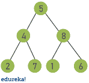
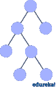
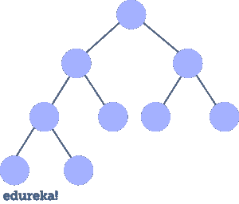

# Java 中的树:如何实现二叉树？

> 原文：<https://www.edureka.co/blog/java-binary-tree>

如果我不得不选择软件开发中最重要的一个话题，那就是[数据结构](https://www.edureka.co/blog/data-structures-algorithms-in-java/)。最常见和最简单的一种是树——一种分层的数据结构。在本文中，让我们探索一下 [Java](https://www.edureka.co/blog/java-tutorial/) 中的树。

*   [什么是二叉树？](#binary-tree)
*   [二叉树的类型](#types)
*   [二叉树实现](#insert)
*   [树遍历](#traversals)
*   [二叉树的应用](#applications)

## **什么是二叉树？**

***树*** 是一种非线性数据结构，其中数据对象通常按照层次关系来组织。与[数组](https://www.edureka.co/blog/java-array/)、[链表](https://www.edureka.co/blog/linked-list-in-java/)、[堆栈](https://www.edureka.co/blog/stack-class-in-java/)和[队列](https://www.edureka.co/blog/java-queue/)不同，该结构是非线性的，树中的数据不是线性组织的。**二叉树是一种递归的树形数据结构，其中每个节点最多可以有 2 个子节点。**



完美的二叉树有一些有趣的性质:

*   属性 1:当你沿着树向下移动时，每个“层”上的总节点数加倍。
*   **属性 2: T** **最后一层的节点数等于其他所有层的节点数之和加 1**

每个数据元素存储在一个称为 *节点的树形结构中。*一个树节点包含以下部分: 1 .数据2。指向左子节点 3 的指针。指向正确子节点的指针

在 Java 中，我们可以用类来表示一个树节点。下面是一个带有[整数数据](https://www.edureka.co/blog/data-types-in-java/#intdatatype)的树节点的例子。

```
static class Node {    
	int value; 
        Node left, right; 

        Node(int value){ 
            this.value = value; 
            left = null; 
            right = null; 
        } 
```

现在你知道了什么是二叉树，让我们来看看不同类型的二叉树。

## **二叉树的类型**

### **全二叉树**

一棵  全二叉树  是一棵二叉树，其中每个节点恰好有 0 或 2 个子节点。完全二叉树的例子是:



### **完美二叉树**

如果所有的内部节点都有两个子节点，并且所有的叶子都在同一层，那么一棵二叉树就是 p 完美二叉树。完美二叉树的例子是:


### **完全二叉树**

一棵完全二叉树是一棵 二叉树，其中每一层，除了可能的最后一层，都被完全填充，所有节点都尽可能靠左。完整二叉树的一个例子是:



现在你已经知道了不同类型的二叉树，让我们来看看如何创建一个二叉树。

## **二叉树实现**

为了实现，有一个辅助的 *节点* 类，它将存储 *int* 值并保存对每个子节点的引用。第一个步骤是找到**我们想要添加新节点的地方，以便保持树的排序**。我们将从根节点开始遵循这些规则:

*   如果新节点的值低于当前节点的值，则转到左边的子节点
*   如果新节点的值大于当前节点的值，则转到右边的子节点
*   当当前节点为 null 时，我们到达了一个叶节点，我们在那个位置插入新节点

现在让我们借助一个例子来看看如何实现这个逻辑:

```
package MyPackage;

public class Tree { 
	static class Node {    
	int value; 
        Node left, right; 

        Node(int value){ 
            this.value = value; 
            left = null; 
            right = null; 
        } 
    } 

    public void insert(Node node, int value) {
        if (value < node.value) { if (node.left != null) { insert(node.left, value); } else { System.out.println(" Inserted " + value + " to left of " + node.value); node.left = new Node(value); } } else if (value > node.value) {
          if (node.right != null) {
            insert(node.right, value);
          } else {
            System.out.println("  Inserted " + value + " to right of "
                + node.value);
            node.right = new Node(value);
          }
        }
      }
     public void traverseInOrder(Node node) {
        if (node != null) {
            traverseInOrder(node.left);
            System.out.print(" " + node.value);
            traverseInOrder(node.right);
        }
     }

     public static void main(String args[]) 
    { 
    Tree tree = new Tree();
    		    Node root = new Node(5);
    		    System.out.println("Binary Tree Example");
    		    System.out.println("Building tree with root value " + root.value);
    		    tree.insert(root, 2);
    		    tree.insert(root, 4);
    		    tree.insert(root, 8);
    		    tree.insert(root, 6);
    		    tree.insert(root, 7);
    		    tree.insert(root, 3);
    		    tree.insert(root, 9);
    		    System.out.println("Traversing tree in order");
    		    tree.traverseLevelOrder();

    		  }
}

```

**输出:**

```
Binary Tree Example
Building tree with root value 5
  Inserted 2 to left of 5
  Inserted 4 to right of 2
  Inserted 8 to right of 5
  Inserted 6 to left of 8
  Inserted 7 to right of 6
  Inserted 3 to left of 4
  Inserted 9 to right of 8
Traversing tree in order
 2 3 4 5 6 7 8 9
```

在这个例子中，我们使用了有序遍历来遍历树。有序遍历包括首先访问左边的子树，然后是根节点，最后是右边的子树。有更多的方法来遍历一棵树。我们去看看。

## **树遍历**

有几种方式可以遍历树:让我们使用之前在每种情况下使用的相同的树示例。

### **深度优先搜索**

深度优先搜索是一种遍历，在后退并尝试不同的路径之前，你沿着一条路径尽可能地深入。执行深度优先搜索有几种方法:**按序**、**前序**和**后序**。

我们已经检查了有序遍历。现在让我们来看看 **前序**和**后序**。

**前序遍历**

在前序遍历中，首先访问根节点，然后是左子树，最后是右子树。这是代码。

```
public void traversePreOrder(Node node) {
    if (node != null) {
        System.out.print(" " + node.value);
        traversePreOrder(node.left);
        traversePreOrder(node.right);
    }
}
```

**输出:**

```
 5 2 4 3 8 6 7 9
```

**后序遍历**

在后序遍历中，首先访问左子树，然后是右子树，最后是根节点。这是代码。

```
public void traversePostOrder(Node node) {
    if (node != null) {
        traversePostOrder(node.left);
        traversePostOrder(node.right);
        System.out.print(" " + node.value);
    }
}
```

**输出:**

```
 3 4 2 7 6 9 8 5
```

### **广度优先搜索**

这种类型的遍历会在进入下一个级别之前访问一个级别的所有节点。这就像在池塘中央扔一块石头。您探索的节点从起点“向外延伸”。广度优先搜索也称为级别顺序，从根开始，从左到右访问树的所有级别。

## **二叉树的应用**

二叉树的应用包括:

*   在许多数据不断进出的搜索应用程序中使用
*   作为为视觉效果合成数字图像的工作流程
*   几乎在每个高带宽路由器中使用，用于存储路由表
*   也用于无线网络和内存分配
*   用于压缩算法和许多其他算法

这篇“Java 中的树”文章到此结束。

**Java 中的数据结构|数据结构中的堆栈、队列、链表、树| Edureka**

[https://www.youtube.com/embed/j1RjRwQPvzY](https://www.youtube.com/embed/j1RjRwQPvzY)

***确保你尽可能多的练习，恢复你的经验。***

*查看 Edureka 的 [**Java 在线课程**](https://www.edureka.co/java-j2ee-training-course) ，edu reka 是一家值得信赖的在线学习公司，在全球拥有超过 250，000 名满意的学习者。我们在这里帮助你的旅程中的每一步，为了成为一个除了这个 java 面试问题，我们提出了一个课程，这是为学生和专业人士谁想要成为一个 Java 开发人员设计的。*

*有问题吗？请在这篇“Java 中的树”* *文章的评论部分提到它，我们会尽快回复您，或者您也可以参加我们在 Ernakulam 的 [Java 培训。](https://www.edureka.co/java-j2ee-training-course-ernakulam)*