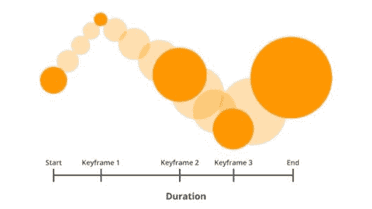

# 在 CSS 中实现动画你所需要知道的

> 原文：<https://www.edureka.co/blog/animations-in-css/>

CSS 是使网页具有交互性的最强大的方法之一。它改变了我们基本的 HTML 网页的外观和感觉。CSS 提供的一个重要且令人兴奋的特性是它让我们可以制作动画。它允许我们在页面中移动元素。让我们按照以下顺序开始我们的 CSS 动画之旅:

*   [CSS 中的动画](#animation)
*   [CSS 中的关键帧](#keyframes)
*   [动画属性](#properties)

## **CSS 中的动画**

在我们的网站上添加动画是吸引用户注意力的好方法。它不仅增加了我们页面的价值，也丰富了用户体验。CSS 中的动画建立在两个部分之上。他们是

*   **关键帧**
*   **动画**

所有浏览器都支持 CSS 动画。然而，一些旧的浏览器，如 Safari(直到 8.0 版)需要前缀(-webkit-)来解释动画属性。例如:

```
<html>
<head>
<style>
.anim {
height: 200px;
width: 200px;
background: lightblue;
position: relative;
border-radius: 100%;
-webkit-animation-name: cssanim; /* old browsers */
-webkit-animation-duration: 5s; /* old browsers */
animation-name: cssanim;
animation-duration: 5s;
}
/* old browsers */
@-webkit-keyframes cssanim {
0% {left: 0px;}
100% {left: 300px;}
}
@keyframes cssanim {
0% {left: 0px;}
100% {left: 300px;}
}
</style>
</head>
<body>
<div class="anim"></div>
</body>
</html>
```

我们可以使用上面的示例 html 页面，替换 style 标签中的 CSS 代码，尝试更多的例子。

## **CSS 中的关键帧**

这是 CSS 中动画的构建块。它用来定义我们网页上动画的特定时刻和风格。换句话说，当我们在 CSS 中指定@keyframes 时，它会获得控制权，将当前状态修改为新状态，或者在一定时间内将对象动画化。今天就来看看这个[全栈开发课程](https://www.edureka.co/masters-program/full-stack-developer-training)，了解更多关于 CSS 的知识。



@关键帧需要具有某些属性来控制动画，例如动画的名称、阶段和属性。

*   **名称**–每个动画都需要一个名称来描述其行为。

*   **阶段**——阶段代表一部动画的完成。可以用“到”和“从”关键字或百分比来表示，而 0%表示动画的开始状态，100%表示结束状态。使用百分比表示的好处是，我们可以在中间定义多个中间阶段，即动画在 50%阶段或 75%阶段的行为。

*   **属性**–这些属性让我们可以控制@关键帧，在动画过程中操纵它们。

```

.anim {
height: 200px;
width: 200px;
background: lightblue;
position: relative;
border-radius: 100%;
animation-name: cssanim;
animation-duration: 5s;
}

@keyframes cssanim {
0% {
transform: scale(0.5);
opacity: 0;
}
50% {
transform: scale(1.5);
opacity: 1;
}
100% {
transform: scale(1);
}
}

```

既然我们已经清楚了关键帧的定义。让我们探索动画属性，来描述如何使我们的元素和对象动画化。继承和初始这两个属性可以用于所有的动画类型。这些属性通常与 div 标签一起使用，以展示不同的行为。

*   **initial:** 将该属性设置为默认值。

*   **inherit:** 从其父元素继承该属性。

## **动画属性**

*   **动画名称**

它指定动画的名称，在@关键帧中使用来操纵。 可能的值有:

*   **名称:**指定绑定到动画关键帧的名称。
*   **无:**这是默认值，可用于覆盖继承或层叠动画。

**语法:**

` animation-name: name | none | initial | inherit;`

```
.anim {
height: 200px;
width: 200px;
background: lightblue;
position: relative;
border-radius: 100%;
animation-name: cssanim;
animation-duration: 5s;
}
@keyframes cssanim {
0% {left: 0px;}
100% {left: 300px;}
}
```

*   **动画时长**

它指定了动画完成一次执行所需的时间。它以秒或毫秒来定义(例如，4 秒或 400 毫秒)。该属性的默认值为 0s，因此如果未指定该属性，则不会播放动画。

**语法:**

`animation-duration: time; `

```

.anim {
height: 200px;
width: 200px;
background: blue;
position: relative;
border-radius: 100%;
animation-name: cssanim;
animation-duration: 4s;
}

@keyframes cssanim {
0% {
transform: scale(0.4);
opacity: 0;
}
50% {
transform: scale(1.4);
opacity: 1;
}
100% {
transform: scale(1);
}
}

```

*   **动画-延迟**

动画延迟属性允许我们指定动画的延迟。它定义了动画序列何时开始执行。

这个属性的值可以用秒或毫秒来声明。它可以包含正值和负值。正值表示动画将在指定时间过后开始，在此之前它将保持未动画状态。另一方面，负值会立即从该点开始播放动画，就好像它已经执行了指定的时间帧一样。

**语法:**

`animation-delay: time;`

```
.anim {
height: 200px;
width: 200px;
background: lightblue;
position: relative;
border-radius: 100%;
animation-name: cssanim;
animation-duration: 4s;
animation-delay: 4s;
}
@keyframes cssanim {
0% {left: 0px;}
100% {left: 250px;}
}
```

*   **动画-迭代-计数**

该属性表示一个动画序列应该播放的次数。该属性的默认值为 1。 可能的值有:

*   **数字**–表示迭代次数
*   **无限**–表示动画应该永远重复

**语法:**

`animation-iteration-count: number | infinite;`

```
.anim {
height: 200px;
width: 200px;
background: lightblue;
position: relative;
border-radius: 100%;
animation-name: cssanim;
animation-duration: 2s;
animation-iteration-count: 4;
}
@keyframes cssanim {
0% {left: 0px;}
100% {left: 100px;}
}
```

*   **动画方向**

它定义了动画的方向。元素的方向可以设置为向前、向后或交替循环播放。 该属性的默认值为 normal，在每个周期都会重置。 可能的值有:

*   **正常**–这是默认行为，动画向前播放。每次循环后，动画回到初始状态，并再次向前播放

*   **反向**–动画反向播放。在每个循环之后，动画到达其结束状态并向后播放

*   **交替**–动画的方向相反，即在每个循环中先向前播放，然后向后播放。每个奇数周期渲染向前动画，每个偶数周期渲染向后运动。

*   **交替-反转**–动画的方向交替反转。在这里，动画在每个循环中首先向后播放，然后向前播放。每个奇数周期反向或向后移动，每个偶数周期渲染向前动画。

**语法:**

`animation-direction: normal | reverse | alternate | alternate-reverse;`

```
.anim {
height: 200px;
width: 200px;
background: lightblue;
position: relative;
border-radius: 100%;
animation-name: cssanim;
animation-duration: 2s;
animation-iteration-count: infinite;
}
@keyframes cssanim {
0% {left: 0px;}
100% {left: 100px;}
}
```

*   **动画-计时-功能**

该属性决定了动画的速度曲线或运动风格。它的任务是将动画风格从一种形式平滑地转换为另一种形式。如果没有指定值，则默认为 ease。 动画-计时-功能的可能值有:

*   –这是该属性的默认值。这里动画开始很慢，中间逐渐变快，然后又慢慢结束。

*   **线性**–动画在整个循环中保持相同的速度，即从开始到结束。

*   –动画缓慢开始。

*   ——动画慢慢结束。

*   **【渐出】**–动画在开始和结束时缓慢移动。

*   **【n，n，n，n】**三次贝塞尔曲线——这一高级功能允许我们通过定义自己的值来创建自定义计时函数。可能的值范围从 0 到 1。

**语法:**

`animation-timing-function : linear | ease | ease-out | ease-in | ease-in-out | cubic-bezier(n,n,n,n) ;`

```
.anim {
height: 200px;
width: 200px;
background: lightblue;
position: relative;
border-radius: 100%;
animation-name: cssanim;
animation-duration: 2s;
animation-direction: reverse;
}
@keyframes cssanim {
0% {background: orange; left: 0px;}
50% {background: yellow; left: 200px; top: 200px;}
100% {background: blue; left: 100px;}
}
```

*   **动画填充模式**

这是一个特殊属性，因为它决定了播放动画之前或之后的动画风格。 默认情况下，元素的样式不受动画开始前或结束后的影响。该属性非常有用，因为它有助于覆盖动画的默认行为。 以下是动画填充模式属性的可能值:

*   **none**–这是属性的默认值，即动画样式不会应用于元素，无论是在动画之前还是之后。

*   –样式由最终动画序列中的元素保留，即在动画完成后。

*   **向后**–样式由初始动画序列中的元素保留，即在动画开始之前，特别是在动画延迟期间。

*   **两个**–这表示动画将沿两个方向移动，即向前和向后

**语法:**

`animation-fill-mode: none | forwards | backwards | both;`

```

.anim {
width: 50px;
height: 50px;
background: lightblue;
color: white;
font-weight: bold;
position: relative;
animation-name: cssanim;
animation-duration: 5s;
animation-iteration-count: infinite;
border-radius: 100%
}

#anim1 {animation-timing-function: ease;}
#anim2 {animation-timing-function: linear;}
#anim3 {animation-timing-function: ease-in;}
#anim4 {animation-timing-function: ease-out;}
#anim5 {animation-timing-function: ease-in-out;}

@keyframes cssanim {
from {left: 0px;}
to {left: 400px;}
}

```

*   **动画播放状态**

该属性指定一个动画处于播放或暂停状态。此外，当动画从暂停状态恢复时，它会从离开的地方开始播放。 可能的值有:

*   **播放**——渲染运行中的动画
*   **暂停**–在暂停状态下渲染动画。

**语法:**

`animation-play-state: paused | playing;`

```

.anim {
width: 100px;
height: 100px;
background: lightblue;
position: relative;
animation-name: cssanim;
animation-duration: 3s;
animation-delay: 2s;
animation-fill-mode: backwards;
border-radius: 100%;
}

@keyframes cssanim {
0% {top: 0px; background-color: orange;}
50% {top: 0px; background-color: green;}
100% {top: 100px;background-color: blue; }
}

```

*   **动画**

这就是所谓的动画速记属性。它用于更干净的代码。一旦我们习惯了所有的动画属性，建议我们使用动画简写来更快地编码并在一行中定义所有的属性。

**语法:**

动画:[animation-name]|[animation-duration]|[animation-timing-function]||[animation-delay]|[animation-iteration-count]|[animation-direction]|||[animation-fill-mode]|[animation-play-state]；

我们上面使用不同动画属性展示的所有动画效果都可以通过使用简写的 动画 属性来获得。

```
.anim {
height: 200px;
width: 200px;
background: lightblue;
position: relative;
border-radius: 100%;
animation-name: cssanim;
animation-duration: 2s;
animation-direction: normal;
animation-play-state: paused;
}
@keyframes cssanim {
0% {background: orange; top: 0px;}
50% {background: yellow; left: 200px; top: 200px;}
100% {background: blue; left: 100px;}
}
```

这包括了所有可以在 CSS 中使用的动画属性。我们应该尝试这些属性的不同变体，以获得更清晰的图像。当我们感到舒适时，动画速记属性可以对编写更干净、更快的代码有很大的帮助。这是 web 开发人员在 CSS 中需要学习的重要技能之一。因为我们更倾向于关注移动的物体，而不是静止的，动画可以帮助我们实现这一点，并开发出优秀的网页。

*查看我们的  [全栈 Web 开发人员硕士课程](https://www.edureka.co/masters-program/full-stack-developer-training) ，该课程包含讲师指导的现场培训和真实项目体验。本培训使您精通使用后端和前端 web 技术的技能。它包括关于 Web 开发、jQuery、Angular、NodeJS、ExpressJS 和 MongoDB 的培训。*

有问题要问我们吗？请在“CSS 中的动画”博客的评论部分提到它，我们会给你回复。