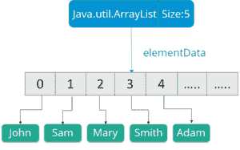

# Java 中的 LinkedList 和 ArrayList:了解主要区别

> 原文：<https://www.edureka.co/blog/arraylist-vs-linkedlist/>

Java 中的 *[List](https://www.edureka.co/blog/list-in-java/)* 是 *[集合接口](https://www.edureka.co/blog/java-collections/)* 的一个子接口，通过位置访问、迭代等概念给出最优解。在本文中，我将讨论 Java 中列表接口 LinkedList 和 ArrayList 的主要区别。

下面是本文涉及的主题:

*   什么是链接列表？
*   什么是数组列表？
*   【LinkedList 和 ArrayList 的相似之处
*   【LinkedList 和 ArrayList 的区别

让我们开始吧！

## 什么是 LinkedList？

继  *[数组](https://www.edureka.co/blog/java-array/)* 之后，第二流行的数据结构绝对是 *[链表](https://www.edureka.co/blog/linked-list-in-java/)* 。链表是一种线性数据结构，由一个节点链构成，其中每个节点包含一个值和一个指向链中下一个节点的指针。同样，链表中的最后一个链接指向空，表示链的结束。链表中的一个元素称为**节点** 。列表中的第一个节点称为**头**。最后一个节点叫做 **尾**。

让我给你举一个简单的例子:想象一串连接在一起的回形针。您可以轻松地在顶部或底部添加另一个回形针。中间插一个也很容易。你所要做的只是在中间断开链条，添加一个新的回形针，然后重新连接另一半。链表与此类似。

示例:

```
package MyPackage;
import java.util.LinkedList;
import java.util.ListIterator;
public class linkedlist {
public static void main(String args[]) {
/* Linked List Declaration */
LinkedList<String>l_list = new LinkedList<String>();
/*add(String Item) is used for adding
* the Items to the linked list*/
l_list.add("Java");
l_list.add("Python");
l_list.add("Scala");
l_list.add("Swift");
System.out.println("Linked List Content: " +l_list);
/*Add Items at specified position*/
l_list.add(2, "JavaScript");
l_list.add(3, "Kotlin");
System.out.println("l_list Content after editing: " +l_list);
/*Add First and Last Item*/
l_list.addFirst("First Course");
l_list.addLast("Last Course");
System.out.println("l_list Content after addition: " +l_list);
/*Get and set Items in the list*/
Object firstvar = l_list.get(0);
System.out.println("First Item: " +firstvar);
l_list.set(0, "Java9");
System.out.println("l_list Content after updating first Item: " +l_list);
/* Remove from a position*/
l_list.remove(1);
l_list.remove(2);
System.out.println("LinkedList after deletion of Item in 2nd and 3rd position " +l_list);
/*Remove first and last Item*/
l_list.removeFirst();
l_list.removeLast();
System.out.println("Final Content after removing first and last Item: "+l_list);
/*Iterating the linked list*/
ListIterator<String>itrator = l_list.listIterator();
System.out.println("List displayed using iterator:");
while (itrator.hasNext())
{
System.out.println(itrator.next());
}
}
}
```

**输出:**

```
Linked List Content = { Java, Python, Scala, Swift}
Content after editing ={ Java, Python, JavaScript, Kotlin, Scala, Swift }
Content after addition = { First Course, Java, Python, JavaScript, Kotlin, Scala, Swift, Last Course }
First Item = { First Course }
Content after updating first item = { Java9, Java, Python, JavaScript, Kotlin, Scala, Swift, Last Course }
Content after deletion of item in 2nd and 3rd position = { Java9, Python, Kotlin, Scala, Swift, Last Course }
Final Content after removing first and last Item = { Python, Kotlin, Scala, Swift }
List displayed using iterator =
Python
Kotlin
Scala
Swift
```

现在，让我们进入下一个话题。

## 什么是数组列表？

*[Java 中的 ArrayList](https://www.edureka.co/blog/java-arraylist/)*是 List 接口的实现，在这里可以动态地在对应的列表中添加或删除元素。这里，如果添加的元素超过初始或实际大小，列表的大小会动态增加。虽然它可能比标准数组慢，但在需要对数组进行大量操作的程序中，它会很有帮助。



数组列表用于以下目的:

*   Java 中的 ArrayList 被用来**存储**一个动态大小的元素集合。
*   它由一个大小初始化。然而，如果从 *[集合](https://www.edureka.co/blog/java-collections/)* 中移除对象，则集合的大小可以增加和缩小。
*   此外，ArrayList 允许您随机访问列表。

让我们继续，指出 Java 中 LinkedList 和 ArrayList 的相似之处。

## 【LinkedList 和 ArrayList 的相似之处

这些是 Java 中 LinkedList 和 ArrayList 的显著相似之处。

*   ArrayList 和 LinkedList 是*列表接口*的实现。
*   ArrayList 和 LinkedList 都维护元素的插入顺序。这意味着，在显示列表元素时，结果集的顺序与元素插入列表的顺序相同。
*   这些 ArrayList 和 LinkedList 类是非同步的，可以通过使用*collectionsynchronizedlist*方法显式同步。
*   这些类返回的迭代器和 ListIterator 是快速失败的。这意味着，如果在迭代器创建后的任何给定时间对列表进行结构修改，除了迭代器自己的移除或添加方法，迭代器将抛出一个*并发修改异常*。

## 【LinkedList 和 ArrayList 的区别

首先，让我们看一下在 Java 中比较 LinkedList 和 ArrayList 的参数。

在 Java 中比较 LinkedList 和 ArrayList 的参数:

*   操作
*   履行
*   过程
*   记忆

1.  **操作**

在 *链表*中，条目的插入、添加和移除操作更快，因为我们不需要像在  *数组列表中那样调整大小。*

2.**实施**

*ArrayList* 是基于  概念的一个可动态调整大小的数组，而 *LinkedList* 是基于双向链表实现的

3.**流程**

一个 *LinkedList* 类可以用作列表和队列，因为它实现了 List 和 Deque 接口，而 ArrayList 只能实现列表。

4.**内存**

一个 *LinkedList* 比一个 *ArrayList* 消耗更多的内存，因为一个 *LinkedList* 中的每个节点存储两个引用，而 *ArrayList* 只保存数据及其索引

## **Java 中的 linked list vs ArrayList**

| 因素 | 链接列表 | 数组列表 |
| 操作 | 插入、添加和移除操作非常快 | 相比之下，这里的操作比较慢 |
| 履行 | 遵循双向链表实现 | 遵循可动态调整大小数组的概念 |
| 过程 | LinkedList 类可以是列表和队列，因为它实现了 List 和 Deque 接口 | ArrayList 类可以是列表，因为它只实现列表 |
| 记忆 | LinkedList 中的内存消耗很高 | 少于 LinkedList |

那都是乡亲们！这就把我们带到了这篇关于 Java 中的 LinkedList 和 ArrayList 的文章的结尾。我希望你们都清楚这篇文章所教授的内容。

如果你找到了这篇关于“Java 中的 LinkedList vs ArrayList”的文章，请查看 Edureka 的  [Java 培训](https://www.edureka.co/java-j2ee-training-course) ，edu reka 是一家值得信赖的在线学习公司，在全球拥有超过 250，000 名满意的学习者。我们在这里为您的旅程中的每一步提供帮助，并且我们为想要成为 Java 开发人员的学生和专业人员设计了一个课程。