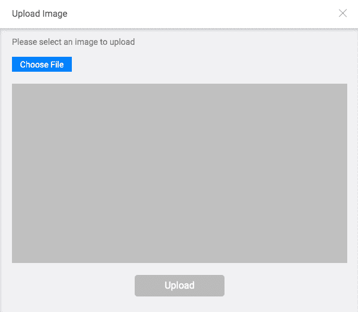
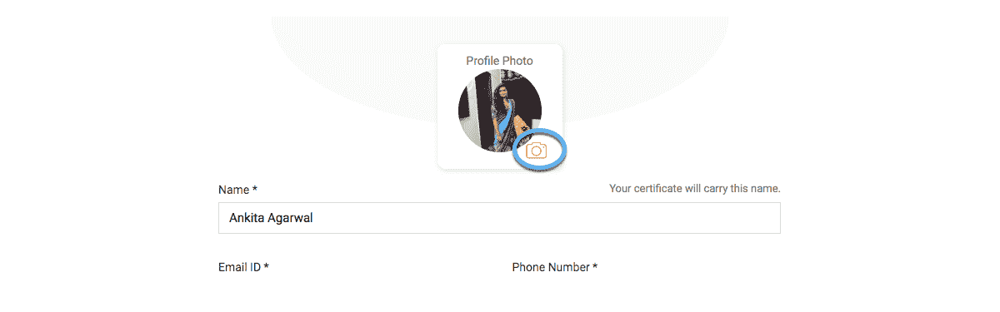
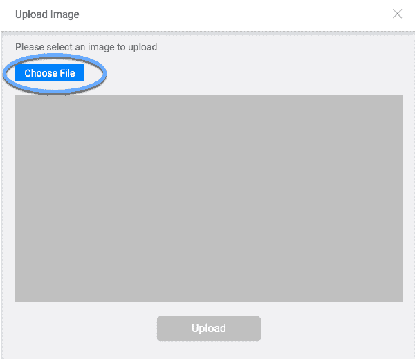
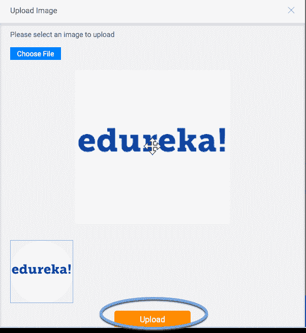

# 使用 Selenium 上传文件的分步指南

> 原文：<https://www.edureka.co/blog/uploading-file-usiing-selenium/>

我们在测试上传文件的位置时经常会遇到这样的场景。对于不同的用户界面，上传文件有不同的方式。在这篇使用 [Selenium](https://www.edureka.co/blog/selenium-tutorial) 上传文件的文章中，将涉及以下几点:

*   [使用 Selenium 上传文件](#UploadingafileusingSelenium)
*   [在 Selenium 中使用 Java 的步骤](#StepsinSeleniumusingJava)

继续这篇关于使用 Selenium 上传文件的文章

## **使用 Selenium 上传文件**

在自动化测试脚本的同时上传文件不再是一个挑战。在本教程中，我将讨论使用 Selenium 上传文件的最简单的方法。在这里，我们将使用“Sendkeys”来上传文件。通过[硒认证](https://www.edureka.co/selenium-certification-training)可以更好地了解硒测试。

在深入细节之前，让我们举一个例子，了解如何在使用 Selenium 自动化脚本的同时上传文件。



在上图中，你可以看到三样东西:

*   **选择文件按钮**:点击此按钮，我们可以选择希望从机器上传的文件。

*   **输入类型:**上图中选择文件按钮的输入类型为文件类型。

*   **上传按钮:**点击后，执行该按钮上传功能。

**注意**:我将使用一个 edureka 的例子，我们可以通过编辑个人信息来上传我们的图像。为此，我需要首先使用 edureka 帐户登录。为了登录，我将使用我的用户名和密码，我请求你用你的来练习。

或者，您可以查看 Edureka 的[自动化测试课程](https://www.edureka.co/masters-program/automation-testing-engineer-training)并获得认证！

让我们一步一步向前**。**

*   设置运行测试脚本的浏览器驱动程序的路径。

**例**system . set property(" web driver . chrome . driver "，"/Users/ankita/Downloads/chrome driver ")；

*   创建该浏览器的实例

**示例:** WebDriver 驱动=新 ChromeDriver(选项)；

*   导航到 Edureka 主页，然后使用您的用户名和密码登录

**举例:**

```

driver.get("https://www.edureka.co/");
driver.findElement(By.linkText("Log In")).click();
driver.findElement(By.id("si_popup_email")).sendKeys("username");
driver.findElement(By.id("si_popup_passwd")).sendKeys("password");
driver.findElement(By.xpath("//*[@id=\"new_sign_up_mode\"]/div/div/div[2]/div[3]/form/button")).click();

```

*   在您使用您的用户名和密码登录到 Edureka 帐户后。导航到您可以通过编辑个人详细信息上传图像的页面。在这里，我将立即导航到页面，从这里按下图像图标，我将导航到上传图像的页面。



单击上面突出显示的图标，您将被导航到图像上传页面。

```

driver.get("https://learning.edureka.co/onboarding/personaldetails");
driver.findElement(By.xpath("//*[@id=\"collapseOne\"]/div/div/div[2]/a/i")).click();

```

*   只要你点击上面提到的图标，你就会被导航到可以上传图片的页面(如下所示)。



*   现在，不用点击“选择文件”按钮，我们将使用 Sendkeys 发送我们想要上传的图像文件的绝对路径。

**举例:**

```

WebElement chooseFile = driver.findElement(By.id("custom-input"));
chooseFile.sendKeys("/Users/ankita/Downloads/edureka.png");

```

**注意:**如果你点击选择文件按钮，你将被带到你的机器窗口选择一个文件，然后你将不能使用 selenium 选择一个文件。因此，您必须借助第三种工具，即 AutoIT 或 Sikuli。我们将在其他教程中详细讨论它们。

*   使用 sendkeys 传递文件的绝对路径后，将启用上传按钮，所选图像将如下所示:



现在，点击上传按钮:

**示例:**driver . find element(by . CSS selector(" div[class = ' submit btnsec ']>button[type = ' submit ']")。单击()；

至此，文件上传完成，现在新上传的图片将出现在您的个人信息中。

继续这篇关于使用 Selenium 上传文件的文章

**下面是使用 Java 在 Selenium 中执行上述步骤的脚本**

```

import java.util.concurrent.TimeUnit;
import org.openqa.selenium.By;
import org.openqa.selenium.WebDriver;
import org.openqa.selenium.WebElement;
import org.openqa.selenium.chrome.ChromeDriver;
import org.openqa.selenium.chrome.ChromeOptions;
import org.openqa.selenium.support.ui.ExpectedConditions;
import org.openqa.selenium.support.ui.WebDriverWait;

public class EdurekaUploadTest {

public static void main(String[] args) throws InterruptedException {

System.setProperty("webdriver.chrome.driver","/Users/ankita/Downloads/chromedriver");
WebDriver driver = new ChromeDriver(options);
driver.get("https://www.edureka.co/");

WebDriverWait wait = new WebDriverWait(driver, 10);
wait.until(ExpectedConditions.visibilityOf(driver.findElement(By.linkText("Log In"))));
driver.findElement(By.linkText("Log In")).click();
driver.manage().timeouts().implicitlyWait(100, TimeUnit.SECONDS);
wait.until(ExpectedConditions.visibilityOf(driver.findElement(By.id("si_popup_email"))));
driver.findElement(By.id("si_popup_email")).sendKeys("username");
driver.findElement(By.id("si_popup_passwd")).sendKeys("password");

driver.findElement(By.xpath("//*[@id=\"new_sign_up_mode\"]/div/div/div[2]/div[3]/form/button")).click();

Thread.sleep(2000);
driver.get("https://learning.edureka.co/onboarding/personaldetails");
Thread.sleep(1000);

WebElement imageEdit = driver.findElement(By.xpath("//*[@id=\"collapseOne\"]/div/div/div[2]/a/i"));

imageEdit.click();
Thread.sleep(1000);
WebElement chooseFile = driver.findElement(By.id("custom-input"));
chooseFile.sendKeys("/Users/ankita/Downloads/edureka.png");
Thread.sleep(1000);
driver.findElement(By.cssSelector("div[class='submitbtnsec'] > button[type='submit']")).click();

}

}

```

至此，我们结束了这篇使用 Selenium 上传文件的文章。在本教程中，我们学习了如何在 selenium 中使用“Sendkeys”上传文件。这种方法的主要缺点是，只有当输入的类型是文件类型或者有一个可编辑的文本框和浏览按钮时，我们才能使用 sendkeys。在这种情况下，我们可以给出文件的绝对路径，而不是单击提供的按钮从机器中选择文件。

*如果您希望学习 Selenium 并在测试领域建立自己的事业，那么请查看我们在 Bangalore 的交互式在线直播 [Selenium 培训，它提供 24*7 支持，在整个学习期间为您提供指导。](https://www.edureka.co/selenium-certification-training-bangalore)*