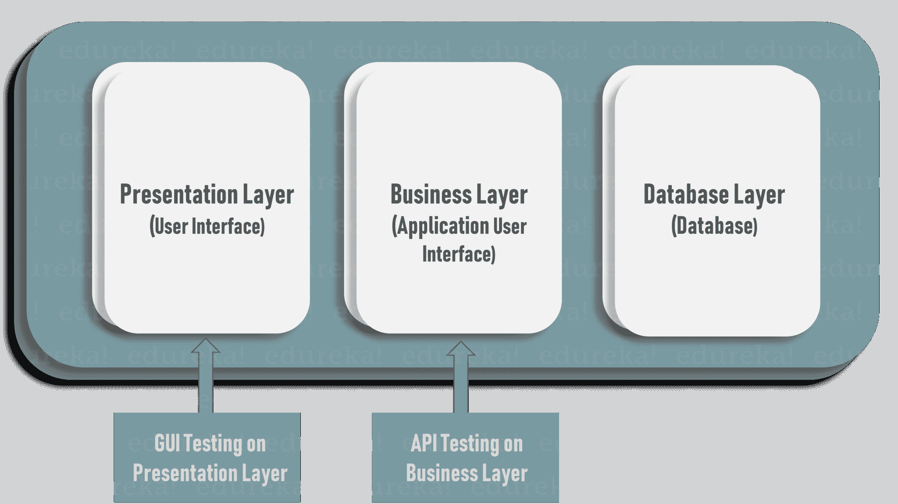
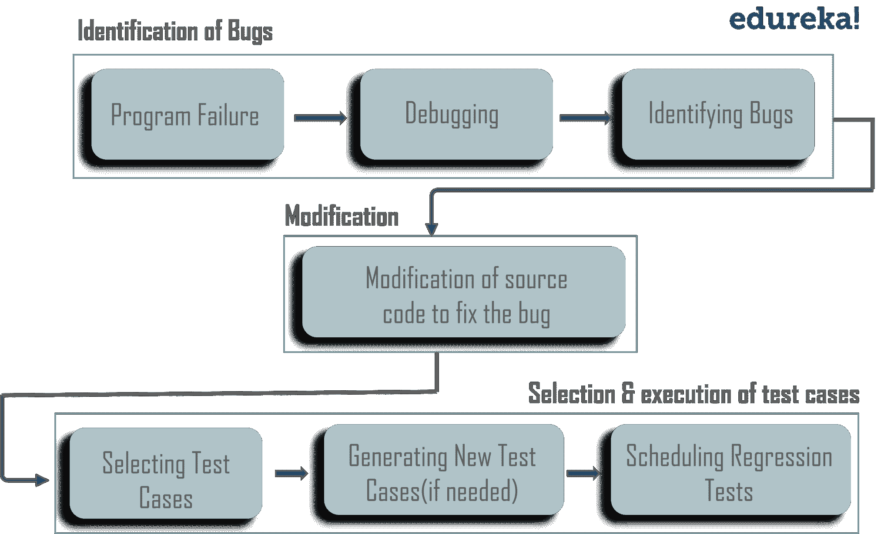
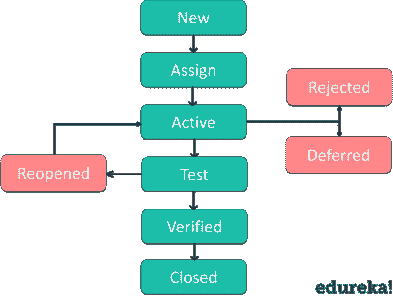

# 2023 年你需要知道的 50 大手工测试面试问题

> 原文：<https://www.edureka.co/blog/interview-questions/manual-testing-interview-questions/>

在这个竞争激烈的世界里，测试对于任何软件产品的成功都是至关重要的。 [手动测试](https://www.edureka.co/blog/what-is-manual-testing/)在软件开发中起着举足轻重的作用，当你无法使用自动化测试时，手动测试就派上了用场。因此，仍然需要大量拥有与手工测试相关技能的人。这篇手工测试面试问题的文章是你掌握软件测试的完美指南。

让我们先来看看最常被问到的人工测试面试问题。

Q1\. [How does quality control differ from quality assurance?](#q8)Q2\. [What is Software Testing?](#q1)Q3\. [Why is Software Testing Required?](#q2)Q4\. [What are the two main categories of software testing?](#q3)Q5\. [What is quality control?](#q4)Q6\. [What different types of manual testing are there?](#q5)Q7\. [Explain the difference between alpha testing and beta testing.](#q6)Q8\. [What are the different levels of manual testing?](#q7)Q9\. [What is a testbed in manual testing?](#q9)Q10\. [Explain the procedure for manual testing?](#q10)

为了更好的理解，面试问题分为以下几个部分:

*   [基础手工测试面试问题](#basic)
*   [高级水平手工测试面试题](#advanced)
*   [基于真实世界的人工测试面试问题](#real-world)

## **基础手工测试面试问题**

### **Q1。质量控制和质量保证有什么不同？**

<caption>**Quality Control vs Quality Assurance**</caption>
| **质量控制** | **质量保证** |
| 质量控制是一种面向产品的方法，它运行一个程序来确定它是否有任何缺陷，以及确保软件满足利益相关者提出的所有需求。 | 质量保证是一种面向过程的方法,其重点是确保用于创建质量可交付成果的方法、技术和过程得到正确应用。 |

### **Q2。什么是软件测试？**

[*软件测试*](https://www.edureka.co/blog/software-testing-tutorial/#IntroductiontoSoftwareTesting) 是用来识别所开发软件的正确性、完整性和质量的过程。它包括一系列发现软件错误的活动，以便在产品投放市场之前纠正错误。

### **Q3。为什么需要软件测试？**

软件测试是一个强制性的过程，它保证软件产品是安全的，并且足够好，可以发布到市场上。这里有一些令人信服的理由来证明测试是必要的:

*   它指出了在[开发阶段出现的缺陷和错误。](https://www.edureka.co/blog/software-testing-tutorial/#SoftwareDevelopmentLifeCycle)
*   通过在开发的初始阶段识别问题来减少编码周期。
*   确保软件应用 需要更低的维护成本，并产生更准确、一致和可靠的结果。
*   测试确保客户发现组织是可靠的，并保持他们对应用程序的满意度。
*   确保软件没有错误，产品质量符合市场标准。
*   确保应用程序不会导致任何故障。

### **Q4。软件测试的两个主要类别是什么？**

软件测试是一个巨大的领域，但它可以大致分为两个领域，例如:

*   ——这是最古老的软件测试类型，测试人员在不使用任何测试自动化工具的情况下手动执行测试用例。这意味着软件应用程序是由 QA 测试人员手工测试的。
*   [**自动化测试**](https://www.edureka.co/blog/automation-testing-tutorial/)——这是利用工具、脚本和软件的辅助，通过重复预定义的动作来执行测试用例的过程。测试自动化关注于用提高效率的系统或设备代替人工活动。

获得自动化测试认证参加 [Selenium 在线培训](https://www.edureka.co/selenium-certification-training)。

### **Q5** 。**什么是质量控制？类似于质量保证吗？**

质量控制是一种面向产品的方法，它运行一个程序来确定它是否有任何缺陷，以及确保软件满足利益相关者提出的所有需求。

### **Q6。有哪些不同类型的手动测试？**

不同类型的手动测试有:

### **Q7。解释 alpha 测试和 beta 测试的区别。**

*   阿尔法测试(Alpha Testing)–It是一种软件测试，在将产品发布给真实用户或公众之前，进行这种测试是为了识别缺陷。Alpha 测试是一种用户验收测试。
*   测试测试由软件应用程序的真实用户在真实环境中进行。Beta 测试也是一种用户接受度测试。

### **Q8。手动测试有哪些不同的级别？**

四个级别的手动测试是:

*   [**单元测试**](https://www.edureka.co/blog/what-is-unit-testing)——这是一种测试被称为**单元**的最小代码片段的方法，该单元可以在系统中进行逻辑隔离。它主要关注独立模块的功能正确性。
*   [**集成测试**](https://www.edureka.co/blog/what-is-integration-testing-a-simple-guide-on-how-to-perform-integration-testing/)–这是一个软件测试的级别，其中将单个单元组合起来进行测试，以验证它们在集成时是否如预期那样工作。这里的主要目的是测试模块之间的接口。
*   **系统测试**–在系统测试中，软件的所有组件作为一个整体进行测试，以确保整个产品符合规定的要求。系统测试有几十种类型，包括可用性测试、回归测试和功能测试。

**用户验收测试**–最后一级，验收测试，或 UAT(用户验收测试)，决定软件是否可以发布。

### **Q9。手动测试中的测试床是什么？**

测试床是为测试而配置的环境。它是用于测试应用程序的环境，包括硬件以及运行待测试程序所需的任何软件。它包括硬件、软件、网络配置、测试中的应用程序以及其他相关软件。

### **Q10。解释手动测试的程序？**

手动测试过程包括以下步骤:

*   规划和控制
*   分析和设计
*   实施和执行
*   评估退出标准和报告
*   测试结束活动

### **Q11。测试用例是什么？**

[**测试用例**](https://www.edureka.co/blog/test-case-in-software-testing/) 是一个文档，它具有一组在软件应用上执行的条件或动作，以便验证特性的预期功能。

测试用例描述了一个要测试的具体想法，没有详细说明要采取的具体步骤或要使用的数据。例如，在一个测试用例中，您记录类似于“ ***测试优惠券是否可以应用于实际价格*** ”的东西。

### **Q12。什么是 API 测试？**

[API 测试](https://www.edureka.co/blog/what-is-api-testing)是一种软件测试，测试应用编程接口(API)以确定它们是否满足功能、可靠性、性能和安全性的预期。简单来说，API 测试旨在揭示 bug、不一致或与 API 预期行为的偏差。

通常，应用程序有三个独立的层:

*   表示层或用户界面
*   用于业务逻辑处理的业务层或应用用户界面
*   用于建模和操作数据的数据库层

API 测试是在软件架构最关键的一层，业务层进行的。

### **Q13。测试中验证和确认有什么区别？**

| **验证** | **验证** |
| 这是一种静态分析技术。这里，测试是在不执行代码的情况下完成的。示例包括–评审、检查和演练。 | 这是一种动态分析技术，通过执行代码来进行测试。例子包括功能和非功能测试技术。 |

### **Q14。bug 和缺陷有什么区别？**

一个 [bug](https://www.edureka.co/blog/bugs-in-software-testing/#softwaretestingbugs) 是在测试期间检测到的软件中的一个正当的错误。缺陷是预期结果和实际结果之间的差异，由开发人员在产品上线后发现。

### **Q15。手工测试的优势是什么？**

手动测试的优点是:

*   与自动化测试相比，这是一种更便宜的测试方式
*   从最终用户的角度对产品进行分析只有通过人工测试才有可能
*   在人工测试的帮助下，GUI 测试可以更准确地完成,因为视觉可访问性和偏好很难自动化
*   东方为刚进入测试的新员工学习
*   当测试脚本不会被重复和重复使用数千次时，它非常适合于短期项目
*   最适合当项目处于开发的早期阶段时
*   高度可靠，因为自动化测试可能包含错误和遗漏的 bug

### **Q16。手工测试的弊端是什么？**

手动测试的缺点是:

*   极易出现人为错误，风险很大
*   像负载测试和性能测试这样的测试类型是无法手动完成的
*   如果回归测试是手工完成的，那么它们真的很耗时
*   与自动化测试相比，手动测试的范围非常有限
*   不适合非常大的组织和有时间限制的项目
*   成本增加了，所以，从长远来看，手动测试的成本更高

### **Q17** 。**文档在手动测试中有什么作用？**

文档在实现有效的 [软件测试](https://www.edureka.co/testing-with-selenium-webdriver) 中起着至关重要的作用。需求规格、设计、业务规则、检查报告、配置、代码变更、测试计划、测试用例、错误报告、用户手册等细节。都应该被记录下来。

记录测试用例将有助于您评估您需要的测试工作，以及测试覆盖和跟踪需求。一些与软件测试相关的常用文档工件是:

1.  测试计划
2.  测试场景
3.  判例案件
4.  追溯矩阵

至此，我们已经完成了基于手工测试的基本问题。在这篇*手动测试面试问题文章的下一部分中，*让我们讨论与手动测试相关的高级问题。

Want to upskill yourself to get ahead in your career? Check out this video

## **2022 年要学的十大技术| Edureka**

[https://www.youtube.com/embed/M2NyXKxyUGc](https://www.youtube.com/embed/M2NyXKxyUGc)

## **高级水平手工测试面试题**

### **Q18。手工测试和自动化测试有什么区别？**

| 人工测试 | 自动化测试 |
| 在手动测试中，测试用例的准确性和可靠性很低，因为手动测试更容易出现人为错误。 | 另一方面，自动化测试更可靠，因为工具和脚本被用来执行测试。 |
| 由于人力资源执行所有任务，手动测试所需的时间很长。 | 软件工具执行测试所需的时间相对较短 |
| 人工测试的投资成本低，但投资回报(ROI)也低。 | 自动化测试的投资成本和投资回报都很高。 |
| 当测试用例运行一次或两次时，手动测试是首选。也适用于探索性、可用性和临时测试。 | 您可以使用测试自动化进行回归测试、性能测试、负载测试或高度可重复的功能测试用例 |
| 允许人工观察，找出任何故障。因此，手动测试有助于改善客户体验。 | 由于不涉及人工观察，因此无法保证积极的客户体验。 |

或者，您可以查看 Edureka 的[自动化工程师课程](https://www.edureka.co/masters-program/automation-testing-engineer-training)并获得认证！

### **Q19。什么时候你应该选择手动测试而不是自动化测试？**

有很多情况下，手工测试比自动化测试更适合，比如:

*   **短期项目:**自动化测试旨在节省时间和资源，然而设计和维护它们需要时间和资源。例如，如果你正在建立一个小型的推广网站，依靠手工测试会更有效率。
*   **临时测试:**在临时测试中，没有特定的方法。特别测试是一种完全没有计划的测试方法，测试人员的理解和洞察力是唯一重要的因素。这可以通过手工测试来实现。
*   **探索性测试:**这种类型的测试需要测试者的知识、经验、分析、逻辑技能、创造力和直觉。所以人类的参与在探索性测试中很重要。
*   可用性测试:在执行可用性测试时，测试人员需要衡量软件或产品对于最终用户来说，用户友好、高效或方便的程度。人类的观察是最重要的因素，因此人工测试听起来似乎更合适。

### **Q20。** **软件测试生命周期涉及哪些阶段？**

[软件测试生命周期](https://www.edureka.co/blog/software-testing-life-cycle/#stlc)涉及的不同阶段有:

| **阶段** | **解释** |
| **需求分析** | QA 团队根据我们将要测试的内容理解需求&找出可测试的需求。 |
| **测试计划** | 在这个阶段，测试策略被定义。目标&确定项目的范围。 |
| **测试用例开发** | 在这里，详细的测试用例被定义和开发。测试团队也为测试准备测试数据。 |
| **测试环境设置** | 它是测试团队执行测试用例的软件和硬件的设置。 |
| **测试执行** | 它是执行代码并比较预期和实际结果的过程。 |
| **测试循环结束** | 它包括 c 召集测试团队成员开会&评估基于测试覆盖、质量、成本、时间、关键业务目标和软件的周期完成标准。 |

如果您对这些手动测试面试问题有任何挑战，请在下面的部分中评论您的问题。

### **Q21。bug、缺陷和错误的区别是什么？**

**Bug**–Bug 是在测试期间发现的软件故障。它们的出现是因为一些编码错误，导致程序出现故障。它们也可能导致产品的功能问题。这些是致命错误，可能会阻塞功能、导致崩溃或导致性能瓶颈

**缺陷**–缺陷是预期结果和实际结果之间的差异，由开发人员在产品上线后发现。缺陷是应用程序投入生产后发现的错误。简而言之，它指的是软件产品、其外部行为或其内部特性的一些问题。

**错误**–错误是软件开发人员的错误、误解或误解。开发人员的类别包括软件工程师、程序员、分析师和测试人员。例如，开发人员可能会误解设计符号，或者程序员可能会错误地键入变量名，从而导致错误。软件中通常会出现错误，它会导致程序功能的改变。

### **Q22。怎样才能成为一名优秀的测试工程师？**

软件测试工程师 是一个专业人员，他决定如何创建一个过程来最好地 *测试* 软件行业中的特定产品。

*   一个好的测试工程师应该有“打破测试”的态度，能够从客户的角度出发
*   对质量的强烈渴望和对微小细节的关注
*   与开发者保持合作关系的机智和外交手段
*   与技术人员(开发人员)和非技术人员(客户、管理人员)沟通的能力
*   有软件开发行业经验的优先考虑
*   在时间有限的情况下，判断情况并做出重要决策以测试应用程序的高风险领域的能力

### **Q23。什么是回归测试？什么时候应用？**

对先前测试过的程序进行测试，以确保软件的未变更区域没有引入或发现缺陷，这种测试被称为[回归测试](https://www.edureka.co/blog/regression-testing)

回归测试是一种系统范围的测试，其主要目的是确保系统某一部分的微小变化不会破坏系统其他部分的现有功能。建议对以下事件的发生进行回归测试:

*   添加新功能时
*   变更要求时
*   当有缺陷修复时
*   出现性能问题时
*   遇环境变化
*   当有补丁修复时

### **Q24。系统测试和集成测试有什么区别？**

| **系统测试** | **集成测试** |
| 系统测试将软件应用作为一个整体进行测试，以检查系统是否符合用户要求 | 集成测试测试软件应用模块之间的接口 |
| 包括功能性和非功能性测试比如健全性、可用性、性能、压力和负载 | 仅执行功能测试，以检查两个模块组合时是否给出正确的结果 |
| 集成测试后进行的高级测试 | 是在单元测试之后进行的低级测试 |

### **Q25。解释缺陷生命周期。**

一个 **缺陷生命周期**是一个过程，在这个过程中，一个缺陷在其整个生命周期中经历不同的阶段。这个循环从发现一个缺陷开始，在确保它不会被复制后，当一个缺陷被关闭时结束。Bug 或缺陷生命周期包括下图所示的步骤。

如果你想深入了解 Bug 生命周期，那么你可以参考这篇关于  [软件测试教程](https://www.edureka.co/blog/software-testing-tutorial/)的文章。

### **Q26。什么是测试线束？**

测试工具是 软件和测试信息的集合，通过在压力、负载、数据驱动等不断变化的条件下运行程序单元，并监控其行为和输出来测试程序单元。测试线束包含两个主要部分:

–测试执行引擎–测试脚本库

### **Q27。什么是测试结束？**

测试结束是一个文档，它给出了在软件开发生命周期中进行的所有测试的总结，并给出了对已消除的错误和已发现的错误的详细分析。该备忘录包含实验总数、已执行实验总数、已发现缺陷总数、已解决缺陷总数、未解决缺陷总数、已拒绝缺陷总数等。

### **Q28。阳性检测和阴性检测有什么区别？**

| **阳性检测** | **阴性测试** |
| **阳性测试** 确定您的应用程序按预期工作。如果在阳性测试中遇到错误，测试失败 | **负面测试** 确保您的应用程序能够优雅地处理无效输入或意外的用户行为 |
| 在这个测试中，测试人员总是检查一组唯一有效的值 | 测试人员尽可能地发挥创造力，并针对无效数据验证应用程序 |

### **Q29。定义什么是关键错误。**

一个关键的错误是一个倾向于影响给定应用程序大部分功能的[错误](https://www.edureka.co/blog/bugs-in-software-testing/)。这意味着大部分功能或主要系统组件完全中断，并且没有进一步移动的变通办法。除非关键错误得到解决，否则无法将应用程序分发到最终客户端。

### **Q30。什么是农药悖论？怎么克服？**

根据*杀虫剂悖论*，i 如果相同的测试被反复重复，最终相同的测试案例将不再发现新的 bug。在测试人员发现更多缺陷的地方，开发人员会格外小心，可能不会查看其他区域。 **防止农药悖论的方法:**

*   编写一套全新的测试用例来测试软件的不同部分。
*   准备新的测试用例，并将它们添加到现有的测试用例中。

使用这些方法，有可能在缺陷数量下降的区域发现更多的缺陷。

如果您在这些手动测试面试问题上遇到任何挑战，请在下面的部分评论您的问题。

### **Q31。什么是软件测试中的缺陷级联？**

缺陷级联是在应用程序中触发其他缺陷的过程。当一个缺陷在测试中被忽视时，它会引发其他缺陷。结果，在开发的后期阶段会出现多个缺陷。如果缺陷级联继续影响应用程序中的其他特性，那么识别受影响的特性就变得很有挑战性。你可以用不同的测试用例来解决这个问题，即使这样也是困难和耗时的。

### **Q32。测试时术语“质量”是什么意思？**

一般来说，质量软件是合理的无缺陷的，按时交付并且在预算之内，满足需求和/或期望，并且是可维护的。但是“质量”又是一个主观的术语。这将取决于“客户”是谁，以及他们在事情发展过程中的整体影响力。例如，每种类型的“客户”对“质量”都有自己的偏好——会计部门可能会根据利润来定义质量，而最终用户可能会将质量定义为用户友好和无缺陷。

### **Q33。什么是黑盒测试，有哪些不同的技术？**

[黑盒测试](https://www.edureka.co/blog/software-testing-methodologies-and-techniques/#BlackBoxTechniques)，也称为基于规格的测试， 在不太了解项目内部结构/设计的情况下，分析软件/应用的功能。该测试的目的是检查系统的整体功能，以确保其正常工作并满足用户需求。各种黑盒测试技术有:

*   等价划分
*   边界值分析
*   基于决策表的技术
*   因果图
*   用例测试

### **Q34。什么是白盒测试，有哪些不同的技术？**

[白盒测试](https://www.edureka.co/blog/software-testing-methodologies-and-techniques/#WhiteBoxTechniques)也称为基于结构的测试，需要对代码有深入的了解，因为它包括对应用程序的一些结构部分的测试。该测试的目的是增强安全性，检查应用程序的输入/输出流程，并改进设计和可用性。各种白盒测试技术有:

*   报表覆盖范围
*   决策覆盖
*   条件覆盖
*   多条件覆盖

### **Q35。什么是基于经验的测试技术？**

基于经验的测试是关于发现、调查和学习的。测试人员不断地研究和分析产品，并相应地应用他的技能、特点和经验来开发测试策略和测试用例，以执行必要的测试。各种基于经验的测试技术有:

*   探索性测试
*   错误猜测

### **Q36。什么是测试中的自顶向下和自底向上方法？**

**自上而下**–测试从上到下进行。也就是说，首先测试高级模块，然后测试低级模块。最后，低级模块被合并到高级状态中，以保证框架按预期工作。

**自下而上**–测试从基础层到高层进行。首先测试最低级模块，然后测试高级状态模块。最后，高层次的状态模块被协调到低层次，以保证框架按照建议的那样填充。

### **Q37。冒烟测试和健全性测试的区别是什么？**

| **特征** | **烟雾检测** | **神智测试** |
| 

**系统构建**

 | 对软件产品的初始版本进行测试 | 测试在已经通过冒烟测试的构建上完成&轮回归测试 |
| 

**试探的动机**

 | 测量新创建的构建的稳定性，以应对更严格的测试 | 评估合理性&软件版本功能的原创性 |
| 

**的子集？**

 | 是验收测试的子集 | 是回归测试的子集 |
| 

文档

 | 涉及文档和脚本工作 | 不强调任何类型的文档 |
| 

**测试覆盖**

 | 肤浅的&广泛的方法包括所有主要功能，但不要太深入 | 狭窄的&深度方法，涉及功能和特性的详细测试 |
| 

**由谁执行？**

 | 由开发人员或测试人员执行 | 由测试人员执行 |

### **Q38。静态测试和动态测试有什么区别？**

| **静态测试** | **动态测试** |
| 静态测试是一种白盒测试技术，它包括探索记录的过程，以识别 SDLC 早期阶段的缺陷。 | 动态测试包括代码的执行过程，在软件开发生命周期的后期完成。它验证并批准具有预期结果的输出。 |
| 静态测试在验证阶段实施。 | 动态测试在验证阶段开始。 |
| 在代码部署之前进行静态测试。 | 代码部署后进行动态测试 |
| 在这种类型的测试中，程序的代码错误检测和执行并不重要。 | 动态测试需要执行代码。 |

至此，我们完成了理论问题。在这篇*人工测试面试问题文章的下一部分，*让我们讨论一些基于真实场景的问题。

## **基于真实世界的人工测试面试问题**

### **Q39。你将如何决定何时停止测试？**

决定何时停止测试可能相当困难。许多现代软件应用程序如此复杂，并且运行在如此相互依赖的环境中，以至于永远无法进行完整的测试。决定何时停止测试的一些常见因素有:

*   截止日期(发布截止日期、测试截止日期等。)
*   以一定百分比通过的测试用例完成
*   当测试预算耗尽时
*   代码或功能或需求的覆盖率达到指定点
*   错误率低于某一水平
*   当 Beta 或 alpha 测试期结束时

### **Q40。** **如果软件漏洞百出，根本无法真正测试，该怎么办？**

测试人员经常会遇到一个根本无法解决的 bug。在这种情况下，对测试人员来说，最好的办法是经历一个报告最初出现的任何 bug 或阻塞型问题的过程，重点是关键的 bug。由于这种类型的问题会导致严重的问题，如单元测试不充分或集成测试不充分、糟糕的设计、不正确的构建或发布过程等，应该通知经理并向他们提供一些文档作为问题的证据。

如果您对这些手动测试面试问题有任何挑战，请在下面的部分中评论您的问题。

### **Q41。如果需求还没有冻结，你如何测试一个产品？**

对于一件产品来说，需求栈可能是不可用的。确定一个应用程序是否有重要的意想不到的功能可能需要很大的努力，这将表明软件开发过程中更深层次的问题。 如果功能对于应用程序的目的来说不是必需的，那么它应该被删除。否则，c 基于对产品的假设创建一个测试计划。但是确保您在测试计划中很好地记录了所有的假设。

### **Q42。** **如果一个组织发展如此之快，以至于不可能有固定的测试过程，那该怎么办？在这种情况下该怎么办？**

在软件行业，这是一个非常普遍的问题，尤其是考虑到在开发产品时所采用的新技术。在这种情况下，没有简单的解决方案，您可以:；雇用优秀的技术人员；管理层应该“无情地优先考虑”质量问题，并保持对客户的关注；组织中的每个人都应该清楚“质量”对最终用户意味着什么

### **Q43。您如何知道代码符合规范？**

“好代码”是有效的、没有错误的、可读的和可维护的代码。大多数组织都有所有开发人员都应该遵守的编码“标准”,但是每个人对于什么是最好的，或者什么是太多或太少的规则都有不同的想法。有很多工具，比如 traceability matrix，可以确保需求被映射到测试用例。当所有测试用例的执行都成功完成时，就表明代码已经满足了需求。

### **Q44。什么情况下你会考虑选择自动化测试而不是手工测试？**

在下列情况下，自动化测试可以被认为优于手动测试:

*   当测试需要定期执行时
*   测试包括重复的步骤
*   测试需要在标准的运行时环境中执行
*   当您完成测试阶段的时间较少时
*   当有大量代码需要重复测试时
*   每次执行都需要报告

### **Q45。什么是“配置管理”？**

每一个高功能的组织都有一个“总体规划”,详细说明他们应该如何运作和完成任务。软件开发和测试没有什么不同。软件配置管理(SCM)是一组组织、控制、协调和跟踪的过程、策略和工具:

*   代码
*   文档
*   问题
*   变更请求
*   设计和工具
*   编译器和库

### **Q46。我们真的可以在任何阶段进行系统测试吗？**

在系统测试中，软件的所有组件都作为一个整体进行测试，以确保整个产品符合规定的要求。所以，没有。只有当所有装置都就位并正常工作时，系统测试才能开始。系统测试通常发生在 UAT(用户验收测试)之前。

### **Q47。在编写测试用例时，您应该遵循哪些最佳实践？**

在编写测试用例时，您需要遵循的几个准则是:

*   根据项目时间表和应用程序的风险因素，确定编写测试用例的优先级。
*   记住 80/20 法则。为了达到最好的覆盖率，20%的测试应该覆盖 80%的应用程序。
*   不要试图在一次尝试中测试案例，而是随着你的进展随机应变。
*   列出您的测试用例，并根据业务场景和功能对它们进行分类。
*   确保测试用例是模块化的，测试用例步骤尽可能的细化。
*   以一种其他人可以容易理解的方式编写测试用例&如果需要的话进行修改。
*   永远记住最终用户的需求，因为最终设计的软件是为客户服务的
*   积极地使用测试管理工具来管理稳定的发布周期。
*   定期监控你的测试用例。编写独特的测试用例，删除不相关的和重复的测试用例。

### **Q48。为什么边界值分析提供了好的测试用例？**

边界值分析提供良好的测试用例的原因是，通常，在测试的输入域的边界处会出现大量错误，而不是在输入域的中心。

在边界值分析技术中，测试用例被设计成包含边界值。如果输入在边界值内，则认为是“阳性测试”如果输入超出边界值，则认为是“阴性测试”它包括最大值、最小值、内边缘或外边缘、典型值或误差值。

让我们假设您正在测试一个接受从“01 到 10”的数字的输入框。

使用边界值分析，我们可以定义三类测试用例:

*   测试数据正好作为输入的输入边界的测试用例:1 和 10(在这种情况下)
*   刚好在输入属性域极端边缘下方的值:0 和 9
*   值刚好高于输入属性域极限边的测试数据:2 和 11

所以边界值是 0，1，2 和 9，10，11。

### **Q49。为什么不可能彻底测试一个程序或者 100%无 bug？**

建立一个 100%没有错误的软件产品是不可能的。你可以最小化计算机程序或系统中导致产生错误或意外结果的错误、瑕疵、失败或故障。

这里有两个主要原因使得完全测试一个程序变得不可能。

*   软件规范可能是主观的，可能会导致不同的解释。
*   一个软件程序可能需要太多的输入、输出和路径组合来测试。

### **Q50。自动化测试能代替手工测试吗？**

自动化测试不能代替手工测试。无论自动化测试有多好，你都不能自动化所有的事情。手动测试在软件开发中扮演着重要的角色，当您遇到无法使用自动化的情况时，手动测试会派上用场。自动化测试和手动测试各有优缺点。手动测试帮助我们理解整个问题，并更灵活地探索其他角度的测试。另一方面，从长远来看，自动化测试通过在短时间内完成大量的表层测试来帮助节省时间。

就这样，伙计们！“手动测试面试问题”到此结束你还可以顺便看看  **[自动化测试面试问题](https://www.edureka.co/blog/interview-questions/test-automation-interview-questions/)** 。

如果你觉得这篇文章相关，可以看看 Edureka 的 [Selenium 认证](https://www.edureka.co/selenium-certification-training)，edu reka 是一家值得信赖的在线学习公司，在全球拥有超过 250，000 名满意的学习者。

有问题吗？请在这个“人工测试面试问题”的评论部分提到它，我们会给你回复。