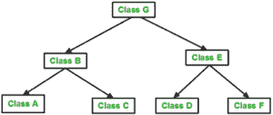
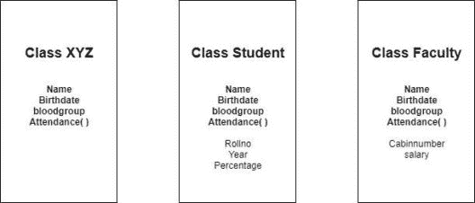
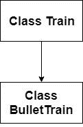
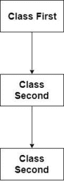
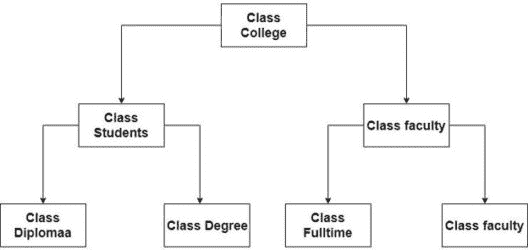
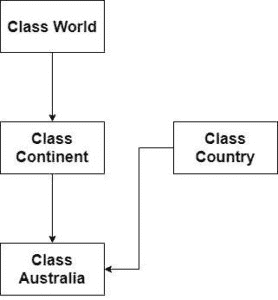
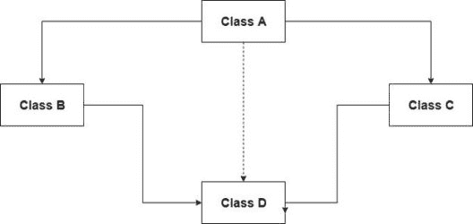

# 关于 C++中的继承，你需要知道的是

> 原文：<https://www.edureka.co/blog/inheritance-in-cpp>

C++是一种面向对象的语言。数据抽象、多态、封装和继承是 OOP 的基石。在这篇文章中，我们将了解什么是继承？C++中的继承类型，以及与之相关的所有必要概念。最后，我们还将看看这个强大概念的缺点，并尝试解决它。

*   [什么是 C++中的继承](#what)
*   [单继承](#single)
*   [多级继承](#multilevel)
*   [分层继承](#hierarchical)
*   [c++中的多重继承](#multiple)
*   [c++中的混合继承](#hybrid)
*   [钻石问题](#diamond)

## **什么是 C++中的继承**

继承是 C++或任何其他面向对象语言中最强大和最广泛使用的概念之一。理解这个概念需要一点类和对象的知识。使用继承，我们可以创建一个包含一般方法和属性的类。这个类可以被包含更多特定方法的其他类继承。



通过这样做，我们不必一次又一次地编写相同的功能，这节省了时间并增加了代码的可读性。

**语法:**

```
class derived_class: access_type base_class{

// class body

};
```

由所有通用方法和属性组成的类被称为基类，这些方法和属性可以被其他类共享以增加代码的可读性。

**派生类:** 由更具体的方法组成并继承一个类的类称为派生类。派生类也可以是其他派生类的基类。

如果我们用一些属性和方法创建一个 XYZ 类。现在一个班级的学生将会有一些其他的属性，但是它也将包括 XYZ 类的元素，同样的情况也适用于教员类。让我们看一个图表:



因此，学生和教职员工类将继承 XYZ。

**访问说明符-** 我们理解了一个类如何继承另一个类。但是有些人可能会说这是一个不安全的方法，因为基类或父类的所有属性和方法都是与子类或派生类共享的。例如，如果“客户”和“投资者”类继承了“银行”类。“银行”类的属性(如“金库密码”)、其他客户相关信息和私人数据与“客户”和“投资者”类共享，这是不安全的。

为了解决上述问题，C++使用访问说明符来限制基类属性对派生类的访问。C++中总共有 3 种访问说明符

1.  公共
2.  私人
3.  受保护的

根据不同的访问说明符，下面的表格会让你很好地理解什么类型的数据可以被派生类访问。

| **访问说明符** | **公开数据** | **私人数据** | **受保护的数据** |
| **私人** | 不是继承的 | 不是继承的 | 不是继承的 |
| **受保护的** | 保护 | **私人** | 受保护的 |
| **公共** | 公共 | **私人** | 保护 |

## **单一继承**

单一继承可以被认为是继承的普通形式。在单继承中，单个类从基类继承。

```
#include <iostream>

using namespace std;

class Train{
    int Numberofwheels;
     int Numberofcoaches;
    public:
     void Traininfo(int n, int m){
        Numberofwheels = n;
        Numberofcoaches = m;
        }
        void showinfo(){
            cout<<Numberofcoaches<<"n"<<Numberofwheels<<"n";
        }
    };
    class BulletTrain : public Train{
        int flux;
        public:
         BulletTrain(int b){
             flux = b;
             }

        void Magneticfield(){
            cout<<" The Magnetic field is turned ON with flux = "<<flux ;
        }     
        };
int main()
{
    BulletTrain bullettrain(10);
    bullettrain.Traininfo(0, 20);  //accessing member function of base class
    bullettrain.showinfo();         //accessing member function of base class
    bullettrain.Magneticfield(); //Using member function of derived class
    return 0;
}
```

**输出:**

`20`

`0`

`The magnetic field is turned ON with flux = 10`

## **多级继承**

这种情况的继承被称为多级继承。第一个类和最后一个类之间的类也称为中间基类。 你怎么看，最后一个阶级能继承第一个阶级的成员吗？是的，它可以

```
#include <iostream>

using namespace std;
class First {
    protected:
    int a;
    public:
    void getinfofirst(int x){
        a = x;
    }
    void showinfofirst(){
        std::cout << "Value of a = " <<a << std::endl;
    }
};

class Second : public First{
    protected:
    int b;
    int c;
    public:
    void getinfosecond(int y, int z){
        b = y;
        c = z;
    }
    void showinfosecond(){
        cout<<"Value of b = "<<b<<"n";
         cout<<"Value of c = "<<c<<"n";
    }

};

class Third : public Second{
    int d;
    public:
    void display(){
        d = b + c;          //Using member variables of class second
        showinfofirst();    //Using member function of class First
        showinfosecond();   //Using member function of class second
        cout<<"Value of d = "<<d<<"n";

    }
};

int main()
{
    Third third;
    third.getinfofirst(10);
    third.getinfosecond(20, 30);
    third.display();
    return 0;

}
```

**输出:**

`Value of a = 10`

`Value of b = 20`

`Value of c = 30`

`Value of d = 50`

## **层次继承**

某些问题无法借助单级或多级遗传来解决。在分层继承中，不止一个类从一个基类继承。

```
#include <iostream> 
using namespace std; 

class College  
{ 
  public: 
    College() 
    { 
      cout << "We are in class College" << endl; 
    } 
}; 

class Student: public College 
{ 

}; 

class Faculty: public College 
{ 

}; 

int main() 
{    

    Student student; 
    Faculty faculty; 
    return 0; 
}
```

**输出:**

`We are in class College`

`We are in class College`

## **c++中的多重继承**

我们看到在层次继承中，一个基类有不止一个派生类。在多重继承中，一个派生类有多个基类。

```
#include <iostream> 
using namespace std; 

  class One{
      protected:
      int a;
      public:
      void getinfoOne(int x){
          a = x;
      }
       };
class Two {
    protected:
    int b;
    public:
    void getinfoTwo(int y){

        b = y;
    }

};

class Main : public One, public Two{

    public : 
        void Display(){
        std::cout << "Value of a = " <<a<< std::endl;   //accessing member variables of class One
        std::cout << "Value of b = " <<b<< std::endl;    //accessing member variables of class Two
        std::cout << "Value of c = " <<a+b<< std::endl;
    }

};
int main() 
{    
    Main main;
    main.getinfoOne(10);  //accessing member function of class One
    main.getinfoTwo(20);  //accessing member function of class Two
    main.Display();

    return 0; 
}
```

输出:

`Value of a = 10`

`Value of b = 20`

`Value of c = 30`

## **c++中的混合继承**

至此，我们对 C++中使用的所有类型的继承都有了很好的理解。但是，等等，如果我们想使用两种不同类型的继承呢？可能吗？是的，在混合遗传的帮助下是可能的。在混合继承中，我们结合了两种不同类型的继承。例如-多级和多重继承、分层和多重继承等。

```
#include <iostream> 
using namespace std; 

  class World{
      protected:
      int a;
      public:
      void getinfoWorld(int x){
          a = x;
      }
       };
class Continent : public World{
    protected:
    int b;
    public:
    void getinfoContinent(int y){

        b = y;
    }

};

class Country{
    protected:
    int d;
    public:
    void getinfoCountry(int m){

        d = m;
    }
};

class Australia : public Continent, public Country {

    public : 
        void Display(){
        std::cout << "Value of a = " <<a<< std::endl;   //accessing member variables of class One
        std::cout << "Value of b = " <<b<< std::endl;    //accessing member variables of class Two
        std::cout << "Value of c = " <<a+b<< std::endl;
        std::cout << "Value of d = " <<d<< std::endl;

    }

};
int main() 
{    
    Australia australia;
    australia.getinfoWorld(10);    //accessing member function of class World
    australia.getinfoContinent(20);  //accessing member function of class Continent
    australia.getinfoCountry(40);  //accessing member function of class Country
    australia.Display();            //accessing member function of class Australia

    return 0; 
}
```

**输出:**

`Value of a = 10`

`Value of b = 20`

`Value of c = 30`

`Value of d = 40`

## **钻石问题**

混合继承带来了大量的可能性，同时也带来了大量的问题。在 C++中有一个流行的问题叫做菱形问题，它是由于混合继承而产生的二义性的结果。



让我们来理解上面的图表，它将有助于我们理解钻石问题。类 B 和类 C 继承自类 A，因此类 A 和类 B 都具有类 A 的属性和方法。如果类 D 继承自类 B 和类 C，则类 D 将具有类 B 和类 C 的所有属性。它还具有类 A 继承自类 B 和类 C 的所有属性。因此，如果我们创建类 D 的对象并调用类的方法 A .将会产生一个不明确的情况，编译器将会弄不清它应该从哪里类 A 的方法，从 B 类还是 d 类

为了解决这种不确定性，我们使用了一个叫做虚拟基类的概念。当我们使一个基类成为虚拟基类时，不管虚拟基类和派生类之间存在多少路径，都只继承该类的一个副本。

```
class A{

};
class B: virtual public A{

};
class C: virtual public A{

};
class D: public C, public D{

};
```

至此，我们结束了 C++文章中的这种继承。如果你想了解更多，请查看由 Edureka(一家值得信赖的在线学习公司)提供的  [Java 培训](https://www.edureka.co/java-j2ee-soa-training)。Edureka 的 Java J2EE 和 SOA 培训和认证课程旨在培训您掌握核心和高级 Java 概念以及各种 Java 框架，如 Hibernate & Spring。

有问题要问我们吗？请在这个博客的评论部分提到它，我们会尽快回复你。