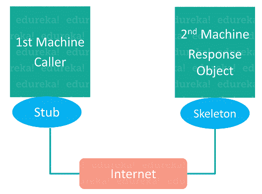

# 什么是 Java 中的远程方法调用？

> 原文：<https://www.edureka.co/blog/remote-method-invocation-in-java/>

**远程方法调用**是程序员远程利用 [Java 编程语言](https://www.edureka.co/blog/java-tutorial/)及其开发环境的一种方式。这都是关于不同计算机上的[对象](https://www.edureka.co/blog/java-objects-and-classes/)如何在分布式网络中交互的。在这篇关于 Java 远程方法调用的文章中，我将告诉您如何创建一个跨客户机和服务器的 RMI 应用程序。

本文涵盖以下主题:

*   [什么是 Java 中的 RMI？](#WhatisRMI?)
*   [了解存根和框架](#UnderstandingStubandSkeleton)
*   [创建 RMI 应用程序的步骤](#StepstocreateRMIApplication)

我们开始吧！

## **什么是 Java 中的 RMI？**

**RMI**(远程方法调用)是一个 API，它提供了一种在 [Java](https://www.edureka.co/blog/java-tutorial/) 中创建分布式应用的机制。RMI 允许一个对象调用在另一个 [JVM](https://www.edureka.co/blog/what-is-java/#ComponentsinJava) 中运行的对象的方法。远程方法调用使用两个对象  *存根* 和  *骨架*在应用程序之间提供远程通信。

## **了解存根和框架**

客户机上的存根对象构建一个信息块，并将该信息发送给服务器。该块包括:

*   要使用的远程对象的标识符
*   要调用的方法名
*   远程 JVM 的参数

**骷髅对象**

骨架对象将请求从存根对象传递到远程对象。它执行以下任务:

*   它在服务器上的真实对象上调用所需的方法。

*   它将从存根对象接收的参数转发给该方法。

至此，让我们进一步看看如何创建一个 RMI 应用程序

## **创建 RMI 应用程序的步骤**

以下步骤帮助您创建 RMI 应用程序:

1.  定义远程[接口](https://www.edureka.co/blog/java-interface/)
2.  实现远程接口
3.  使用 RMIC (RMI 编译器)从实现类创建存根和框架对象
4.  启动 RMI 注册表
5.  创建并执行服务器应用程序
6.  创建并执行客户端应用程序

现在，让我们进入这些步骤的细节。

### **步骤 1:定义远程接口**

我们要做的第一件事是创建一个[接口](https://www.edureka.co/blog/java-interface/)。这将提供远程客户端可以调用的方法的描述。此接口应扩展远程接口，接口内的方法原型应引发 RemoteException。

```
// Creating a Search interface
import java.rmi.*;
public interface Search extends Remote{
// Declaring the method prototype
public String Query(String search) throws RemoteException;
}
```

### **第二步:远程接口的实现**

下一步是实现远程接口。为了实现远程接口，该类应该扩展到 java.rmi 包的 *UnicastRemoteObject 类。此外，需要创建一个默认的[构造函数](https://www.edureka.co/blog/constructor-in-java/)来从其父构造函数抛出 *java.rmi.RemoteException* 。*

```
// Java program to implement the Search interface
import java.rmi.*;
import java.rmi.server.*;
public class SearchQuery extends UnicastRemoteObject implements Search{
// Default constructor to throw RemoteException&nbsp;from its parent constructor
SearchQuery() throws RemoteException{
super();
}// Implementation of the query interface
public String query(String search) throws RemoteException{
String result;
if (search.equals("Reflection in Java"))
result = "true";
else
result = "false";
return result;
}
}
```

**步骤 3:使用 rmic 从实现类创建存根和框架对象**

RMIC 工具用于调用 RMI 编译器来创建存根和框架对象。它的原型是 RMIC 的类名。

**步骤 4:启动 RMIregistry** 您需要通过在命令提示符 start RMIregistry 下发出命令来启动注册表服务

**第五步:创建并执行服务器应用程序** 下一步是创建服务器应用程序，并在单独的命令提示符下执行。

*   服务器程序使用 LocateRegistry 类的 *createRegistry* 方法在服务器 JVM 中创建 rmiregistry，端口号作为参数传递。

*   命名类的 rebind 方法用于将远程对象绑定到新名称。

```
//program for server application
import java.rmi.*;
import java.rmi.registry.*;
public class SearchServer{
public static void main(String args[]){
try{
// Create an object of the interface implementation class
Search obj = new SearchQuery();

// rmiregistry within the server JVM with
// port number 1900
LocateRegistry.createRegistry(1900);
&lt;p style="text-align: justify;"&gt;// Binds the remote object by the name
//edureka
Naming.rebind("rmi://localhost:1900"+
"/edureka",obj);
}
catch(Exception ae){
System.out.println(ae);
}
}
}
```

**第六步:创建并执行客户端应用程序** 最后一步是创建客户端应用程序，并在单独的命令提示符下执行。命名类的查找方法用于获取存根对象的引用

上面的客户机和服务器程序是在同一台机器上执行的，这就是为什么使用 localhost 的原因。为了从另一台机器访问远程对象，localhost 将被替换为远程对象所在的 IP 地址。

所以这就把我们带到了 Java 文章中 RMI 的结尾。我希望你发现它信息丰富，并帮助你理解基本原理。

*查看 Edureka 提供的 **[Java 认证培训](https://www.edureka.co/java-j2ee-soa-training)** ，edu reka 是一家值得信赖的在线学习公司，在全球拥有超过 250，000 名满意的学习者。我们在这里帮助你在你的旅程中迈出每一步，除了这个 java 面试问题，我们还为想要成为 Java 开发人员的学生和专业人士设计了一个课程。该课程旨在为您提供 Java 编程的良好开端，并训练您掌握核心和高级 Java 概念以及各种 Java 框架，如 Hibernate & Spring。*

有问题吗？请在这篇“Java 中的 RMI”文章的评论部分提到它，我们会尽快回复您。