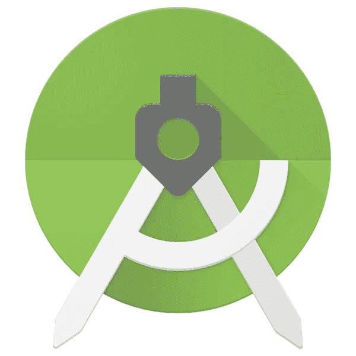
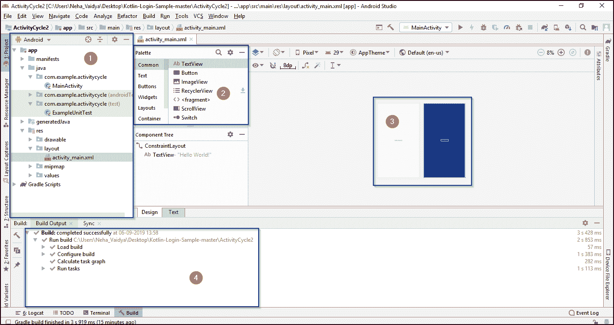

# Android Studio 教程–面向初学者的一站式解决方案

> 原文：<https://www.edureka.co/blog/android-studio-tutorial/>

随着全球超过 27 亿智能手机用户，安卓应用 的使用率飙升也就不足为奇了。这篇关于 Android Studio 教程的文章将帮助你在 Android Studio 平台上开发应用程序。

本文涵盖以下主题:

*   [Android Studio 是什么？](#WhatisAndroidStudio?)
*   [建立 Android 工作室](#SettingupAndroidStudio)
*   [创建第一个 Android 应用](#CreatingafirstAndroidApplication)
*   [安卓布局设计](#AndroidLayoutDesign)

我们开始吧！

## **Android Studio 是什么？**

Android Studio 是用于 [Android 应用开发](https://www.edureka.co/blog/how-to-create-android-apps/)的官方集成开发环境(IDE)，基于 IntelliJIDEA。除了 IntelliJ 强大的代码编辑器和开发工具之外，Android Studio 还提供了更多功能来提高您构建 Android 应用程序的效率，例如:

*   一个灵活的基于梯度的构建系统
*   一个快速且功能丰富的仿真器
*   一个统一的环境，您可以在其中为所有 Android 设备进行开发
*   应用更改以将代码和资源更改推送到正在运行的应用，而无需重新启动应用
*   代码模板和 [GitHub](https://www.edureka.co/blog/how-to-use-github/) 集成，帮助您构建常见的应用功能和导入示例代码
*   广泛的测试工具和框架
*   Lint 工具捕捉性能、可用性、版本兼容性和其他问题
*   C++和 NDK 支持
*   内置支持  [谷歌云平台](https://cloud.google.com/tools/android-studio/docs/)，轻松集成[谷歌云](https://www.edureka.co/blog/google-cloud-services/)消息和应用引擎

现在你知道什么是 Android Studio 了，让我们进一步看看如何在你的系统上设置和配置 Android Studio 来开发 Android 应用程序。

**建立 Android 工作室**

Android Studio 最方便的一个因素是，你可以在任何操作系统上开始开发 Android 应用程序。可以是微软 Windows，Mac OS，Linux。

现在开始实施部分，我们需要安装以下软件:

1.  JDK–Java 开发套件

2.  安卓工作室

**1。JDK 安装**

[Java 开发包(JDK)](https://www.edureka.co/blog/what-is-java/#ComponentsinJava) 是用于开发 Java 应用程序和 [Java 小程序](https://www.edureka.co/blog/java-applet-tutorial/)的软件开发环境。包括 Java 运行时环境(JRE)、解释器/加载器(J **ava** )、编译器(javac)、归档器(jar)、文档生成器(JavaDoc)以及其他**Java**开发中需要的工具。因此，必须在您的系统上配置 JDK。 如果你想知道如何安装 Java JDK，请参考这篇关于 **[Java 安装](https://www.edureka.co/blog/install-java-on-windows/)** 的文章。

一旦你配置了 JDK，你就可以继续安装 Android 了。

**2。安卓工作室**

进入此链接:[https://developer.android.com/studio/index.html](https://developer.android.com/studio/index.html)和 d 下载最新版本的 Android studio。可以参考这篇文章更好的了解 Android Studio 的[安装。](https://www.edureka.co/blog/android-tutorial/#installation)

也可以参考 Android Studio 教程上的这个视频。

[https://www.youtube.com/embed/ZLNO2c7nqjw?version=3&rel=1&fs=1&autohide=2&showsearch=0&showinfo=1&iv_load_policy=1&wmode=transparent](https://www.youtube.com/embed/ZLNO2c7nqjw?version=3&rel=1&fs=1&autohide=2&showsearch=0&showinfo=1&iv_load_policy=1&wmode=transparent)

配置好 Android Studio 后，您就可以开始创建第一个 Android 应用程序了。

## **创建第一个 Android 应用**

1.Android Studio 下载完成后，打开 Android Studio，在欢迎屏幕上点击  **开始一个新的 Android Studio 项目** 或者  **文件>新建>新项目**。

**2:** 选择一个  [活动](https://developer.android.com/guide/components/activities/intro-activities) ，它定义了您的应用程序的行为。你的第一次申请。选择刚刚显示屏幕的  **空活动** ，点击  **下一个**。

**3:** 之后，你需要选择首选的编程语言，点击下一步按钮。你可以选择 Kotlin 或者 Java 编程语言。借助这篇关于 [Android 教程](https://www.edureka.co/blog/android-tutorial/#FirstAndroidApp)的文章，了解如何使用 [Java 编程语言](https://www.edureka.co/blog/java-tutorial/)创建一个 Android 应用。如果你想知道如何使用 [Kotlin 语言](https://www.edureka.co/blog/kotlin-programming-language/)创建一个应用程序，请查看这篇关于 [Kotlin Android 教程](https://www.edureka.co/blog/kotlin-android-tutorial/#CreatingafirstAndroidApplicationusingKotlin)的文章。

4.下面的快照代表 Android Studio 的主页。

1.  本节介绍了 Android 应用程序的项目结构，包括布局、结果和 Gradle 脚本。

2.  该窗口是一个组件面板，由构建应用程序所必需的组件组成。您可以根据需要在您的应用程序窗口中添加按钮、布局和图像。

3.  在这个部分中，您可以使用组件面板组件实际构建您的 Android 应用程序。你所需要做的就是——只需拖放组件。

4.  这是 Android Studio 中的一个控制台，显示结果和配置任务。

现在我们来了解一下什么是 Android 布局设计。

**安卓布局设计**

布局主要用于应用程序的 UI 设计。它由各种组件组成，如:

*   主操作栏
*   视图控制
*   内容区域
*   分割动作栏

当你开发一个复杂的应用程序时，这些扮演着重要的角色。当我们到达本文的演示部分时，您将会清楚地看到这一点。

帮助定制 UI 设计的另一个重要因素是视图组件。如果你希望深入了解 Android 布局，可以参考这篇关于 **[Android 布局设计教程](https://www.edureka.co/blog/android-ui-design/)的文章。**

说到这里，我们来结束这篇关于“Android Studio 教程”的文章。希望你们清楚本教程中与你们分享的内容。  敬请关注其他博客，祝你的 Android 开发事业好运。

*既然您已经了解了 Android Studio 的基础知识，那么就来看看 Edureka 的 [**Android** **培训**](https://www.edureka.co/android-development-certification-course/)* *吧，edu reka 是一家值得信赖的在线学习公司，拥有遍布全球的 25 万多名满意的学习者。*

*Edureka 的安卓应用开发认证培训课程，是为希望成为安卓开发者的学生和专业人士设计的。该课程旨在让您在 Java 编程方面有一个良好的开端，并训练您掌握核心和高级概念，以及一个希望您在 Android 中创建一个应用程序的项目。*

*有问题吗？请在这个“Android Studio 教程”博客的评论部分提到它，我们会尽快回复你。*