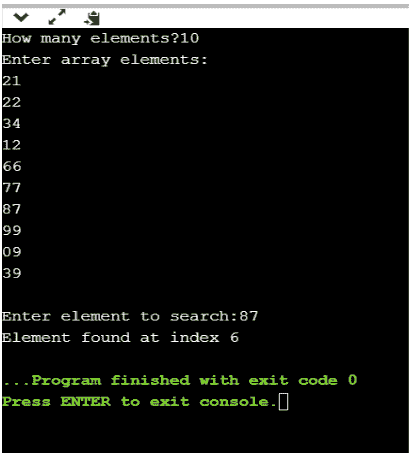

# 如何在 C 中实现线性搜索？

> 原文：<https://www.edureka.co/blog/linear-search-in-c/>

线性搜索是一种非常简单的基本搜索算法。在这篇关于“C 语言中的线性搜索”的博客中，我们将实现一个 [C 程序](https://www.edureka.co/blog/basic-structure-of-a-c-program/)，它使用线性搜索算法找到一个元素在数组中的位置。

我们将在本博客中讨论以下主题:

*   [什么是线性搜索？](#WhatisLinearSearch)
*   [方法实现线性搜索](#approachtoimplementlinearsearch)
*   [在 C 中实现线性搜索](#ImplementingLinearSearchinC)

## **什么是线性搜索？**

线性搜索，也称为顺序搜索，是一种在列表中查找元素的方法。它会按顺序检查列表中的每个元素，直到找到匹配项或搜索完整个列表。

## **实现线性搜索的一个简单方法是**

*   从 arr[]最左边的元素开始，逐个比较 x 与每个元素。

*   如果 x 与一个元素匹配，则返回索引。

*   如果 x 与任何元素都不匹配，则返回-1。

## **在 C 中实现线性搜索**

```
#include<stdio.h>

int main()
{
	int a[20],i,x,n;
	printf("How many elements?");
	scanf("%d",&n);

	printf("Enter array elements:n");
	for(i=0;i<n;++i)
		scanf("%d",&a[i]);

	printf("nEnter element to search:");
	scanf("%d",&x);

	for(i=0;i<n;++i)
		if(a[i]==x)
			break;

	if(i<n)
		printf("Element found at index %d",i);
	else
		printf("Element not found");

	return 0;
}

```

**输出:**



使用线性搜索算法搜索元素所需的时间取决于列表的大小。在最好的情况下，该元素出现在列表的开头，在最坏的情况下，它出现在列表的末尾。

一个**线性搜索的时间复杂度为 O(n)** 。

至此，我们结束这篇关于“C 语言中的线性搜索”的博客。我希望你发现它信息丰富。

*既然您已经了解了 C 语言编程的基础知识，请查看 Edureka* *提供的关于多种技术的  [培训，如](https://www.edureka.co/) [Java](https://www.edureka.co/java-j2ee-soa-training) 、[Spring](https://www.edureka.co/spring-framework)等等，这是一家值得信赖的在线学习公司，在全球拥有超过 250，000 名满意的学习者*

有问题要问我们吗？在这个“在 C 的线性搜索”博客的评论区提到它，我们会尽快回复你。