# 在 Tableau 中使用双轴图表的 3 种方法

> 原文：<https://www.edureka.co/blog/dual-axes-charts-in-tableau/>

***Tableau 中的双轴图*** 之所以这样命名，是因为它们有两个相互叠加的独立轴。通常情况下，它们会显示不同标记类型的组合。 例如，在这里您可以创建一个可视化，在一个轴上显示条形，在第二个轴上显示线条。

这是我在 [Tableau](https://www.edureka.co/blog/tableau-tutorial/) 中最喜欢的图表之一，因为它可以添加一个新的轴，并且可以单独控制这些轴。这释放了一些额外的灵活性，创建了几个可用于改进您的分析、用户体验和设计的实际应用程序。

这篇文章将向你展示如何在 Tableau 中构建双轴图表，以及使用它们的三种不同方式:

*   [**繁体使用**](#traditional)
*   [**让你的最终用户成为故事一部分的方法**](#end-user)
*   一个提升你仪表盘美观度的选项

## **如何在 Tableau 中创建传统用途的双轴图表**

所以，我将使用 Tableau 提供的 ***样本——超市数据集*** 。现在，让我们从制作一个传统的双轴组合图开始。

你可能对它很熟悉，但我还会分享第二种方法，你可能不知道它能帮你节省一两次点击。

第一个图表在一个轴上描绘了每年的销售额，在另一个轴上描绘了每年的利润率；这两项措施也应按照类别维度进行细分。

*   首先，让我们创建一个图表，所以我将按类别从按年份的销售开始。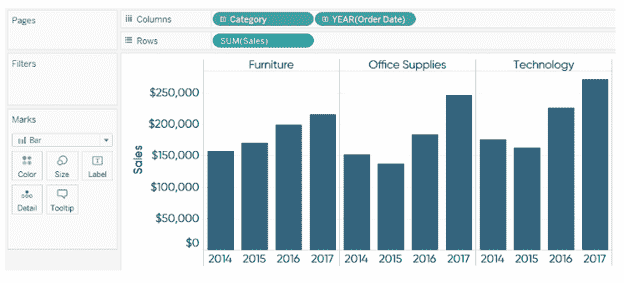
*   接下来，让我们将第二个指标，即 *利润率* 放在成排的架子上。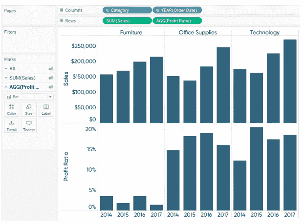

此时，你在两行上有两个单独的条形图。有两种方法可以将这两个独立的条形图转换为双轴条形图。

*   首先，也是大多数人学习的方式，就是右键点击架子上第二个量丸排，选择 *双轴* 。

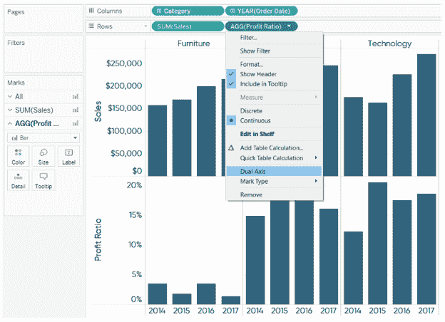第二种也是更有效的方法是将鼠标悬停在第二行的轴上。

*   悬停时，轴的左上角会出现一个绿色的小三角形。

*   你可以左键点击三角形，将其拖动到第一行左轴的对面轴上。

*   当您将鼠标悬停在图表的右侧时，您会看到一条虚线，当您松开鼠标左键时，该虚线将显示坐标轴。

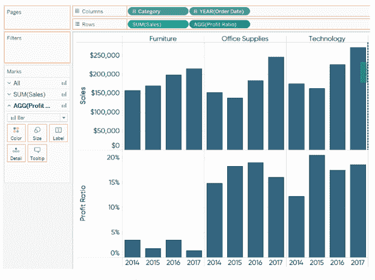在这两种情况下，你最终都会得到一个双轴条形图。

传统上，双轴组合图更适合这种情况。所以，这就是我们要做的。

现在，对于一个双轴 *组合* 图表，我们需要一个标记类型的组合。当在行架和/或列架上有多个度量时，每个度量最终都有自己的标记架。这意味着您可以独立编辑测量的标记类型。

下面是我把 *利润率* 的标记类型从横条改为横条后的最终视图。

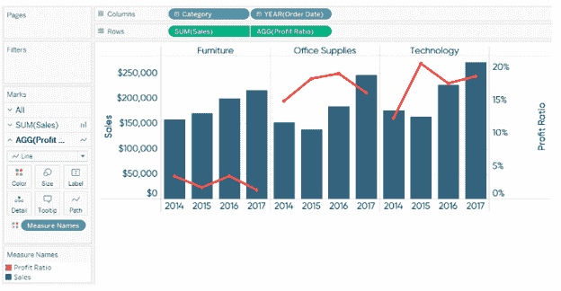当数据点之间随着时间的推移存在关系，或者如果它们由连续的维度/度量连接时，应严格使用线条。在 Tableau 的行架或列架上，离散字段按特定顺序处理。

所以对于这个例子来说，*利润比例* 被分解为维度第一，然后是 *年份(订单日期)* 维度第二。

这很有效，但是如果我们想先将这两个指标分解为 *【订单日期】* ，然后再分解为 *类别* 呢？下面是它的样子:

#### **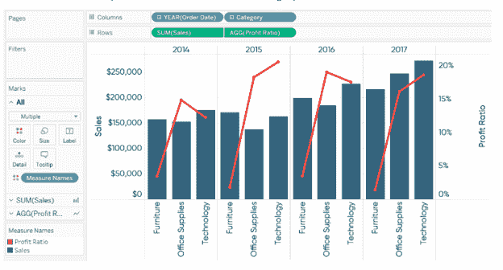**

## **使用双轴图表让你的用户成为故事的一部分**

下图是翻拍自的 *CNN 货币计算器* 。

给定的 viz 以一条曲线为特色，显示每个家庭的收入如何按百分位数排列。这是一个非常常见的“描述性”视图，用于描述高级统计数据。通过使用第二个轴来显示使用仪表板的个人在该曲线上的排名，可以获得真实值。这使得用户成为故事的一部分，是一种更吸引人的用户体验。

为了实现这一效果，我在 Tableau 中使用了一个内置的参数，该参数允许最终用户在 2，000 美元和**450，000 美元之间选择任何家庭收入选项。**

选择后，圆圈根据用户选择移动到适当的位置。此外，该标签将更新为一个标题，告诉最终用户他们的家庭收入处于哪个百分点等级。

这是一个双轴组合图。

左轴的曲线使用折线图的标记类型，圆是仅在右轴上显示圆供最终用户选择的第二个度量。只显示一个圆圈的诀窍是这个简单的公式，它计算用户的参数选择是否与 Y 轴上的家庭收入值相匹配。

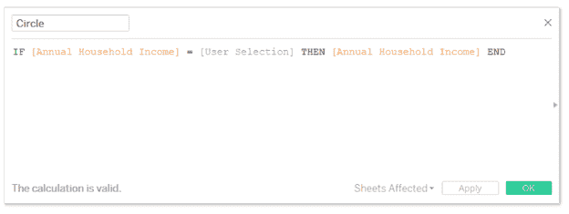一旦你有了这个计算，你就可以在左边的轴上建立曲线，在右边的轴上画圆。

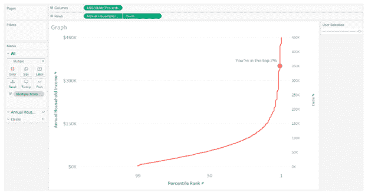要最终确定该视图，您可以通过右键单击 * 圆 * 的轴并选择 * 同步轴 * 选项来同步轴。

该确保圆与对面轴上的直线完美对齐。最后，通过右击隐藏右边的轴，并取消选择 *显示标题* 。

## **使用双轴改进线图的设计**

假设你有一个按月趋势显示销售额的折线图。

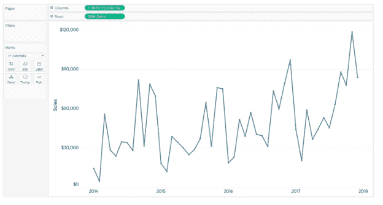现在我将把 * 销售 * 测量放在右轴上，同步这两个轴，并将第二个轴的标记类型更改为 * 区域 * 。

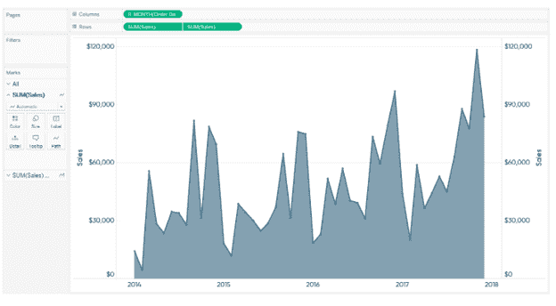至此，我们有了一个双轴组合图，其中 * 按月销售 * 作为折线图，作为面积图。要完成视图，隐藏右轴，并将该区域的不透明度降低到 10%。

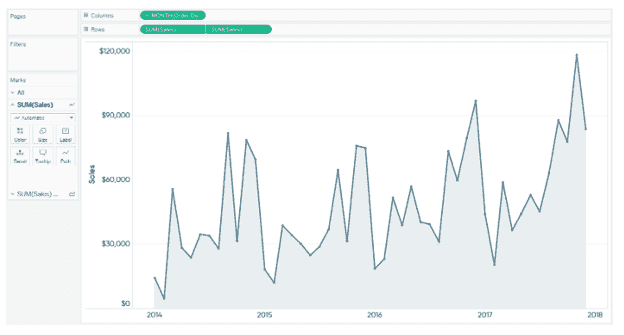一次只能将第二轴用于单一目的。但是，如果您不是因为上面提到的前两个原因中的一个原因而使用它，这是第三个应用程序，可以用来增强您的传统线图。

我希望你已经发现 Tableau 中双轴图表上的这件作品很有趣，并理解它们是什么，以及如何使用它们来揭示 Tableau 中的潜力。

*至此，我们结束了这篇双轴图表中的 Tableau 文章。* *如果你希望掌握 Tableau，Edureka 有一个关于 **[Tableau 培训&认证](https://www.edureka.co/tableau-training-for-data-visualization)** 的策划课程，该课程深入涵盖了数据可视化的各种概念，包括条件格式、脚本、链接图表、仪表板集成、Tableau 与 R 的集成等等。它提供 24*7 支持，在整个学习期间为您提供指导。新的批次即将开始。*

*有问题吗？请在评论区提到它，我们会尽快回复您。*