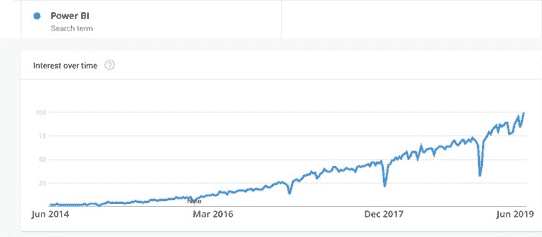

# Power BI 开发人员工资:您需要了解的见解和趋势

> 原文：<https://www.edureka.co/blog/power-bi-developer-salary>

***【Power BI】***在过去几年中，已经成为商业智能领域最热门的趋势之一。这种数据可视化工具在大大小小的公司中都越来越受欢迎。因此，很明显 ***Power BI 开发人员的平均工资*** 正在飞涨。

如果你看一下谷歌趋势，这似乎是一个美好的时机来获得 ***[Power BI 认证](https://www.edureka.co/power-bi-certification-training)*** 并在商业智能和 ***数据分析*** 中建立职业生涯。 以下是本文涉及的话题:

*   [**权势毕的人气上升**](#rise)
*   [**电力 BI 开发者工资**](#developer)
*   [**权力毕**](#career)
*   [**公司招聘电力 BI 开发者**](#companies)
*   [**为什么电力 BI 专业人士的工资这么高**](#why)
*   [**结论**](#conclusion)

## **权力的崛起毕的人气**

如果我们看看下面的谷歌趋势图，我们会发现微软的 Power BI 在过去五年里变得非常受欢迎。这就是人们对权力 BI 的兴趣所在，它是什么，以及如何利用权力 BI 成就一番事业。

下面介绍的是 Power BI 的主要成果。

*   与 Tableau、Domo 和 Sisense 等其他 BI 工具相比，Power BI 是一种更便宜的替代工具

*   一旦确定了 KPI，Power BI 就是一个难以置信的简单易用的工具

*   Power BI 与 Office 365 和其他微软工具无缝集成。

很明显，在 Power BI 中招聘员工的公司都是大老板。

## **电力 BI 开发人员工资**

根据的数据，印度一名入门级电力 BI 开发者的平均年薪为 **Rs。293544**，高达 **Rs。44.5 万** 。经验丰富的 Power BI 开发人员的收入潜力非常高。能走多远 **Rs。平均 88.2 万** ，最高为**200 万** 卢比。

在美国，电力 BI 开发人员的需求正在上升，初级人员的平均年薪 [l](https://www.payscale.com/research/US/Job=Business_Intelligence_(BI)_Developer/Salary/5b41c27d/Early-Career-Microsoft-Power-BI) 为70，050 美元到88，000 美元一年 有经验者的年薪高达**【134，000 美元**

**了解我们在顶级城市举办的 Power BI 培训课程**

| 印度 | 美国 | 其他国家 |
| [海德拉巴的 Power BI 培训](https://www.edureka.co/power-bi-certification-training-hyderabad) | [达拉斯的 Power BI 球场](https://www.edureka.co/power-bi-certification-training-dallas) | [墨尔本 Power BI 球场](https://www.edureka.co/power-bi-certification-training-melbourne) |
| [班加罗尔的 Power BI 培训](https://www.edureka.co/power-bi-certification-training-bangalore) | [夏洛特动力 BI 课程](https://www.edureka.co/power-bi-certification-training-charlotte) | [伦敦 Power BI 课程](https://www.edureka.co/power-bi-certification-training-london) |
| [在钦奈的电力 BI 培训](https://www.edureka.co/power-bi-certification-training-chennai) | [纽约的 Power BI 课程](https://www.edureka.co/power-bi-certification-training-new-york-city) | [悉尼 Power BI 球场](https://www.edureka.co/power-bi-certification-training-sydney) |

## **权力毕的职业生涯**

如果您开始使用表格模型，那么拥有 Power BI 方面的深入知识和实践经验将极大地帮助您实现更大规模的项目。

从事电力商业智能是一项激动人心的快节奏工作。Power BI 的互动社区正在以相当快的速度增长，提供了许多学习和社交 Power BI 用户组的选择。下面列出了所有潜在的工作角色，面向精通电力商业智能的专业人士。精通电力商业智能的专业人士并不缺乏机会。

*   毕建筑师
*   商业分析师
*   数据分析师
*   商务智能开发者

你可以参考这段由我们的专家策划的视频，以获得更深入的解释。

[https://www.youtube.com/embed/3u7MQz1EyPY](https://www.youtube.com/embed/3u7MQz1EyPY)

## **雇佣 Power BI 开发人员的公司**

如果你快速浏览一下当前的职位空缺，你会发现与软件相关的技能是多么抢手。

支付者包括 SAP、Azure、Mphasis、凯捷、埃森哲、丹佛斯、Larsen & Toubro、Wipro、日产、索尼和 Infosys。

因此，如果你渴望为行业内的大公司工作，在 Power BI 的职业生涯是实现这一目标的必由之路。

## **为什么电力商务智能专业人员的薪酬如此之高**

精通商务智能的专业人士有大量的工作角色和机会。如今，拥有一个优秀的数据分析策略对企业来说极其重要。这导致对商业智能专业人员的需求增加。在一个重要的分析领域从事如此高要求的工作，无疑意味着精通 Power BI 的个人在他们的工作岗位上获得了丰厚的报酬。

让我们根据这些专业人员的工作角色和职责来评估他们的重要性。

*   **商业智能架构师**

BI 架构师管理数据库、数据仓库和不同的存储基础设施。他们还开发数据结构，这反过来有助于组织平台和更有效地利用数据。管理和分析公司的数据使 BI 架构师能够提出策略，帮助他们做出更好、更有成效的决策，并支持更成功的结果。

*   **商业分析师**

业务分析师部分是技术人员，部分是基于业务的专业人员。他们需要了解业务需求和数据技能，以便有足够的能力分别建模和分析数据。业务分析师总是努力开发和提出新的商业智能解决方案，并撰写报告，以便组织从他们的数据中获得更多。

*   **数据分析师**

数据分析师制作报告、设计数据和分析，然后将其转化为具有愿景的可理解数据，可用于制定业务行动。

*   **商务智能开发者**

与任何其他类型的软件开发人员一样，BI 开发人员为应用和服务设计和开发工具和解决方案。他们的主要工作是将商业需求转化为规范，改进和扩展商业智能平台，这将有助于他们以更好的方式满足用户的需求。

很容易理解，精通电力商业智能的分析师拥有广泛的技能，快速形成完善的数据分析策略的需求导致了对电力商业智能专业人员的巨大需求。这些人在工作中的未来是坚定的，因此他们获得了相当可观的报酬。

## **结论**

这仅仅是过去几年来全世界见证的微软智能增长的开始。其强大但简化的功能将为商业分析领域带来新的重大变化。难怪它在 Gartner 截至 2019 年 2 月的魔力象限 *之上* 。

*有问题吗？请在评论区提到它，我们会给你回复。*