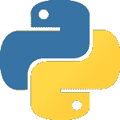
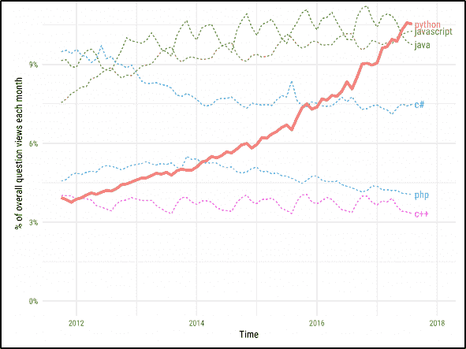
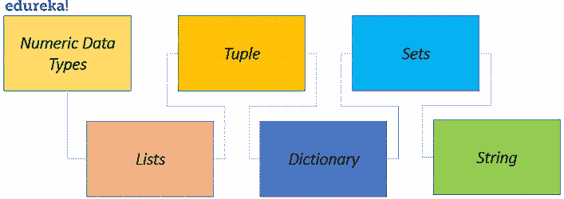
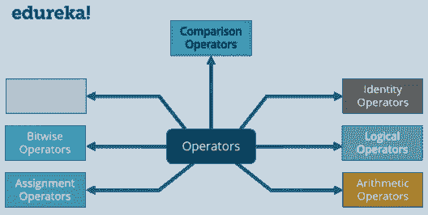
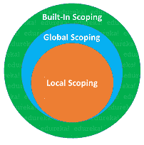
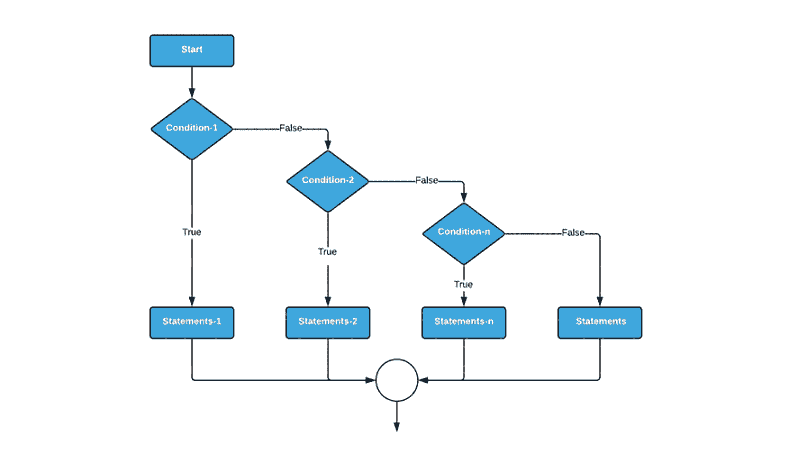
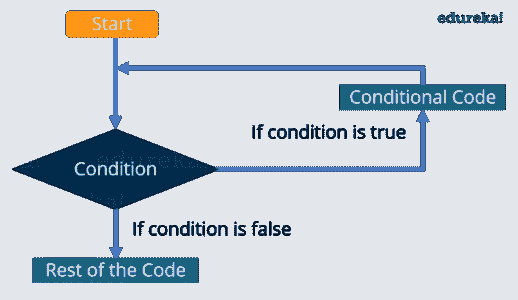

# Python 基础:是什么让 Python 如此强大？

> 原文：<https://www.edureka.co/blog/python-basics/>

Python ，你听说过它，并且想知道这种语言有什么特别之处。随着 **[机器学习](https://www.edureka.co/blog/what-is-machine-learning/)****[人工智能](https://www.edureka.co/blog/what-is-artificial-intelligence)** 的崛起，是不可能摆脱它的。你可能会质疑自己，**Python 好学吗？** 我来告诉你， **其实就是** ！我在这里帮助你开始 [Python 编程认证](https://www.edureka.co/python-programming-certification-training)。

本博客将为进行演练

*   [ 什么是 Python？](#ToPython)
*   [Python 的特性](#Features)
*   [跳转到 Python 基础知识](#Basics)
    *   [评论](#Comments)
    *   [变量](#Variables)
    *   [数据类型](#DataTypes)
        *   [类型转换](#TypeConversion)
    *   [操作员](#Operators)
    *   [命名空间和范围](#Namespacing)
*   [流量控制](#Flow)
    *   [if，elif，else](#ifelse)
    *   [for，while，嵌套循环](#loops)
*   [文件处理](#Files)
*   [哎呀用 Python](#OOPS)

让我们开始吧。

## **Python 是什么？**

Python 简单来说就是一种的高级动态编程语言，也就是用 **解释** 。“Python 之父”吉多·范·罗苏姆 在开发它的时候就有简单的目标， **代码简单，可读性强，开源。**在 Stack Overflow 于 2018 年举行的一项调查中，Python 被列为第三大最突出的语言，其次是 [JavaScript](https://www.edureka.co/blog/javascript-tutorial/) 和 [Java](https://www.edureka.co/blog/java-tutorial/) ，这证明了它是最具增长性的语言。



## **Python 的特性**

Python 是目前我最喜欢的语言，因为它的简单性、强大的库和可读性。你可能是一个老派的程序员，也可能是一个编程新手， **[Python](https://www.edureka.co/blog/10-reasons-why-you-should-learn-python)** 是入门的最佳途径！

Python 提供了下列功能:

*   简单:少考虑语言的语法，多考虑代码。
*   开源:一种强大的语言，每个人都可以根据需要免费使用和修改。
*   **可移植性:** Python 代码可以被共享，并且它会按照预期的方式工作。无缝便捷。
*   **可嵌入&可扩展:** Python 内部可以有其他语言的片段来执行某些功能。
*   **被解释:**大内存任务和其他繁重的 CPU 任务由 Python 自己处理，让您只需担心编码。
*   **海量库:** [数据科学](https://www.edureka.co/blog/learn-python-for-data-science/)？Python 为您提供了保护。Web 开发？Python 仍然为您提供了保护。一直都是。
*   **面向对象:**对象有助于将复杂的现实生活中的问题分解成可以编码和求解的解决方案。

综上所述，Python 有 **简单语法** ，有 **可读** ，有 **强大的社区支持** 。你现在可能会问，如果你懂 Python，你能做什么？嗯，你有很多选择。

*   [数据科学家](https://www.edureka.co/blog/what-is-data-science/)
*   [机器学习](https://www.edureka.co/blog/what-is-machine-learning/)和[人工智能](https://www.edureka.co/blog/what-is-artificial-intelligence)
*   [物联网](https://www.edureka.co/blog/iot-tutorial/)
*   [网页开发](https://www.edureka.co/blog/django-tutorial/)
*   [数据可视化](https://www.edureka.co/blog/python-matplotlib-tutorial/)
*   [](https://www.edureka.co/blog/selenium-using-python/)自动化

现在，既然你知道 Python 有如此惊人的特性集，为什么我们不从 Python 基础开始呢？

## **跳转到 Python 基础知识**

要开始学习 Python 基础知识，你需要首先**在你的系统中安装 Python** ，对吗？所以让我们现在就开始吧！你应该知道，现在大多数 **Linux** 和 **Unix** 发行版都自带 Python 版本。要设置自己，你可以遵循这个 [**分步指南**](https://www.edureka.co/blog/install-python-on-windows/) 。

设置完成后，你需要创建你的第一个项目。遵循以下步骤:

*   创建**项目**，输入名称，点击**创建**。
*   **右击项目文件夹上的**，使用 New- > File- > Python 文件创建一个 **python 文件**，输入文件名

你完成了。你已经设置好你的文件，开始用 Python 进行[编码。 开始编码你激动吗？我们开始吧。首先也是最重要的是“你好世界”节目。](https://www.edureka.co/blog/python-programming-language)

```
print('Hello World, Welcome to edureka!')

```

**输出**:你好世界，欢迎来到 edureka！

给你，这是你的第一个程序。从语法上你可以看出，它非常容易理解。让我们转到 Python 基础知识中的注释。

### **Python 中的注释**

Python 中的单行注释是使用#符号完成的，而多行注释则使用“.”。如果你想了解更多关于**评论**的信息，你可以阅读这本[羽翼丰满指南](https://www.edureka.co/blog/comments-in-python/)。一旦你知道了 Python 基础中的注释，让我们跳到 Python 基础中的变量。

### **变量**


变量简单来说就是**内存空间**，在这里你可以存储**数据**或者**值**。但是 Python 中的问题是，变量不需要像其他语言那样在使用前声明。**数据类型**被**自动赋给**变量。如果输入整数，数据类型将被指定为整数。您输入一个[字符串](https://www.edureka.co/blog/what-is-string-in-python/)，该变量被赋予一个字符串数据类型。你明白了。这使得 Python **成为动态类型语言**。使用赋值运算符(=)为变量赋值。

```
a = 'Welcome to edureka!'
b = 123
c = 3.142
print(a, b, c)

```

**输出**:欢迎来到 edureka！你可以看到我给这些变量赋值的方式。这就是在 Python 中给变量赋值的方法。如果你想知道，是的，你可以**在单个[打印语句](https://www.edureka.co/blog/print-in-python/)中打印多个变量**。现在让我们回顾一下 Python 基础中的数据类型。

### **Python 中的数据类型**

数据类型基本上是一种**语言支持的**数据**，这样有助于定义现实生活中的数据，如工资、员工姓名等。可能性是无限的。数据类型如下所示:**



#### **数字数据类型**

顾名思义，这是在变量中存储数值数据类型。你要知道它们是**不可变的**，也就是说变量中的具体数据是不能改变的。

有 3 种数值数据类型:

*   **Integer:** 这就是说你可以在变量中存储整数值一样简单。例:a = 10。
*   **Float:** Float 保存实数，用十进制表示，有时甚至用科学符号表示，用 E 或 E 表示 10 的幂(2.5e2 = 2.5 x 102 = 250)。例:10.24。
*   **复数:**它们的形式是 a + bj，其中 a 和 b 是浮点数，J 代表-1 的平方根(这是一个虚数)。例如:10+6j。

```
a = 10
b= 3.142
c = 10+6j

```

既然您已经理解了各种数值数据类型，那么您就可以理解如何将一种数据类型转换成另一种数据类型了。

#### **类型转换**

类型转换是将一种数据类型转换成另一种数据类型的转换，当我们开始编程以获得问题的解决方案时，这种转换会非常有帮助。让我们用例子来理解。

```
a = 10
b = 3.142
c = 10+6j
print(int(b), float(a), str(c))

```

**输出** : 10.0 3 '10+6j' 你可以理解，通过上面的代码片段进行类型转换。‘a’为整数，‘b’为浮点数，‘c’为复数。您使用 Python 中内置的 float()、int()、str()方法，这有助于我们转换它们。 **类型转换**在现实世界的例子中非常重要。

一个简单的情况是，你需要计算一家公司雇员的工资，这些工资应该是浮点格式的，但却以字符串格式提供给我们。因此，为了使我们的工作更容易，您只需使用类型转换，将工资字符串转换为 float，然后继续我们的工作。现在让我们转向 Python 基础知识中的列表数据类型。

#### **列表**

简单来说，列表可以被认为是存在于其他语言中的 **[数组](https://www.edureka.co/blog/arrays-in-python/)** ，但是它们可以包含 **异构元素** ，即**不同的数据类型在同一个列表中**。列表是**可变的**，这意味着你可以改变列表中可用的数据。

对于那些不知道数组是什么的人来说，你可以通过想象一个可以按照你需要的方式保存数据的机架来理解它。稍后你可以通过调用数据存储的位置来访问数据，这在编程语言中被称为索引。使用 a=list()方法或使用 a=[]来定义列表，其中“a”是列表的名称。


从上图可以看出，存储在列表中的数据以及与存储在列表中的数据相关的索引。注意 **Python 中的索引总是以‘0’**开头。现在，您可以转到列表可能的操作。

列表操作如下表所示。

| 代码片段 | 获得的输出 | 操作说明 |
| 答【2】 | 135 | 找到索引 2 处的数据并将其返回 |
| a[0:3] | 【3.142，'印地语'，135】 | 返回从索引 0 到 2 的数据，因为最后提到的索引总是被忽略。 |
| a[3] = 'edureka！' | 招式‘edu reka！’至索引 3 | 索引 3 中的数据被替换 |
| 德尔答 | 从列表中删除“印地语” | 删除项目，不返回任何项目 |
| 镜头(a) | 3 | 获取 Python 中变量的长度 |
| a * 2 | 输出列表‘a’两次 | 如果一个字典被乘以一个数字，它被重复许多次 |
| a[::-1] | 倒序输出列表 | 索引从左到右从 0 开始。按照相反的顺序，即从右到左，索引从-1 开始。 |
| a .追加(3) | 3 将被添加到列表的末尾 | 在列表末尾添加数据 |
| a .延长(b) | 【3.142，135，‘爱德华卡！’3，2] | ‘b’是一个值为 2 的列表。仅将列表“b”中的数据添加到“a”中。对“b”不做任何更改。 |
| a.insert(3，‘你好’) | 【3.142，135，‘爱德华卡！’，'你好'，3，2] | 取索引和该索引的值和 ad ds 值。 |
| a .移除(3.142) | 【135，‘爱德华卡！’，'你好'，3，2] | 从列表中删除作为参数传递的值。没有返回值。 |
| a.index(135) | 0 | 找到元素 135 并返回该数据的索引 |
| a.count('hello') | 1 | 它遍历字符串，找到它在列表中重复出现的次数 |
| a.pop(1) | “爱德华卡！” | 弹出给定索引中的元素，并在需要时返回该元素。 |
| a.reverse() | 【2，3，'你好'，135】 | 它只是反转列表 |
| a.sort() | 【5，1234，64738】 | 根据升序或降序对列表进行排序。 |
| a.clear() | [] | 用于删除列表中存在的所有元素。 |

现在您已经理解了各种列表函数，让我们转到理解 Python 基础中的元组。

#### **元组**

Python 中的元组是与列表相同的**。只要记住一点，元组是** **不可变的** 。这意味着一旦声明了元组，就不能添加、删除或更新元组。就这么简单。这使得**元组比列表**快得多，因为它们是常量值。

操作类似于列表，但是涉及到更新、删除、添加的操作就不起作用了。Python 中的元组被写成 a=()或 a=tuple()，其中“a”是元组的名称。

```
a = ('List', 'Dictionary', 'Tuple', 'Integer', 'Float')
print(a)

```

**输出** = ('List '，' Dictionary '，' Tuple '，' Integer '，' Float ')

这基本上包含了元组所需的大部分东西，因为你只有在需要一个具有常量值的列表时才会用到它们，因此你使用元组。让我们转到 Python 基础中的字典。

#### **字典**

当你有真实世界的例子时，字典是最容易理解的。最容易理解的例子是电话簿。想象一下电话簿，了解其中存在的各种字段。还有姓名、电话、电子邮件等你能想到的字段。把*名*想象成**键**，把你输入的**名**想象成**值**。同样，*电话*为**键**，*输入的数据*为**值**。这就是字典。它是一个保存键、值对的结构。

使用 a=dict()或 a={}编写字典，其中 a 是字典。该键可以是一个字符串或整数，后面必须跟一个“:”和该键的值。

```
MyPhoneBook = { 'Name' : [ 'Akash', 'Ankita' ] ,
'Phone' : [ '12345', '12354' ] ,
'E-Mail' : [ 'akash@rail.com', 'ankita@rail.com' ]}
print (MyPhoneBook)

```

**Output** : { 'Name' : ['Akash '，' Ankita']，' Phone' : ['12345 '，' 12354']，' E-Mail' : ['akash@rail.com '，' ankita@rail.com']}

**访问字典的元素**

您可以看到，关键字是 Name、Phone 和 EMail，每个关键字都分配有两个值。打印字典时，会打印关键字和值。现在，如果您只想获得特定键的值，可以执行以下操作。这被称为访问字典的元素。

```
print(MyPhoneBook['E-Mail'])

```

**输出** : [ 'akash@rail.com '，' ankita@rail.com' ]

**字典操作**

| 代码片段 | 获得的输出 | 操作说明 |
| MyPhoneBook.keys() | 字典键(['姓名'，'电话'，'电子邮件']) | 返回字典的所有键 |
| MyPhoneBook.values() | dict _ values([' Akash '，' Ankita']，[12345，12354]，['ankita@rail.com '，' Akash @ rail . com ']) | 返回字典中的所有值 |
| 我的电话簿['id']=[1，2] | {'Name': ['Akash '，' Ankita']，' Phone': [12345，12354]，' E-Mail': ['ankita@rail.com '，' akash@rail.com']，' id': [1，2]}为更新值。 | id 的新键、值对被添加到字典中 |
| my phone book[' Name '][0]= " Akki " | 【名称】【电池】【锚】 | 访问名称列表并更改第一个元素。 |
| 删除我的电话簿['id'] | { '姓名':['阿卡什'，'安基塔']，'电话':[12345，12354]，'电子邮件':['安基塔@rail.com '，'阿卡什@rail.com']} | ID 的键、值对已被删除 |
| len(我的电话簿) | 3 | 字典中有 3 个键-值对，因此得到值 3 |
| MyPhoneBook.clear() | {} | 清除键、值对并创建一个清晰的字典 |

现在，您可能对 Python 基础中的字典有了更好的理解。因此，让我们转到 Python 基础知识博客中的 set。

#### **设置**

集合基本上是元素或项目**的无序集合。元素是**集合中唯一的**。在 [Python](https://www.edureka.co/blog/python-programming-language) 中，它们被写在**花括号**和**内，用逗号**隔开。** 你可以看到，即使集合‘a’中有相似的元素，它仍然只打印一次，因为[集合](https://www.edureka.co/blog/sets-in-python/)是唯一元素的集合。

```
a = {1, 2, 3, 4, 4, 4}
b = {3, 4, 5, 6}
print(a,b)

```

**输出** : {1，2，3，4} {3，4，5，6}

**集合运算**

| 代码片段 | 获得的输出 | 操作说明 |
| a &#124; b | {1，2，3，4，5，6} | 集合中所有元素的联合运算。 |
| 甲&乙 | {3，4} | 交集运算，只选择两个集合中的元素。 |
| a–b | {1，2} | 差运算，删除“a”和“b”中的元素，得到“a”中剩余的元素。 |
| 甲^乙 | {1，2，5，6} | 对称差分运算，其中交叉元素被删除，而两个集合中的剩余元素是结果。 |

集合很容易理解，所以让我们转到 Python 基础中的字符串。

#### **琴弦**

Python 中的字符串是最常用的数据类型，特别是因为它们对我们人类来说更容易交互。从字面上看，它们是单词和字母，这对于它们在什么样的上下文中如何使用是有意义的。Python 之所以大受欢迎，是因为它与字符串有如此强大的集成。[字符串](https://www.edureka.co/blog/string-to-integer/)写在**单引号**(“”)或**双引号**(“”)内。字符串是**不可变的**，这意味着字符串中的数据不能在特定的索引处改变。

Python 对字符串的操作可以表示为:

**注意:这里我用的字符串是:mystsr ="edureka！是我的地方"**

| 代码片段 | 获得的输出 | 操作说明 |
| len(mystr) | 20 | 找出字符串的长度 |
| mystr.index('！') | 7 | 查找字符串中给定字符的索引 |
| mystr.count('！') | 1 | 查找作为参数传递的字符数 |
| mystr.upper() | 爱德华卡！是我的地方 | 将所有字符串转换成大写 |
| mystr . split(') | 爱德华卡！，'是'，'我的'，'地点'] | 根据作为参数传递的分隔符断开字符串。 |
| mystr.lower() | 爱德华卡！是我的地方 | 将字符串中的所有字符串转换成小写 |
| mystr.replace('，'，') | 爱德华卡！，是，我的，地点 | 用新值替换旧值的字符串。 |
| mystr . capital() | 爱德华卡！是我的地方 | 这将字符串的第一个字母大写 |

这些只是几个可用的功能，如果你搜索一下，你会找到更多。

#### **拼接成串**

拼接是**将字符串**拆分成你想要获得的格式或方式。关于这个话题的更多信息，你可以[阅读这个博客。](https://www.edureka.co/blog/what-is-string-in-python/)Python 中有很多内置函数，你可以在这里 查阅这篇 [文章。这基本上总结了 Python 中的数据类型。我希望你能很好地理解这一点，如果你有任何疑问，请留下评论，我会尽快回复你。](https://www.edureka.co/blog/python-functions)

现在让我们转到 Python 基础中的运算符。

### **Python 中的运算符**

操作符是**构造**，你用它来**操纵****数据**，这样你就可以得出某种解决方案给我们。一个简单的例子是，如果有两个朋友，每个人有 70 卢比，你想知道他们每个人的总数，你会把钱加起来。在 Python 中，使用+运算符将值相加，其总和为 140，这是问题的解决方案。

Python 有一个操作符列表，可以分为:



让我们继续前进，仔细了解每一个操作符。

注意:变量被称为操作数，出现在操作符的左边和右边。例:

```
a=10
b=20
a+b

```

这里‘a’和‘b’是操作数，+是运算符。

#### **算术运算符**

它们用于对数据执行**算术运算**。

| 操作员 | 描述 |
| + | 将操作数的值相加 |
| – | 用左运算符减去右运算符的值 |
| * | 左操作数乘以右操作数 |
| / | 左操作数除以右操作数 |
| % | 左操作数除以右操作数，返回余数 |
| ** | 执行左操作数与右操作数的指数运算 |

下面的代码片段会帮助你更好地理解它。

```
a = 2
b = 3
print(a+b, a-b, a*b, a/b, a%b, a**b, end=',')

```

**输出** : 5，-1，6，0.6666666666666，2，8

一旦你理解了 Python 基础中的算术运算符，让我们转到赋值运算符。

#### **赋值运算符**

顾名思义，这些用来**给变量**赋值。就这么简单。

各种赋值运算符有:

| 操作员 | 描述 |
| = | 用于将右边的值赋给左边的变量 |
| += | 将左右操作数之和的值赋给左操作数的符号。 |
| -= | 将左右操作数的差值赋给左操作数的符号。 |
| *= | 将左右操作数乘积的值赋给左操作数的简写符号。 |
| /= | 将左右操作数的除法值赋给左操作数的简写符号。 |
| %= | 将左右操作数的余数赋值给左操作数的简写符号。 |
| **= | 将左右操作数的指数值赋给左操作数的简写符号。 |

在这篇 Python 基础知识的博客中，让我们继续讨论比较运算符。

#### **比较运算符**

这些操作符用于**显示左右操作数之间的关系**,并导出您需要的解决方案。很简单，你用它们来做**比较**。根据这些值的条件是真还是假，这些运算符获得的输出将是真或假。

| 操作员 | 描述 |
| == | 找出左右操作数的值是否相等 |
| ！= | 找出左右运算符的值是否不相等 |
| < | 找出右操作数的值是否大于左操作数的值 |
| > | 找出左操作数的值是否大于右操作数的值 |
| < = | 找出右操作数的值是否大于或等于左操作数的值 |
| > = | 找出左操作数的值是否大于或等于右操作数的值 |

你可以在下面的例子中看到它们的工作方式:

```
a = 21 
b = 10 
if a == b:
    print ( 'a is equal to b' )
if a != b
    print ( 'a is not equal to b' )
if a < b:
    print ( 'a is less than b' )
if a > b: 
    print ( 'a is greater than b' ) 
if a <= b: 
    print ( 'a is either less than or equal to b' ) 
if a >= b:
    print ( 'a is either greater than or equal to b' )

```

**输出:** a 不等于 b a 大于 b a 不是大于就是等于 b

让我们继续学习 Python 基础知识中的按位运算符。

#### **按位运算符**

要理解这些算符，你需要理解比特的**理论**。这些操作符用于**直接操作位**。

| 操作员 | 描述 |
| & | 用于对左右操作数的单个位进行 AND 运算 |
| &#124; | 用于对左右操作数的单个位进行 OR 运算 |
| ^ | 用于对左右操作数的单个位进行异或运算 |
| ~ | 用于对左右操作数的单个位进行 1 的补码运算 |
| << | 用于将左操作数移位右操作数倍。左移一次相当于乘以 2。 |
| >> | 用于将左操作数移位右操作数倍。一次右移相当于除以 2。 |

最好在电脑上自己练习。继续学习 Python 基础中的逻辑运算符。

#### **逻辑运算符**

这些用来从操作数中获得某个**逻辑**。我们有 3 个操作数。

*   **和**(如果左右操作数都为真，则为真)
*   **或**(如果任一操作数为真，则为真)
*   **非**(给出了传递的操作数的反义词)

```
a = True
b = False
print(a and b, a or b, not a)

```

**输出:**假真假

转到 Python 基础中的成员运算符。

#### **隶属运算符**

这些用于测试某个**特定变量**或值**是否存在于列表、字典、元组、集合等中的**。

操作员有:

*   中的 **(如果在序列中找到值或变量则为真)**
*   **不在**(如果序列中找不到该值，则为真)

```
a = [1, 2, 3, 4]
if 5 in a:
    print('Yes!')
if 5 not in a:
    print('No!')

```

**输出**:否！

让我们跳到 Python 基础中的标识运算符。

#### **身份操作员**

这些运算符用于**检查值**，变量**是否与**相同。就这么简单。

操作员有:

*   **是**(如果相同则为真)
*   **不是**(如果不相同则为真)

```
a = 5
b = 5
if a is b:
    print('Similar')
if a is not b:
    print('Not Similar!')

```

对于 Python 的操作者来说，这就对了。

在转向名称空间之前，我建议您阅读一下 [Python Functions 的文章](https://www.edureka.co/blog/python-functions)，以便更好地理解 Python 中的函数。一旦你完成了这些，让我们继续学习 Python 基础中的命名空间。

### **命名空间和范围**

你记得 Python 中的**一切都是一个[对象](https://www.edureka.co/blog/python-class/#Objects)、**吧？那么，Python 如何知道你试图访问的是什么呢？想象这样一种情况，你有两个同名的函数。你仍然可以调用你需要的函数。这怎么可能呢？这就是命名空间的用处。

命名空间是 Python 用来给我们代码中的所有对象分配唯一名称的系统。如果你想知道，对象可以是变量和方法。Python 通过**维护字典结构**来命名空间。其中*名称充当键*，而*对象或变量充当结构*中的值。现在你会想什么是名字？

嗯， **名** 只是你用来**访问对象**的一种方式。这些名称用作访问您分配给它们的值的参考。

**例子** : a=5，b='edureka！'

如果我想访问值‘edu reka！’我可以简单地用' b '调用变量名，这样我就可以访问' edureka！'。这些是名字。您甚至可以指定方法名并相应地调用它们。

```
import math
square_root = math.sqrt
print('The square root is ',square_root(9))

```

**输出**:根为 3.0

命名空间与作用域一起工作。**作用域**是函数/变量/值在它们所属的函数或类内的*有效性。Python **内置函数**命名空间**覆盖了 Python** 的所有其他作用域。print()和 id()等功能。即使没有任何进口也可以使用，可以在任何地方使用。在它们下面是**全局**和**局部**命名空间。让我在下面的代码片段中解释一下作用域和命名空间:*

```
def add():
    x = 3
    y = 2
    def add2():
        p, q, r = 3, 4, 5
        print('Inside add2 printing sum of 3 numbers:'(p+q+r))
    add2()
    print('The values of p, q, r are :', p, q, r)
    print('Inside the add printing sum of 2 numbers:'(x+y))
add()

```

从上面的代码可以看出，我已经用 add()和 add2()的名字声明了两个函数。您有了 add()的定义，然后调用 add()方法。在 add()中，你调用 add2()，这样你就能得到 12 的输出，因为 3+4+5 是 12。但是一旦从 add2()中出来，p，q，r 的作用域就终止了，这意味着 p，q，r 只有在 add2()中才能访问和使用。因为你现在在 add()中，没有 p，q，r，所以你得到错误，执行停止。

从下图中你可以更好地理解作用域和命名空间。**内置范围**覆盖了所有的 Python，使得它们*在任何需要的时候都可用*。**全局范围**覆盖所有正在执行的*程序*。**局部范围**覆盖了程序中正在执行的所有*方法*。这基本上就是 Python 中的命名空间。让我们继续学习 Python 基础中的流控制。

### 

## **Python 中的流量控制和调节**

你知道在任何语言中代码都是按顺序运行的，但是如果你想**打破那种流程**，这样你就能够**添加逻辑并重复某些语句**，这样你的代码就减少了，并且能够用更少更聪明的代码获得一个**解决方案**。毕竟，这就是编码。寻找问题的逻辑和解决方案，这可以使用 Python 中的循环和条件语句来完成。



条件语句只有在满足**某个条件**时**才执行**，否则**跳过**到满足条件的地方。Python 中的条件语句是 **if、elif 和 else。**

**语法:**

```
if condition:
    statement
elif condition:
    statement
else:
    statement

```

这意味着如果一个条件被满足，做某事。否则遍历剩余的 elif 条件，最后如果不满足任何条件，则执行 Else 块。甚至可以在 if-else 块中嵌套 if-else 语句。

```
a = 10 
b = 15 
if a == b: 
    print ( 'They are equal' ) 
elif a > b: 
    print ( 'a is larger' ) 
else : 
    print ( 'b is larger' )

```

**输出** : b 较大

理解了条件语句后，让我们转到循环。在某些情况下，您可能希望一次又一次地执行某些语句来获得解决方案，或者您可以应用一些逻辑，以便仅使用 2 到 3 行代码就可以执行某种类似的语句。这就是你在 Python 中使用 **[循环的地方。](https://www.edureka.co/blog/loops-in-python/)**



循环可分为两种。

*   **有限:**这种循环一直工作到满足某个条件
*   **无限:**这种循环无限工作，永不停止。

Python 或任何其他语言中的循环必须测试条件，它们可以在语句之前或之后完成。它们被称为:

*   **预测试循环:**首先测试条件，然后执行语句
*   **Post 测试循环:**语句至少执行一次，然后检查条件。

Python 中有两种循环:

*   **为**
*   **而**

让我们用下面的语法和代码片段来理解这些循环。

**For Loops:** 这些循环用于针对给定的**条件**执行**某组语句**，并持续到条件失败。你知道你需要执行 for 循环的次数。

**语法:**

```
 for variable in range: statements 
```

代码片段如下:

```
basket_of_fruits= ['apple', 'orange', 'pineapple', 'banana']
for fruit in basket_of_fruits:
    print(fruit, end=',')

```

**产量**:苹果、橘子、菠萝、香蕉

这就是 Python 中 for 循环的工作方式。让我们继续学习 Python 基础知识中的 while 循环。

**While 循环:** While 循环与 for 循环的**相同，只是你可能不知道结束条件。For 循环条件已知但 **[while 循环条件](https://www.edureka.co/blog/while-loop-in-python/)**可能不知道。**

**语法:**

```
while condition:
    statements

```

代码片段如下:

```
second = 10 
while second >= 0: 
    print(second, end='->')
    second-=1 
print('Blastoff!')

```

**输出**:10->9->8->7->6->5->4->3->2->1->升空！

这就是 while 循环的工作方式。

稍后你会有**嵌套循环**，在那里你**将一个循环嵌入到另一个循环中。**下面的代码应该给你一个思路。

```
count = 1
for i in range(10):
    print(str(i) * i)
    for j in range(0, i):
        count = count+1

```

**输出:**

one

Twenty-two

Three hundred and thirty-three

Four thousand four hundred and forty-four

Fifty-five thousand five hundred and fifty-five

Six hundred and sixty-six thousand six hundred and sixty-six

Seven hundred and seventy-seven thousand seven hundred and seventy-seven

Eighty-eight million eight hundred and eighty-eight thousand eight hundred and eighty-eight

Nine hundred and ninety-nine million nine hundred and ninety-nine thousand nine hundred and ninety-nine

第一个 for 循环打印了数字的字符串。另一个 for 循环将数字加 1，然后执行这些循环，直到满足条件。这就是 for 循环的工作方式。这就结束了我们关于循环和条件的讨论。继续学习 Python 基础中的文件处理。

## **用 Python 处理文件**

Python 有内置函数，你可以使用这些函数来**处理文件**，比如**从文件**读取和**写入** **数据** **。当使用 open()函数调用一个文件时，会返回一个**文件对象**,然后您可以对其进行读、写、修改等操作。**

如果你想详细了解一下文件处理，可以通过完整教程-**[Python 中的文件处理。](https://www.edureka.co/blog/file-handling-in-python/)**

处理文件的流程如下:

*   **使用 Open()函数打开**文件
*   对文件对象执行**操作**
*   **使用 Close()函数关闭**文件，以避免对文件造成任何损坏

**语法:**

```
File_object = open('filename','r')

```

其中模式是您希望与文件交互的方式。如果没有传递任何模式变量，则默认模式为读取模式。

| 模式 | 描述 |
| r | Python 中的默认模式。它用于从文件中读取内容。 |
| w | 用于以写模式打开。如果一个文件不存在，它应该创建一个新的否则截断当前文件的内容。 |
| x | 用于创建文件。如果文件存在，操作失败 |
| 答 | 以追加模式打开文件。如果该文件不存在，它将打开一个新文件。 |
| b | 这将读取二进制文件的内容。 |
| t | 这以文本模式读取内容，是 Python 中的默认模式。 |
| + | 这将打开文件进行更新。 |

**举例:**

```
file = open('mytxt','w')
string = ' --Welcome to edureka!-- '
for i in range(5):
    file.write(string)
file.close()

```

**输出**:–欢迎来到 edureka！––欢迎来到 edureka！––欢迎来到 edureka！––欢迎来到 edureka！––欢迎来到 edureka！–在 mytxt 文件中

你可以继续尝试更多的文件。让我们转到博客的最后一个话题。对象和类。这两者密切相关。

## **哎呀**

旧的编程语言的结构是这样的:代码的任何模块都可以**访问**数据**。这可能会导致**潜在的安全问题**，导致开发人员转向**面向对象编程**，这可以帮助我们将真实世界的示例模拟到代码中，从而获得更好的解决方案。**

有 4 个非常重要的概念需要理解。他们是:

*   **继承:**继承允许我们**从父类中派生属性和方法**，并根据需要修改它们。最简单的例子是汽车，它描述了汽车的结构，这个类可以被派生来描述跑车、轿车等等。
*   **封装:**封装是**将数据和对象绑定在一起**，这样其他对象和类就不能访问数据。Python 有私有、受保护和公共类型，它们的名字暗示了它们的作用。Python 使用“_”或“__”来指定私有或受保护的关键字。
*   **多态性:**这允许我们为它所需要的各种类型的数据拥有一个**公共接口。可以有相似的函数名，但传递给它们的数据不同。**
*   **抽象:** 抽象可以用来**通过对适合问题的类**建模来简化复杂的现实。

我建议你仔细阅读这篇关于 Python 类和对象的文章。

我希望你喜欢阅读这篇博客，并且理解 Python 的基础知识。敬请关注更多内容。快乐学习！

*既然您已经了解了 Python 的基础知识，那么就来看看 Edureka 在法里达巴德* *举办的 [Python 培训吧，这是一家值得信赖的在线学习公司，拥有遍布全球的 250，000 多名满意的学习者。](https://www.edureka.co/python-programming-certification-training-faridabad)*

*Edureka 的 Python 编程认证培训课程是为希望成为 Python 程序员的学生和专业人士设计的。该课程旨在为您提供 Python 编程的开端，并训练您掌握核心和高级概念。*

*有问题吗？请在“Python 基础:是什么让 Python 如此强大”博客的评论部分提到它，我们会尽快回复您。*