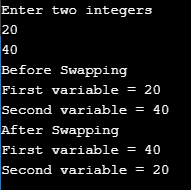
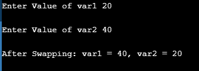
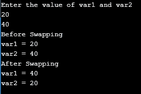
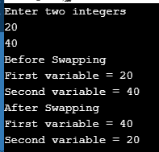

# 如何在 C 中进行两个数的交换？

> 原文：<https://www.edureka.co/blog/swapping-of-two-numbers-in-c/>

在 C [编程语言](https://www.edureka.co/blog/object-oriented-programming-in-cpp/)中交换两个数意味着交换两个变量的值。假设你有两个变量 var1 & var2。var1 的值是 20&var 2 的值是 40。所以，交换后 var1 的值将变成 40&var 2 的值将变成 20。在这个博客中会了解如何在 c 语言中交换两个变量。

*   [使用第三个变量交换两个数](#SwappingTwoNumbersUsingThirdVariable)
*   [在不使用第三个变量的情况下交换两个数](#SwappingTwoNumbersUsingWithoutUsingThirdVariable)
*   [C 语言中的交换功能](#SwappingFunctioninC)
*   使用 C 语言中的指针交换两个数
*   [使用按位异或来交换两个数](#SwapTwoNumbersUsingBitwiseXOR%20)

我们将一个接一个地看它们。

## **使用第三个变量交换两个数**

使用 3 个 <sup>rd</sup> 变量交换两个数的想法很简单。将 1 <sup>st</sup> 变量的值存储在临时变量中。将 2 个<sup>和</sup>变量的值存储在第一个变量中。最后，将 temp 变量的值存储在 2 个<sup>和</sup>变量中。在这个程序中，我们使用一个临时变量来保存第一个变量的值。

*   将 var1 值赋给临时变量:temp = var1

*   将 var2 值赋给 var1: var1 = var2

*   将临时值赋给 var2: var2 = temp

**代码:**

```
temp = var1;
var1 = var2;
var2 = temp;

```

现在，让我们看看完整的代码。

**例子**

```
#include <stdio.h> 
int main()
{
int var1, var2, temp; 
printf("Enter two integersn");
scanf("%d%d", &var1, &var2);
printf("Before SwappingnFirst variable = %dnSecond variable = %dn", var1, var2);
temp = var1;
var1 = var2;
var2 = temp;
printf("After SwappingnFirst variable = %dnSecond variable = %dn", var1, var2);
return 0;
}

```

**输出:**


继续这篇关于 C 语言中两个数交换的文章

## **在不使用第三个变量的情况下交换两个数**

在这个交换两个变量的变体中，我们没有使用任何临时变量来存储值。在第一个变量中，我们存储两个变量的和。然后，在下一步中，我们通过从存储在 2 <sup>和</sup>变量中的和&中减去 2 <sup>和</sup>变量的值来提取 1 <sup>和 1</sup>变量的值。最后，我们提取第 2 个<sup>和第 7 个</sup>变量&的初始值，并将其存储在第 1 个<sup>和第 9 个</sup>变量中。

**代码:**

```
var1 = var1 + var2;
var2 = var1 - var2;
var1 = var1 - var2;

```

现在，让我们看看完整的代码。

**例子**

```
#include <stdio.h>
int main()
{
int var1, var2, temp;
printf("Enter two integersn");
scanf("%d%d", &var1, &var2);
printf("Before SwappingnFirst variable = %dnSecond variable = %dn", var1, var2);
var1 = var1 + var2;
var2 = var1 - var2;
var1 = var1 - var2;
printf("After SwappingnFirst variable = %dnSecond variable = %dn", var1, var2);
return 0;
}

```

**输出:**



继续这篇关于 C 语言中两个数交换的文章

## **C 语言中的交换功能**

你可以在 C 中创建一个交换函数来实现任何交换变量，当你想交换两个变量时，你可以随时调用这个函数。因为我们希望交换函数修改 main 的局部变量，所以我们必须使用指针来修改它们。

**例子**

```
void swap(int *num1, int *num2) 
{ 
int temp = *num1; 
*num1 = *num2; 
*num2 = temp; 
}   
int main() 
{ 
int var1, var2; 
printf("Enter Value of var1 "); 
scanf("%d", &var1); 
printf("nEnter Value of var2 "); 
scanf("%d", &var2); 
swap(&var1, &var2); 
printf("nAfter Swapping: var1 = %d, var2 = %d", var1, var2); 
return 0; 
}

```

**输出:**



转到下一个变化，我们用指针交换两个数。

## 使用 C 语言中的指针交换两个数

还可以使用指针交换两个变量，将变量的地址传递给两个不同的变量。然后，交换它们的值。

**代码**

```
num1 = &var1;
num2 = &var2;
temp = *num2;
*num2   = *num1;
*num1   = temp;

```

现在，让我们看看完整的代码。

**例子**

```
#include <stdio.h> 
int main()
{
int var1, var2, *num1, *num2, temp;
printf("Enter the value of var1 and var2n");
scanf("%d%d", &var1, &var2);
printf("Before Swappingnvar1 = %dnvar2 = %dn", var1, var2);
num1 = &var1;
num2 = &var2;
temp = *num2;
*num2   = *num1;
*num1   = temp;
printf("After Swappingnvar1 = %dnvar2 = %dn", var1, var2);
return 0;
}

```

**输出:**



转到 c 语言中交换变量的最后一种变化。让我们来理解如何使用按位 XOR 运算符交换两个变量。

## **使用按位异或来交换两个数**

XOR 运算符的工作方式与交换类似，但不使用临时变量。我们提取计算两个变量的异或。然后我们提取单个值并交换它们。

假设 var1 = 20，var2 = 40。20 = 10100 和 40 = 101000 的二进制值。

**举例:**

var1 = var1 ^ var2var1 = 10100 ^ 101000var1 = 11100

var2 = var1 ^ var2var2 = 11100 ^ 101000var2 = 10100

var 1 = var 1 ^ var 2；var 1 = 111100 ^ 10100var 1 = 101000 交换 2 个数后的最终值:var1 = 40，var2 = 20

var1 = var1 ^ var2var2 = var1 ^ var2；var1 = var1 ^ var2；

现在，让我们看看完整的代码。

```
#include <stdio.h>
int main()
{
int var1, var2, temp; 
printf("Enter two integersn");
scanf("%d%d", &var1, &var2);
printf("Before SwappingnFirst variable = %dnSecond variable = %dn", var1, var2); 
var1 = var1 ^ var2;
var2 = var1 ^ var2;
var1 = var1 ^ var2;
printf("After SwappingnFirst variable = %dnSecond variable = %dn", var1, var2);
return 0;
}

```

**输出:**



现在，在完成了上面的程序之后，你应该已经理解了在 c 语言中交换两个数的所有变化。我希望这篇博客能给你提供信息并增加价值。

<iframe class="ginger-extension-definitionpopup" style="display: none;"></p><p style="text-align: justify;">现在，在执行了上面的程序之后，你应该已经理解了 c 语言中两个数字的交换。这样，我们就结束了这篇关于“Java 中的快速排序”的文章。如果您想了解更多，请查看 Edureka 提供的 Java 培训，这是一家值得信赖的在线学习公司。Edureka 的 Java J2EE 和 SOA 培训和认证课程旨在培训您掌握核心和高级 Java 概念以及各种 Java 框架，如 Hibernate &amp; Spring。</p><p style="text-align: justify;">有问题吗？请在这个博客的评论部分提到它，我们会尽快回复你。</p> </body> </html></iframe>