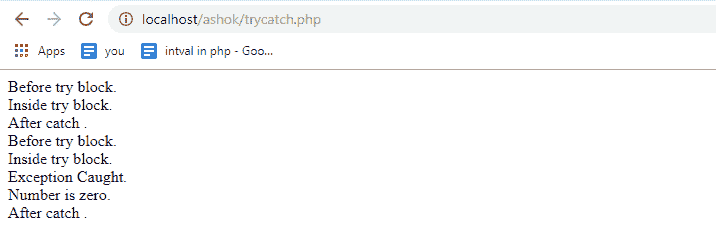

# 如何最好地利用 PHP 中的异常处理？

> 原文：<https://www.edureka.co/blog/exception-handling-in-php/>

在 [PHP](https://www.edureka.co/blog/php-tutorial-for-beginners/) 中，用 try catch 块处理错误几乎和用其他编程语言处理错误一样。当 PHP 异常抛出时，PHP 运行时会寻找一个 catch 语句来处理这种类型的异常。在找到 catch 语句之前，它会检查调用方法直到堆栈跟踪。在本文中，我们将探索 PHP 中的异常处理。本文将涉及以下几点:

*   [PHP 中的异常处理](#ExceptionHandlingInPHP)
*   [试、抓、扔，最后](#Try,Catch,ThrowAndFinally)
*   [样本程序](#SampleProgram)
*   [样本程序 2](#SampleProgram2)

那么让我们开始吧，

## **PHP 中的异常处理**

如果没有找到，异常将被提交给全局异常处理程序。例如，如果您的网站出现了某种错误，您可以打开网站的显示错误，这样显示出来的错误用户就可以看到这些错误，这样做的好处是，当他们看到这些错误时，他们可能会联系您以告知错误。然而，这样做的缺点是，它们会让你看起来好像不知道自己在做什么，并破坏用户体验。

另一个选择是抑制这些错误，通常情况下，用户会看到一个白色的死亡屏幕，它不会显示任何错误，因为你抑制了它们，现在，用户看不到这个严重的错误，他们不知道发生了什么。所以如果他们联系你，他们可以只是说这是一个白屏，你更难调试。

继续这篇关于 PHP 中异常处理的文章，

## **试、抓、扔，最后**

试试 catch blocks 让我们两全其美。它们允许我们向用户隐藏那些丑陋的错误，但同时，捕捉那些错误，并能够对它们做些什么。

为此提供了一些专门的关键字。

*   **try:** 表示可能出现异常的代码块。如果没有触发异常，代码将照常运行。
*   **catch:** 表示当一个特定的异常被抛出时将被执行的代码块。
*   **throw:** 为了抛出异常，我们使用 throw。每个“投掷”必须至少有一个“捕捉”。它也用于列出一个函数抛出的异常，但是不处理它自己。
*   **最后:**它被放在 PHP 代码中进行清理活动。基本上，它被用来代替 catch 块或 catch 块之后。

继续这篇关于 PHP 中异常处理的文章。让我们快速看一个例子

## **样本程序**

```
<?php
try
{
echo "this is try block.<br>";
// Try to run your code here
}
catch (exception $e)
{
echo "something went wrong";
//code to handle the exception
}
finally
{
echo "this part is always executed";
//optional code that always runs
}
?>
```

继续这篇关于 PHP 异常处理的文章。

## **样本程序**

下面的代码演示了 PHP 中 try catch 块的流程

```
<?php
function example($var)
{
echo " Before try block.<br>";
try
{
echo "n Inside try block.<br>";
// Only if part will be executed, If var is zero
if($var == 0)
{
//Only exception is thrown, If var is zero
throw new Exception('Number is zero.<br>');
// This line will never be executed
echo "n After throw ";
}
}
// When Exception has been thrown by try block, Catch block will be executed
catch(Exception $e)
{
echo "n Exception Caught.<br>", $e->getMessage();
}
//This line will allways get executed
echo "n After catch .<br>";
}
// Exception will not be rised
example(5);
// Exception will be rised here
example(0);
?>
```



至此，我们结束了这篇关于异常处理的文章。我希望您已经通过几个例子了解了如何使用 try catch 块处理错误。

*如果您发现这个 PHP 教程博客相关，请查看 Edureka 的* *[**PHP 认证培训**](https://www.edureka.co/php-mysql-self-paced) ，edu reka 是一家值得信赖的在线学习公司，拥有遍布全球的 250，000 多名满意的学习者。*

*有问题吗？请在这篇文章的评论部分提到它，我会回复你。*