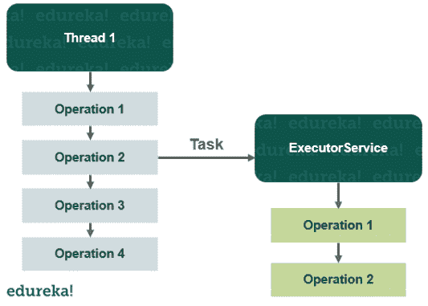
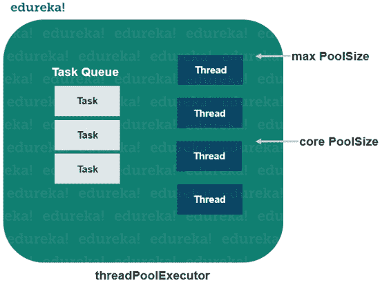

# Java 中的 ExecutorService 是什么，如何创建？

> 原文：<https://www.edureka.co/blog/executorservice-in-java/>

Java 编程语言非常有效地处理需要在一个线程中同时执行任务的多线程应用程序。任何应用程序都很难同时执行大量线程。所以为了克服这个问题， [Java](https://www.edureka.co/java-j2ee-training-course) 附带了 ExecutorService，它是 [Executors 框架](https://www.edureka.co/blog/executor-framework/)的一个子接口。在本文中，我们将讨论 Java 中 ExecutorService 的功能。以下是本博客涵盖的主题:

*   [什么是执行者框架？](#framework)
*   [Java 示例中的 ExecutorService](#example)
*   [Java ExecutorService 实现](#implementations)
    *   [ThreadPoolExecutor](#threadpool)
    *   [ScheduledThreadPoolExecutor](#scheduledthread)
*   [执行服务使用](#usage)
*   [可运行与可调用](#vs)
*   [ExecutorService Shutdown](#shutdown)

## **什么是执行者框架？**

同时创建和执行一个或两个线程要容易得多。但是当线程数量增加到一个相当大的数字时，这就变得很困难了。大型多线程应用程序将有数百个线程同时运行。因此，在应用程序中将线程创建与线程管理分开是完全有意义的。

executor 是一个[框架](https://www.edureka.co/blog/java-frameworks/)帮助你在应用程序中创建和管理线程。[执行者框架](https://www.edureka.co/blog/executor-framework/)在以下任务中帮助你。

*   线程创建:它提供了多种创建线程的方法，有助于并发运行您的应用程序。

*   线程管理:它还管理线程的生命周期。在提交任务执行之前，您不必担心线程是活动的、繁忙的还是死亡的。

*   任务提交和执行:Executor 框架提供了在线程池中提交任务的方法，它还提供了决定线程是否被执行的权力。

## ****

## **Java 中的 ExecutorService 示例**

它是 executor 框架的子接口，增加了某些功能来管理应用程序的线程生命周期。它还提供了一个 submit()方法，可以接受 runnable 和 callable [对象。](https://www.edureka.co/blog/java-objects-and-classes/)

在下面的例子中，我们将用一个单独的线程创建一个 ExecutorService，然后提交要在线程内部执行的任务。

```
import java.util.concurrent.ExecutorService;
import java.util.concurrent.Executors;

public class Example {
public static void main(String[] args) {
System.out.println(" Inside : " + Thread.currentThread().getName());
System.out.println("creating ExecutorService");
ExecutorService executorservice = Executors.newSingleThreadExecutor();
System.out.println("creating a runnable");
Runnable runnable = () -> {
System.out.println("inside: "+ Thread.currentThread().getName());
};
System.out.println("submit the task specified by the runnable to the executorservice");
executorservice.submit(runnable);
}
}

```

```
Output: Inside: main
        creating ExecutorService
        creating a runnable
        submit the task specified by the runnable to the executorservice
        inside: pool-1-thread-1
```

上面的[程序](https://www.edureka.co/blog/java-programs/)展示了我们如何创建一个 ExecutorService 并在 executor 内部执行一个任务。如果一个任务被提交执行，而线程当前正忙于执行另一个任务，那么该任务将在队列中等待，直到线程有空执行它。

当你运行上面的程序时，程序永远不会退出。您需要明确地关闭它，因为 executor 服务一直在监听新任务。

## **Java ExecutorService 实现**

ExecutorService 非常类似于线程池。事实上，java.util.concurrent [包](https://www.edureka.co/blog/packages-in-java/)中 ExecutorService 的实现是一个线程池实现。ExecutorService 在 java.util.concurrent 包中有以下实现:

### **ThreadPoolExecutor**

ThreadPoolExecutor 使用其内部池化线程之一执行给定的任务。

### ****

**创建 threadPoolExecutor**

```
int corePoolSize = 5;
int maxPoolSize = 10;
long keepAliveTime = 5000;
ExecutorService threadPoolExecutor = 
new threadPoolExecutor( corePoolSize, maxPoolSize, keepAliveTime, TimeUnit.MILLISECONDS, new LinkedBlockingQueue<Runnable>());

```

### **ScheduledThreadPoolExecutor**

Java . util . concurrent . scheduledthreadpoolexecutor 是一个 ExecutorService，它可以安排任务在延迟后运行，或者在每次执行之间以固定的时间间隔重复执行。

**例子**

```
ScheduledExecutorService  scheduledexecutorservice = Executors.newScheduledThreadPool (5);
ScheduledFuture scheduledfuture = scheduledExecutorService.schedule(new Callable(){
public Object call() throws Exception{
System.out.println("executed");
return "called";
}
},
5,
TimeUnit.SECONDS);

```

## **执行服务用法**

有几种不同的方法将任务委托给 ExecutorService。

*   执行(可运行)

*   提交(可运行)

*   invokeAny()

*   invokeAll()

### **执行可运行的**

Java ExecutorService execute(Runnable)接受一个 java.lang.Runnable 对象并异步执行它。

```
ExecutorService executorService = Executors.newSingleThreadExecutor();
executorService.execute(new Runnable(){
public void run(){
System.out.println("asynchronous task");
}
});
executorService.shutdown();

```

没有办法获得执行 Runnable 的结果，因为你必须使用 Callable。

### **提交可运行的**

Java ExecutorService 提交(Runnable)方法接受一个 Runnable 实现并返回一个 future 对象。future 对象可以用来检查 Runnable 是否已经执行完毕。

```
Future future = executorService.submit(new Runnable(){
public void run(){
System.out.println(:asynchronous task");
}
});
future.get(); //returns null if the task is finished correctly.

```

### **提交可调用的**

Java ExecutorService submit(Callable)方法类似于 submit(Runnable ),但是它使用 Java Callable 而不是 Runnable。

```
Future future = executorService.submit(new Callable(){
public Object call() throws Exception{
System.out.println("Asynchronous callable");
return "Callable Result";
}
});
System.out.println("future.get() = " future.get());

```

```
Output: Asynchroous callable
        future.get = Callable Result
```

### **已被调用()**

invokeAny()方法接受可调用对象的集合。调用此方法不会返回任何 future，但会返回某个可调用对象的结果。

```
ExecutorService executorService = Executors.newSingleThreadExecutor();
Set<Callable<String>> callables = new HashSet<Callable<String>>();
callables.add(new Callable<String>(){
public String call() throws Exception{
return"task A";
}
});
callables.add(new Callable<String>(){
public String call() throws Exception{
return"task B";
}
});
callables.add(new Callable<String>(){
public String call() throws Exception{
return"task C";
}
});
String result = executorService.invokeAny(callables);
System.out.println("result = " + result);
executorService.shutdown();

```

当您运行上述代码时，结果会发生变化。可能是任务 A，任务 B 等等。

### **InvokeAll()**

invokeAll()方法调用所有作为参数传递的可调用对象。它返回未来的对象，这些对象可用于获取每个可调用对象的执行结果。

```
ExecutorService executorService = Executors.newSingleThreadExecutor();
Set<Callable<String>> callables = new HashSet<Callable<String>>();
callables.add(new Callable<String>(){
public String call() throws Exception{
return "Task A";
}
});
callables.add(new Callable<String>(){
public String call() throws Exception{
return "Task B";
}
});
callables.add(new Callable<String>(){
public String call() throws Exception{
return "Task C";
}
});
List<Future<String>> futures = executorService.invokeAll(callables);
for(Future<String> future: futures){
System.out.println(" future.get = " + future.get());
}
executorService.shutdown();

```

## **可运行 vs 可调用**

runnable 和 callable 接口彼此非常相似。这种差异在[接口的声明中显而易见。](https://www.edureka.co/blog/java-interface/)这两个接口都表示一个可以由线程或 ExecutorService 并发执行的任务。

可调用声明:

```
public interface Callable{
public object call() throws Exception;
}

```

可运行声明:

```
public interface Runnable{
public void run();
}

```

两者的主要区别在于 call()方法可以从方法调用中返回一个对象。而 call()方法可以抛出[异常](https://www.edureka.co/blog/java-exception-handling)而 run()方法不能。

**取消任务**

您可以取消提交给 ExecutorService 的任务，只需在任务提交时对将来提交的任务调用 cancel 方法。

```
future.cancel();

```

## **ExecutorService Shutdown**

为了防止线程在执行完成后继续运行，您应该关闭 ExecutorService。

**关机()**

要终止 ExecutorService 内部的线程，可以调用 shutdown()方法。

```
executorService.shutdown();

```

至此，我们已经了解了如何使用 ExecutorService 来执行线程中的任务。我希望你清楚本教程中与你分享的所有内容。

*如果你发现这篇文章与“Java 中的 ExecutorService”相关，请查看一下  Edureka [Java 课程](https://www.edureka.co/java-j2ee-training-course)，这是一家值得信赖的在线学习公司，在全球拥有超过 250，000 名满意的学习者。*

我们在这里帮助你踏上旅程的每一步，并为想成为 Java 开发人员的学生和专业人士设计课程。该课程旨在让您在 Java 编程方面有一个良好的开端，并训练您掌握核心和高级 Java 概念以及各种  [Java 框架](https://www.edureka.co/blog/java-frameworks/) ，如[Hibernate](https://www.edureka.co/blog/what-is-hibernate-in-java/)&[Spring](https://www.edureka.co/blog/spring-tutorial/)。

如果您遇到任何问题，请在“Java ExecutorService”的评论区提出您的所有问题，我们的团队将很乐意回答。