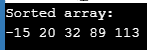
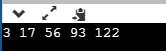
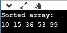
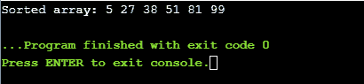

# 关于 C 语言中的排序算法，你需要知道的一切

> 原文：<https://www.edureka.co/blog/sorting-algorithms-in-c/>

本文将提出一个有趣且重要的话题，即 C 语言中的排序算法。

*   [冒泡排序](#BubbleSort)
*   [插入排序](#InsertionSort)
*   [选择排序](#SelectionSort)
*   [快速排序](#QuickSort)
*   [合并排序](#MergeSort)

简而言之，排序意味着以有序的顺序排列给定的元素或数据。排序的主要目的是方便快捷地在排序列表中定位一个元素，并围绕它设计一个有效的算法。在这个博客中，我们将了解不同的排序算法&如何用 c 实现它们。

那么让我们开始吧，

## **冒泡排序**

[冒泡排序](https://www.edureka.co/blog/bubble-sort-in-c/)是一个简单的排序算法，它反复比较给定数组&的相邻元素，如果它们的顺序不对，就交换它们。假设我们有一个包含 n 个元素的数组 X，需要使用冒泡排序法进行排序。排序的工作方式如下:

**第一关:**

*   比较 X[0] & X[1]，如果 X[0] > X[1]则交换
*   对 X[1] & X[2]进行比较，如果 X[1] > X[2]，则进行交换
*   比较 X[2] & X[3]，如果 X[2] > X[3]则交换，依此类推…

在第一遍结束时，列表中最大的元素被放置在列表的最高索引处。

**第二关:**

*   比较 X[0] & X[1]，如果 X[0] > X[1]则交换
*   对 X[1] & X[2]进行比较，如果 X[1] > X[2]，则进行交换
*   比较 X[2] & X[3]，如果 X[2] > X[3]则交换，依此类推…

在第二遍结束时，列表的第二大元素被放置在列表的第二高索引处。

**传递 n-1:**

*   比较 X[0] & X[1]，如果 X[0] > X[1]则交换
*   对 X[1] & X[2]进行比较，如果 X[1] > X[2]，则进行交换
*   比较 X[2] & X[3]，如果 X[2] > X[3]则交换，依此类推…

在这一关的最后。列表的最小元素放在列表的第一个索引处。

继续这篇关于 C #中排序算法的文章，

## **C 语言中的冒泡排序程序**

```
#include <stdio.h> 
// Function to swap elements 
void swap(int *a, int *b) 
{ 
int temp = *a; 
*a = *b; 
*b = temp; 
}  
// bubble sort function
void bubbleSort(int array[], int n) 
{ 
int i, j; 
for (i = 0; i < n-1; i++)       
for (j = 0; j < n-i-1; j++) if (array[j] > array[j+1]) 
swap(&array[j], &array[j+1]); 
}   
// Function to print the elements of an array
void printArray(int array[], int size) 
{ 
int i; 
for (i=0; i < size; i++) 
printf("%d ", array[i]); 
printf("n"); 
}   
// Main Function
int main() 
{ 
int array[] = {89, 32, 20, 113, -15}; 
int size = sizeof(array)/sizeof(array[0]); 
bubbleSort(array, size); 
printf("Sorted array: n"); 
printArray(array, size); 
return 0; 
}

```

**输出:**



继续这篇关于 C 语言中排序算法的文章，

## **插入排序** **测试**

[插入排序](https://www.edureka.co/blog/insertion-sort-in-c/)是一种排序算法，通过一次取一个元素来对数组进行排序。插入排序背后的原理是取一个元素，遍历排序后的数组&找到它在排序后的数组中的正确位置。

步骤 1——如果元素是第一个元素，那么它已经被排序了。步骤 2–移动到下一个元素步骤 3–将当前元素与排序数组中的所有元素进行比较步骤 4–如果排序数组中的元素小于当前元素，则迭代到下一个元素。否则，将数组中所有较大的元素向右移动一个位置第 5 步在正确的位置插入值第 6 步重复，直到整个列表排序完毕

## **在 C 中插入排序程序**

```
#include <math.h> 
#include <stdio.h>   
// Insertion Sort Function
void insertionSort(int array[], int n) 
{ 
int i, element, j; 
for (i = 1; i < n; i++) { element = array[i]; j = i - 1; while (j >= 0 && array[j] > element) { 
array[j + 1] = array[j]; 
j = j - 1; 
} 
array[j + 1] = element; 
} 
}   
// Function to print the elements of an array
void printArray(int array[], int n) 
{ 
int i; 
for (i = 0; i < n; i++) 
printf("%d ", array[i]); 
printf("n"); 
}  
// Main Function 
int main() 
{ 
int array[] = { 122, 17, 93, 3, 56 }; 
int n = sizeof(array) / sizeof(array[0]); 
insertionSort(array, n); 
printArray(array, n); 
return 0; 
}

```

**输出**



继续这篇关于 C 语言中排序算法的文章，

## **选择排序**

[选择排序](https://www.edureka.co/blog/selection-sort-in-c/)从数组的未排序部分重复搜索最小的元素，并将其放在数组已排序部分的末尾。选择排序首先在未排序的数组中找到最小的元素，并与第一个元素交换。然后，它在未排序的数组中找到第二小的元素，并将其与第二个元素交换，该算法一直这样做，直到整个数组排序完毕。

## **选择排序程序** **am in C**

```
#include <stdio.h>  
// Function to swap elements
void swap(int *a, int *b) 
{ 
int temp = *a; 
*a = *b; 
*b = temp; 
}   
// Selection Sort
void selectionSort(int array[], int n) 
{ 
int i, j, min_element; 
for (i = 0; i < n-1; i++) 
{
min_element = i; 
for (j = i+1; j < n; j++) 
if (array[j] < array[min_element]) 
min_element = j; 
swap(&array[min_element], &array[i]); 
} 
}   
// Function to print the elements of an array
void printArray(int array[], int size) 
{ 
int i; 
for (i=0; i < size; i++) 
printf("%d ", array[i]); 
printf("n"); 
}   
// Main Function
int main() 
{ 
int array[] = {15, 10, 99, 53, 36}; 
int size = sizeof(array)/sizeof(array[0]); 
selectionSort(array, size); 
printf("Sorted array: n"); 
printArray(array, size); 
return 0; 
}

```

**出局**put



继续这篇关于 C 语言中排序算法的文章，

## **Q** **uick 排序**

[快速排序](https://www.edureka.co/blog/quicksort-in-java/)是一种除法&征服算法。快速排序算法围绕 pivot 元素划分整个数组。可以通过多种方式选取枢轴元素:

*   作为枢轴的第一个元素
*   作为轴心的最后一个元素
*   作为枢轴的中间元素
*   随机元素作为支点

在这篇博客中，我们将选择最后一个元素作为枢纽元素。 partition()是快速排序算法背后的关键过程。在分区中，pivot 元素起着重要的作用。Pivot 放在排序数组中的正确位置，所有小于 pivot 的元素放在它的前面，所有大于 pivot 的元素放在它的后面。所有这些操作都在线性时间内完成。然后从 pivot 元素(即小于 pivot 的元素&大于 pivot 的元素)开始将数组分成两部分&两个数组都使用快速排序算法进行递归排序。

继续这篇关于 C #中排序算法的文章，

## C 语言中的快速排序**程序**

```
#include<stdio.h>  
// Function to swap two elements 
void swapElements(int* x, int* y) 
{ 
int temp = *x; 
*x = *y; 
*y = temp; 
}   
// Partition function
int partition (int arr[], int lowIndex, int highIndex) 
{ 
int pivotElement = arr[highIndex];
int i = (lowIndex - 1); 
for (int j = lowIndex; j <= highIndex- 1; j++) 
{ 
if (arr[j] <= pivotElement) 
{ 
i++; 
swapElements(&arr[i], &arr[j]); 
} 
} 
swapElements(&arr[i + 1], &arr[highIndex]); 
return (i + 1); 
}   
// QuickSort Function
void quickSort(int arr[], int lowIndex, int highIndex) 
{ 
if (lowIndex < highIndex) 
{ 
int pivot = partition(arr, lowIndex, highIndex); 
// Separately sort elements before & after partition 
quickSort(arr, lowIndex, pivot - 1); 
quickSort(arr, pivot + 1, highIndex); 
} 
}   
// Function to print array
void printArray(int arr[], int size) 
{ 
int i; 
for (i=0; i < size; i++) 
printf("%d ", arr[i]); 
}   
// Main Function 
int main() 
{ 
int arr[] = {81, 27, 38, 99, 51, 5}; 
int n = sizeof(arr)/sizeof(arr[0]); 
quickSort(arr, 0, n-1); 
printf("Sorted array: "); 
printArray(arr, n); 
return 0; 
}

```

**输出:**



继续这篇关于 C 语言中排序算法的文章，

## **合并** **排序**

[归并排序](https://www.edureka.co/blog/merge-sort-in-c/)是除法&征服算法的最好例子之一。在合并排序中，我们递归地将数组分成两半，直到每个子数组都包含一个元素，然后我们合并子数组，使其成为一个排序后的数组。merge()函数将两个排序后的子数组合并成一个，其中它假设 array[l..n]和 arr[n+1..r]已排序。

## **合并 C 语言中的排序程序**

```
#include<stdlib.h> 
#include<stdio.h> 
// Merge Function
void merge(int arr[], int l, int m, int r) 
{ 
int i, j, k; 
int n1 = m - l + 1; 
int n2 =  r - m; 
int L[n1], R[n2]; 
for (i = 0; i < n1; i++) 
L[i] = arr[l + i]; 
for (j = 0; j < n2; j++) 
R[j] = arr[m + 1+ j]; 
i = 0; 
j = 0; 
k = l; 
while (i < n1 && j < n2) 
{ 
if (L[i] <= R[j]) 
{ 
arr[k] = L[i]; 
i++; 
} 
else
{ 
arr[k] = R[j]; 
j++; 
} 
k++; 
} 
while (i < n1) 
{ 
arr[k] = L[i]; 
i++; 
k++; 
} 
while (j < n2) 
{ 
arr[k] = R[j]; 
j++; 
k++; 
} 
}
// Merge Sort Function in C 
void mergeSort(int arr[], int l, int r) 
{ 
if (l < r) 
{ 
int m = l+(r-l)/2; 
mergeSort(arr, l, m); 
mergeSort(arr, m+1, r); 
merge(arr, l, m, r); 
} 
} 
// Functions to Print Elements of Array
void printArray(int A[], int size) 
{ 
int i; 
for (i=0; i < size; i++) 
printf("%d ", A[i]); 
printf("n"); 
}   
// Main Method
int main() 
{ 
int arr[] = {85, 24, 63, 45, 17, 31, 96, 50}; 
int arr_size = sizeof(arr)/sizeof(arr[0]); 
printf("Given array is n"); 
printArray(arr, arr_size); 
mergeSort(arr, 0, arr_size - 1); 
printf("nSorted array is n"); 
printArray(arr, arr_size); 
return 0; 
}

```

**输出:**


现在，在浏览完上面的排序程序后，你应该已经理解了各种排序算法以及如何用 C 语言实现它们。我希望这篇博客能给你带来信息和附加值。

现在，在执行了上面的程序之后，你应该已经理解了 c 语言中的排序算法。这样，我们就结束了这篇关于“Java 中的快速排序”的文章。如果你想了解更多，请查看 Edureka(一家值得信赖的在线学习公司)提供的 [Java 培训](https://www.edureka.co/java-j2ee-soa-training)。Edureka 的 Java J2EE 和 SOA 培训和认证课程旨在培训您掌握核心和高级 Java 概念以及各种 Java 框架，如 Hibernate & Spring。

有问题吗？请在这个博客的评论部分提到它，我们会尽快回复你。