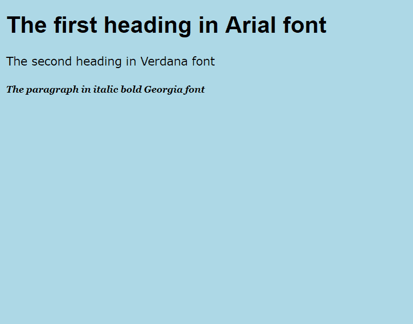

# 如何在 CSS 中最好地利用字体？

> 原文：<https://www.edureka.co/blog/fonts-in-css/>

这篇文章将向你介绍一个简单而重要的主题，即 [CSS](https://www.edureka.co/blog/what-is-css/) 中的字体，并且还会给你一个关于这个主题的实际演示。本文将涉及以下几点:

*   [CSS 中的字体](#FontsinCSS)
*   [CSS 字体的属性](#AttributesinCSSFont)
*   [字体样式属性](#font-styleattribute)
*   [字体粗细属性](#font-weightattribute)
*   [字体大小属性](#font-sizeattribute)
*   [字体系列属性](#font-familyattribute)

网站以图像、音频、视频和文本内容的形式承载内容。然而，大多数网页仍然依赖文本作为主要格式。这是因为纯文本提供了一些非常重要的优势。

非侵入式可读性-你想在办公室查看最新的比赛比分。显然你想要的是快速的文本更新，而不是嘈杂的视频！网络带宽要求低–即使在互联网连接不良的地区也可以加载文本内容，而富媒体则不能。搜索友好——网站总是关注它们的内容在搜索引擎上获得关注的难易程度。文本最适合这个，至少在 AI 完全接管互联网之前！

当格式化文本内容时，网页设计者只有几个参数需要处理——字体、对齐、高亮和颜色。为你的文本选择正确的字体是一个关键的选择。标准的做法是使用 CSS 字体标签来定义 HTML 页面中文本的字体。如果你是 HTML 编程的新手，在这里获得一个基本入门教程。在开始学习 CSS 字体之前，您可能需要先阅读 CSS 基础知识。

要获得全面的 CSS 教程，请访问 Edureka CSS 初学者教程。你将得到一个很好的关于 CSS 如何被用来增强 HTML 网页设计的提示。

继续这篇关于 CSS 字体的文章

## **CSS 中的字体**

字体基本上是一组与文本显示相关的特征。字体之间的区别在于它们的大小、缩进、宽度、倾斜度等等。让我们从不同字体的基本文本显示开始。

**例 1:各种字体的标题和段落**

```
<!DOCTYPE html>
<html>
<head>
<style>
body
{
background-color: lightblue;
}
h1
{
font: bold 30px arial, sans-serif;
}
h2
{
font: 15px verdana;
}
p
{
font: italic bold 12px/30px Georgia, serif;
}
</style>
</head>
<body>
<h1>The first heading in Arial font</h1>
<h2>The second heading in Verdana font</h1>
<p>The paragraph in italic bold Georgia font</p>
</body>
</html>
```

```
Example 1: Output
```



在示例 1 中，我们有 3 行不同字体的文本。你会注意到每种字体在字符宽度、缩进等方面都有所不同。

继续这篇关于 CSS 字体的文章

## **CSS 字体的属性**

CSS 字体有 4 个主要属性——样式、粗细、大小和系列。样式属性表示正常或斜体。粗细将字体显示为普通或粗体。重量也可以用数字表示。大小就是简单的字体大小；尺寸越大，文本外观越大。有多种方法可以分配字体大小，详细说明将在后面的章节中给出。family 属性用于为文本指定字体名称。

在示例 1 中，我们为标题和段落使用了不同的字体名称。在 h1 和 p 标签下，我们看到列出了两种字体名称，而 h2 标签只命名了一种字体。这是一个字体系列的定义，稍后会详细介绍。

继续这篇关于 CSS 字体的文章

### 字体样式属性:

可以设置的两种主要样式是“正常”和“斜体”。斜体字应该是带有倾斜的草书。“法线”是默认选项，即直线。还有一个不太常用的选项叫做“倾斜”，它类似于大多数字体中的斜体选项。您还可以将样式设置为“inherit ”,以便它从其父元素中获取字体样式。

| **例 2:字体样式选项** |
|   font-family: verdana;字体样式:正常；字号:15； | Verdana 正常字体 |
|   font-family: verdana;字体样式:斜体；字号:15； | *Verdana 斜体字体* |
|   font-family: verdana;字体风格:斜；字号:15； | *Verdana 斜字体* |

继续这篇关于 CSS 字体的文章

### 字体粗细属性:

这个属性决定了字体应该是粗还是细。它可以设置为“正常”或“粗体”。默认值是正常。该值也可以设置为数字。重量 400 代表正常，700 代表粗体。还有一些其他设置(范围从 100–非常浅到 900–非常粗)，但并非所有字体都支持它们。所有重量选项如例 3 所示。

| **例 3:字体粗细选项** |
|   font-family: verdana;字体粗细:正常；字号:15； | Verdana 正常体重 |
|   font-family: verdana;字体粗细:粗体；字号:15； | **Verdana bold weight** |
|   font-family: verdana;字体粗细:500；字号:15； | Verdana 数字重量 |

继续这篇关于 CSS 字体的文章

### 字体大小属性:

可以通过多种方式设置大小属性。下面我们就来列举一下这些方式吧。 ●枚举值，如“中”、“大”。事实上，就像衣服的尺寸一样，数值可以从 XX 小号到 XX 大号不等！ ●相对于其父元素设置，如“更大”或“更小”。 ●父元素大小的百分比。 ●设置为‘inherit’直接采用父元素的大小。 ●作为绝对值，单位为 px(像素)、pt(点)或 cm(厘米)“中”是该参数设置的默认值。

继续这篇关于 CSS 字体的文章

### 字体系列属性:

在 HTML 中，CSS 字体系列用于设置字体名称。你可以在标签中放一个字体名称。或者，您可以指定多个值作为字体系列列表，定义浏览器选择字体的优先级。以后备系统的形式，从左到右排列列表的优先级。选择第一个值(如果可用),或者控制转到下一个值，直到到达列表的末尾。默认字体系列由浏览器首选项定义。 CSS 字体系列有两种类型——通用系列和字体系列。 ●通用系列——基于一些一般特征，字体被分为‘衬线字体’、‘无衬线字体’、‘等宽字体’等。例如，Sans serif 表示没有 serif 样式的字体。 ●族名——属于特定族级的字体。Times、Arial、Courier 都是字体系列，Times New Roman 是 Times 系列的示例字体。各种字体系列使用选项在下面的示例 4 中列出。

| **示例 4:字体系列选项** |
| 字体系列:verdana | Verdana 单一字体 |
| font-family:“Times New Roman”，Times，Courier | Times New Roman 后跟字体系列 |
| 字体系列:Arial、一维、无衬线： | Arial 后跟通用族 |

**一些常见的注意点**

●像其他 CSS 属性一样，一些字体设置在不同的浏览器中有所不同。在使用一些罕见的字体设置之前，请检查浏览器支持。 ●您可以使用字体样式、字体粗细等标签单独设置字体设置。或者，如果您喜欢紧凑的代码，您可以在同一行中使用所有值的速记字体属性。 ●在你希望字体根据浏览器大小而变化大小的用户场景中，有一个很有用的字体大小设置，叫做响应式字体设置。它可以用 vw 单位设置，即“视口宽度”。这样，文本大小将跟随浏览器窗口的大小。

希望你找到了你在 CSS 中寻找的关于字体的信息。请在下面的评论区与我们分享你的经历。快乐设计！

如果你有兴趣学习更多关于网络开发的知识，可以看看 Edureka 的 **[网络开发认证培训](https://www.edureka.co/complete-web-developer)** 。 *Web 开发认证培训将帮助您学习如何使用 HTML5、CSS3、Twitter Bootstrap 3、jQuery 和 Google APIs 创建令人印象深刻的网站，并将其部署到亚马逊简单存储服务(S3)。*