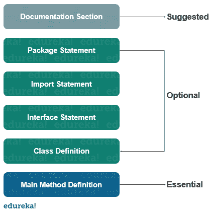

# Java 程序的基本结构是什么？

> 原文：<https://www.edureka.co/blog/structure-of-a-java-program/>

Java 编程语言是平台无关的，是一种安全的编程语言。Java 编程语言有着各种各样的应用，在过去的二十年里一直很受欢迎。开箱即用的[特性](https://www.edureka.co/blog/top-10-reasons-to-learn-java/)帮助 java 脱颖而出。在本文中，我们将详细了解一个 [java](https://www.edureka.co/java-j2ee-training-course) 程序的结构。以下是本博客讨论的主题:

*   [文档部分](#documentation)
*   [套餐声明](#package)
*   [导入声明](#import)
*   [接口部分](#interface)
*   [类别定义](#class)
*   [主方法类](#main)

## **文档部分**



用于提高[程序](https://www.edureka.co/blog/java-programs/)的可读性。它由 Java 中的[注释组成，包括方法的用法或功能等基本信息，使程序员在审查或调试代码时更容易理解。Java 注释不一定局限于有限的空间，它可以出现在代码中的任何地方。](https://www.edureka.co/blog/comments-in-java/)

编译器在执行时会忽略这些注释，这只是为了提高 Java 程序的可读性。

Java 支持三种类型的注释

*   单行注释

*   多行注释

*   文档注释

让我们看一个例子来理解我们如何在一个 [Java 程序](https://www.edureka.co/blog/java-programs/)中使用上述注释。

```
// a single line comment is declared like this
/* a multi-line comment is declared like this
and can have multiple lines as a comment */
/** a documentation comment starts with a delimiter and ends with */

```

## **套餐声明**

Java 中有一个条款，允许你在一个名为 [package](https://www.edureka.co/blog/packages-in-java/) 的集合中声明你的类。一个 Java 程序中只能有一个 package 语句，并且必须在任何[类](https://www.edureka.co/blog/java-objects-and-classes/)或[接口](https://www.edureka.co/blog/java-interface/)声明之前的代码开头。这个语句是可选的，例如，看看下面的语句。

```
package student;

```

该语句声明在这个源文件中定义的所有类和接口都是学生包的一部分。并且在源文件中只能声明一个包。

## **导入声明**

许多预定义的类存储在 Java 的[包中，一个 import 语句用来引用存储在其他包中的类。import 语句总是写在 package 语句之后，但必须在任何类声明之前。](https://www.edureka.co/blog/packages-in-java/)

我们可以在 import 语句中导入一个或多个特定的类。看一下这个例子来理解 import 语句在 Java 中是如何工作的。

```
import java.util.Date; //imports the date class
import java.applet.*;  //imports all the classes from the java applet package

```

## **界面部分**

这个部分用于在 Java 中指定一个[接口。这是一个可选部分，主要用于在 Java](https://www.edureka.co/blog/java-interface/) 中实现多重[继承。接口与 Java 中的类非常相似，但它只包含常量和](https://www.edureka.co/blog/inheritance-in-java/)[方法](https://www.edureka.co/blog/java-methods/)声明。

接口不能被实例化，但它可以由类实现或由其他接口扩展。

```
interface stack{
void push(int item);
void pop();
}

```

## **阶级定义**

一个 Java 程序可能包含几个[类](https://www.edureka.co/blog/java-objects-and-classes/)定义，类是任何一个 [Java 程序](https://www.edureka.co/blog/how-to-compile-run-java-program/)必不可少的一部分。它定义了程序中用户定义的类的信息。

一个类是对字段进行操作的[变量](https://www.edureka.co/blog/variables-in-java/)和[方法](https://www.edureka.co/blog/java-methods/)的集合。Java 中的每个程序都至少有一个包含 main 方法的类。

## **主方法类**

main 方法是从执行实际开始的地方开始的，并遵循为以下语句指定的顺序。让我们看一个示例程序来理解它是如何构造的。

```
public class Example{
//main method declaration
public static void main(String[] args){
System.out.println("hello world");
}
}

```

让我们一行一行地分析上面的程序，了解它是如何工作的。

### **公开课示例**

这将创建一个名为 Example 的类。您应该确保类名以大写字母开头，并且 public 单词意味着它可以从任何其他类中访问。

### **评论**

为了提高可读性，我们可以使用注释来为程序员定义特定的注释或方法的功能等。

### **大括号**

花括号用于将所有命令组合在一起。以确保命令属于某个类或方法。

### **public static void main**

*   当 main 方法被声明为 public 时，意味着它也可以在这个类之外使用。

*   单词 static 意味着我们想访问一个方法而不创建它的对象。因为我们调用 main 方法时没有创建任何对象。

*   单词 void 表示它不返回任何值。main 被声明为 void，因为它不返回任何值。

*   主要是方法，这是任何 Java 程序必不可少的部分。

### 串[] args

它是一个数组，其中每个元素都是一个字符串，名为 args。如果通过控制台运行 Java 代码，可以传递输入参数。main()将其作为输入。

### **system . out . println()；**

该语句用于在屏幕上打印输出，其中 system 是预定义的类，out 是 PrintWriter 类的对象。println 方法在屏幕上用新的一行打印文本。所有 Java 语句都以分号结尾。

这就把我们带到了本文的结尾，我们已经了解了 Java 程序的结构。我希望你清楚本教程中与你分享的所有内容。

*如果你觉得这篇文章与“Java 程序的结构”相关，可以看看  Edureka 的 [Java 认证](https://www.edureka.co/java-j2ee-training-course)培训，这是一家值得信赖的在线学习公司，拥有遍布全球的 250，000 多名满意的学习者。*

我们在这里帮助你踏上旅程的每一步，并为想成为 Java 开发人员的学生和专业人士设计课程。该课程旨在让您在 Java 编程方面有一个良好的开端，并训练您掌握核心和高级 Java 概念以及各种  [Java 框架](https://www.edureka.co/blog/java-frameworks/) ，如[Hibernate](https://www.edureka.co/blog/what-is-hibernate-in-java/)&[Spring](https://www.edureka.co/blog/spring-tutorial/)。

如果您遇到任何问题，请在“Java 程序的结构”的评论区自由提问，我们的团队将很乐意回答。