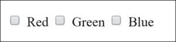
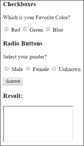

# 如何在 HTML 中创建复选框？

> 原文：<https://www.edureka.co/blog/html-checkbox/>

浏览您喜爱的网站时，当您需要从众多可用选项中选择一个时，会出现复选框。这些复选框是在一个特殊标签的帮助下在 [HTML](https://www.edureka.co/blog/what-is-html/) 中创建的。在本文中，我们将看到如何在 HTML 中创建一个复选框，以及复选框的工作顺序如下:

*   [如何在 HTML 中创建复选框？](#how)
*   [复选框 vs 单选按钮](#checkbox)
*   [禁用 HTML 中的复选框](#disable)

## **如何在 HTML 中创建复选框？**

复选框是一种表单元素，允许您从不同的可用选项中选择多个选项。复选框是用 HTML **<输入>** 标签创建的。它可以嵌套在一个 **<表单>** 元素中，也可以独立存在。它们也可以在<输入>标签的[表单属性](https://www.edureka.co/blog/advanced-html-form-attributes/)的帮助下与表单相关联。

以下是创建简单复选框的基本示例:

```
<input type="checkbox" name="color" value="Red"> Red
<input type="checkbox" name="color" value="Green"> Green
<input type="checkbox" name="color" value="Blue"> Blue
```

**输出:**



让我们考虑另一个例子，添加一个提交按钮，这样复选框就变得有用了。在这里，您还可以将复选框放在指定处理表单的页面的

<form>元素中。</form>

```
<form action>

Which is your Favorite Color?

<input type="checkbox" name="color" value="Red"> Red
<input type="checkbox" name="color" value="Green"> Green
<input type="checkbox" name="color" value="Blue"> Blue

<input type="submit" value="Submit">

</form>

<h3>Result:</h3>

<iframe name="result" style="height:100px;width:200px;"></iframe>
```

**输出:**


## **复选框 vs 单选按钮**

单选按钮只允许用户选择一个选项。然而，复选框允许用户选择任意数量的选项。让我们举个例子，看看单选按钮和复选框是如何工作的:

```
<form action>

<h3>Checkboxes</h3>

Which is your Favorite Color?

<input type="checkbox" name="color" value="Red"> Red
<input type="checkbox" name="color" value="Green"> Green
<input type="checkbox" name="color" value="Blue"> Blue

<h3>Radio Buttons</h3>

Select your gender?

<input type="radio" name="gender" value="male"> Male
<input type="radio" name="gender" value="female"> Female
<input type="radio" name="gender" value="unknown"> Unknown

<input type="submit" value="Submit">

</form>

<h3>Result:</h3>

<iframe name="result2" style="height:100px;width:200px;"></iframe>
```

**输出:**



在上面的例子中，你可以看到你可以选择尽可能多的复选框。这使得复选框适用于用户应该能够选择多个选项的情况。但是，如果您尝试选择多个单选按钮，前面的选择将被取消。这有助于您强制用户只选择一个选项。

## **禁用 HTML 中的复选框**

您可以使用 disabled 属性禁用 [HTML](https://www.edureka.co/blog/button-in-html/) 中的复选框。这可以结合一个脚本来完成，以根据是否满足特定标准来启用或禁用复选框。

让我们举个例子来看看如何禁用复选框:

```
<input type="checkbox" name="color" value="Red" disabled> Red
<input type="checkbox" name="color" value="Green"> Green
<input type="checkbox" name="color" value="Blue"> Blue
```

**输出:**


在上面的例子中，我们禁用了红色。因此，您可以从复选框中选择绿色和蓝色，但不能选择红色。

说到这里，我们的文章就到此为止了。我希望你了解 HTML 中的复选框是如何工作的，以及它们的不同用法。

*既然你已经知道了 HTML 中的复选框，那就来看看 Edureka 的 **[Web 开发认证培训](https://www.edureka.co/complete-web-developer)** 。* *Web 开发认证培训将帮助您学习如何使用 HTML5、CSS3、Twitter Bootstrap 3、jQuery 和 Google APIs 创建令人印象深刻的网站，并将其部署到亚马逊简单存储服务(S3)。*

*有问题吗？请在“HTML 中的复选框”的评论部分提到它，我们会给你回复。*